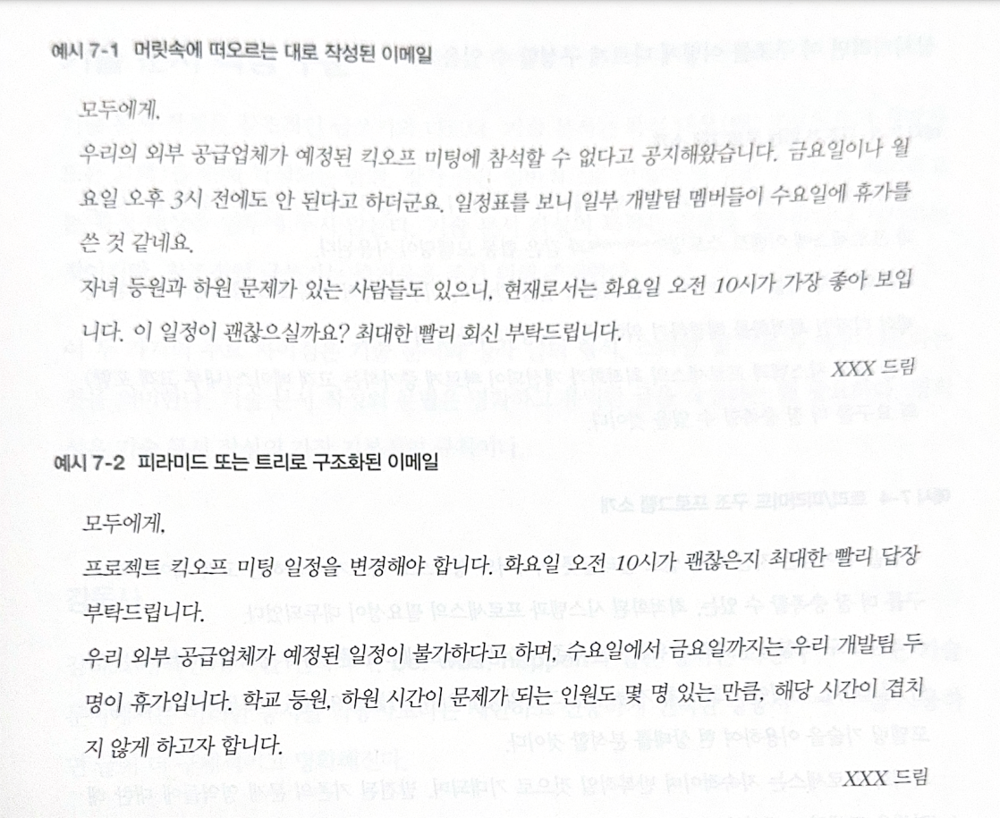

# 서면 커뮤니케이션

- 명확하고 효과적인 서면 커뮤니케이션(written communication)은 업무에서 매우 중요한 부분을 차지한다. 이 장에서는 글쓰기 실력을 한 단계 끌어올리는데 도움이 되는 실용적인 지침을 소개한다.

## 단순한 언어

- 단순한 언어 패턴을 사용하면 단순성과 간결성을 유지하는 것이 도움이 된다. 복잡한 언어를 사용하면 사람들은 여러분을 높게 평가하는 것이 아니라, 내용을 이해하지 못했기 때문에 여러분을 낮게 평가할 가능성이 높다.

## 축약어 지옥

- 독자가 설명하는 문맥을 알고 있더라도 사람마다 알고 있는 축약어의 의미가 다를 수 있다. 다른 사람들도 나와 같은 수준으로 이해할 것이라고 생각하기 쉽다. 이를 흔히 지식의 저주라고 한다.

- 축약어 지옥 안티패턴을 피하는 가장 좋은 방법은 약어를 정의하는 것이다. 예를 들어 약어와 전체 단어를 함께 언급하는 것이다. 텍스트에서는 일반적으로 약어를 최초로 사용할 때 괄호 안에 약어를 정의한다.

## 구조화하기

- 대부분의 글쓰기는 계획적이고 구조화되어 있을 때 가장 효과적이며, 기술 문서 작성도 예외가 아니다.

- 위 예시는 피라미드 구조의 강점을 보여준다. 예시 7-2에서는 이메일의 의도가 무엇이고 독자로부터 무엇을 원하는지 처음부터 명확히 알 수 있으며, 그 후에 회의 일정을 변경해야 하는 이유에 대한 설명으로 이어진다. 이 이유에 대한 답변이 필요하지 않은 독자라면 첫 단락 이후의 정보를 무시하고 요청을 따르면 된다.

## 기술 문서 작성 구문

- 기술 문서 작성은 창조적인 글쓰기와 다르다. 기술 문서 작성의 목적은 정보를 제공하거나 지시하는것이고, 창조적인 글쓰기는 즐거움을 주기 위해 존재한다.

### 짧은 문장

- 짧은 문장이 읽기에 더 좋다. 이것은 단일 책임 원칙의 또 다른 적용이다. 한 문장에는 단 하나의 메시지만 있어야 한다. 

### 명확한 문단

- 단락에서 가장 중요한 것은 첫 문장이다. 첫 문장은 단락의 핵심을 다루거나 수사학적 질문과 같은 기법을 사용하여 독자의 주의를 끌어야 한다.

### 일관적인 어휘

- 전체에 걸쳐 일관된 어휘를 사용하자. 의미가 동일한데 다른 단어로 바꾸는 것은 메서드 중간에 변수 이름을 바꾸는 것과 다름없다. (사용자, 클라이언트, 고객)

### 독자와의 공감

- 독자의 지식 수준을 고려하는 것은 커뮤니케이션의 기본 중 하나다. 독자가 누구인지에 따라 글을 쓰는 방법과 글의 구조를 달리하자.
