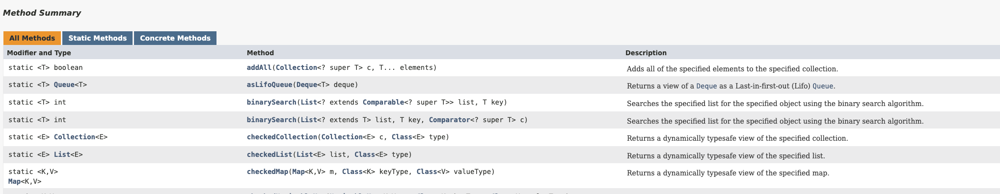

## Chapter 56

자바 버전이 올라가면서 추가된 중요한 자바독 태그
- @literal
- @code
- @implSpec
- @index

다다익선: 공개된 클래스, 인터페이스, 메서드, 필드 선언에 문서화 주석을 달 수 있으면 좋다.(잘 안되는데..)

메소드용 문서화 주석은 클라이언트와의 규약을 명료하게 기술해야함.(how가 아닌 what을 기술)
- 클라이언트가 메서드를 호출하기 위한 전제조건(precondition)을 모두 나열
- 메서드가 성공적으로 수행된 후 만족해야하는 사후조건(postcondition) 모두 나열
- 일반적으로 전제조건은 @throw 태그로 `암시적으로 기술`(예외 하나가 전제조건 하나에 대응)
- 부작용도 문서화해야한다.(사후조건으로 명확히 나타나지는 않지만, 시스템의 상태에 어떤 변화를 가져오는것)

* @code 효과

- 태그로 감싼 내용을 코드용 폰트로 렌더링
- 태그로 감싼 내용에 포함된 html 요소나 다른 자바독 태그를 무시

html 메타문자를 포함시키려면 `@literal`로 감싸자.

**문서화 주석은 코드에서건, 변환된 api 문서에서건 읽기 쉬워야한다.**

요약 설명: 요약설명 끝을 판단하는 기준은 {<마침표><공백><다음 문장시작>} 패턴의 마침표 까지이므로 마침표를 주의해서 사용해야한다.

@summary 태그를 이용해서 마침표가 포함된 문장도 사용가능 - java10



스레드 안전수준을 반드시 api설명에 포함해야 한다. 직렬화할 수 있는 클래스라면 직렬화 형태도 API 설명에 기술해야한다.

@inheritDoc 태그를 사용해서 상위 타입의 문서화 주석 일부를 상속할 수 있다.


## 챕터 57

지역변수의 범위를 줄이는 가장 강력한 기법은 가장 처음 쓰일 때, 선언하기

거의 모든 지역변수는 선언과 동시에 초기화 해야한다.(try-catch는 예외)

while보다는 for 관용구를 이용하자
```java
Iterator<String> iter = c.iterator();
while(iter.hasNext()) {
    doSomething(iter.next());
}

for( Iterator<String> iter = c.iterator(); iter.hasNext();) {
    doSomething(iter.next());
}

for(int i = 0, n = expensiveComputation(); i <n ; i++) {
    // do something
}
```

메소드를 작게 유지하고 한가지 기능에 집중하는것도 범위를 줄이는 방법이다.

## 챕터 58

for 문보다는 for-each문을 사용하라.

for문은 컬렉션이냐 배열이냐에 따라 코드형태가 달라지므로 주의

for-each(enhanced for statement)는 하나의 관용구로 컬렉션과 배열을 모두 처리할 수 있는 장점.

* for-each를 사용할 수 없는 상황
  - 파괴적인 필터링(destructive filtering): 컬렉션을 순회하면서 선택된 원소를 제거해야 하는 경우, (java8부터 removeIf를 통해서 명시적인 순회 회피 가능)
  - 변형(transforming): 리스트나 배열을 순회하면서, 그 원소의 값 일부 혹은 전체를 교체하는 경우
  - 병렬 반복(parallel iteration): 병렬로 순회해야 하는 경우

## 챕터 59

```java
public class RandomTest {
    static Random rnd = new Random();

    public static void main(String[] args) {
        int n = 2 * (Integer.MAX_VALUE / 3);
        int low = 0;
        for( int i = 0 ; i < 1000000 ; i++) {
            if( random(n) < n/2) low++;
        }

        // 666044
        System.out.println(low);
        // -2147483648
        System.out.println(Math.abs(Integer.MIN_VALUE));
    }

    static int random(int n ) {
        return Math.abs(rnd.nextInt()) % n;
    }
}

```

* 문제점
  - n이 그리 크지 않은 2의 제곱수라면, 같은 수열이 반복
  - n이 2의 제곱수가 아니라면 몇몇 숫자가 평균적으로 더 자주 반환
  - n값이 크면 이 현상은 더 두드러짐.

* 이점
- 표준라이브러리를 사용하면, 코드 작성자의 지식과 나보다 앞서 사용한 프로그래머들의 경험을 활용할 수 있다. java7부터는 Random -> ThreadLocalRandom으로 대체하면 대부분 잘 동작한다.(근데 ThreadLocalRandom으로 해도 low 갯수는 거의 비슷하다.)
- 핵심적인 비지니스로직에 집중할 수 있다.
- 지속적으로 성능이 개선된다: 수년에 걸쳐 많은 부분이 재작성 됨.
- 기능이 점점 많아진다.
- 많은 사람에게 더 익숙한 코드를 제공할 수 있다.

적어도 java.lang, java.util, java.io와 . 그하위 패키지들에는 익숙해지자.

코드품질에도 규모의 경제가 적용된다.(주목을 많이 받을수록 코드 품질도 높아진다.)

## 챕터 60

float,double 타입은 정확한 값을 계산하기에는 적합하지 않다.(특히 금융관련 계산)

금융계산에는 BigDecimal, int, long을 사용해야한다.

다만 BigDecimal은 기본타입에 비해 사용성이 떨어지고, 훨씬 느리다는 단점이 있다.


## 기타
- html 유효성 검사기

## 참조
- javadoc: https://www.oracle.com/technical-resources/articles/java/javadoc-tool.html#format
- release note: https://www.oracle.com/java/technologies/javase/22u-relnotes.html