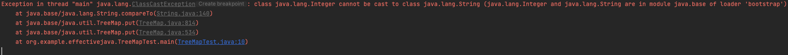

## 아이템 76. 가능한 한 실패 원자적으로 만들라.

1. 가장 간단한 방법은 불변으로 객체를 설계하는것이다.

2. 실패 원자적으로 만드는 가장 보편적인 방식은 유효성 검사를 하는것이다. 
```java
public Object pop() {
    if( size == 0) throw new EmptyStackException();
    Object result = elements[--size];
    elements[size] = null;
    return result;
}
```

3. 이와 비슷한 취지로 객체의 상태를 변경하기 전에, 실패 가능성이 있는 코드를 배치하는 방식도 있다.

예를 들어서 TreeMap은 원소를 어떤 기준으로 배열하는데, 기준에 맞지 않는 타입의 경우에, 원소를 찾는 과정에서 ClassCastException이 발생한다.
```java
public class TreeMapTest {
    public static void main(String[] args) {
        TreeMap<Object, String> map = new TreeMap<>();
        map.put(1,"test");
        map.put("test","test2");
    }
}
```



4. 임시 복사본에 변경사항을 수정한다음에, 성공하면 객체를 교체하는 방식

`ex) 정렬을 수행하기 전, 배열로 옮겨 담기.`

5. 실패 시, 복구 코드를 이용해 작업 전 상태로 되돌리는 방식(주로 디스크 기반의 내구성을 보장해야하는 자료구조에 쓰이나, 자주 쓰이진 않는 방식)

* 기타: 
  - 실패 원자성을 달성하기 위한 비용, 복잡성도 함께 고려해서, 결정하자
  - api 명세에 기술된 예외라면, 실패 원자성을 보장할것을 적극 권장한다.

## 아이템 77. 예외를 무시하지 말라

예외를 무시하는 것은 catch 블럭을 비워놓는것을 의미하며, 이는 화재경보를 무시하는 수준을 넘어, 화재 발생을 알지 못하게 알람을 끄는것과 같다.

예외를 무시한다면, 적어도 catch 블록안에 이유는 주석으로 남겨두자.

```java
Future<Integer> f = exec.submit(planarMap::chromaticNumber);
int numColors = 4; // 기본값, 어떤 지도라도 이 값이면 충분하다.
try {
    numColors = f.get(1L, TimeUnit.SECONDS);
} catch( TimeoutException | ExecutionException ignored) {
    // 기본값을 사용한다.(색상 수를 최소화하면 좋지만, 필수는 아님)
}
```

## 아이템 78. 공유 중인 가변 데이터는 동기화해 사용하라.

* 동기화의 기능
  - 배타적 실행: 한 시점에 하나의 스레드만이 실행
  - 스레드 통신: 같은 락의 보호하에 수행된 최종 결과를 보게 해줌.

* 스레드 사이의 안정적인 통신

자바 언어 명세는 스레드가 항상 `수정이 완전히 반영된` 값을 얻는다고 보장하지만,
한 스레드가 저장한 값이 다른 스레드에게 `보이는가`는 보장하지 않는다.(한 스레드가 만든 변화가, 다른 스레드에게 언제 어떻게 보이는지를 규정한 자바의 메모리 모델 때문이다.)

예) boolean 필드를 읽고 쓰는 작업은 원자적이라 동기화를 제거하기도 한다.
```java
public class SyncTest {
    private static boolean stop = false;
    public static void main(String[] args) throws InterruptedException {
        Thread backgroundThread = new Thread(()->{
            int i = 0;
            while(!stop) {
                i++;
            }
            System.out.println("finally stop " + i);
        });
        backgroundThread.start();

        TimeUnit.SECONDS.sleep(1);
        stop = true;
    }
}
```

위 예제의 문제점은 동기화를 제거한다면, 메인 스레드가 수정한 값을, 백그라운드 스레드가 언제쯤에나 보게 될지 보증할 수 없다.
동기화가 빠지면 가상머신이 다음과 같은 최적화를 수행할 수도 있다.

```java
// 원래 코드
while(!stop) i++;

// 최적화 코드
// OpenJDK의 VM이 실제 적용하는 hoisting 최적화 기법
if(!stop)
    while(true) i++;
```

```java
// synchronized를 적용하면 예상한대로 동작.
// 쓰기와 읽기 모두가 동기화되지 않으면 동작을 보장하지 않는다.
public static synchronized boolean stop() {
    return stop;
}

public static synchronized  void stop(boolean s) {
    stop = s;
}

// 테스트 결과 read에만 있어도 동작은 하지만, 명세에 따라 둘다 보장해주자.
```

volatile은 배타적 수행과 상관없이, 항상 가장 최근에 기록된 값을 읽게 됨을 보장해준다.

volatile 주의사항

> 예: 
```java
private static volatile int nextSerialNumber = 0;

// volatile은 배타적 실행을 보장하지 않으므로, 예상한것과 다르게 동작할 수 있다.
// 프로그램이 잘못된 결과를 계산하는 오류를 "안전오류"라고 한다.
public static int generateSerialNumber() {
    return nextSerialNumber++;
}

// synchronized
private static int nextSerialNumber = 0;

public static synchronized int generateSerialNumber() {
    return nextSerialNumber++;
}

// AtomicLong

private static final AtomicLong nextSerialNum = new AtomicLong();

public static int generateSerialNumber() {
    return nextSerialNum.getAndIncrement();
}
```

위와 같은 복잡한 상황을 피하고 싶다면, 애초에 `가변 데이터를 공유하지 않는 것`이다.

될 수 있다면, 가변 데이터는 단일 스레드에서만 쓰도록 하자.

### 중요

여러 스레드에 공유되는 가변데이터는, 읽기/쓰기 동작을 동기화 해야한다.
배타적 실행은 필요없고, 스레드 간 통신만 필요하다면 `volatile`을 사용해도 된다.( 다만 난이도가 높다.)


## 아이템 79. 과도한 동기화는 피하라.

응답 불가(교착상태)와, 안전 실패를 피하려면 동기화 메소드나 동기화 블록 안에서는 제어를 절대로 클라이언트에 양도하면 안된다. 

예를 들어, 동기화된 영역 안에서는 재정의할 수 있는 메소드와, 클라이언트가 넘겨준 함수 객체를 호출해서도 안된다.( 동기화된 영역을 포함한 클래스 관점에서는 모두 외계인 메소드)

ex) GUI에서도 동기화된 영역 안에서 외계인 메소드를 호출하여 `교착상태`에 빠지는 사례가 자주 있다.

자바의 `재진입 가능 락`은 객체 지향 멀티스레드 프로그램을 쉽게 구현할 수 있도록 해주지만, 응답 불가(교착상태)가 될 상황을 안전 실패(데이터 훼손)으로 변모시킬 수도 있다.

notifyElementAdded 메소드에서라면 관찰자 리스트를 복사해 쓰면 락 없이도 `안전하게 순회`할 수 있다.

이 용도로 `CopyOnWriteArrayList`를 이용할 수도 있다.


* 열린 호출: 동기화 영역 밖에서 호출되는 외계인 메소드

얼마나 오래 걸릴지 모르는, 외계인 메소드를 동기화 영역 안에서 호출한다면, 다른 스레드는 보호된 자원을 대기해야만 한다. 따라서 `열린 호출`은 실패 방지효과 외에도 동시성 효율을 크게 개선해준다.

### 기본 규칙은 동기화 영역에서 가능한 일을 적게하는 것이다.

또한 과한 동기화는, 가상머신의 코드 최적화를 제한한다는 점에서 숨은 비용으로 주의해야한다.

* 가변 클래스를 만드려면
  - 동기화를 전혀하지 않고, 외부에서 알아서 동기화하도록 위임(ex: java.util)
  - 내부 동기화처리를 통해, 스레드 안전한 클래스로 만들자: 클라이언트가 외부에서 락을 거는것보다, 동시성을 월등히 개선할 수 있을때만 선택(ex: java.util.concurrent)

* StringBuilder: 동기화되지 않은 StringBuffer 버전
* ThreadLocalRandom: 동기화되지 않은 Random 버전
* 동시성을 높여줄 수 있는 락 기법
  - 락 분할(lock splitting)
  - 락 스트라이핑(lock striping)
  - 비차단 동시성 제어(nonblocking concurrency control)

### 정리
  - 교착상태와 데이터 훼손을 방지하려면, 동기화 영역안에서 외계인 메소드를 호출하지 말자.(동기화 영역을 최소화하자.)
  - 가변 클래스 설계시, 동기화 여부를 결정하자. 스레드 안전한 클래스로 설계할때에는 합당한 이유가 있어야한다, 그리고 동기화 여부를 문서에 명확히 밝히자.


## 아이템 80. 스레드보다는 실행자, 태스크, 스트림을 애용하라.

* `java.util.concurrent`: 실행자 프레임워크
  - 특정 태스크가 완료되기를 기다린다.
  - 태스크 모음 중 아무거나(invokeAny) 혹은 모든 태스크(invokeAll)가 완료되기를 기다린다.
  - 실행자 서비스가 종료하기를 기다린다(awaitTermination)
  - 완료된 태스크들의 결과를 차례로 받는다(ExecutorCompletionService)
  - 태스크를 특정 시간에 혹은 주기적으로 실행하게 한다.(ScheduledThreadPoolExecutor)

* ThreadPoolExecutor: 평범하지 않은 실행자를 원할때, (스레드 풀 동작을 결정하는 거의 모든 속성을 설정 가능)
* CachedThreadPool: 무거운 프로덕션 서버에 안좋다.(cpu가 100% 근접한 부하상황에서 각 새로운 태스크마다, 다른 스레드를 생성해서 상황을 더욱 악화시킨다, 스레드 갯수가 고정된 Executors.newFixedThreadPool 혹은 ThreadPoolExecutor를 권장)
* ForkJoinPool: 작은 하위 태스크로 분리 가능한 포크조인태스크(ForkJoinTask)를 실행하는 서비스
  - 병렬 스트림: 내부 구현은 ForkJoinPool을 이용한다.

* 실행자 프레임워크 단위 개념
  - 태스크: 수행해야할 작업
    - runnable
    - callable(값을 반환하고, throw Exception 가능)
  - 실행서비스: 작업을 수행을 담당


