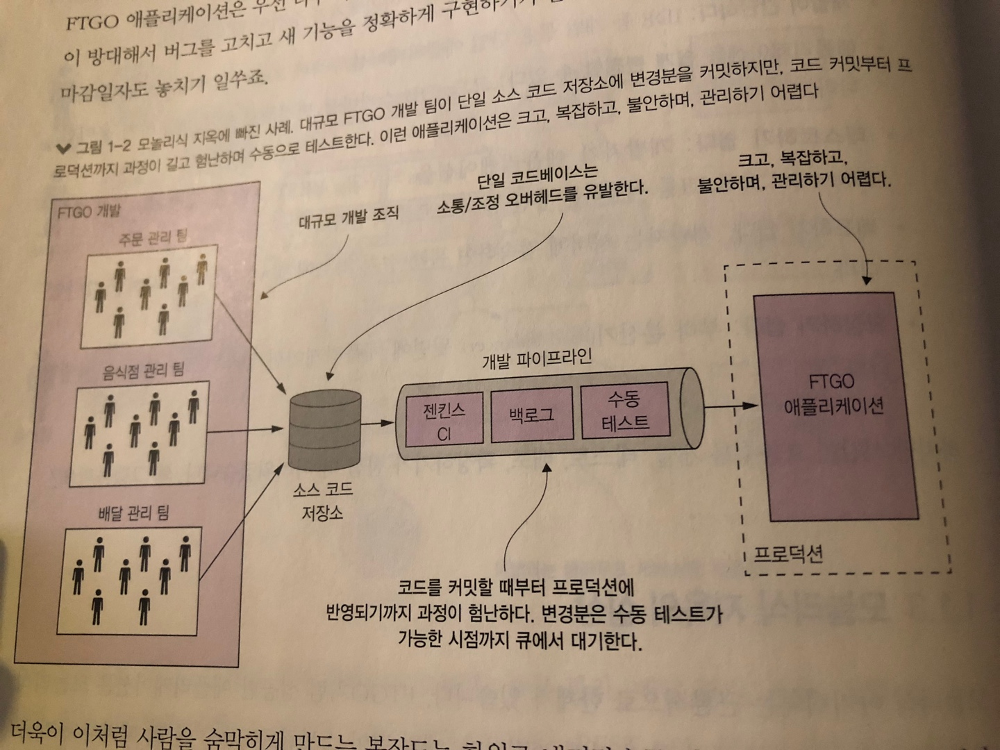
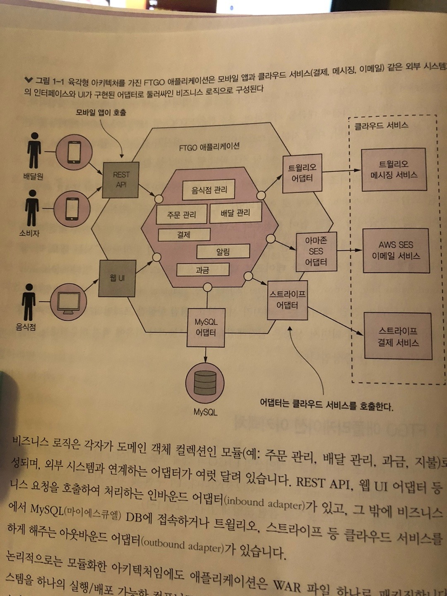
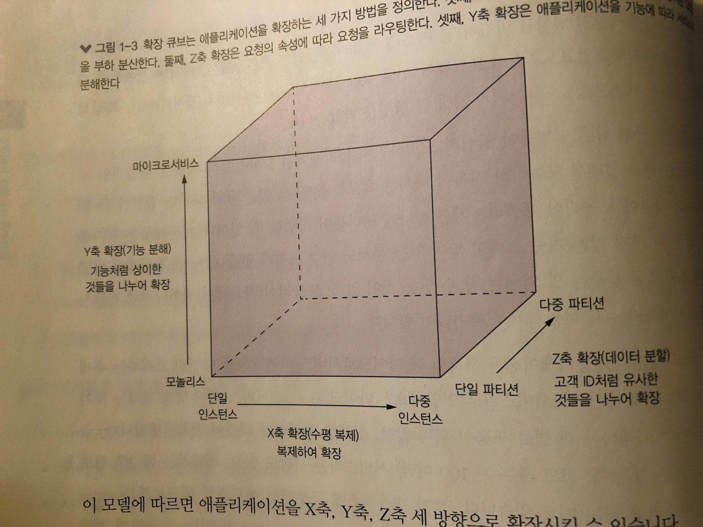
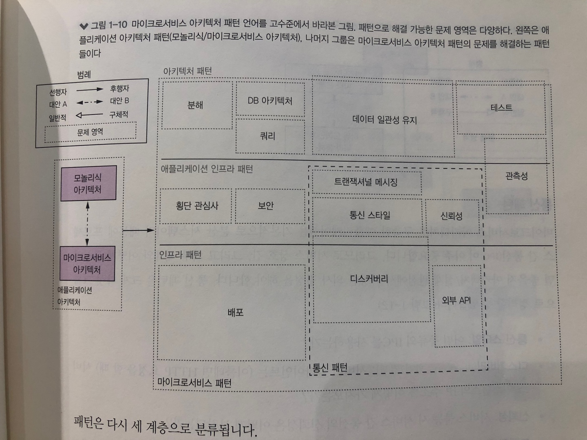

# 1장 모놀리식 지옥에서 벗어나라

| 마이크로서비스 패턴 1장을 정리한 내용입니다

# 프롤로그

- 푸드투고(FTGO) CTO 메리는 지난주 컨퍼런스에 참석해서 지속적 배포, 마이크로서비스 아키텍처 등 최신 소프트웨어 개발 기법을 접하게 되었다
- 컨퍼런스를 다녀온 메리는 한껏 자신감에 부풀어 FTGO의 소프트웨어 개발 프로세스를 개선하겠다고 마음먹었다
- 그런데 사무실로 복귀하여 출근한 날 아침부터 자신감은 이내 사라져 버렸다
- 개발 팀이 주요 릴리스 날짜를 못 맞추게 된 이유를 두고 2시간이나 넘게 옥식각신했다
- 불행히도 최근 몇 년간 이런 소모성 회의는 점점 일상처럼 굳어졌다
- FTGO가 어떤 문제에 봉착했고, 어쩌다 이 지경에 이르렀는지 확인해보자

# 1.1 서서히 모놀리식 지옥에 빠져들다

- FTGO는 웹, 또는 모바일 앱에 접속하여 인근 음식점에 주문하면 배달원이 음식을 픽업해서 소비자에게 배달하는 서비스이다
- FTGO 애플리케이션 역시 하나의 WAR 파일로 구성된 모놀리스로 개발되었다
- 시간이 흐를수록 점점 앱이 커지면서 애플리케이션이 복잡해졌다
- 진흙잡탕(Big Ball of Mud) 패턴 : 되는 대로 막 쌓아 올려 제먹대로 연결된, 엉성한 테이프로 덕지덕지 도배된 스파게티 코드 범법
- 소프트웨어 전달 페이스는 느려지기 시작했고, 프레임워크 버전은 점점 한물가게 되었다

## 1.1.1 FTGO 애플리케이션 아키텍처

## 1.1.2 모놀리식 아키텍처의 장점

- 개발이 간단하다 : 단일 애플리케이션 구축에 초점을 맞출수 있다
- 애플리케이션을 쉽게 변경할 수 있다 : 코드, DB 스키마를 변경해서 빌드/배포하기 용이하다
- 테스트하기 용이하다
- 배포하기 쉽다 : WAR파일만 복사하면 된다
- 확장하기 쉽다 : 인스턴스를 여러개 실행하면 된다

## 1.1.3 모놀리식 지옥의 실상

- 개발 팀이 스프린트를 할 때마다 추가 구현할 스토리가 늘어나고 그만큼 코드베이스와 관리 오버헤드 역시 증가했다
- 당초 소규모였던 개발 팀도 이제는 팀별로 긴으 분야가 특화된 스크럼 팀만 여럿이다

### 너무 복잡해서 개발자가 주눅 들다

- FTGO는 여느 개발자가 완전히 이해할 수 없을 정도로 내용이 방대해서 버그를 고치고 새 기능을 정확하게 구현하기가 갈수록 힘들고 시간도 오래 걸린다

  

- 그림추가

### 개발이 더디다

- 애플리케이션이 너무 커져서 개발자 IDE의 실행 속도도 느려지고, 자연히 빌드 시간도 오래 걸린다
- 더구나 비대한 몸집에 걸맞게 한 번 시동하는 것도 적잖은 시간이 필요하다

### 커밋부터 배포에 이르는 길고 험난한 여정

- 고친 내용을 프로덕션에 배포하는 일이 아주 길고 고통스럽다
- 배포는 한달에 한번 정도 금요일 저녁이나 토요일 밤에 프로덕션 배포를 한다
- FTGO는 부분적으로 애자일을 도입했고 기술 팀을 여러 소그룹으로 나누어 2주짜리 스프린트를 진행한다
- 그러나 완성된 코드가 프로덕션에서 실행되기 전까지는 길고 험난한 여정을 거쳐야 한다
- 여러 개발자가 같은 코드베이스에 소스 커밋을 하다 보니 종종 릴리즈할 수 없을때도 있다
- 기능 브랜치로 해결하면 되겠다 싶지만 아주 길고 고통스러운 소스 병합 단계가 개발자를 괴롭힌다
- 테스트 시간이 너무 긴 것도 변경분을 프로덕션에 반영하는 데 시간이 많이 걸리는 요인이다
- 코드베이스가 너무 복잡하여 변경 영향도가 제대로 파악이 안 되므로 개발자는 CI 서버에서 전체 테스트를 한 번씩 돌려 봐야 한다
- 테스트가 실패하면 원인을 찾고 조치하는 데 시간이 많이 걸리므로 테스트 한 사이클을 완료하는 데만 2~3일이나 걸린다

### 확정하기 어렵다

- FTGO는 모듈마다 리소스 요건이 서로 맞지 않아 확장하기 어렵다
- 데이터 용량이 큰 음식점 데이터는 인-메모리 DB 형태로 저장하는데, 이런 DB는 메모리 칩이 많이 장착된 서버에 배포하는 것이 좋지만, 이미지 처리 모듈은 CPU를 집중 소모하므로 CPU 코어 수가 많은 서버에 배포하는 것이 최적한다

### 모놀리스는 확실하게 전달하기 어렵다

- 애플리케이션 자체가 워낙 덩치가 커서 철저하게 테스트하기 어렵고, 테스트성이 부족하면 결국 프로덕션에 버그가 발생할 가능성도 높다
- 전체 모듈이 같은 프로세스로 실행되는 까닭에 결함 격리(fault isolation)가 되지 않고, 그러다 보니 어떤 모듈에 버그 하나만 있어도 메모리 누수가 발생해서 전체 애플리케이션 인스턴스가 내려가는 일도 드물지 않다

### 갈수록 한물간 기술 스택에 발목이 붙잡히다

- 모놀리식 지옥에서는 아키텍처 때문에 어쩔 수 없이 점점 한물간 기술 스택을 쓸 수 밖에 없고, 그 특성상 새로운 프레임워크, 새로운 프로그래밍 언어를 받아들이기 어렵다
- 최신 기술을 사용하고자 전체 모놀리식 애플리케이션을 재작성하는 것도 비용도 비용이거니와 리스크가 높기 때문에 개발자는 프로젝트 초기에 결정된 기술을 그냥 따를 수 밖에 없고, 점점 안 쓰는 기술스택으로 작성된 애플리케이션을 울며 겨자 먹기로 유지할 수밖에 없다
- 스프링 프레임워크는 하위 호환성을 보장하면서 발전해왔지만 불행히도 새 버전의 스프링과 호환되지 않는 프레임워크 버전을 사용 중이고 이 프레임워크를 업그레이드할 시간은 엄두도 못 낼 형편이다
- FTGO 개발자는 Go, Node.js 등 비 JVM 언어로 이런저런 실험을 해보고 싶어 하지만 모놀리식 애플리케이션은 그저 희망사항일 뿐이다

# 1.4 마이크로서비스 아키텍처가 답이다

- 결국 메리는 FTGO 애플리케이션을 마이크로서비스 아키텍처로 전환하기로 했다
- FTGO 애플리케이션은 점점 몸집이 커지면서 여러 가지 품질 속성이 악화되었고, 그중 소프트웨어 전달 속도, 확장성, 테스트성이 가장 큰 영향을 받았다
- 평소 훈련이 잘된 팀은 팀원들이 열심히 노력하면 종합적인 자동화 테스트를 작성해서 모놀리식 지옥에 빠지는 속도를 늦출 수 있다
- 하지만 규모가 커지면 여러 사람이 모놀리식 애플리케이션 하나에 달라붙어 작업할 떄 일어나는 문제들은 불가피할 수 없다

## 1.4.1 확장 큐브와 마이크로서비스

- 마이크로서비스 아키텍처는 확장 큐브라는 3차원 확장 모델이 있다

- X축 확장 : 다중 인스턴스에 고루 요청 분산
- Z축 확장 : 요청 속성별 라우팅
- Y축 확장 : 기능에 따라 애플리케이션을 서비스로 분해

## 1.4.2 마이크로서비스는 모듈성을 갖고 있다

- 애플리케이션은 규모가 방대하고 내용이 너무 복잡해서 어느 한 개인이 전부 다 이해하고 개발할수 없다
- 따라서 여러 사람이 이해하고 개발할 수 있게 애플리케이션을 여러 모듈로 분해한다
- 마이크로서비스 아키텍처는 서비스를 모듈성의 단위로 사용한다

## 1.4.3 서비스마다 DB가 따로 있다

- 마이크로서비스는 서로 느슨하게 결합되어 있고 오직 API를 통해서만 통신한다
- 그렇기 때문에 서비스 특성 마다 다른 DB를 사용할 수 있다
- 그래서 다른 서비스 개발자와 일일이 스키마에 대해 협의하지 않아도 되고 스스로 변경이 가능하다

# 1.5 마이크로서비스 아키텍처의 장단점

## 마이크로서비스 아키텍처는 다음과 같은 장점이 있다

### 크고 복잡한애플리케이션을 지속적으로 전달/배포할 수 있다

- 마이크로서비스 아키텍처는 다음 세 가지 방법으로 지속적 전달/배포를 실현한다
  - 테스트성
    - 지속적 전달/배포를 하려면 자동화 테스트가 꼭 필요하다
    - 상대적으로 크기가 작아서 자동화 테스트를 작성하기 쉽고 더 빨리 실행되며 버그도 적은편이다
  - 배포성
    - 독립적으로 배포할 수 있어서 개발자가 자신이 담당한 서비스 변경분을 배포할 때 굳이 다른 개발자와 협의할 필요가 없다(?)
  - 자율성, 느슨한 결합
    - 타 팀과 독립적으로 개발, 배포, 확장할 수 있으므로 개발 속도는 더 빨라진다
  - 지속적 전달/배포의 비즈니스 측면
    - 고객 피드백에 신속히 대응할 수 있다
    - 고객들의 기대 수준으로 확실하게 서비스를 제공할 수 있다
    - 제품의 가치를 전달하는 데 더 많은 시간을 투자할 수 있다

### 서비스 규모가 작아 관리하기 쉽다

- 비교적 개발자가 코드를 이해하기 쉽다
- 구동하는 시간이 훨씬 빠르기 때문에 작업후 배포하는 과정 역시 더 빠르고 생산적이다

### 서비스를 독립적으로 배포/확장할 수 있다

### 마이크로서비스 아키텍처 덕분에 팀이 자율적으로 움직인다

### 결함 격리가 잘된다

- 어느 서비스에서 메모리 누수가 발생하더라도 해당 서비스만 영향을 받고 다른 서비스는 정상 가동된다

### 새로운 기술을 실험하고 도입하기 쉽다

- 새로운 서비스를 개발할 때 그 서비스에 가장 알맞은 언어와 프레임워크를 자유롭게 선택할 수 있다
- 서비스 규모가 작기 때문에 더 나은 언어와 기술로 얼마든지 재작성 할 수 있다

## 마이크로서비스 아키텍처의 단점

### 딱 맞는 서비스를 찾기가 쉽지 않다

- 만약 서비스를 잘못 분해할 경우, 모놀리식/마이크로서비스 아키텍처의 단점만 있는 분산 모놀리스를 구축하게 된다
- 반드시 함께 배포해야 하는 결합도가 높은 서비스들로 이루어진 시스템이 탄생한다

### 분산 시스템은 복잡하다

- 서비스 간 통신에 필수적인 IPC 역시 단순 메서드 호출보다는 복잡하며, 사용 불능 또는 지연 시간이 긴 원격 서비스, 부분 실패한 서비스를 처리할 수 있게 설계해야 한다
- 특히 서비스마다 DB가 따로 있기 때문에 트랜잭션을 구현하는 일이 어렵다
- 그래서 마이크로서비스 아키텍처는 사가라는 기술로 서비스 간 데이터 일관성을 유지한다
- 또는 단순 쿼리로는 여러 서비스에 있는 데이터를 조회할 수 없으므로 몌ㅑfmf whgkqgkrjsk CQRS 뷰로 쿼리한다
- 여러 서비스가 연관된 테스트를 자동화하는 것도 쉽지 않다
- 마이크로서비스 아키텍처는 운영 복잡도 역시 가중시킨다
- 종류가 다른 서비스가 여러 인스턴스로 떠 있으니 프로덕션에서 관리해야 할 가동부가 더 늘어난다
- 그래서 마이크로서비스를 성공적으로 배포하려면 다음과 같은 기술을 응용하여 플래폼을 고도로 자동화해야 한다
  - 넥플릭스 스핀네이커 같은 자동화 배포 툴
  - 피보탈 클라우드 파운드리 또는 레드햇 오픈시프트 처럼 바로 쓸 수 있는 PaaS
  - 도커 스웜, 쿠버네티스 등 도커 오케스트레이션 플래폼

### 여러 서비스에 걸틴 공통 기능은 배포할 때 잘 살펴야 한다

- 여러 서비스에 걸틴 기능을 배포할 때에는 여러 개발 팀 간에 세심한 조율이 필요하다
- 그러므로 서비스 간 디펜던시에 따라 서비스 배포 계획을 빈틈없이 수립해야 한다

### 도입 시기를 결정하기 어렵다

- 마이크로서비스 아키텍처를 도입할지 결정하는 것도 쉽지 않다
- 초기 버전을 개발할 때에는 굳이 마이크로서비스 아키텍처를 사용해서 해결할 이슈가 거의 없다
- 정교한 분산 아키텍처를 사용하면 개발 속도가 더딜 수 있고 신속하게 이터레이션하기도 어렵다
- 따라서 비즈니스 모델과 이를 뒷받침하는 애플리케이션을 재빠르게 발전시켜야 하는 스타트업 회사는 모놀리식 애플리케이션으로 시작하는 것이 좋다
- 그런 다음 복잡성을 다루는 문제가 중요해지는 시점에 애플리케이션을 여러 마이크로서비스로 기능 분해하는 것이 바람직하다
- 이베이, 아마존, 구루폰, 길트 같ㅊ은 유명 사이트로 처음에는 모놀리식 아키텍처로 시작했다가 나중에 마이크로서비스 아키텍처로 전환했다
- 마이크로서비스 도입은 각자 나름대로 트레이드오프가 존재하다
- 그래서 올바른 의사결정을 할 수 있도록 마이크로서비스 아키텍처 패턴 언어를 살펴봐야 한다

# 마이크로서비스 아키텍처 패턴 언어

## 마이크로서비스 아키텍처도 만병통치약은 아니다

- 프레더릭 브룩스는 <맨먼스 미신>에서 소프트웨어 공학에 만병통치약 따위는 없다고 이야기한다
- 하지만 현재도 자신의 묘책이 정답이라고 강변하며 자신이 즐겨 쓰는 기술이 엄청난 생산성 증대로 이어질 것이란 맹목적인 확신을 부르짓는 개발자들이 있다
- 모든 기술은 일장일단이 있기에 어떤 기술을 택하더라도 `가트너 하이프 사이클`의 전철을 밟게 된다
- 즉, 새로운 기술은 관심이 최고조에 이르러 환멸의 구렁텅이로 미끄러지고 결국 생산성이 정채 상태에 빠지게 되는 5단계를 거치게 된다(그제서야 그 기술의 트레이드오프가 무엇인지, 언제 사용해야 할지 이해하게 된다)
- 마이크로서비스 역시 만병통치약이 아니다
- 어떤 기술을 놓고 과장된 극단적인 논쟁이 벌어지는 근복적인 이유는 본래 감정의 지배를 받기 쉬운 인간의 특성 탓이다
- 소프트웨어 개발 커뮤니티에 속한 사람들은 자신의 감정을 극복한 산태에서 기술을 논할 방법을 강구해야 한다

## 패턴 및 패턴 언어

- 패턴은 특정한 상황에서 발생한 문제에 대한 재사용 가능한 해법이다
- 패턴은 맥락을 고려하게 만드는 것 외에도 매우 중요하지만 자주 간과되는 솔루션의 측면도 함께 기술하도록 강제한다는 점에서 효용성이 크다. 사용 패턴의 구조는 대략 다음 세 부분으로 구성된다
  - 강제 조항
  - 결과 맥락
  - 연관 패턴

### 강제 조항: 문제 해결을 위해 반드시 처리해야 할 이슈

- 주어진 맥락에서 문제를 해결하고자 할 때 반드시 처리해야 할 강제 조항이다
- 모든 조항을 전부 충족할 수는 없고, 어느 조항이 더 중요한지는 맥락에 따라 다르므로 우선순위를 정해야 한다
- 예를 들어 리액티브 스타일로 작성한 코드는 동기 코드보다 성능은 우수할지 모르지만 개발자가 이해하기는 상대적으로 어렵다
- 강제 조항을 명시적으로 나열하면 어느 이슈를 해결해야 할지 명확해진다

### 결과 맥락: 패턴 적용 결과

- 패턴을 적용한 결과를 다음 세 부분으로 기술하는 영역이다
  - 장점 : (해결된 강제 조항 등) 패턴의 좋은 점
  - 단점 : (미해결 강제 조항 등) 패턴의 나쁜 점
  - 이슈 : 패턴 적용 시 발생한 새로운 문제점

### 연관 패턴 : 다섯 가지 관계 유형

- 한 패턴과 다른 패턴의 관계를 기술하는 영역
  - 선행자(predeccor) : 이 패턴을 필요하게 만든 선행 패턴
  - 후행자(successor) : 리 패턴으로 야기된 이슈를 해결하는 패턴
  - 대안(alternative) : 이 패턴의 대체 솔루션을 제공하는 패턴
  - 일반화(generalization) : 문제를 해결하는 일반적인 솔루션에 해당하는 패턴
  - 세분화(specialization) : 특정 패턴을 더 세부적으로 나타낸 형태

# 마이크로서비스 아키텍처 패턴 언어 개요

- 패턴 언어는 여러 그룹의 패턴으로 구성된다

  

- 인프라 패턴 : 주로 개발 영역 밖의 인프라 문제를 해결
- 애플리케이션 인프라 : 개발에도 영향을 미치는 인프라 문제를 해결
- 애플리케이션 패턴 : 개발자가 맞닥뜨리는 문제를 해결

## 애플리케이션을 여러 서비스로 분해하는 패턴

- 한 시스템을 여러 서비스로 분해하는 방법을 결정하는 기술이다

## 통신 패턴

- 서비스 상호 간, 그리고 외부 세계와 어떻게 통신하면 좋을지 아키텍처/설계 관점에서 다양한 의사 결정
  - 통신 스타일 : 여러 종류의 IPC를 사용하는가?
  - 디스커버리 : 서비스 클라이언트는 서비스 인스턴스의 IP 주소를 어떻게 가져오는가?
  - 신뢰성 : 서비스 불능 시 서비스 간 통신의 신뢰성은 어떻게 보장되는가?
  - 트랜잭셔널 메시징 : 비즈니스 데이터를 업데이트하는 DB 트랜잭션에 메시지를 송신하고 이벤트를 발행하는 행위를 어떻게 통합하는가?
  - 외부 API : 애플리케이션 클라이언트는 서비스와 어떻게 통신하는가?

## 트랜잭션 관리를 위한 데이터 일관성 패턴

- 분산 트랜잭션은 사가 패턴에 따라 데이터 일관성을 유지해야 한다

## 데이터 쿼리 패턴

- 서비스마다 DB를 두면 각 서비스가 소유한 데이터를 조인하는 쿼리도 문제이다
- 서비스 데이터는 오직 그 서비스의 API를 통해서만 접근할 수 있기 때문에 DB에 분산 쿼리를 사용할 수 없다
- 이런 쿼리는 두 가지 패턴을 응용해서 구현한다
  - API 조합 패턴
  - CQRS

## 서비스 배포 패턴

- 마이크로서비스 애플리케이션은 다양한 언어와 프레임워크로 구현된 수십~수백 개의 서비스로 이루어져 있기 때문에 배포 작업이 훨씬 더 복잡하고 관리할 가동부가 상당히 많다
- 보통 언어에 특정한 패키징 포맷으로 애플리케이션을 수동 배포했다
- 하지만 이런 식으로는 마이크로서비스 아키텍처가 오래 버틸 수 없다
- 개발자가 단순한 UI로 서비스를 배포/관리하고, 가상 머신, 컨테이너, 서버리스 기술을 응용한 배포 플랫폼이 바람직하다

## 관측성 패턴: 애플리케이션 동작 파악

- 운영자의 주 임무는 애플리케이션의 런타임 동작을 이해하고 요청 실패, 높은 지연 시간 등 갖가지 문제를 진단/조치하는 일이다.
- 마이크로서비스 아키텍처는 요청 결과가 클라이언트에 반환되기까지 어떤 서비스를 어떻게 오갈지 알 수 없기 때문에 로그 파일 하나만으로는 원인을 파악할 수 없고 문제의 원인을 찾고 진단하기가 매우 복잡하다
- 관측 가능한 서비스를 설계하려면 다음과 같은 패턴이 필요하다
  - 헬스 체크 API : 서비스 가동 상태를 반환하는 끝점
  - 로그 수집 : 서비스 내역을 기록하고 중앙 로깅 서버에 로그를 출력하는 검색/경고 기능
  - 분산 추적 : 각 외부 요청마다 ID를 부여하여 서비스를 통화하는 과정을 추적
  - 예외 추적 : 예외가 발생하면 예외 추적 서비스에 보고한다
  - 애플리케이션 지표 : 카운터, 게이지 등의 지료를 측정
  - 감사 로깅 : 사용자가 한 일을 기록

## 서비스 테스트 자동화 패턴

- 컨슈머 주도 계약 테스트 : 클라이언트가 의도한 대로 서비스가 동작하는지 확인
- 컨슈머 쪽 계약 테스트 : 클라이언트와 서비스가 상호 통신 가능한지 확인
- 서비스 컴포넌트 테스트 : 서비스를 따로따로 테스트

## 보안 패턴

- 마이크로서비스 아키텍처에서는 일반적으로 API 게, 역할 등 사용자 정보를 인증한 후 호출할 서비스에 관련 정보를 전달한다

# 마이크로서비스 너머: 프로세스와 조직

## 소프트웨어 개발/전달 조직

- 프레드 브룩스의 <맨먼스 미신>에 따르면 크기가 N인 팀의 소통 오버헤드는 O(N2)으로 증가한다고 한다
- 그래서 규모가 큰 팀을 여러 팀으로 나누는 것이 좋다
- 거대한 한 팀보다는 작은 여러 팀의 움직임이 훨씬 빠르다
- 각 팀마다 굳이 다른 팀과 협의할 필요 없이 독립적으로 서비스를 개발, 배포, 확장할 수 있다
- 무엇보다 개발 조직도 확장성이 좋다
- 팀을 늘려 조직을 키울 수 있고, 어떤 팀 하나가 너무 커지면 연관된 서비스 단위로 다시 팀을 나누면 된다
- 팀은 서로 느슨하게 결합되어 있으므로 대규모 팀의 소통 오버헤드가 발생할 일은 없으며, 생산성에 아무런 영향을 끼치지 않고 인원을 보강할 수 있다

## 소프트웨어 개발/전달 프로세스

- 애자일 개발 프로세스를 도입하고 스크럼, 칸반 등을 실천해야 한다
- 데브옵스의 일부인 지속적 전달/배포를 실천하면 금상첨화이다
- 데브옵스의 목표는 신속하고 확실하게 소프트웨어를 전달하는 것이다. 다음은 소프트웨어 개발 수준을 평가하는 네가지 기준이다
  - 배포 빈도 : 소프트웨어를 얼마나 자주 프로덕션에 배포하는가?
  - 리드 타임 : 개발자가 변경분을 체크인할 때부터 프로덕션에 배포할 때까지 걸린 시간
  - 평균 복구 시간 : 프로덕션 문제 복구에 소요된 시간
  - 변경분 실패율 : 프로덕션에 문지를 일으킨 변경분의 비율

## 마이크로서비스를 받아들이는 인간적 요소

- 마이크로서비스 아키텍처를 도입하면 아키텍처, 조직, 개발 프로세스가 모두 변화한다
- 앞서 언급한 대로 궁극적으로는 감정적인 존재인 인간의 근무 환경도 달라질 것이다
  1. 끝나다. 빼앗기다. 놓아주다 : 사람들이 안락한 영역에서 강제로 내쫒기게 되었을 떄 느끼는 감정적인 격변과 저항 기간이다
  2. 중립 지대 : 옛 작업 방식과 새 작업 방식 사이의 중간 단계이다
  3. 새 출발 : 사람들이 새로운 작업 방식을 열심히 받아들이고 그 혜책을 몸소 경험하기 시작하는 최종 단계
- 이 책은 세 변이 단계를 각각 어떻게 관리하는 것이 최선인지, 어떻게 하면 성공적으로 변화할 가능성을 높일 수 있는지 안내한다

# 마치며

- 마이크로서비스 아키텍처 패턴은 독립적으로 배포 가능하면서 자체 DB를 보유한 서비스들로 시스템을 분해한다
- 마이크로서비스 아키텍처를 채택하면 자율적인 소규모 팀들이 작업을 병행할 수 있어서 소프트웨어 개발 속도가 빠르다
- 마이크로서비스 아키텍처는 만병통치약이 아니다
- 소프트웨어 전달 속도를 높이려면 마이크로서비스 아키텍처만으로는 부족하다. 소프트웨어를 성공적으로 개발하려면 데브옵스 및 자율적인 소규모 팀들이 있어야 한다
- 마이크로서비스를 검토할 때 인간적인 측면도 고려해야 한다. 직원들이 느끼는 감정도 충분히 반영되어야 성공적인 전환이 가능하다
