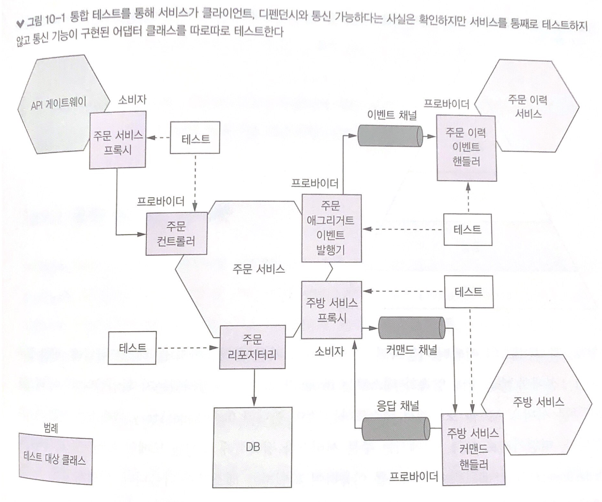
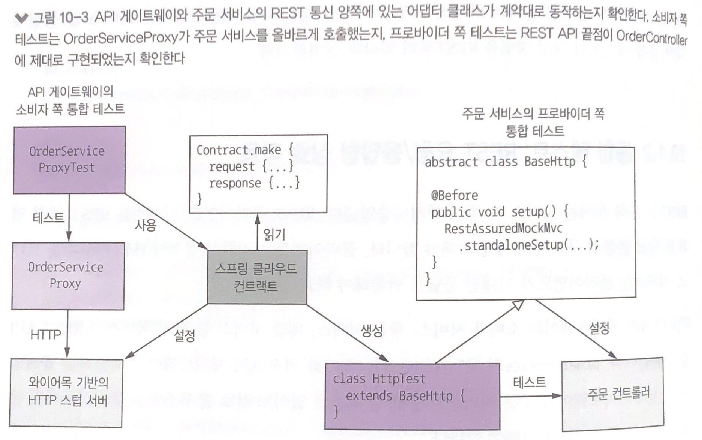
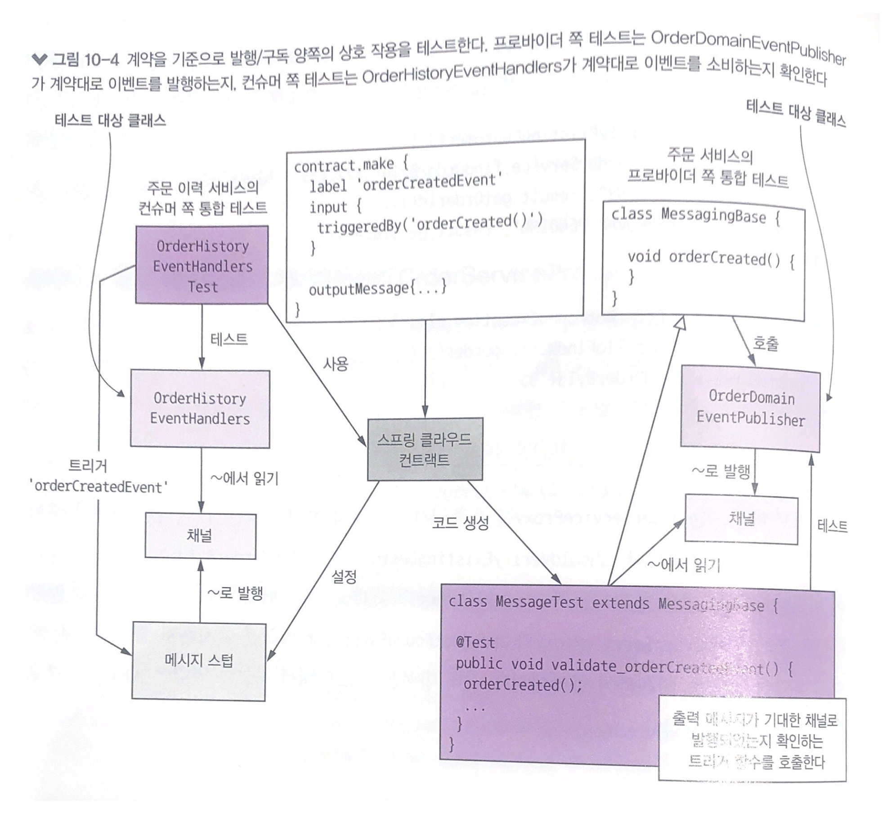

# 마이크로서비스 테스트 2부

> 마이크로서비스 패턴 10장을 정리한 내용입니다

# 통합 테스트 작성



- 통합 테스트는 종단 간 테스트처럼 전체 서비스를 실행시키지 않는다
- 그 대신 테스트 효과에 영향을 끼치지 않고도 테스트를 엄청나게 간소화하기 위해 두 가지 전략을 사용한다
    - 첫째, 각 서비스의 어댑터를 테스트한다. 예를 들어 JPA 영속화 테스트는 Order가 정확히 저장되었는지 확인한다
    - 둘째, 계약은 두 서비스 간 상호 작용의 구체적인 사례이다.

## 통합 테스트: 영속화

- 영속화 통합 테스트의 절차는 다음과 같다
    - 설정 : DB 스키마를 생성하고 기지(known)의 상태로 초기화하는 DB를 설정한다
    - 실행 : DB 작업을 수행한다
    - 확인 : DB 상태, 그리고 DB 에서 조회한 객체를 단언한다
    - 정리 : 설정 단계에서 시작한 트랜잭션을 롤백하는 등 DB에 변경한 내용을 언두해야 할 경우 필요한 단계이다

```jsx
@Configuration
@EnableJpaRepositories
@EnableAutoConfiguration(exclude = TramConsumerJdbcAutoConfiguration.class)
public class OrderJpaTestConfiguration { }

@RunWith(SpringRunner.class)
@SpringBootTest(classes = OrderJpaTestConfiguration.class)
public class OrderJpaTest {

  @Autowired
  private OrderRepository orderRepository;

  @Autowired
  private TransactionTemplate transactionTemplate;

  @Test
  public void shouldSaveAndLoadOrder() {

    long orderId = transactionTemplate.execute((ts) -> {
      Order order = new Order(CONSUMER_ID, AJANTA_ID, OrderDetailsMother.DELIVERY_INFORMATION, chickenVindalooLineItems());
      orderRepository.save(order);
      return order.getId();
    });

    transactionTemplate.execute((ts) -> {
      Order order = orderRepository.findById(orderId).get();

      assertNotNull(order);
      assertEquals(OrderState.APPROVAL_PENDING, order.getState());
      assertEquals(AJANTA_ID, order.getRestaurantId());
      assertEquals(CONSUMER_ID, order.getConsumerId().longValue());
      assertEquals(chickenVindalooLineItems(), order.getLineItems());
      return null;
    });

  }

}
```

# 통합 테스트: REST 요청/응답형 상호 작용

- API 게이트웨이가 스텁에 어떤 HTTP 요청을 하는지 기술하고, 계약의 응답은 스텁이 API 게이트웨이에 어떤 응답을 돌려주는지 기술한다
- 스프링 클라우드 컨트랙트는 이런 계약을 이용하여 프로바이더 쪽 주문 서비스 통합 테스트를 코드-생성하고, 이 통합 테스트로 스프링 목 MVC나 레스트 어슈어드 목 MVC를 이용하여 컨트롤러를 테스트한다
- 소비자 쪽 OrderServiceProxyTest는 OrderServiceProxy를 호출하는데, 이 OrderServiceProxy는 wireMock에 HTTP 요청을 하도록 설정하였다
- wireMock을 관리하고 계약에 명시된 HTTP 요청에 응답하도록 구성하는 작업은 스프링 클라우드 컨트랙트의 몫이다



## REST API 계약 예제

- 프로바이더 쪽에서 스프링 클라우드 컨트랙트는 HttpTest라는 테스트 클래스를 생성한다
- REST 계약에는 클라이언트가 전송하는 HTTP 요청과 서버가 반환하리라 기대되는 HTTP 응답을 지정한다

```jsx
org.springframework.cloud.contract.spec.Contract.make
{
  request {
    method 'GET'
    url '/orders/99'
  }
  reponse {
    status 200
    headers {
      header('Content-Type': 'application/json;charset=UTF-8')
    }
    body('''{"orderId" : "99", "state" : "APPROVAL_PENDING"}''')
  }
}
```

## 컨슈머 주도 계약 통합 테스트: 주문 서비스

- 주문 서비스의 컨슈머 주도 계약 통합 테스트는 이 서비스의 API가 클라이언트 기대에 부합하는지 확인한다
- 이 클래스는 목 디펜던시가 주입된 컨트롤러를 생성하고, 이 목이 컨트롤러가 기대한 응답을 만들어 내도록 설정한다

```jsx
public abstract class HttpBase {

  private StandaloneMockMvcBuilder controllers(Object... controllers) {
    CommonJsonMapperInitializer.registerMoneyModule();
    MappingJackson2HttpMessageConverter converter = new MappingJackson2HttpMessageConverter(JSonMapper.objectMapper);
    return MockMvcBuilders.standaloneSetup(controllers).setMessageConverters(converter);
  }

  @Before
  public void setup() {
    OrderService orderService = mock(OrderService.class);
    OrderRepository orderRepository = mock(OrderRepository.class);
    OrderController orderController = new OrderController(orderService, orderRepository);

    when(orderRepository.findById(OrderDetailsMother.ORDER_ID)).thenReturn(Optional.of(OrderDetailsMother.CHICKEN_VINDALOO_ORDER));
    when(orderRepository.findById(555L)).thenReturn(empty());
    RestAssuredMockMvc.standaloneSetup(controllers(orderController));

  }
}
```

## 소비자 쪽 통합 테스트: API 게이트웨이의 OrderServiceProxy

- API 게이트웨이의 OrderServiceProxy는 GET /orders/{orderId} 끝점을 호출한다
- @AutoConfigureStubRunner는 스프링 클라우드 컨트랙트가 랜덤포트에 와이어목 서버를 계약 내용대로 구성/실행하도록 지시하는 스프링 클라우드 컨트랙트에 내장된 애너테이션이다

```jsx
@RunWith(SpringRunner.class)
@SpringBootTest(classes=TestConfiguration.class, webEnvironment= SpringBootTest.WebEnvironment.NONE)
@AutoConfigureStubRunner(ids = {"net.chrisrichardson.ftgo:ftgo-order-service-contracts"})
@DirtiesContext
public class OrderServiceProxyIntegrationTest {

  @Value("${stubrunner.runningstubs.ftgo-order-service-contracts.port}")
  private int port;
  private OrderDestinations orderDestinations;
  private OrderServiceProxy orderService;

  @Before
  public void setUp() throws Exception {
    orderDestinations = new OrderDestinations();
    String orderServiceUrl = "http://localhost:" + port;
    orderDestinations.setOrderServiceUrl(orderServiceUrl);
    orderService = new OrderServiceProxy(orderDestinations, WebClient.create());
  }

  @Test
  public void shouldVerifyExistingCustomer() {
    OrderInfo result = orderService.findOrderById("99").block();
    assertEquals("99", result.getOrderId());
    assertEquals("APPROVAL_PENDING", result.getState());
  }

  @Test(expected = OrderNotFoundException.class)
  public void shouldFailToFindMissingOrder() {
    orderService.findOrderById("555").block();
  }

}
```

# 통합 테스트: 발행/구독 스타일 상호 작용

- 가령 주문 서비스는 Order 애그리거트를 생성/수정할 때마다 Order* 이벤트를 발행하고, 주문 이력 서비스는 이 이벤트를 소비하는 컨슈머이다
- 컨슈머 쪽 테스트는 각 계약에 지정된 이벤트를 발행하며 OrderHistoryEventHandler가 목 디펜던시를 올바르게 호출하는지 확인한다



## OrderCreated 이벤트 발행 계약

```jsx
org.springframework.cloud.contract.spec.Contract.make {
    label 'orderCreatedEvent'
    input {
        triggeredBy('orderCreated()')
    }

    outputMessage {
        sentTo('net.chrisrichardson.ftgo.orderservice.domain.Order')
        body('''{"orderDetails":{"lineItems":[{"quantity":5,"menuItemId":"1","name":"Chicken Vindaloo","price":"12.34","total":"61.70"}],"orderTotal":"61.70","restaurantId":1, "consumerId":1511300065921}, "restaurantName" : "Ajanta"}''')
        headers {
            header('event-aggregate-type', 'net.chrisrichardson.ftgo.orderservice.domain.Order')
            header('event-type', 'net.chrisrichardson.ftgo.orderservice.api.events.OrderCreatedEvent')
            header('event-aggregate-id', '99') // Matches OrderDetailsMother.ORDER_ID
        }
    }
}
```

- 다음은 이 계약의 두 가지 주요 엘리먼트이다
  - label : 컨슈머 테스트에서 스프링 컨트랙트가 이벤트 발행을 트리거하기 위해 사용하는 엘리먼트
  - triggeredBy : 코드-생성된 테스트 메서드가 이벤트 발행을 트리거하기 위해 호출하는 상위 클래스의 메서드명

- 이 테스트는 Order 애그리거트 도메인 이벤트의 발행을 담당한 OrderDomainEventPublisher가 클라이언트의 기대대로 이벤트를 발행하는지 확인한다
- 인-메모리 메시징 스텁을 사용하도록 구성하고, 코드-생성된 테스트가 이벤트 발행을 트리거하기 위해 호출하는 orderCreated() 같은 메서드를 정의한다

```jsx
@RunWith(SpringRunner.class)
@SpringBootTest(classes = DeliveryserviceMessagingBase.TestConfiguration.class, webEnvironment = SpringBootTest.WebEnvironment.NONE)
@AutoConfigureMessageVerifier
public abstract class DeliveryserviceMessagingBase {

  static {
    CommonJsonMapperInitializer.registerMoneyModule();
  }

  @Configuration
  @EnableAutoConfiguration
  @Import({EventuateContractVerifierConfiguration.class, TramEventsPublisherConfiguration.class, TramInMemoryConfiguration.class, EventuateTransactionTemplateConfiguration.class})
  public static class TestConfiguration {

    @Bean
    public OrderDomainEventPublisher orderAggregateEventPublisher(DomainEventPublisher eventPublisher) {
      return new OrderDomainEventPublisher(eventPublisher);
    }
  }

  @Autowired
  private OrderDomainEventPublisher orderAggregateEventPublisher;

  protected void orderCreatedEvent() {
    orderAggregateEventPublisher.publish(CHICKEN_VINDALOO_ORDER,
            Collections.singletonList(new OrderCreatedEvent(CHICKEN_VINDALOO_ORDER_DETAILS, OrderDetailsMother.DELIVERY_ADDRESS, AJANTA_RESTAURANT_NAME)));
  }
}
```

- OrderDomainEventPublisher를 호출하여 OrderCreated 이벤트를 발행하고, 테스트 메서드는 이 이벤트를 받아서 계약에 명시된 이벤트와 맞추어 본다

## 소비자 쪽 계약 테스트: 주문 이력 서비스

- 주문 이력 서비스는 주문 서비스가 발행한 이벤트를 소비하는 서비스이다
- 각 테스트 메서드는 먼저 스프링 클라우드를 호출해서 계약에 명시된 이벤트를 발행하고, OrderHistoryEventHandlers가 OrderHistoryDao를 올바르게 호출하는지 확인한다

```jsx
@RunWith(SpringRunner.class)
@SpringBootTest(classes = OrderHistoryEventHandlersTest.TestConfiguration.class,
        webEnvironment = SpringBootTest.WebEnvironment.NONE)
@AutoConfigureStubRunner(ids ={"net.chrisrichardson.ftgo:ftgo-order-service-contracts"})
@DirtiesContext
public class OrderHistoryEventHandlersTest {

  @Configuration
  @EnableAutoConfiguration
  @Import({OrderHistoryServiceMessagingConfiguration.class,
          TramCommandProducerConfiguration.class,
          TramInMemoryCommonConfiguration.class,
          TramNoopDuplicateMessageDetectorConfiguration.class,
          EventuateContractVerifierConfiguration.class})
  public static class TestConfiguration {

    @Bean
    public ChannelMapping channelMapping() {
      return new DefaultChannelMapping.DefaultChannelMappingBuilder().build();
    }

    @Bean
    public OrderHistoryDao orderHistoryDao() {
      return mock(OrderHistoryDao.class); // OrderHistoryEventHandlers에 주입할 목 OrderhistoryDao 생성
    }
  }

  @Autowired
  private StubFinder stubFinder;

  @Autowired
  private OrderHistoryDao orderHistoryDao;

  @Test
  public void shouldHandleOrderCreatedEvent() throws InterruptedException {
    when(orderHistoryDao.addOrder(any(Order.class), any(Optional.class))).thenReturn(false);

    stubFinder.trigger("orderCreatedEvent"); // orderCreatedEvent 스텁을 트리거하여 OrderCreated 이벤트를 발생시킴

    eventually(() -> { // OrderHistoryEventHandlers가 orderHistoryDao.addOrder()를 호출했는지 확인
      ArgumentCaptor<Order> orderArg = ArgumentCaptor.forClass(Order.class);
      ArgumentCaptor<Optional<SourceEvent>> sourceEventArg = ArgumentCaptor.forClass(Optional.class);
      verify(orderHistoryDao).addOrder(orderArg.capture(), sourceEventArg.capture());

      Order order = orderArg.getValue();
      Optional<SourceEvent> sourceEvent = sourceEventArg.getValue();

      assertEquals("Ajanta", order.getRestaurantName());
    });
  }

}
```

# 컴포넌트 테스트 개발

- 서비스 인수 테스트는 통합 테스트와 종단 간 테스트 중간에 위치한 컴포넌트 테스트를 이용하여 작성하는 것이 효율적이다
- 서비스 인수 테스트를 작성하기 위해 거킨(Gherkin)이라는 테스트 DSL의 사용 방법을 살펴보고, 컴포넌트 테스트의 다양한 설계 이슈를 알아보자

## 인수 테스트 정의

- 인수 테스트는 사용자 스토리나 유스 케이스에서 출발하며, 내부 구현이 아닌 컴포넌트의 클라이언트 관점에서 어떤 동작이 외부에 드러나야 하는지 기술한다
- 예를 들어 ‘주문하기’ 스토리는 주문 서비스의 주요 스토리 중 하나이다

    ```jsx
    나는 주문 서비스의 소비자로서 주문을 할 수 있어야 한다
    ```


- 이 스토리는 다음과 같은 시나리오로 확장할 수 있다

    ```jsx
    내가 유효한 소비자라면
    내가 유효한 신용카드를 사용한다면
    아잔타 음식점이 주문을 받는다면
    내가 이 음식점에 치킨 빈달루를 주문할 경우
    나의 주문은 승인되어야 한다
    그리고 OrderAuthorized 이벤트가 발행되어야 한다
    ```


## 인수 테스트 작성: 거킨

- 거킨은 실행 가능한 명세를 작성하는 DSL이다
- 일상 언어로 작성한 시나리오 형태로 인수 테스트를 정의한 후, 큐컴버(Cucumber)라는 거킨 전용 테스트 자동화 프레임워크를 이용하여 명세를 실행한다.
- 거킨, 큐컴버 덕분에 시나리오를 실행 가능한 코드로 전환하는 수작업을 할 필요가 없다

### 큐컴버를 이용한 거킨 명세 실행

- 큐컴버는 거킨으로 작성한 테스트를 실행하는 자동화 테스트 프레임워크이다
- 큐컴버를 사용하려면 먼저 스텝 데피니션 클래스를 작성한다
- @Given, @When, @Then, @And를 붙이고, 큐컴버가 스텝을 매칭시키는 데 필요한 정규 표현식은 애너테이션의 값으로 지정한다

```jsx
// place-order.features

Feature: Place Order

  As a consumer of the Order Service
  I should be able to place an order

  Scenario: Order authorized
    Given A valid consumer
    Given using a valid credit card
    Given the restaurant is accepting orders
    When I place an order for Chicken Vindaloo at Ajanta
    Then the order should be APPROVED
    And an OrderAuthorized event should be published

  Scenario: Order rejected due to expired credit card
    Given A valid consumer
    Given using an expired credit card
    Given the restaurant is accepting orders
    When I place an order for Chicken Vindaloo at Ajanta
    Then the order should be REJECTED
    And an OrderRejected event should be published
```

## 컴포넌트 테스트 작성: 주문 서비스

- @CucumberOptions에는 거킨 피처 파일의 경로를 지정한다.
- 일반적인 JUnit 테스트 클래스와는 달리 테스트 메서드가 하나도 없다. 거킨 피처를 읽어 테스트를 정의하고 OrderServiceComponentTestStepDefinitions 클래스로 실행 가능한 테스트를 만드는 것이다
- OrderServiceComponentTestStepDefinitions는 테스트 클래스는 아니지만, 스프링 테스트 프레임워크의 일부인 @ContextConfiguration이 달려 있다
- 그래서 이 애너테이션으로 스프링 ApplicationContext를 가져와 메시징 스텁 등 다양한 스프링 컴포넌트를 정의할 수 있다

## OrderServiceComponentTestStepDefinitions 클래스

```jsx
@SpringBootTest(classes = OrderServiceComponentTestStepDefinitions.TestConfiguration.class, webEnvironment = SpringBootTest.WebEnvironment.NONE)
@ContextConfiguration
public class OrderServiceComponentTestStepDefinitions {

	...

  @Given("A valid consumer")
  public void useConsumer() {
    sagaParticipantStubManager.
            forChannel("consumerService")
            .when(ValidateOrderByConsumer.class).replyWith(cm -> withSuccess());
  }

  public enum CreditCardType { valid, expired}

  @Given("using a(.?) (.*) credit card")
  public void useCreditCard(String ignore, CreditCardType creditCard) {
    switch (creditCard) {
      case valid :
        sagaParticipantStubManager
                .forChannel("accountingService")
                .when(AuthorizeCommand.class).replyWithSuccess();
        break;
      case expired:
        sagaParticipantStubManager
                .forChannel("accountingService")
                .when(AuthorizeCommand.class).replyWithFailure();
        break;
      default:
        fail("Don't know what to do with this credit card");
    }
  }

  @Given("the restaurant is accepting orders")
  public void restaurantAcceptsOrder() {
    sagaParticipantStubManager
            .forChannel("kitchenService")
            .when(CreateTicket.class).replyWith(cm -> withSuccess(new CreateTicketReply(cm.getCommand().getOrderId())))
            .when(ConfirmCreateTicket.class).replyWithSuccess()
            .when(CancelCreateTicket.class).replyWithSuccess();

    if (!restaurantRepository.findById(RestaurantMother.AJANTA_ID).isPresent()) {
      domainEventPublisher.publish("net.chrisrichardson.ftgo.restaurantservice.domain.Restaurant", RestaurantMother.AJANTA_ID,
              Collections.singletonList(RestaurantMother.makeAjantaRestaurantCreatedEvent()));

      eventually(() -> {
        FtgoTestUtil.assertPresent(restaurantRepository.findById(RestaurantMother.AJANTA_ID));
      });
    }
  }

  @When("I place an order for Chicken Vindaloo at Ajanta")
  public void placeOrder() {

    response = given().
            body(new CreateOrderRequest(consumerId,
                    RestaurantMother.AJANTA_ID, OrderDetailsMother.DELIVERY_ADDRESS, OrderDetailsMother.DELIVERY_TIME, Collections.singletonList(
                            new CreateOrderRequest.LineItem(RestaurantMother.CHICKEN_VINDALOO_MENU_ITEM_ID,
                                                            OrderDetailsMother.CHICKEN_VINDALOO_QUANTITY)))).
            contentType("application/json").
            when().
            post(baseUrl("/orders"));
  }
}
```

## 컴포넌트 테스트 실행

- 컴포넌트 테스트는 실행 속도가 느린 편이므로 ./gradlew test의 일부로 실행하는 방법은 좋지않다
- 테스트 코드를 src/component-test/java라는 별도 디렉터리에 넣고 ./gradlew componentTest 명령을 실행하는 것이 좋다

# 종단 간 테스트 작성

- 종단 간 테스트는 가동부가 무진장 많고, 수많은 서비스와 관련 인프라 서비스까지 함께 배포해야 하므로 느릴 수밖에 없다
- 많은 서비스를 배포하는 테스트는 서비스 중 하나라도 배포 실패하면 무용지물이므로 테스트를 신뢰할 수 없게 될 가능성이 높다
- 그래서 종단 간 테스트는 가능하다면 그 수를 줄이는 것이 좋다

# 마치며

- 서비스 간 상호 작용을 테스트할 때에는 예제 메시지에 해당하는 계약을 활용한다. 서비스와 그 중간 단계에 위치한 디펜던시를 전부 실행하는 굼뜬 테스트보다는 두 서비스의 어댑터가 계약에 맞게 동작하는지 확인하는 테스트를 작성하세요
- 서비스가 API를 통해 잘 동작하는지는 컴포넌트 테스트를 작성하여 확인해라. 디펜던시는 스터빙하고 서비스는 따로 테스트해서 컴포넌트 테스트를 단순/신속하게 수행하는 것이 좋다
- 느리고 취약하면서 시간만 축내는 종단 간 테스트는 가급적 줄이고 사용자 탐험 테스트를 작성해라. 사용자 탐험 테스트는 사용자가 애플리케이션에 접속하고 이동하는 과정을 모킹해서 비교적 규모가 큰 애플리케이션이 잘 동작하는지 고수준에서 확인한다.
- 테스트 수가 적고 테스트마다 설정 같은 오버헤드를 최소화할 수 있어서 테스트가 빠르다
