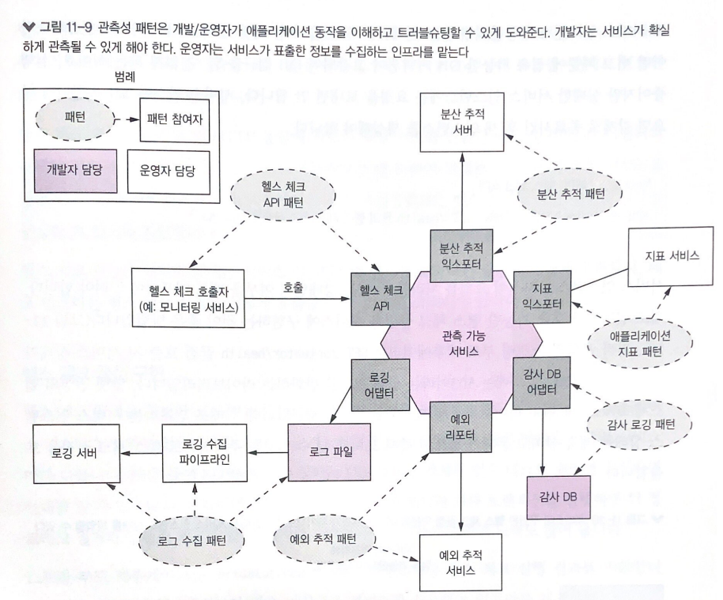
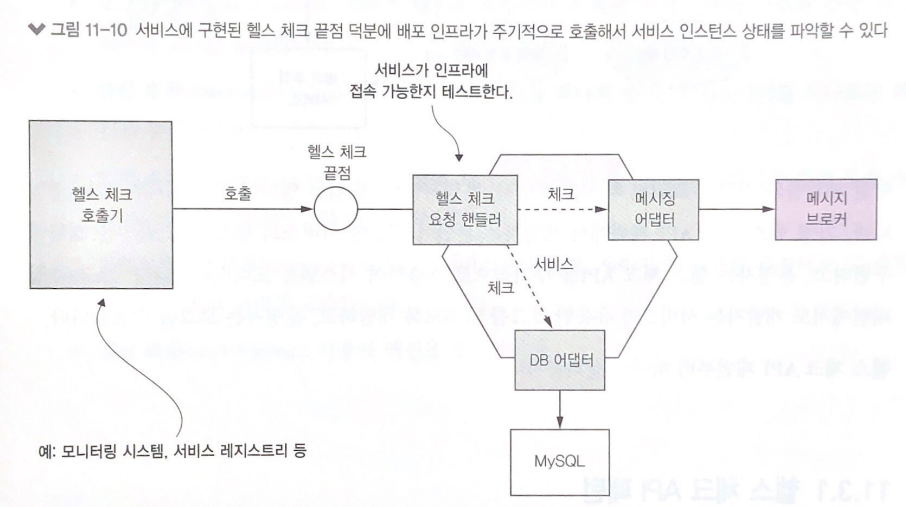
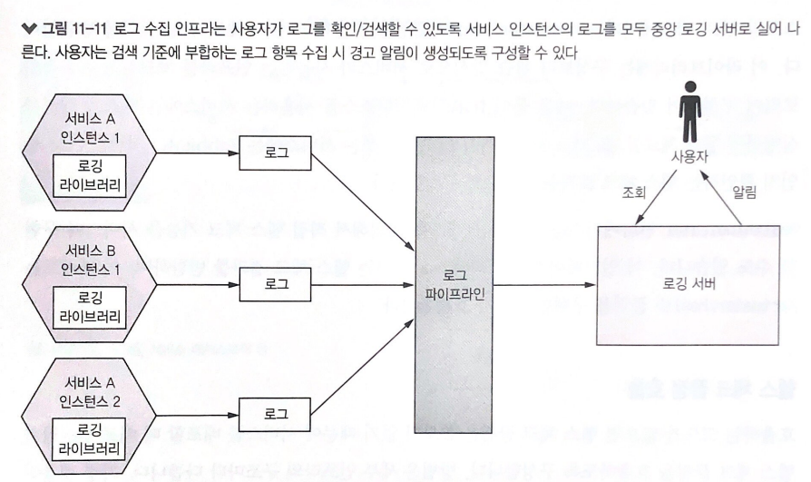
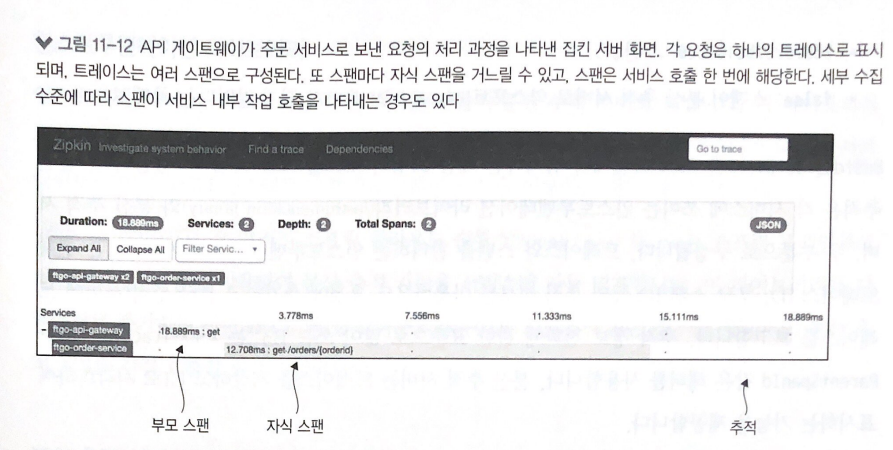
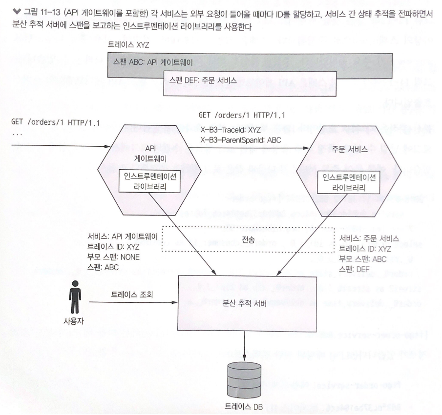
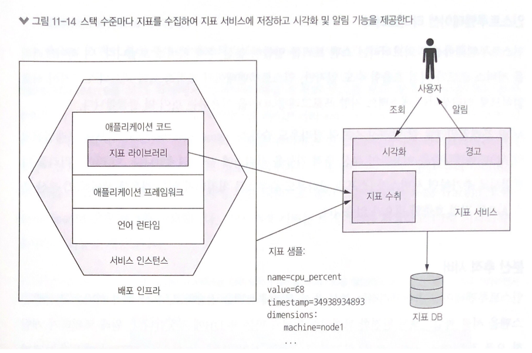
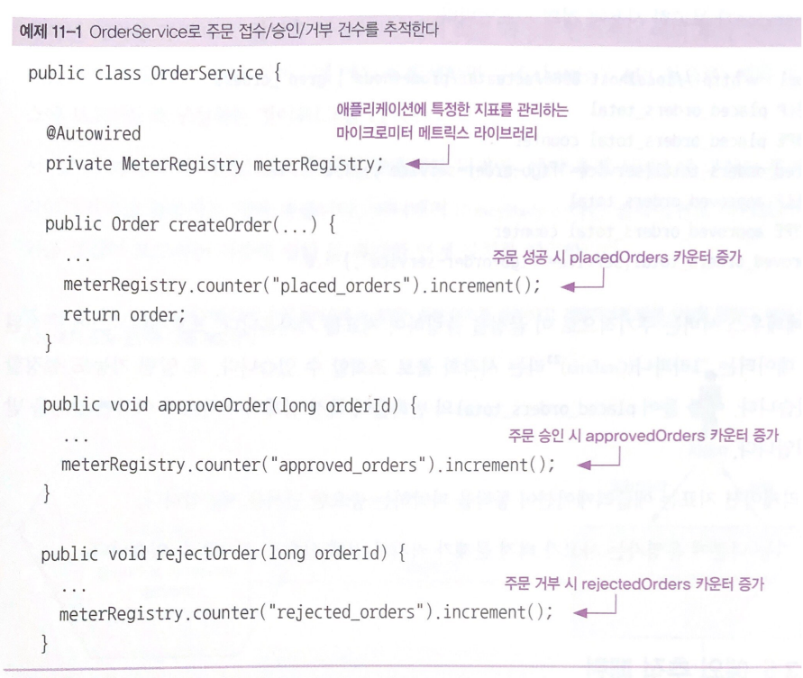
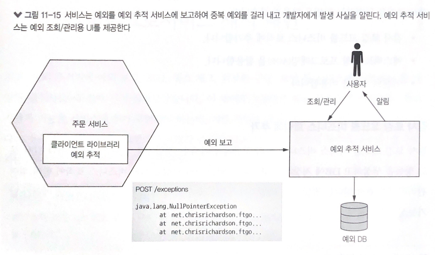
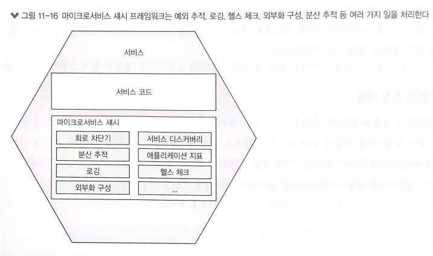
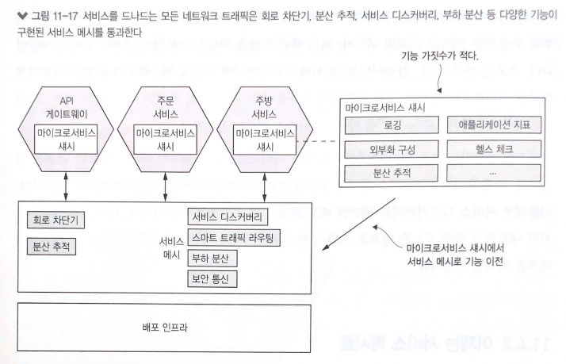

# 11장 프로덕션 레디 서비스 개발

> 마이크로서비스 패턴 11장을 정리한 내용입니다

- 이제 서비스를 프로덕션에 배포할 수 있게 준비하려면 세 가지 핵심 품질 속성, 보안, 구성성, 관측성이 보장되어야 한다
  - 애플리케이션 보안 : 보안 측면에서 본다면 마이크로 서비스 아키텍처는 기존 모놀리식 아키텍처와 큰 차이점은 없다. 서비스간에 사용자 신원을 전달하는 수단같은 일부 보안 요소는 구현 방법을 달리한다
  - 서비스 구성성 : 메시지 브로커, DB 등 다수의 외부 서비스를 사용한다. 서비스에 구성 프로퍼티를 하드코딩할 수는 없으니 런타임에 구성 프로퍼티 값을 서비스에 공급하는 외부화 구성 메커니즘을 활용한다
  - 관측성 : 여러개의 서비스가 구동중인 마이크로 서비스 아키텍처에서 로그가 분산되어 있으면 요청이 어떻게 처리되는지 알기 어렵다. 쉽게 파악할 수 있어야 한다

## 보안 서비스 개발

- 애플리케이션 개발자는 주로 다음 네 가지 보안 요소를 구현한다
  - 인증(authentication) : 신원 확인, 주체의 자격 증명
  - 인가(authorization) : 주체의 데이터 수행 권한 확인. 역할 기반(role-based) 보안 및 ACL 을 보통 함께 사용
  - 감사(auditing) : 보안 이슈 탐지, 컴플라이언스 시행 등 고객 지원을 위해 주체가 수행하는 작업을 추적
  - 보안 IPC : 모든 서비스 통신이 TLS(Transport Layer Security)를 경유하는 것이 이상적

### 기존 모놀리식 애플리케이션의 보안


- 그림 11-2의 이벤트 순서
  - 클라이언트가 애플리케이션에 로그인 요청을 한다
  - LoginHandler가 자격증명 확인, 세션 생성, 세션에 주체 정보 저장 등 일련의 로그인 요청 처리를 수행한다
  - LoginHandler가 클라이언트에 세션 토큰을 반환한다
  - 클라이언트는 이후 모든 작업을 호출할 때마다 세션 토큰을 넣어 보낸다
  - SessionBasedSecurityInterceptor가 제일 먼저 이를 처리한다. 이 인터셉터는 요청이 들어올 때마다 세션 토큰을 확인한 후, 보안 컨텍스트를 설정한다. 보안 컨텍스트에는 주체와 역할 관련 정보가 있다
  - 요청 핸들러는 보안 컨텍스트를 이용하여 사용자가 작업을 수행할 권한이 있는지 판단하고 사용자의 신원을 획득한다

- 사용자 종류마다 소비자, 음식점, 배달원, 관리자 역할을 정의하고, 스프링 시큐리티의 선언형 보안 메커니즘을 이용하여 역할별로 서비스 및 URL접근을 제한한다

### 마이크로서비스 아키텍처에서의 보안 구현

- 마이크서비스 아키텍처는 모든 외부 요청을 API 게이트웨이와 하나 이상의 서비스가 처리하는 분산 시스템이다
- 주문 서비스는 소비자 본인의 주문 정보만 조회할 수 있게 해야 하는데, 그러려면 인증/인가를 조합해야 한다
- 모놀리식에서 통했던 다음 두 가지 보안 요소는 마이크로서비스 아키텍처에서는 해당되지 않는다
  - 인-메모리 보안 컨텍스트 : 스레드 로컬 등 인-메모리 보안 컨텍스트를 이용해서 사용자 신원을 전달하는 방법으로 서비스는 메모리를 공유할 수 없으므로 이 방법으로 신원을 전달할 수 없다
  - 중앙화 세션 : 인-메모리 세션도 의미가 없고 DB 기반의 세션에 접근하는것은 가능하나 느슨한 결합 원칙에 위배된다. 다른 세션 메커니즘이 필요하다
  

#### API 게이트웨이에서 인증 처리

- 첫째, 서비스마다 알아서 사용자를 인증한다 -> 모든 개발자가 제대로 보안을 구현하리라 보기 어렵기 때문에 보안 취약점이 노출될 위험성이 크다
- 둘째, 요청을 서비스에 보내기 전에 API 게이트웨이가 요청을 인증한다 -> 인증 로직 중앙화로 보안 취약점이 노출될 가능성이 줄어든다. API 게이트웨이가 매번 서비스에 요청을 할 때마다 토큰을 함께 넣어 보낸다. 서비스는 이 토큰을 이용하여 요청을 검증하거나 주체 정보를 획득할 수 있다


- API 클라이언트 쪽 이벤트 순서는 다음과 같다(A)
  - 클라이언트는 자격증명이 포함된 요청을 전송한다
  - API 게이트웨이는 자격증명을 인증하고, 보안 토큰을 생성해서 서비스에 전달한다
  
- 로그인 기반 클라이언트의 이벤트 순서는 다음과 같다(B)
  - 클라이언트는 자격증명이 포함된 로그인 요청을 한다
  - API 게이트 웨이는 보안 토큰을 반환한다
  - 클라이언트는 작업을 호출하는 요청에 보안 토큰을 넣어 보낸다
  - API 게이트웨이는 보안 토큰을 검증하고 해당 서비스로 포워딩한다
  
#### 인가 처리

- 인증처럼 인가 로직도 API 게이트웨이 내부에 중앙화하면 보안을 강화할 수 있다
- 하지만 API 게이트웨이에 인가 로직을 두면, API 게이트웨이와 서비스가 단단히 결합하게 되어서 나중에 변경할 일이 생기면 서로 맞물리게 될 수 있다
- 또 API 게이트웨이는 역할 기반의 URL 경로 접근 제한만 구현할 수 있고 서비스 도메인 로직의 세부 내용까지 알고 있어야 하는 개별 도메인 객체의 접근 권한을 제어하는 ACL까지 구현할 수 는 없다
- 따라서 인가 로직은 서비스에 구현하는 것이 좋다. 서비스가 직접 역할 기반으로 URL과 메서드를 인가하고, ACL로 애그리거트 접근을 따로 관리한다

#### JWT로 사용자 신원/역할 전달

- API 게이트웨이가 어떤 종류의 토큰에 사용자 정보를 담아 서비스에 전달해야 하는지 결정해야 한다. 토큰 종류는 두가지 이다
  - 첫째, 난독화 토큰(opaque token)
    - UUID를 많이 쓰고 성능 및 가용성이 떨어지고 지연 시간이 길다는 단점이 있다. 토큰 수신자가 토큰의 유효성을 검증하고 보안 서비스를 동기 RPC를 호출하여 사용자 정보를 조회해야 하기 때문이다
  - 둘째, 보안 서비스 호출이 필요 없는 투명 토큰(transparent token)
    - JWT가 사실상 투명 토큰의 표준 규격으로 두 당사자 간의 사용자 신원/역할 등의 정보를 안전하게 표현하는 표준 수단이다
    - JWT는 토큰 자체가 포함되어 있어 중간에 취소가 불가하다. 이를 위해 유효 기간이 짧은 JWT를 발급하는 방법을 쓴다. JWT를 계속 재발행해야하는 문제는 OAuth 2.0을 통해 해결할 수 있다
  
#### OAuth 2.0 응용

- 자격증명, 역할 등 사용자 정보를 관리하는 보안 인프라를 직접 개발하는것은 비효율적이다. OAuth 2.0표준이 구현된 기성 서비스나 프레임 워크를 사용하면 된다
- 깃허브 리포지터리에 CI 서비스가 접근하도록 보안 허가를 내주는 메커니즘도 OAuth 2.0이다
- OAuth 2.0의 핵심개념을 간략히 살펴보자
  - 인증 서버 : 사용자 인증 및 액세스/리프레시 토큰 획득 API를 제공한다. 스프링 OAuth는 OAuth 2.0 인증 버서버를 구축하는 대표적인 프레임워크다
  - 액세스 토큰 : 리소스 서버 접근을 허가하는 토큰. 구현체마다 포맷이 다르며, 스프링 OAuth는 JWT를 사용한다
  - 리프레시 토큰 : 클라이언트가 새 액세스 토큰을 얻기 위해 필요한 토큰. 수명은 길지만 취소 가능한 토큰이다
  - 리소스 서버 : 엑세스 토큰으로 접근을 허가하는 서비스, 마이크로서비스 아키텍처는 서비스가 곧 리소스 서버이다
  - 클라이언트 : 리소스 서버에 접근하려는 클라이언트. 마이크로서비스 아키텍처는 API 게이트웨이가 OAuth 2.0 클라이언트이다
  


- API 클라이언트를 인증하는 방법
  - 클라이언트는 기본 인증을 이용하여 자격증명과 함께 요청한다
  - API 게이트웨이는 OAuth 2.0 인증 서버에 패스워드 승인을 요청한다
  - 인증 서버는 API 클라이언트의 자격증명을 검증하고 액세스/리프레시 토큰을 반환한다
  - API 게이트웨이는 서비스에 요청을 할 때마다 발급받은 액세스 토큰을 넣어 보내고, 서비스는 액세스 토큰을 이용하여 요청을 인증한다


- 로그인 기반 클라이언트를 인증하는 방법
  - 로그인 기반의 클라이언트가 자격증명을 API 게이트웨이에 POST 한다
  - API 게이트웨이의 로그인 핸들러는 OAuth 2.0 인증 서버에 패스워드 승인을 요청한다
  - 인증 서버는 클라이언트의 자격증명을 검증 후, 액세스/리프레시 토큰을 반환한다
  - API 게이트웨이는 인증 서버에서 받은 두 토큰을 클라이언트에 반환한다
  - 클라이언트는 액세스/리프레시 토큰을 API 게이트웨이에 요청할 때마다 실어 보낸다
  - API 게이트웨이의 세션 인증 인터셉터는 액세스 토큰을 검증 후 서비스에 토큰을 넣어 보낸다
  
- OAuth 2.0이 마이크로서비스 아키텍쳐의 유일한 보안 수단은 아니지만, 어떻게 보안에 접근하든 다음 세 가지 기본 사상은 똑같다
  - API 게이트웨이는 클라이언트 인증을 담당한다
  - API 게이트웨이 및 서비스는 투명 토큰을 이용하여 주체 정보를 주고 받는다
  - 서비스는 토큰을 이용하여 주체의 신원/역할 정보를 획득한다
  
## 구성 가능한 서비스 설계

- 주문 이력 서비스는 아파치 카프카에서 전달받은 이벤트를 소비하고 AWS DynamoDB 테이블 아이템을 읽고 쓴다. 이 서비스를 실행하려면 각 인프라 위치 등 여러 가지 구성 프로퍼티가 필요하다
- 문제는 개발, 운영 환경 등 서비스 실행 환경마다 구성 프로퍼티의 값이 다르다는 점이다


- 소스 코드에 미리 하드 코딩해 놓거나, 스프링 프레임워크의 프로파일 장치로 런타임에 프로퍼티 세트를 선택하는 구조는 보안에 취약하고 배포에 한계가 있어 적철치 않다
- 외부화 구성 패턴에 따라 런타임에 적합한 구성 프로퍼티를 서비스에 제공하는 방법이 낫다
- 외부화 구성 메커니즘은 구현 방식에 따라 푸시/풀 두 가지 모델이 있다
  - 푸시 모델: OS 환경 변수, 구성 파일 등을 통해 배포 인프라에서 서비스로 프로퍼티 값을 전달한다
  - 풀 모델: 서비스 인스턴스가 구성 서버에 접속해서 프로퍼티 값을 읽어 온다
  
### 푸시 기반의 외부화 구성

- 배포 환경은 서비스 인스턴스가 생성될 때 프로퍼티 값을 제공한다


- 스프링 부트가 프로퍼티 값을 읽어 올 수 있는 소스는 다음과 같다 (프로퍼티 명이 같을 때 우선 순위 규칙 순)
  - CLI 인수
  - OS 환경 변수(SPRING_APPLICATION_JSON) 또는 JSON 포맷으로 기술된 JVM 시스템 프로퍼티
  - JVM 시스템 프로퍼티
  - OS 환경 변수  
  - 현재 디렉터리의 구성 파일
  
- @Value를 붙여 특정 프로퍼티 값을 세팅하면 된다

```java
@Value("${aws.region}")
private String awsRegion;
```

- aws.region 프로퍼티 값은 구성 파일, AWS_REGION 환경 변수 등 여러 소스 중 하나에서 읽는다
- 푸시 모델은 널리 사용되지만 이미 실행 중인 서비스를 재구성하기는 어렵다. 재시동하지 않고서는 바꿀 수 없거나 구성 프로퍼티 값이 여러 서비스에 흩어지는 문제가 있어 풀 모델을 검토해야 한다

### 풀 기반의 외부화 구성

- 풀 모델은 서비스 인스턴스가 시동 시 자신이 필요한 값을 구성 전용 서버에 접속하여 읽는 방식이다
- 구성 전용 서버 접속에 필요한 프로퍼티 값은 푸시 구성 메커니즘을 사용한다
- 구성 서버는 여러 가지 방법으로 구현 가능하다
  - 버전 관리 시스템
  - SQL/NoSQL DB
  - 전용 구성 서버(스프링 클라우드 컨피그 서버), 자격증명 등 민감한 데이터를 보관하는 해시코프 볼트, AWS 파라미터 스토어


- 스프링 클라우드 컨피그는 서버/클라이언트로 구성된 유명한 구성 서버 기반 프레임워크로 서버는 구성 프로퍼티를 저장하는 다양한 백엔드 기술을 지원하고, 클라이언트는 서버에서 구성 프로퍼티를 가져와 스프링 ApplicationContext에 주입하는 역할을 한다
- 구성 서버가 있으면 장점이 많다
  - 중앙화 구성 : 모든 구성 프로퍼티를 한곳에서 관리하여 간편하고, 전역 기본값을 정의해서 서비스 단위로 재정의하는 식으로 중복 구성 프로퍼티를 제거할 수 있다
  - 민감한 데이터의 투명한 복호화 : DB 자격증명 등 민감한 데이터는 암호화를 해야하는데 암호화한 데이터를 서비스 인스턴스에서 복호화하려면 암호화키가 필요하다. 구성 서버는 프로퍼티를 자동 복호화해서 서비스에 전달한다
  - 동적 재구성 : 수정된 프로퍼티 값을 폴링 등으로 감지해서 자동 재구성한다
  
## 관측 가능한 서비스 설계

- 애플리케이션을 프로덕션에 배포하고 나서 운영자 입장에서는 초당 요청 수, 리소스 이용률 등 현재 애플리케이션의 상태가 궁금하다
- 다음은 이런 관측 가능한 서비스를 설계하는 패턴이다
  - 헬스 체크 API : 서비스 헬스를 반환하는 끝점을 표출한다
  - 로그 수집(log aggregation) : 서비스 활동을 로깅하면서 검색/경고 기능이 구현된 중앙 로그 서버에 로그를 출력한다
  - 분산 추적(distributed tracing) : 각 외부 요청에 ID를 하나씩 붙여 서비스 사이를 드나드는 과정을 추적한다
  - 예외 추적(exception tracking) : 예외 중복 제거, 개발자 알림, 예외별 해결 상황 추적 등을 수행하는 예외 추적 서비스에 예외를 보고한다
  - 애플리케이션 지표(application metrics) : 서비스는 카운터, 게이지 등 지표를 유지하고, 수집한 데이터를 지표 서버에 표출한다
  - 감사 로깅(audit logging) : 사용자 액션을 로깅한다



- 이 패턴들의 두드러진 특징은 개발자, 운영자 각자의 업무 영역이 각각 정해져 있는것이다

### 헬스 체크 API 패턴

- 서비스 인스턴스는 자신이 요청을 처리할 수 있는 상태인지 여부를 배포 인프라에 알려야 한다
- 배포 인프라가 호출 가능한 헬스 체크 끝점을 서비스에 구현하는 것이 좋은 방법이다
- 자바 진영의 스프링 부트 액추에이터는 GET /actuator/health 끝점 호출 시 서비스 상태가 정상일 경우 200, 그 외에는 503이라는 상태 코드를 반환하는 라이브러리이다



- 헬스 체크 요청 핸들러는 서비스 인스턴스 및 외부 서비스의 접속 상태를 테스트 한다. DB에도 주기적으로 테스트 쿼리를 전송한다
- 헬스 체크 기능을 구현할 때에는 서비스 인스턴스의 헬스를 보고하는 끝점을 어떻게 구현할지, 배포 인프라는 헬스 체크 끝점을 어떻게 호출할지, 두 가지를 고려해야 한다

#### 헬스 체크 끝점 구현

- 헬스 체크 끝점을 구현한 코드는 서비스 인스턴스가 접근할 외부 인프라 서비스 마다 방법이 다르다
- 스프링 부트 액추에이터는 관습 방식으로 인프라를 체크하는 실용적인 로직이 구현되어 있다. 예를 들어 JDBC 데이터소스를 사용하는 서비스에는 테스트 쿼리를 실행하는 헬스 체크를, RabbitMQ 메시지 브로커를 쓰는 서비스에는 RabbitMQ 서버가 가동 중인지 확인하는 헬스 체크 로직을 자동으로 구성한다

#### 헬스 체크 끝점 호출

- 서비스를 배포할 때 배포 인프라가 헬스 체크 끝점을 호출하도록 구성한다. 방법은 세부 인프라의 구조마다 다르다
- 넷플릭스 유레카 같은 서비스 레지스트리가 헬스 체크 끝점을 호출하도록 구성해서 네트워크 트래픽이 서비스 인스턴스로 전송되었는지 확인 할 수 있다

### 로그 수집 패턴

- 로그는 소중한 트러블슈팅 도구다. 애플리케이션에서 문제가 무엇인지 확인하려면 로그 파일부터 보는것이 순서다. 하지만 마이크로서비스 아키텍처에서 로그를 이용하는 것이 쉽지는 않다
- 모든 서비스 인스턴스가 남긴 로그를 로그 수집 파이프라인을 통해 중앙 로깅 서버로 보내는 로그 수집으로 해결 할 수 있다
- 로깅 서버에 저장된 로그 데이터는 간편하게 조회, 검색, 분석할 수 있고, 특정한 메시지가 로그에 있으면 알림을 전송하도록 구성할 수도 있다



- 로깅 파이프라인과 로깅 서버는 보통 운영 팀이 담당하지만 유용한 로그를 남기도록 코딩하는 작업은 서비스 개발자의 몫이다

#### 서비스 로그 생성

- 서비스 개발자는 적합한 로깅 라이브러리를 선택한 후, 로그 항목을 어디에 출력할지 정해야한다
- 자바 진영의 로깅 라이브러리에는 로그백, Log4J, JUL 삼총사, 다양한 로깅 프레임워크의 퍼사드 역할을 하는 SLF4J가 있다
- 로그를 남길 장소로는 기존에는 잘 알려진 파일 시스템 경로에 로그 파일이 생성되도록 프레임워크를 설정했지만, 컨테이너, 서버리스 등 요즘 배포 기술에서는 보통 이렇게 하지 않는다(12장에서 설명)

#### 로그 수집 인프라

- 로깅 인프라는 로그를 수집, 저장한다. 이렇게 저장된 로그를 검색할 수 있다
- ELK 스택은 다음 세 오픈 소스 제품으로 구성된 대표적인 로깅 인프라이다
  - 일래스틱서치(Elasticsearch) : 로깅 서버로 쓰이는 텍스트 검색 지향 NoSQL DB
  - 로그스태시(Logstash) : 서비스 로그를 수집하여 일래스틱서치에 출력하는 로그 파이프라인
  - 키바나(kibana) : 일래스틱서칙 전용 시각화 툴
  
### 분산 추적 패턴

- getOrderDetails() 쿼리가 갑자기 느려진 원인을 찾는다고 하자. 서비스 호출이 많이 중첩되면 복잡해지고, 한 사람이 모든 서비스를 다 잘 알 리가 만무하다
- 분산 추적은 모놀리식 애플리케이션의 성능 프로파일러와 비슷한 것으로, 요청을 처리할 때마다 서비스 호출 트리 정보(예: 시작 시간, 종료 시간 등)를 기록 한다. 서비스가 외부 요청을 처리하며 어떤 상호 작용을 했는지, 어느 지점에서 얼마큼 시간을 썻는지 파악할 수 있다



- 위와 같은것을 트레이스라고 하는데, 외부 요청을 나타내는 트레이스는 하나 이상의 스팬으로 구성된다
- 스팬은 작업을 나타내며, 작업명, 시작/종료 타임스탬프가 주요 속성이다
- 중첩된 작업은 하나 이상의 자식 스팬으로 나타낼 수 있다

- 분산 추적은 각 외부 요청마다 ID를 부여하는 부수 효과를 유발하는데 서비스는 이 요청 ID를 로그에 남겨 특정 외부 요청에 대한 로그 항목은 수집된 로그에서 이 ID로 쉽게 찾을 수 있다
- 분산 추적은 각 서비스에 쓰이는 인스트루멘테이션(instrumentation) 라이브러리와 분산 추적 서버, 두 부분으로 구성된다
- 트레이스와 스팬을 관리하는 인스트루멘테이션 라이브러리는 현재 트레이스 ID, 부모 스팬 ID 등의 추적 정보를 아웃바운드 요청에 추가하고 분산 추적 서버에 트레이스를 보고한다
- 분산 추적 서버는 트레이스를 저장하고 UI로 시각화하여 표시하는 기능을 제공한다



#### 인스트루멘테이션 라이브러리

- 인스트루멘테이션 라이브러리는 스팬 트리를 만들어 분산 추적 서버로 보낸다
- 인스트루멘테이션 호출 로직은 서비스 코드에 넣으면 깔끔하지 않으므로 AOP 프레임워크로 잘 알려진 스프링 클라우드 슬루스(Sleuth)를 이용하여 분산 추적 기능을 서비스에 자동 연계한다
- 이 라이브러리를 디펜던시로 추가하면 서비스가 분산 추적 API를 직접 호출할 필요가 없다

#### 분산 추적 서버

- 분산 추적 서버는 전달받은 스팬을 서로 짜깁기해서 완전한 트레이스 형태로 만든 후 DB에 저장한다
- 트위터가 개발한 오픈 집킨(Zipkin)은 잘 알려진 분산 추적 서버이다
- 서비스는 HTTP나 메시지 브로커를 통해 스팬을 집킨 서버로 전송하고, 집킨 서버는 SQL/NoSQL DB 같은 저장소에 트레이스를 보관한다. 트레이스를 표시하는 UI도 있다

### 애플리케이션 지표 패턴

- 운영 환경에서 모니터링과 알림 기능은 매우 중요하다
- 모니터링 시스템은 기술 스택의 모든 부분에서 지표를 수집하여 중요한 애플리케이션 헬스 정보를 제공하고 수집하는 지표는 인프라 수준(cpu, 메모리, 디스크 사용률)부터 애플레케이션 수준(서비스 요청 지연 시간, 주문 접수 건수)까지 다양하다



- 지표는 주기적으로 샘플링하는데 지표 샘플은 기본적으로 세 가지 속성이 있다
  - name: 지표명
  - value: 수치값
  - timestamp: 샘플링 시간
  
- 지표는 보통 머신명, 서비스명 등 부가 정보를 제공하는 용도로 디멘션(dimension)이라는 임의의 이름-값 쌍과 함께 쓰인다
- 모니터링 역시 대부분 운영 팀이 관장하지만 서비스 개발자도 두 가지 임무가 있다
  - 첫째, 서비스가 자신의 동작에 관한 지표를 수집하도록 구현한다
  - 둘째, 지표를 JVM 및 애플리케이션 프레임워크 수준에서 수집한 지표와 함께 지표 서버에 표출한다
  
#### 서비스 수준의 지표 수집

- 지표 수집 기능 구현에 필요한 작업 공수는 애플리케이션에 사용한 프레임워크와 수집하려는 지표 종류마다 다르다
- 스프링 부트 기반의 서비스는 마이크로미터 메트릭스라는 라이브러리를 디펜던시로 추가하고 구성 코드 몇 줄만 넣으면 기본 지표(JVM)는 바로 수집 가능하다
- 아래 예제는 OrderService에서 주문 접수/승인/거부 건수에 관한 지표를 수집하는 코드이다. 마이크로미터 메트릭스의 MeterRegistry라는 인터페이스를 이용하여 이런 사용자 정의 지표를 수집한다



#### 지표 서비스에 지표 전달

- 서비스는 수집한 지표를 푸시 또는 풀 방식으로 메트릭스 서비스에 전달한다
- 푸시 모델은 서비스 인스턴스가 API를 호출하여 메트릭스 서비스에 지표를 밀어 넣는 방법이다(AWS 클라우드 워치)
- 풀 모델은 메트릭스 서비스(또는 로컬에서 실행되는 에이전트)가 서비스 API를 호출하여 서비스 인스턴스에서 지표를 당겨 오는 방법이다(프로메테우스)
- 축적된 지표 데이터는 그라파나(Grafana)라는 시각화 툴로 조회할 수 있고 알림 기능도 설정 할 수 있다

### 예외 추적 패턴

- 예외 로그를 남겨야 하는 경우는 드물지만, 문제의 근본 원인을 식별하는 데 중요한 단서이다
- 기존에는 직접 로그 파일에서 예외를 검색하거나, 로그 파일에 예외가 출현하면 알림을 보내도록 로깅 서버를 구성 했지만, 이런 방식은 다음과 같은 한계가 있다
  - 로그 파일은 대부분 한 줄이지만, 예외는 보통 여러줄이다
  - 로그 파일에 있는 예외의 해결 과정을 추적할 메커니즘이 없다. 결국 예외를 이슈 추적기에 일일이 복사/붙여넣기 해야 된다
  - 중복된 예외를 자동으로 하나의 예외로 식별하여 처리할 방법이 없다
  
- 중복된 예외를 제거하고, 알림을 생성하고, 예외 해결 과정을 관리하는 예외 추적 서비스를 따로 두는 것이 좋다
- 서비스가 예외 추적 서비스 API를 직접 호출해도 되지만, 예외 추적 서비스에 내장된 클라이언트 라이브러리르 활용하는 것이 좋다(허니배저 honeyBadger)



### 감사 로깅 패턴

- 감사 로깅은 각 사용자의 액션을 기록하는 것으로 일반 적으로 고객 지원, 컴플라이언스 준수, 수상한 동작 감지 용도로 쓰인다
- 사용자 신원 및 사용자가 수행한 작업, 비즈니스 객체들을 감사 로그 항목에 꼼꼼히 기록해서 DB에 저장한다
- 감사 로깅을 구현하는 방법은 다음이 있다
  - 감사 로깅 코드를 비즈니스 로직에 추가한다
  - 애스팩트 지향 프로그래밍(AOP)을 활용한다
  - 이벤트 소싱을 이용한다
  
#### 감사 로깅 코드를 비즈니스 로직에 추가

- 서비스 메서드마다 감사 로그 항목을 생성하고 DB에 저장한다
- 문제는 감사 로깅 코드와 비즈니스 로직이 섞여 관리하기 쉽지 않고 개발자가 감사 로깅 코드를 작성하여 에러가 날 가능성도 높다

#### 애스팩트 지향 프로그래밍 활용

- AOP를 응용해서 각 서비스 메서드의 호출을 자동 인터셉트하는 어드바이스를 구성해서 감사 로그 항목을 저장한다
- 서비스 메서드가 호출될 때마다 자동 기록되는 확실한 방법이지만, 어드바이스는 메서드명과 인수만 접근할 수 있으므로 어떤 비즈니스 객체를 대상으로 액션이 이루어지는지 판단하거나 비즈니스 지향적인 감사 로그 항목을 만들기는 어렵다

#### 이벤트 소싱 이용

- 이벤트 소싱은 생성/수정 작업의 감사 로그를 자동으로 제공하는 기능이 있다. 사용자 신원을 각각의 이벤트에 기록하면 된다
- 단 이 방법은 쿼리는 기록하지 않기 때문에 쿼리를 별도 로그 항목으로 남겨야 할 경우는 다른 방법을 강구해야 한다

## 서비스 개발: 마이크로서비스 섀시 패턴

- 지금까지 살펴본 다양환 관심사 뿐만 아니라 이전에 배운 서비스 디스커버리, 회로 차단기 기능 등 구현해야 하는데, 이런 작업을 매번 서비스를 개발할 때마다 반복한다는 것은 말이 안된다
- 마이크로서비스 섀시(chassis)는 횡단 관심사 처리에 특화된 프레임워크이다. 이를 기반으로 서비스를 구축하면 횡단 관심사를 처리하는 코드를 서비스에 작성할 일이 거의 없고 그만큼 개발 속도는 빨라진다



### 마이크로서비스 섀시

- 마이크로서비스 섀시를 적용하면 개발자가 작성해야 할 코드가 확 줄고 경우에 따라 코드를 전혀 작성하지 않아도 된다
- FTGO 애플리케이션은 스프링 부트, 스프링 클라우드를 마이크로서비스 섀시로 활용한다

### 이제는 서비스 메시로

- 마이크로서비스 섀시는 다양한 횡단 관심사를 구현하기 좋은 수단이지만, 사용하는 프로그래밍 언어마다 하나씩 필요하다는 점이 문제다
- 스프링 부트, 스프링 클라우드는 자바/스프링으로 작성된 서비스에는 유용하지만 Node 기반 서비스에는 아무 소용이 없다
- 이런 문제로 공통 기능 일부를 서비스 외부에 위치한 서비스 메시에 구현하게 되었다
- 서비스 메시는 한 서비스와 다른 서비스, 그리고 외부 애플리케이션 간의 소통을 조정하는 인프라이다
- 서비스를 드나드는 네트워크 트래픽은 모드 다양한 관심사가 구현된 서비스 메시를 통과한다



- 서비스 메시 덕분에 마이크로 서비스 섀시는 외부화 구성, 헬스 체크 등 애플리케이션 코드와 단단히 결합된 관심사만 구현하면 되기 때문에 훨씬 더 단순해진다
- 서비스 메시를 구현한 제품: 이스티오, 링커드, 콘듀이트 등

## 마치며

- 서비스는 안전하고 구성 가능하며 관측 가능해야 한다 
- 마이크로서비스 아키텍처 보안 역시 모놀리식 아키텍처와 대동소이하지만 API 게이트웨이와 서비스가 사용자 신원을 주고받는 방식, 인증/인가를 담당하는 주체 등 차이가 나는 부분이 있다. 일반적으로는 API 게이트웨이에서 클라이언트를 인증한다. API 게이트웨이는 서비스를 요청할 때마다 투명 토큰(JWT)을 같이 넣어 보낸다. 사용자의 신원 및 역할 정보가 이 토큰에 있고, 서비스는 이정보를 가져와 리소스 접근을 승인한다. OAuth2.0은 마이크로서비스 아키텍처 보안을 구현하기에 더없이 훌룡한 수단이다
- 서비스는 대부분 메시지 브로커, DB 등 하나 이상의 외부 서비스를 사용한다. 외부 서비스별 네트워크 위치와 자격증명은 서비스 실행 환경마다 다르기 때문에 외부화 구성 패턴을 적용하고 런타임에 구성 프로퍼티를 서비스에 공급해야 한다. 배포 인프라는 대개 이런 프로퍼티 값을 서비스 인스턴스 생성 시 OS 환경 변수나 프로퍼티 파일을 통해 제공 받는다. 서비스 인스턴스가 직접 자신의 프로퍼티 값을 구성 서버에서 가져오는 방법도 있다
- 운영자/개발자는 관측성 패턴을 구현할 책임을 분담한다. 운영자는 로그 수집, 지표, 예외 추적, 분산 추적을 처리하는 관측성 인프라를 담당하고, 개발자는 본인이 개발한 서비스가 관측 가능하도록 보장해야 한다. 헬스 체크 API 끝점을 추가하고, 로그 항목을 생성하고, 지표를 수집/표출하고, 예외 추적 서비스에 예외를 보고하고, 분산 추적하는 코드를 서비스에 구현한다
- 개발을 단순화/가속화하려면 서비스를 마이크로서비스 섀시 기반으로 개발하는 것이 좋다. 마이크로서비스 섀시는 갖가지 횡단 관심사를 처리하는 프레임워크다. 향후 마이크로서비스 섀시의 네트워킹 관련 기능은 서비스 메시(전체 서비스 네트워크 트래픽이 흐르는 인프라 소프트웨어 계층)로 옮아갈 전망이다