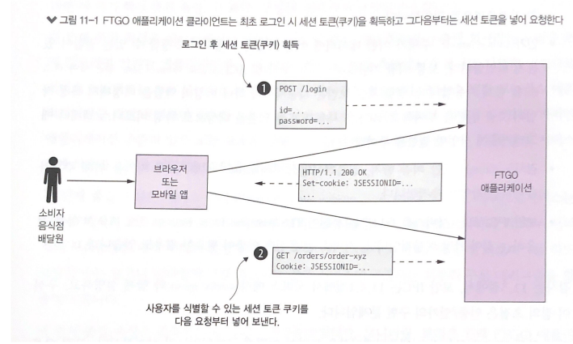
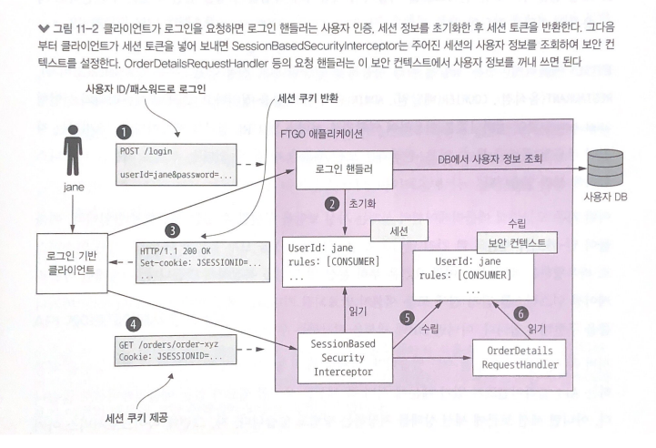
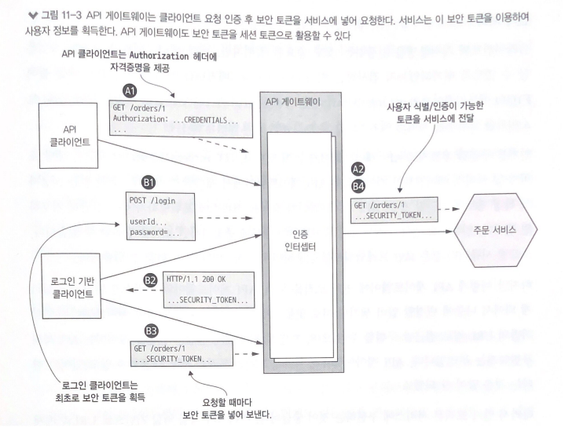
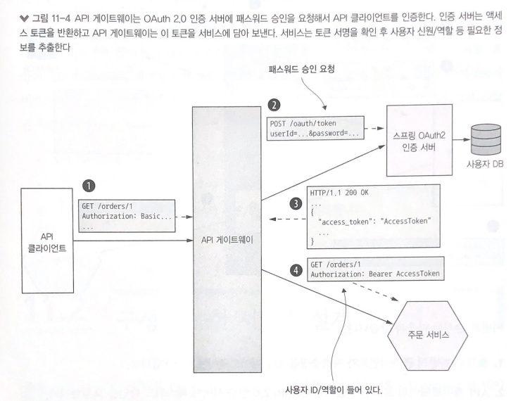
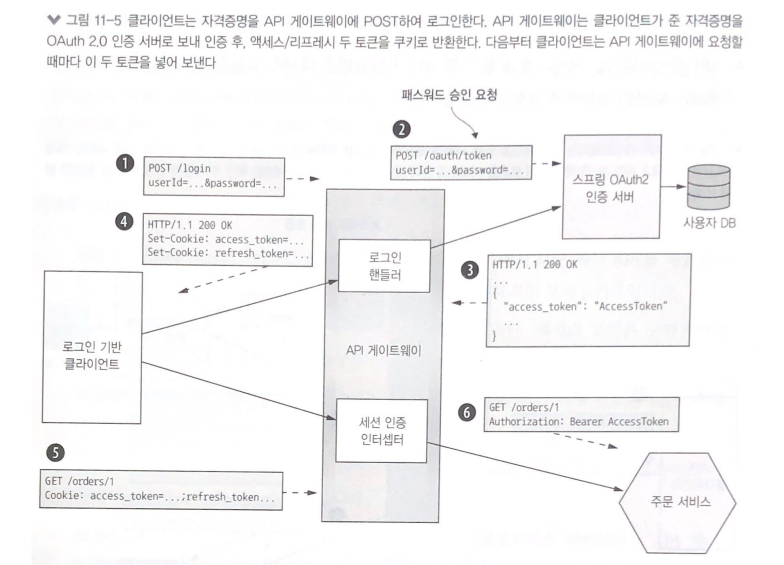
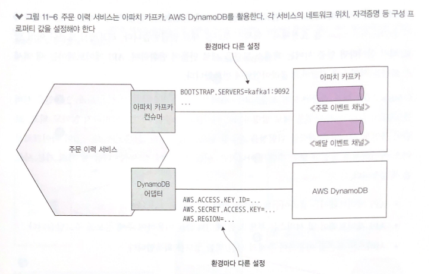
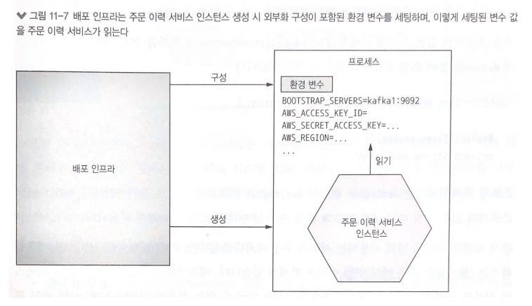
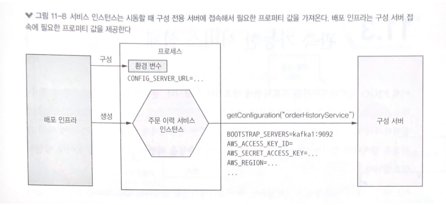

# 11장 프로덕션 레디 서비스 개발

> 마이크로서비스 패턴 11장을 정리한 내용입니다

- 이제 서비스를 프로덕션에 배포할 수 있게 준비하려면 세 가지 핵심 품질 속성, 보안, 구성성, 관측성이 보장되어야 한다
  - 애플리케이션 보안 : 보안 측면에서 본다면 마이크로 서비스 아키텍처는 기존 모놀리식 아키텍처와 큰 차이점은 없다. 서비스간에 사용자 신원을 전달하는 수단같은 일부 보안 요소는 구현 방법을 달리한다
  - 서비스 구성성 : 메시지 브로커, DB 등 다수의 외부 서비스를 사용한다. 서비스에 구성 프로퍼티를 하드코딩할 수는 없으니 런타임에 구성 프로퍼티 값을 서비스에 공급하는 외부화 구성 메커니즘을 활용한다
  - 관측성 : 여러개의 서비스가 구동중인 마이크로 서비스 아키텍처에서 로그가 분산되어 있으면 요청이 어떻게 처리되는지 알기 어렵다. 쉽게 파악할 수 있어야 한다

## 보안 서비스 개발

- 애플리케이션 개발자는 주로 다음 네 가지 보안 요소를 구현한다
  - 인증(authentication) : 신원 확인, 주체의 자격 증명
  - 인가(authorization) : 주체의 데이터 수행 권한 확인. 역할 기반(role-based) 보안 및 ACL 을 보통 함께 사용
  - 감사(auditing) : 보안 이슈 탐지, 컴플라이언스 시행 등 고객 지원을 위해 주체가 수행하는 작업을 추적
  - 보안 IPC : 모든 서비스 통신이 TLS(Transport Layer Security)를 경유하는 것이 이상적

### 기존 모놀리식 애플리케이션의 보안





- 그림 11-2의 이벤트 순서
  - 클라이언트가 애플리케이션에 로그인 요청을 한다
  - LoginHandler가 자격증명 확인, 세션 생성, 세션에 주체 정보 저장 등 일련의 로그인 요청 처리를 수행한다
  - LoginHandler가 클라이언트에 세션 토큰을 반환한다
  - 클라이언트는 이후 모든 작업을 호출할 때마다 세션 토큰을 넣어 보낸다
  - SessionBasedSecurityInterceptor가 제일 먼저 이를 처리한다. 이 인터셉터는 요청이 들어올 때마다 세션 토큰을 확인한 후, 보안 컨텍스트를 설정한다. 보안 컨텍스트에는 주체와 역할 관련 정보가 있다
  - 요청 핸들러는 보안 컨텍스트를 이용하여 사용자가 작업을 수행할 권한이 있는지 판단하고 사용자의 신원을 획득한다

- 사용자 종류마다 소비자, 음식점, 배달원, 관리자 역할을 정의하고, 스프링 시큐리티의 선언형 보안 메커니즘을 이용하여 역할별로 서비스 및 URL접근을 제한한다

### 마이크로서비스 아키텍처에서의 보안 구현

- 마이크서비스 아키텍처는 모든 외부 요청을 API 게이트웨이와 하나 이상의 서비스가 처리하는 분산 시스템이다
- 주문 서비스는 소비자 본인의 주문 정보만 조회할 수 있게 해야 하는데, 그러려면 인증/인가를 조합해야 한다
- 모놀리식에서 통했던 다음 두 가지 보안 요소는 마이크로서비스 아키텍처에서는 해당되지 않는다
  - 인-메모리 보안 컨텍스트 : 스레드 로컬 등 인-메모리 보안 컨텍스트를 이용해서 사용자 신원을 전달하는 방법으로 서비스는 메모리를 공유할 수 없으므로 이 방법으로 신원을 전달할 수 없다
  - 중앙화 세션 : 인-메모리 세션도 의미가 없고 DB 기반의 세션에 접근하는것은 가능하나 느슨한 결합 원칙에 위배된다. 다른 세션 메커니즘이 필요하다
  

#### API 게이트웨이에서 인증 처리

- 첫째, 서비스마다 알아서 사용자를 인증한다 -> 모든 개발자가 제대로 보안을 구현하리라 보기 어렵기 때문에 보안 취약점이 노출될 위험성이 크다
- 둘째, 요청을 서비스에 보내기 전에 API 게이트웨이가 요청을 인증한다 -> 인증 로직 중앙화로 보안 취약점이 노출될 가능성이 줄어든다. API 게이트웨이가 매번 서비스에 요청을 할 때마다 토큰을 함께 넣어 보낸다. 서비스는 이 토큰을 이용하여 요청을 검증하거나 주체 정보를 획득할 수 있다



- API 클라이언트 쪽 이벤트 순서는 다음과 같다(A)
  - 클라이언트는 자격증명이 포함된 요청을 전송한다
  - API 게이트웨이는 자격증명을 인증하고, 보안 토큰을 생성해서 서비스에 전달한다
  
- 로그인 기반 클라이언트의 이벤트 순서는 다음과 같다(B)
  - 클라이언트는 자격증명이 포함된 로그인 요청을 한다
  - API 게이트 웨이는 보안 토큰을 반환한다
  - 클라이언트는 작업을 호출하는 요청에 보안 토큰을 넣어 보낸다
  - API 게이트웨이는 보안 토큰을 검증하고 해당 서비스로 포워딩한다
  
#### 인가 처리

- 인증처럼 인가 로직도 API 게이트웨이 내부에 중앙화하면 보안을 강화할 수 있다
- 하지만 API 게이트웨이에 인가 로직을 두면, API 게이트웨이와 서비스가 단단히 결합하게 되어서 나중에 변경할 일이 생기면 서로 맞물리게 될 수 있다
- 또 API 게이트웨이는 역할 기반의 URL 경로 접근 제한만 구현할 수 있고 서비스 도메인 로직의 세부 내용까지 알고 있어야 하는 개별 도메인 객체의 접근 권한을 제어하는 ACL까지 구현할 수 는 없다
- 따라서 인가 로직은 서비스에 구현하는 것이 좋다. 서비스가 직접 역할 기반으로 URL과 메서드를 인가하고, ACL로 애그리거트 접근을 따로 관리한다

#### JWT로 사용자 신원/역할 전달

- API 게이트웨이가 어떤 종류의 토큰에 사용자 정보를 담아 서비스에 전달해야 하는지 결정해야 한다. 토큰 종류는 두가지 이다
  - 첫째, 난독화 토큰(opaque token)
    - UUID를 많이 쓰고 성능 및 가용성이 떨어지고 지연 시간이 길다는 단점이 있다. 토큰 수신자가 토큰의 유효성을 검증하고 보안 서비스를 동기 RPC를 호출하여 사용자 정보를 조회해야 하기 때문이다
  - 둘째, 보안 서비스 호출이 필요 없는 투명 토큰(transparent token)
    - JWT가 사실상 투명 토큰의 표준 규격으로 두 당사자 간의 사용자 신원/역할 등의 정보를 안전하게 표현하는 표준 수단이다
    - JWT는 토큰 자체가 포함되어 있어 중간에 취소가 불가하다. 이를 위해 유효 기간이 짧은 JWT를 발급하는 방법을 쓴다. JWT를 계속 재발행해야하는 문제는 OAuth 2.0을 통해 해결할 수 있다
  
#### OAuth 2.0 응용

- 자격증명, 역할 등 사용자 정보를 관리하는 보안 인프라를 직접 개발하는것은 비효율적이다. OAuth 2.0표준이 구현된 기성 서비스나 프레임 워크를 사용하면 된다
- 깃허브 리포지터리에 CI 서비스가 접근하도록 보안 허가를 내주는 메커니즘도 OAuth 2.0이다
- OAuth 2.0의 핵심개념을 간략히 살펴보자
  - 인증 서버 : 사용자 인증 및 액세스/리프레시 토큰 획득 API를 제공한다. 스프링 OAuth는 OAuth 2.0 인증 버서버를 구축하는 대표적인 프레임워크다
  - 액세스 토큰 : 리소스 서버 접근을 허가하는 토큰. 구현체마다 포맷이 다르며, 스프링 OAuth는 JWT를 사용한다
  - 리프레시 토큰 : 클라이언트가 새 액세스 토큰을 얻기 위해 필요한 토큰. 수명은 길지만 취소 가능한 토큰이다
  - 리소스 서버 : 엑세스 토큰으로 접근을 허가하는 서비스, 마이크로서비스 아키텍처는 서비스가 곧 리소스 서버이다
  - 클라이언트 : 리소스 서버에 접근하려는 클라이언트. 마이크로서비스 아키텍처는 API 게이트웨이가 OAuth 2.0 클라이언트이다
  


- API 클라이언트를 인증하는 방법
  - 클라이언트는 기본 인증을 이용하여 자격증명과 함께 요청한다
  - API 게이트웨이는 OAuth 2.0 인증 서버에 패스워드 승인을 요청한다
  - 인증 서버는 API 클라이언트의 자격증명을 검증하고 액세스/리프레시 토큰을 반환한다
  - API 게이트웨이는 서비스에 요청을 할 때마다 발급받은 액세스 토큰을 넣어 보내고, 서비스는 액세스 토큰을 이용하여 요청을 인증한다



- 로그인 기반 클라이언트를 인증하는 방법
  - 로그인 기반의 클라이언트가 자격증명을 API 게이트웨이에 POST 한다
  - API 게이트웨이의 로그인 핸들러는 OAuth 2.0 인증 서버에 패스워드 승인을 요청한다
  - 인증 서버는 클라이언트의 자격증명을 검증 후, 액세스/리프레시 토큰을 반환한다
  - API 게이트웨이는 인증 서버에서 받은 두 토큰을 클라이언트에 반환한다
  - 클라이언트는 액세스/리프레시 토큰을 API 게이트웨이에 요청할 때마다 실어 보낸다
  - API 게이트웨이의 세션 인증 인터셉터는 액세스 토큰을 검증 후 서비스에 토큰을 넣어 보낸다
  
- OAuth 2.0이 마이크로서비스 아키텍쳐의 유일한 보안 수단은 아니지만, 어떻게 보안에 접근하든 다음 세 가지 기본 사상은 똑같다
  - API 게이트웨이는 클라이언트 인증을 담당한다
  - API 게이트웨이 및 서비스는 투명 토큰을 이용하여 주체 정보를 주고 받는다
  - 서비스는 토큰을 이용하여 주체의 신원/역할 정보를 획득한다
  
## 구성 가능한 서비스 설계

- 주문 이력 서비스는 아파치 카프카에서 전달받은 이벤트를 소비하고 AWS DynamoDB 테이블 아이템을 읽고 쓴다. 이 서비스를 실행하려면 각 인프라 위치 등 여러 가지 구성 프로퍼티가 필요하다
- 문제는 개발, 운영 환경 등 서비스 실행 환경마다 구성 프로퍼티의 값이 다르다는 점이다



- 소스 코드에 미리 하드 코딩해 놓거나, 스프링 프레임워크의 프로파일 장치로 런타임에 프로퍼티 세트를 선택하는 구조는 보안에 취약하고 배포에 한계가 있어 적철치 않다
- 외부화 구성 패턴에 따라 런타임에 적합한 구성 프로퍼티를 서비스에 제공하는 방법이 낫다
- 외부화 구성 메커니즘은 구현 방식에 따라 푸시/풀 두 가지 모델이 있다
  - 푸시 모델: OS 환경 변수, 구성 파일 등을 통해 배포 인프라에서 서비스로 프로퍼티 값을 전달한다
  - 풀 모델: 서비스 인스턴스가 구성 서버에 접속해서 프로퍼티 값을 읽어 온다
  
### 푸시 기반의 외부화 구성

- 배포 환경은 서비스 인스턴스가 생성될 때 프로퍼티 값을 제공한다



- 스프링 부트가 프로퍼티 값을 읽어 올 수 있는 소스는 다음과 같다 (프로퍼티 명이 같을 때 우선 순위 규칙 순)
  - CLI 인수
  - OS 환경 변수(SPRING_APPLICATION_JSON) 또는 JSON 포맷으로 기술된 JVM 시스템 프로퍼티
  - JVM 시스템 프로퍼티
  - OS 환경 변수  
  - 현재 디렉터리의 구성 파일
  
- @Value를 붙여 특정 프로퍼티 값을 세팅하면 된다

```java
@Value("${aws.region}")
private String awsRegion;
```

- aws.region 프로퍼티 값은 구성 파일, AWS_REGION 환경 변수 등 여러 소스 중 하나에서 읽는다
- 푸시 모델은 널리 사용되지만 이미 실행 중인 서비스를 재구성하기는 어렵다. 재시동하지 않고서는 바꿀 수 없거나 구성 프로퍼티 값이 여러 서비스에 흩어지는 문제가 있어 풀 모델을 검토해야 한다

### 풀 기반의 외부화 구성

- 풀 모델은 서비스 인스턴스가 시동 시 자신이 필요한 값을 구성 전용 서버에 접속하여 읽는 방식이다
- 구성 전용 서버 접속에 필요한 프로퍼티 값은 푸시 구성 메커니즘을 사용한다
- 구성 서버는 여러 가지 방법으로 구현 가능하다
  - 버전 관리 시스템
  - SQL/NoSQL DB
  - 전용 구성 서버(스프링 클라우드 컨피그 서버), 자격증명 등 민감한 데이터를 보관하는 해시코프 볼트, AWS 파라미터 스토어



- 스프링 클라우드 컨피그는 서버/클라이언트로 구성된 유명한 구성 서버 기반 프레임워크로 서버는 구성 프로퍼티를 저장하는 다양한 백엔드 기술을 지원하고, 클라이언트는 서버에서 구성 프로퍼티를 가져와 스프링 ApplicationContext에 주입하는 역할을 한다
- 구성 서버가 있으면 장점이 많다
  - 중앙화 구성 : 모든 구성 프로퍼티를 한곳에서 관리하여 간편하고, 전역 기본값을 정의해서 서비스 단위로 재정의하는 식으로 중복 구성 프로퍼티를 제거할 수 있다
  - 민감한 데이터의 투명한 복호화 : DB 자격증명 등 민감한 데이터는 암호화를 해야하는데 암호화한 데이터를 서비스 인스턴스에서 복호화하려면 암호화키가 필요하다. 구성 서버는 프로퍼티를 자동 복호화해서 서비스에 전달한다
  - 동적 재구성 : 수정된 프로퍼티 값을 폴링 등으로 감지해서 자동 재구성한다
  
## 관측 가능한 서비스 설계
