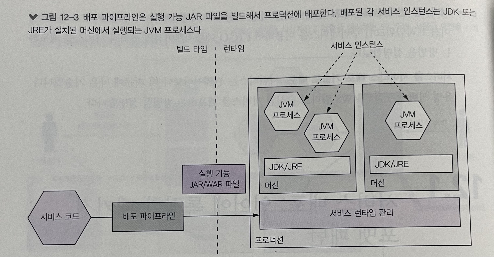
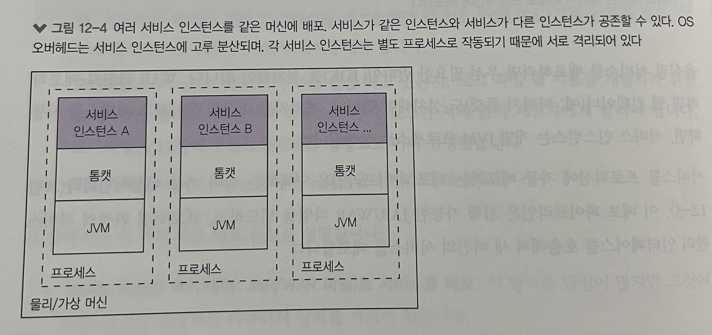
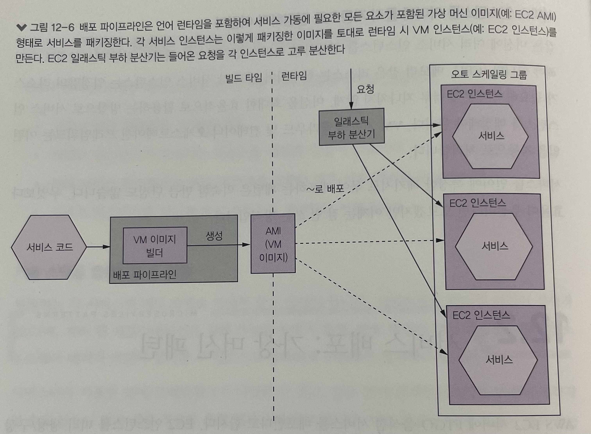
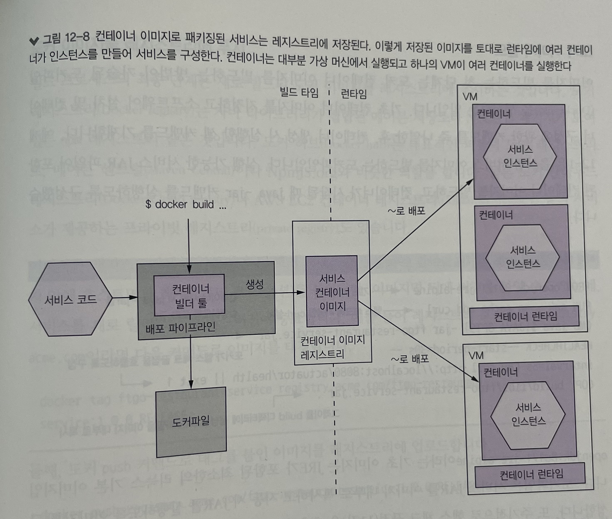
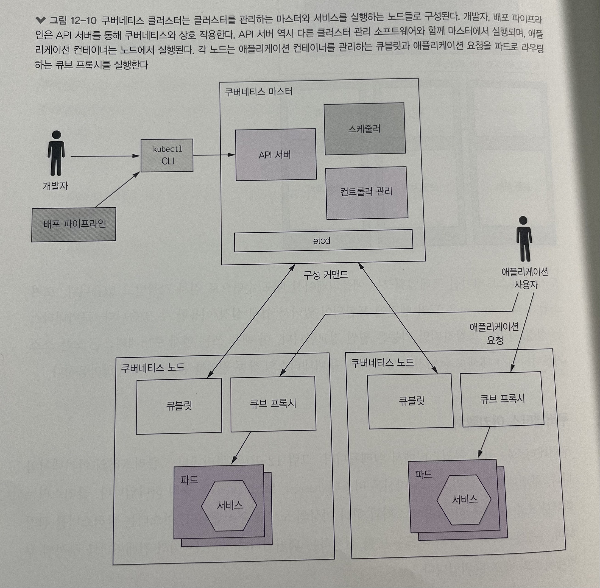
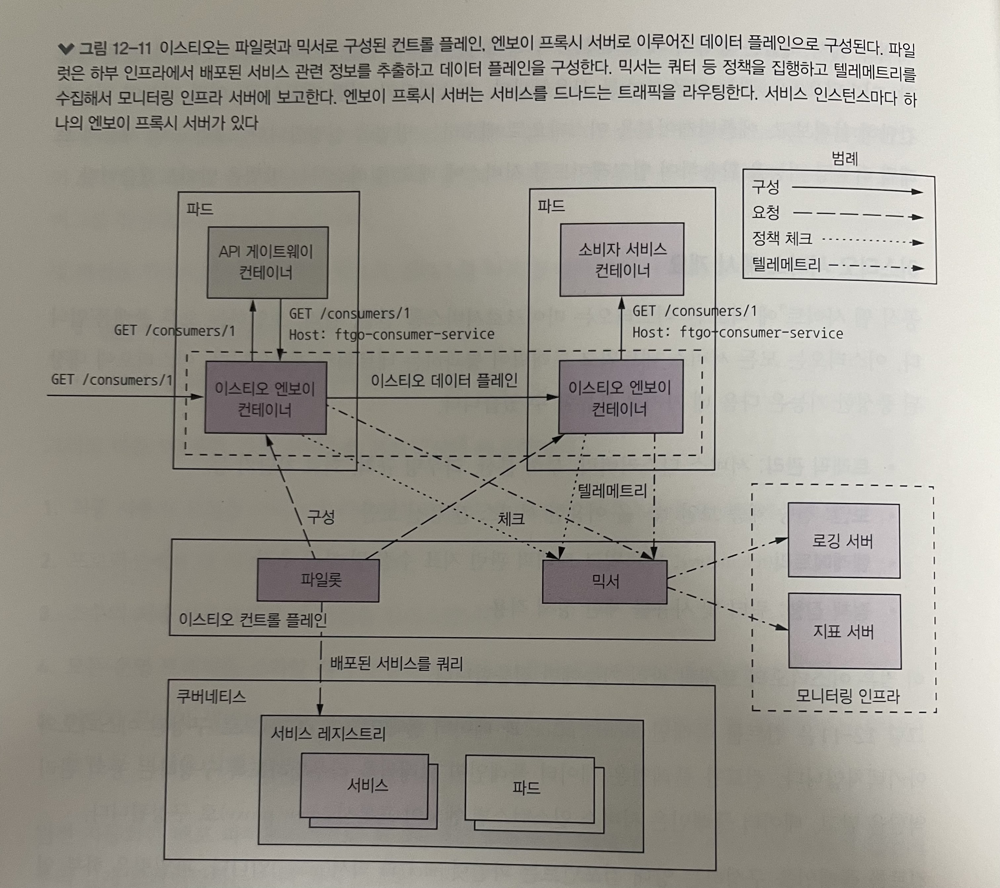
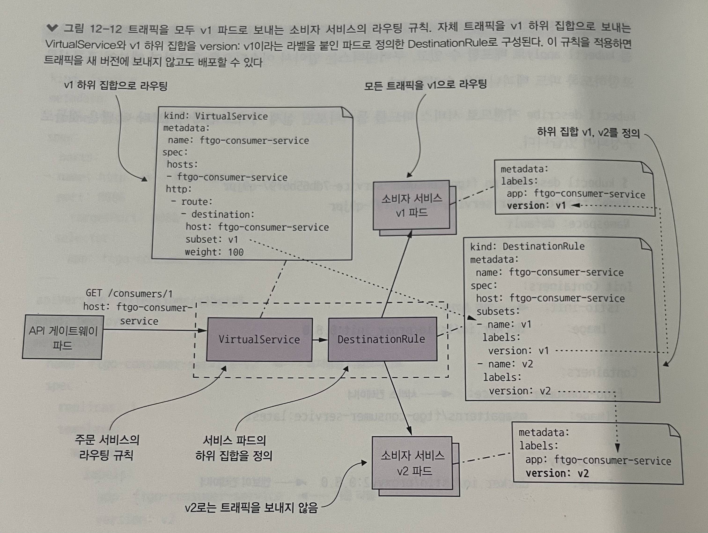
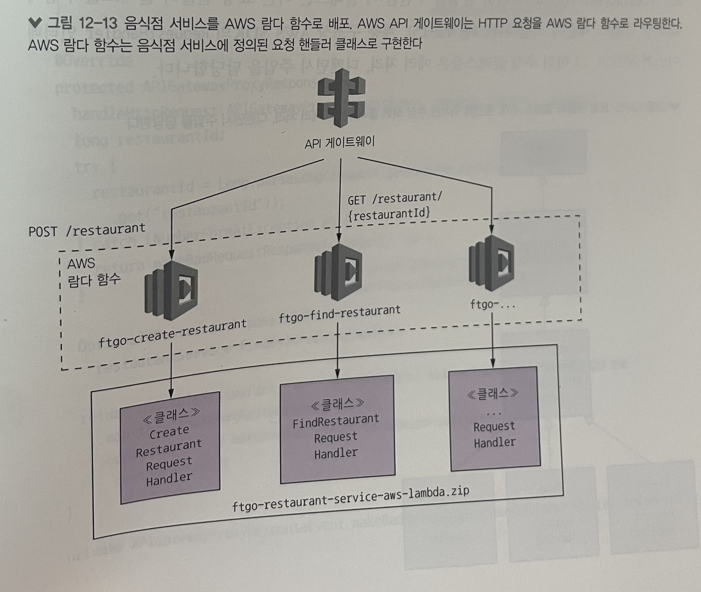

## 12장 마이크로서비스 배포

### 목차
- 4대 주요 패턴의 작동 원리와 장단점 (언어별 패키징 포맷, 서비스를 가상 머신으로 배포, 서비스를 컨테이너로 배포, 서버리스 배포)
- 쿠버네티스를 이용한 서비스 배포
- 서비스 메시를 이용한 배포와 릴리스를 구분
- AWS 람다를 이용한 서비스를 배포

### 들어가며..
- 1990년대에는 애플리케이션을 배포해달라고 요청하는 트러블 티켓을 제출하고, 운영 팀은 웹로직이나 웹스피어같은 고가의 무거운 애플리케이션 서버를 구매/설치
- 2000년대 중반 이런 고가의 애플리케이션 서버는 아파치 톰캣, 제티 등 가벼운 오픈 소스 웹 컨테이너로 점차 대체됨
    - 점점 가상 머신이 물리 머신을 대체하기 시작
- 요즘은 데브옵스 체제하에 개발 팀이 직접 애플리케이션 또는 서비스를 배포
    - AWS 등 고도로 자동화한 클라우드에 기반한 가상 머신은 수명이 긴 물리/가상 머신을 급속히 대체
    - 가상 머신 위에서 더 가벼운 추상 계층으로 진화한 컨테이너는 애플리케이션 배포 수단으로 점점 읻기를 얻고 있고,
    - 훨씬 가벼운 서버리스 배포 플랫폼(람다...)를 사용할 수 있게 되었다
- 프로덕션 환경의 4대 필수 기능
    - 서비스 관리 인터페이스: 개발자가 서비스를 생성 / 수정 / 구성할 수 있는 인터페이스 제공
    - 런타임 서비스 관리: 서비스 인스턴스가 항상 적정한 개수만큼 실행되도록 함
    - 모니터링: 로그 파일 및 지표를 개발자가 관찰할 수 있게 해야 함
    - 요청 라우팅: 사용자 요청을 서비스로 보냄

### 12.1 서비스 배포: 언어에 특정한 패키징 포맷 패턴
- https://microservices.io/patterns/deployment/multiple-services-per-host.html



#### 12.1.1 언어에 특정한 패키징 포맷 패턴의 장점
- 배포가 빠르다
    - 호스트에 서비스를 복사해서 시동하면 되기 때문에 서비스 인스턴스를 배포하는 속도가 가장 빠름
        - 자바로 개발한 서비스는 JAR/WAR 파일을 복사하고, Node.js나 루비로 개발한 서비스는 소스 코드를 복사
    - 서비스를 시동하는 시간도 거의 안 걸림
- 리소스를 효율적으로 활용할 수 있다
    - 여러 서비스 인스턴스가 머신과 OS를 공유하므로 리소스를 효율적으로 활용할 수 있음
        - 여러 서비스 인스턴스가 같은 프로세스에서 실행되면(여러 웹 애플리케이션이 같은 아파치 톰캣서버와 JVM을 공유) 훨씬 더 효율적

#### 12.1.2 언어에 특정한 패키징 포맷 패턴의 단점
- 기술 스택을 캡슐화할 수 없다
    - 운영자는 서비스의 배포 방법을 자세히 알고 있어야 하고, 필요한 소프트웨어 패키지 버전도 정확하게 구분해서 설치해야 한다
    - 서비스마다 사용한 언어/프레임워크와 버전이 제각각일 수 있어서, 이런 복잡성 탓에 버전이 맞지 않는 언어 런타임이 머신에 설치되는 등 갖가지 이유로 배포 중 에러가 발생할 가능성이 높다.
- 서비스 인스턴스가 소비하는 리소스를 제한할 방법이 없다
    - 한 프로세스가 전체 CPU/메모리를 다 소모하면 다른 서비스 인스턴스와 OS 리소스는 기아에 허덕이게 됨
- 여러 서비스 인스턴스가 동일 머신에서 실행될 경우 서로 격리할 수 없다
    - 어느 서비스 인스턴스가 오동작하면 다른 서비스 인스턴스에도 영향을 끼칠 수 있기때문에 불안정
- 서비스 인스턴스를 어디에 둘지 자동으로 결정하기 어렵다
    - 같은 머신에 여러 서비스 인스턴스를 실행하면, 머신을 최대한 효율적으로 활용하는 방향으로 서비스 인스턴스를 배정해야 하는데, 자동으로 결정하기 어려움

### 12.2 서비스 배포: 가상머신 패턴

- 언어 런타임을 포함하여 서비스 기동에 필요한 모든 요소가 포함된 가상 머신 이미지 형태로 서비스를 패키징
- 이렇게 패키징한 이미지를 토대로 런타임 시 VM 인스턴스를 만든다.
- VM 이미지 빌드 툴: Aminator, Packer

#### 12.2.1 가상 머신 패턴의 장점
- VM 이미지로 기술 스택을 캡슐화한다
    - 서비스와 연관된 디펜던시를 모두 VM 이미지에 담을 수 있음
    - 기술 스택이 캡슐화된 블랙 박스를 만드는 것과 같아서 어디라도 배포할 수 있음
- 서비스 인스턴스가 격리된다
    - 각 서비스 인스턴스가 서로 완전히 떨어져 동작하므로 정해진 CPU/메모리 리소스가 가상 머신마다 배정되므로 다른 서비스의 리소스를 빼앗아 올 수 가 없음
- 성숙한 클라우드 인프라를 활용한다
    - 고도로 자동화된 클라우드 인프라를 활용할 수 있음
    - AWS 등의 퍼블릭 클라우드는 물리 머신에 과부하를 유발하지 않는 방향으로 여러 VM을 스케줄링하며 VM 간 부하 분산 및 자동 확장 등 유요한 부가 기능도 제공

#### 12.2.2 가상 머신 패턴의 단점
- 리소스를 효율적으로 활용할 수 없다
    - 서비스 인스턴스마다 OS를 포함한 전체 가상 머신의 오버해드가 있음
    - VM 크기가 한정되어 있어서서 활용하기 어려움
    - 상대적으로 무거운 자바 기반 서비스라면 크게 문제되지 않겠지만, 가벼운 Node.js나 Go 언어라면 비효율적인 배포 방식
- 배포가 비교적 느리다
    - VM 이미지는 대부분 크기가 커서 빌드 시간이 오래 걸리고 네트워크를 통해 이동하는 데이터양도 많음
- 시스템 관리 오버헤드 발생
    - OS/런타임 패치를 해야 한다

_VM의 장점은 그대로 유지한채로 더 가볍게 마이크로서비스를 배포할 방법은 없을까?_

### 12.3 서비스 배포: 컨테이너 패턴

- 컨테이너
    - OS 수준에서 가상화한 메커니즘으로 다른 컨테이너들과 격리된 샌드박스에서 하나의 프로세스로 실행된다
        - 자바 서비스를 실행하는 컨테이너는 JVM 프로세스로 구성됨
    - 프로세스 입장에서 컨테이너는 자체 머신에서 실행되는 것처럼 실행됨
        - 고유한 IP 주소를 갖고 있으므로 포트 충돌 가능성도 없고 컨테이너마다 자체 루트 파일 시스템을 갖고 있음
        - Solaris zones 같은 제품도 있지만 가장 유명한 컨테이너 런타임은 Docker
- 컨테이너를 생성할 때 CPU, 메모리, I/O 리소스를 지정할 수 있음
    - 컨테이너 런타임은 컨테이너가 지정된 임계치를 초과하여 함부로 머신 리소스를 독차지하지 않도록 감시
    - 쿠버네티스 같은 오케스트레이션 프레임워크를 사용할 경우에는 특히 컨테이너 리소스를 잘 지정해야 함

#### 12.3.1 서비스를 도커로 배포
- 도커 이미지 빌드
```dockerfile
FROM openjdk:8u7171-jre-alpine
RUN apk --no-cache add curl
CMD java ${JAVA_OPTS} -jar ftgo-restaurant-service.jar
HEALTHCHECK --start-period=30s --
intervals=5s CMD curl http://localhost:8080/actuator/health || exit 1
COPY build/libs/ftgo-restaurant-service.jar .
```

```shell
cd ftgo-restaurant-service
../gradlew assemble
docker build -t ftgo-restaurant-service .
```

- 도커 이미지를 레지스트리에 푸시
```shell
docker tag ftgo-restaurant-service registry.acme.com/ftgo-restaurant-service:1.0.0.RELEASE
docker push registry.acme.com/ftgo-restaurant-service:1.0.0.RELEASE
```

- 도커 컨테이너 실행
```shell
docker run \ 
  -d \
  --name ftgo-restaurant-service \ 
  -p 8082:8080
  -e SPRING_DATASOURCE_URL=... -e SPRING_DATASOURCE_USERNAME=... \
  registry.acme.com/ftgo-restaurant-service:1.0.0.RELEASE
```

#### 12.3.2 컨테이너 패턴의 장점
- 기술 스택의 캡슐화. 서비스 관리 API가 곧 컨테이너 API가 된다
- 서비스 인스턴스가 격리됨
- 서비스 인스턴스의 리소스를 제한할 수 있음

#### 12.3.3 컨테이너 패턴의 단점
- 컨테이너 이미지를 직접 관리해야 하는 부담
- OS와 런타임 패치도 정기적으로 해주어야 함
- 구글 컨테이너 엔진이나 AWS ECS같은 컨테이너 솔루션을 호스팅해서 쓰지 않는 한 VM 인프라를 직접 관리해야 함

### 12.4 FTGO 애플리케이션 배포: 쿠버네티스
#### 12.4.1 쿠버네티스 개요

##### 도커 오케스트레이션 프레임워크의 주요 기능
- 리소스 관리: 어러 머신을 CPU, 메모리, 스토리지 볼륨을 묶어 놓은 하나의 리소스 풀로 취급
- 스케줄링: 컨테이너를 실행할 머신을 선택
- 서비스 관리: 마이크로서비스에 직접 매핑되는 서비스를 명명하고 버저닝. 정상 인스턴스를 항상 적정 개수만큼 가동시키고 요청 부하를 인스턴스에 고루 분산.

##### 쿠버네티스 아키텍처
- 마스터
    - API 서버: kubectl CLI에서 사용하는 서비스 배포/관리용 REST API
    - etcd: 클러스터 데이터를 저장하는 키-값 NoSQL DB
    - 스케줄러: 파드를 실행할 노드를 선택
    - 컨트롤러 관리자: 컨트롤러 실행. 컨트롤러는 클러스터가 원하는 상태가 되도록 제어. (서비스 인스턴스가 적정 개수만큼 실행되도록 인스턴스를 시동/중지하는 등..)
- 노드
    - 큐블릿(kubelet): 노드에서 실행되는 파드를 생성/관리
    - 큐브 프록시(kube-proxy): 여러 파드에 부하를 분산하는 등 네트워킹 관리
    - 파드(pod): 애플리케이션 서비스

##### 쿠버네티스 핵심 개념
- 파드(pod)
    - 쿠버네티스 기본 배포 단위
    - IP 주소, 스토리지 볼륨을 공유하는 하나 이상의 컨테이너로 구성
    - 파드의 컨테이너와 노드, 둘 중 하나는 언제라도 깨질 수 있기 때문에 일시적(ephemeral)
- 디플로이먼트(deployment)
    - 파드의 선언형 명세
    - 항상 파드 인스턴스를 원하는 개수만큼 실행시키는 컨트롤러
    - 롤링 업데이트/롤백 기능이 탭재된 버저닝을 지원
- 서비스(service)
    - 클라이언트에 안정된 정적 네트워크 위치를 제공
    - IP 주소와 이 주소로 해석되는 DNS명이 할당된 서비스는 TCP/UDP 트래픽을 하나 이상의 파드에 고루 분산
        - 쿠버네티스 내부에서만 접근할 수 있음. 외부에서 접근 가능한 서비스의 구성 방법은 잠시 후 설명
- 컨피그맵(configmap)
    - 하나 이상의 애플리케이션 서비스에 대한 외부화 구성이 정의된 이름-값 쌍의 컬랙션
    - 파드 컨테이너의 데피니션은 컨테이너 환경 변수를 정의하기 위해 컨피그맵을 참조
    - 구성 파일을 만들 수도 있음

#### 12.4.2 쿠버네티스 배포: 음식점 서비스
##### 디플로이먼트 생성
- 스프링 부트가 읽을 컨테이너 환경 변수 설정
- 컨테이너 포트 설정
- readinessProbe 설정: 트래픽을 해당 서비스 인스턴스로 라우팅을 해도 괜찮은지 알아보는 헬스 체크
- livenessProbe 설정: 서비스 인스턴스를 중지/재시작해야 할지 판단할 수 있는 근거를 제공
```shell
kubectl apply -f ftgo-restaurant-service/.../restauarant-service.yaml
```

##### 서비스 생성
- 외부 포트, 트래픽을 라우팅할 컨테이너 포트 설정
- selector: 트래픽을 라우팅할 컨테이너 설정
```shell
kubectl apply -f ftgo-restaurant-service/.../restauarant-service.yaml
```

#### 12.4.3 API 게이트웨이 배포
- 쿠버네티스 서비스는 클러스터 내부에서만 접근할 수 있음
- API 게이트웨이는 클러스터 외부에서도 접근 가능해야 함
- 서비스에는 `ClusterIp`, `NodePort`, `LoadBalancer` 등 다양한 종류가 있음
    - `NodePort`: 광역 클러스터 포트를 통해 클러스터의 모든 노드에 접근할 수 있음. 어떤 클러스터 노드라도 광역 클러스터 포트를 경유한 트래픽은 모두 백엔드 파드로 부하 분산 처리됨 (단, 30000~32767 중에 택 1)
    - `LoadBalancer`: 클라우드에 특정한 부하 분산기를 자동 구성하는 서비스 (AWS에선 ELB).

#### 12.4.4 무중단 배포
- 변경분 업데이트
```text
1. 태그를 달리 해서 ftgo-restaurant-service:1.1.0.RELEASE 이미지를 레지스트리에 푸시
2. 새 이미지를 참조하도록 YAML 파일의 서비스 디플로이먼트 부분을 편집
3. kubectl apply -f 커맨드로 디플로이먼트를 업데이트
```

- 쿠버네티스는 파드를 롤링 업데이트
    - 단계적으로 1.1.0.RELEASE 버전을 실행하는 파드를 생성하고 1.0.0 q버전을 중지하는데 신 버전이 요청 처리 준비가 완료되기 전에는 구 버전을 절대 중지하지 않음
- 디플로이먼트는 롤아웃이라는 이력을 관리하므로 다음 커맨드로 쉽게 이전 버전으로 롤백할 수 있다
    - `Kubectl rollout undo deployment ftgo-restaurant-service`

_무중단 배포할 수 있는 좋은 방법. 그런데 파드 준비가 끝나고 운영 트래픽이 막 들어오는 상황에서 버그가 된다면 어떻게 될까_
- 이런 문제가 없도록 새 버전의 서비스를 보다 확실하게 시작하려면 서비스 배포와 릴리스를 분리해야 한다
- 서비스 메시가 이런 일을 해주는 기술이다

#### 12.4.5 배포와 릴리스 분리: 서비스 메시
**새 버전을 확실하게 시작하려면 배포와 릴리스를 따로 분리하는 것이 상책**
- 배포: 운영 환경에서 실행
- 서비스 릴리스: 최종 사용자에게 서비스를 제공
  다음 5단계를 거쳐 서비스를 프로덕션에 제공
```text
1. 최종 사용자 요청을 서비스에 라우팅하지 않고 새 버전의 서비스를 프로덕션에 배포
2. 프로덕션에서 새 버전을 테스트
3. 소수의 최종 사용자에게 새 버전을 릴리스
4. 모든 운영 트래픽을 소화할 때까지 점점 더 많은 사용자에게 새 버전을 릴리스
5. 어디선가 문제가 생기면 곧장 구 버전으로 되돌림. 새 버전이 정확히 잘 동작한다는 확신이 들면 구 버전을 삭제
```
- 서비스 메시를 통해 위와 같은 배포를 수월하게 진행할 수 있게 되었음

_서비스 메시란 무엇인가_
- Microservice 아키텍처의 적용이 늘어나면서 생겨난 접근 방법
- 중앙 로그 수집, 트랜젝션 추적 등 다양한 기능이 필요해져서 Proxy를 서비스 앞에 배포하여 서비스 간의 통신을 다루는 것
- Proxy가 서비스 간의 통신을 다루지만 Proxy의 수도 너무 많아져서 Control Plane에서 Proxy에 관한 설정값을 Data Plane으로 전달해줌
- Istio = Envoy 프록시를 sidecar 패턴으로 배포
- Linkerd = Daemonset로 배포. 하나의 Pod이 모든 Pod의 메시지 라우팅을 담당

##### 이스티오 서비스 메시 개요
- https://istio.io/latest/about/service-mesh/

- 마이크로서비스를 연결, 관리, 보안하는 오픈 플랫폼
- 기능 1. 트래픽 관리: 서비스 디스커버리, 부하 분산, 라우팅 규칙, 회로 차단기 등
- 기능 2. 보안: 전송 계층 보안(TLS)을 이용한 서비스 간 통신 보안
- 기능 3. 텔레메트리: 네트워크 트래픽 관련 지표 수집 및 분산 추적
- 기능 4. 정책 집행: 쿼터 및 사용률 제한 정책 적용
- 트래픽 관리
    - 컨트롤 플레인(Control Plane)
        - 데이터 플레인이 트래픽을 라우팅하도록 구성하는 등의 관리 역할
        - 파일럿(Pilot): 하부 인프라에서 배포된 서비스 관련 정보를 추출 (예: 서비스와 정상 파드를 조회, 엔보이 프록시가 미리 정의된 라우팅 규칙에 따라 트래픽을 라우팅하도록 구성)
        - 믹서(Mixer): 텔레메트리를 수집하고 정책을 집행하는 역할
    - 데이터 플레인(Data Plane): 서비스 인스턴스 별 엔포이 프록시로 구성됨
        - 엔보이(Envoy)
            - 저수준 프로토콜(TCP, ...)부터 고수준 프로토콜(HTTPS/HTTP, ...)까지 다양한 프로토콜을 지원하는 고성능 프록시
            - MongoDb, 레디스, DynamoDB 프로토콜도 이해하고 회로 차단기, 사용량 제한, 자동 재시도 등 서비스 간 통신을 확실하게 지원
    - 이스티오는 엔보이를 사이드카 프로세스 또는 컨테이너로 활용
        - 원래는 (서비스 -> 서비스)라면, (서비스 -> 서비스 엔보이 -> 목적지 엔보이 -> 서비스)가 되는 것

##### 이스티오로 서비스를 배포
- 배포하려는 애플리케이션 서비스마다 쿠버네티스 서비스와 디플로이먼트를 정의
- 서비스 파드에 엔보이 프록시 컨테이너 실행 방법
    - 수동으로 사이드카를 주입
        - `istioctl kube-inject -f ftgo-consumer-service.yml | kubectl apply -f -`
    - 자동 사이드카 주입 활용

##### v1 버전으로 보내는 라우팅 규칙 생성


##### v2 소비자 서비스 배포

##### v2 라우팅 테스트
- 테스트 유저는 testuser라는 요청 헤더를 추가 -> 이 헤더를 붙인 요청은 v2 인스턴스로 향하도록 VirtualService 수정
```yaml
- http:
  - match:
    - headers:
        testuser:
          regex: "^.+$"
    route:
    - destination:
      host: ftgo-consumer-service
      subset: v2
```

##### 운영 트래픽을 v2로 라우팅
- 5% -> 100%로 점차 늘리면서 VirtualService 수정
```yaml
- route:
    - destination: 
        host: ftgo-consumer-service
        subset: v1
      weight: 95
    - destination:
        host: ftgo-consumer-service
        subset: v2
      weight: 5
```

### 12.5 서비스 배포: 서버리스 패턴
- 언어에 특정한 패키징, VM으로서의 서비스, 컨테이너로서의 서비스는 공통점이 있었음
    - 어떤(물리 머신이든, 가상 머신이든, 컨테이너든 간에) 컴퓨팅 리소스를 사전에 프로비저닝해야 함
        - 어떤 VM이든 컨테이너든 준비하는 비용은 지불해야 함
    - 사람이 직접 시스템 관리를 해야 함
        - 어떤 머신에서 가동하는 그 OS는 반드시 패치해야 하고, 물리 머신일 경우 랙킹, 스태킹하는 작업도 병행해야 함
        - 언어 런타임도 관리 대상 => 무차별적 고생이라고 표현도 함

#### 12.5.1 AWS 람다를 이용한 서버리스 배포
- AWS 람다는 자바, Node.js, C#, 고 언어, 파이썬을 지원
- AWS 서비스를 호출하여 요청을 처리하는 Stateless 서비스
- Zip 또는 Jar로 묶고 AWS 람다에 업로드 -> 요청을 처리할 함수명을 지정
- AWS 람다는 요청을 처리하기에 충분한 개수만큼 마이크로서비스 인스턴스를 자동 실행

#### 12.5.2 람다 함수 개발
- 프로그래밍 언어마다 크도 및 패키징이 다름
- 자바 람다 함수
```java
public interface ReqeustHandler<I, O> {
	public O handleRequest(I input, Context context);
}
```

#### 12.5.3 람다 함수 호출
- HTTP 요청: AWS API 게이트웨이 -> 람다 함수로 라우팅
- AWS 서비스에서 생성된 이벤트: S3 버킷에 객체 생성, DynamoDB 테이블 데이터 변경 이벤트 -> 람다 호출
- 스케줄링된 호출
- API를 직접 호출: 애플리케이션이 웹 서비스를 요청해서 직접람다 함수를 호출

#### 12.5.4 람다 함수의 장점
- 다양한 AWS 서비스와의 연계
- 시스템 관리 업무가 많이 경감됨
- 탄력성: 부하 처리에 필요한 개수만큼 인스턴스를 실행하므로 필요한 능력을 어렵게 예측할 필요도 없고 과대/과소 프로비저닝할 위험도 감수할 필요가 없음
- 사용량만큼 과금

#### 12.5.5 람다 함수의 단점
- 긴-꼬리 지연(long-tail latency)
    - 코드를 동적 실행하므로 애플리케이션 인스턴스를 프로비저닝하고 애플리케이션을 시동하기까지 시간이 걸림
    - 요청에 따라 많이 지연되는 경우도 있음
    - 특히 자바로 작성한 서비스는 보통 시동 시간이 적어도 수 초는 걸림
- 제한된 이벤트/요청 기반 프로그래밍 모델
    - 처음부터 실행시간이 긴 서비스(예: 서드파티 메시지에서 유입된 메시지를 소비하는 서비스)를 배포할 용도는 아님

### 12.6 REST 서비스 배포: AWS 람다 및 AWS 게이트웨이
#### 12.6.1 음식점 서비스를 AWS 람다 버전으로 설계
- 스프링 MVC 컨트롤러 대신 AWS 람다 요청 핸들러 클래스가 있을 뿐, 나머지 비즈니스 로직은 그대로


#### 12.6.2 ZIP 파일로 서비스 패키징
- gradle task를 통해 루트 디렉토리에는 클래스/리소스, lib 디렉토리에는 JAR 파일이 있는 ZIP 파일이 생성됨
```groovy
task buildZip(type: Zip) {
  from compileJava
  from processResources inti('lib') {
    from configurations.runtime
  }
}
```

#### 12.6.3 서버리스 프레임워크로 람다 함수 배포
- 람다 함수를 쉽게 사용할 수 있게 도와주는 오픈 소스 서버리스 프로젝트를 통해 간편하게 람다 함수 배포할 수 있음
- 람다 함수와 REST 끝점이 기술된 serverless.yml 파일만 작성하면 서버리스가 대신 람다 함수를 배포하고 요청을 라우팅하는 API 게이트웨이를 생성/구성한다
```yml
provider:
  name: aws
runtime: java8
# …
stage:
  environment:
    SPRING_DATASOURCE_DRIVER_CLASS_NAME: …
    SPRING_DATASOURCE_URL: …
    # …
package:
  artifact: ftgo-restaurant-service-aws-lambda.zip

functions:
  create-restaurant:
    handler: net.chrisrichardson.ftgo.restaurantservice.lambda.CreateRestaurantRequestHandler
    events:
      - http:
        path: restaurants
        method: post
# …
```
- AWS API 게이트웨이를 구성하는 서버리스 배포 커맨드를 실행하면 API 게이트 끝점을 통해 서비스에 접속해볼 수 있다