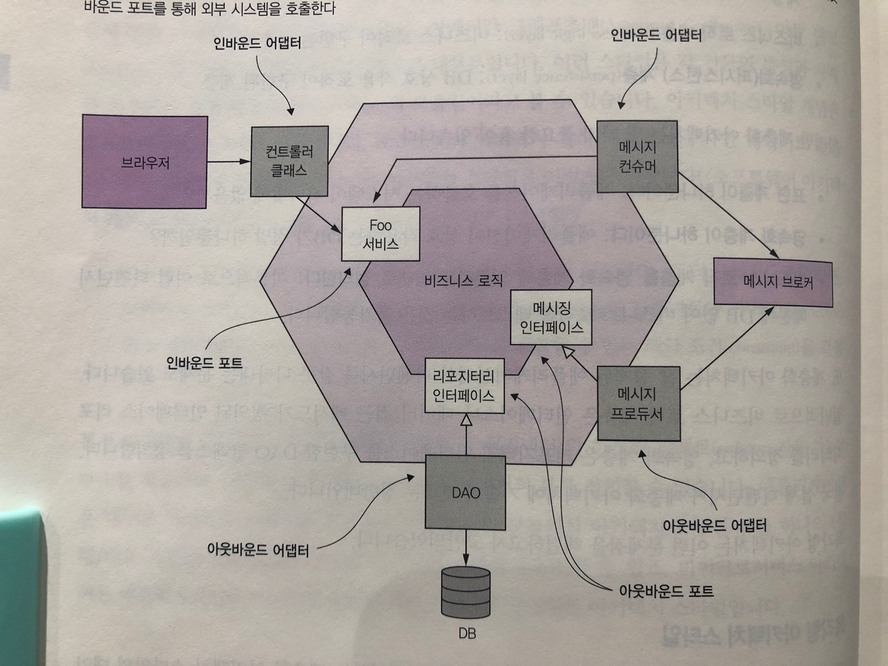
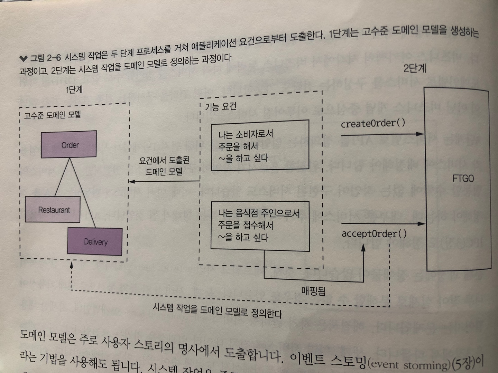
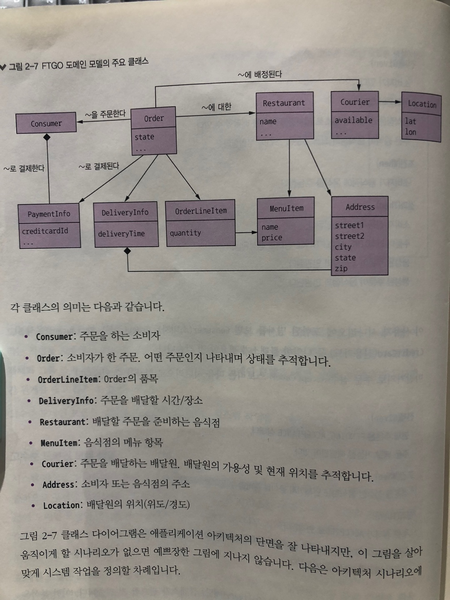
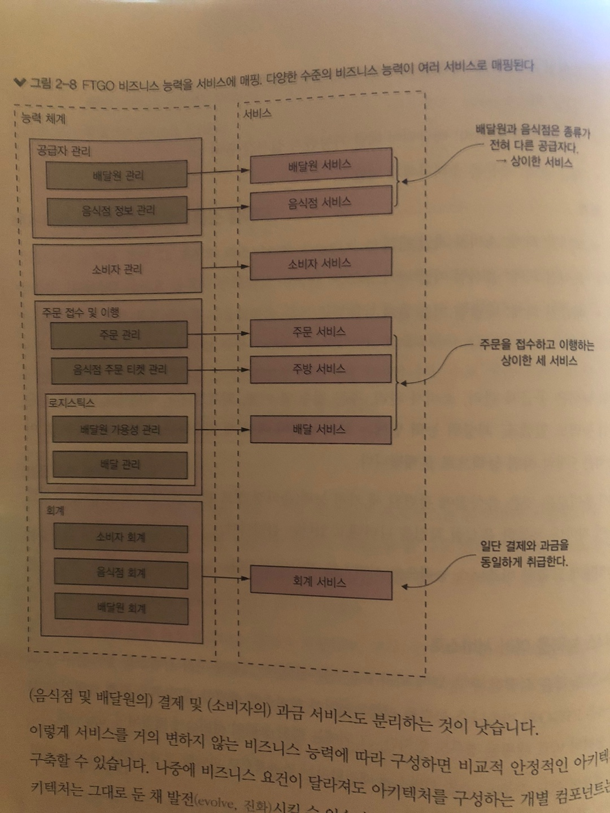
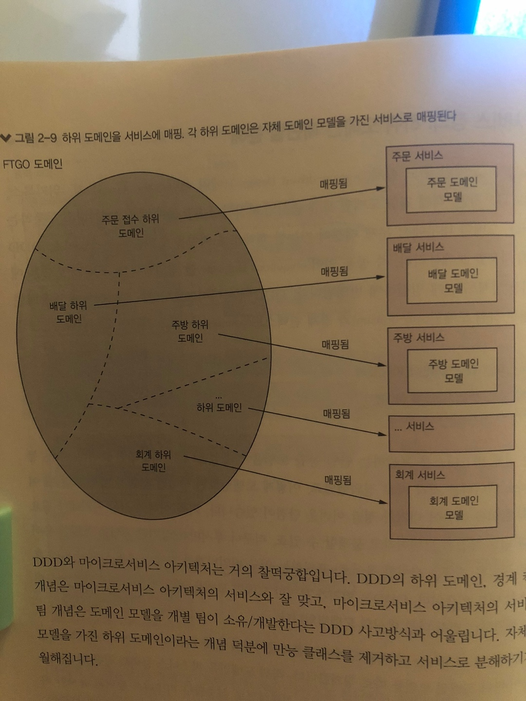
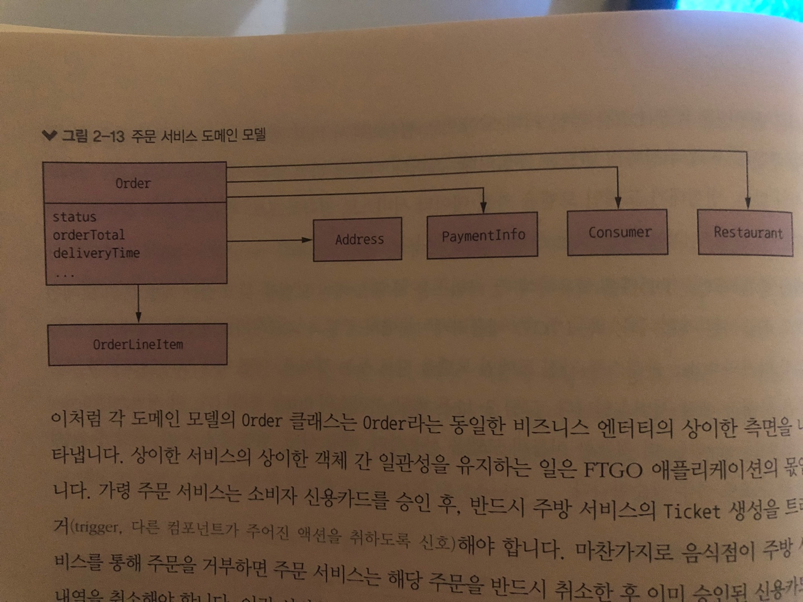

# 2장 분해 전략

> 마이크로서비스 패턴 2장을 정리한 내용입니다


**💡 서비스 분해 전략을 알아보자**

애플리케이션을 여러 서비스로 분해하는 다양한 전략을 살펴보면서 서비스가 기술 관심사보다는 비즈니스 관심사를 중심으로 구성된다는 사실을 배우자


 

# 마이크로서비스 아키텍처란 무엇인가?

## 소프트웨어 아키텍처의 정의와 중요성

### 소프트웨어 아키텍처의 정의

- 컴퓨팅 시스템의 소프트웨어 아키텍처는 소프트웨어 엘리먼트와 그들 간의 관계, 그리고 이 둘의 속성으로 구성된 시스템을 추론하는 데 필요한 구조의 집합이다

### 소프트웨어 아키텍처의 4+1 뷰 모델

- 필립 크러첸은 소프트웨어 아키텍처가 4+1 뷰 모델리고 기술한 논문을 발표했다
- 4+1 모델은 소프트웨어 아키텍처를 바라보는 상이한 4뷰를 정의한다.
    - 논리 뷰 : 개발자가 작성한 소프트웨어 엘리먼트, 클래스, 패키지가 해당되며 결국 상속, 연관, 의존 등 클래스와 패키지의 관계를 말한다
    - 구현 뷰 : 빌드 시스템의 결과물, 모듈과 컴포넌트로 구성된다, 자바에서 모듈은 보통 JAR 파일이나 WAR 파일이다
    - 프로세스 뷰 : 런타임 컴포넌트. 각 엘리먼트는 개별 프로세스고, IPC는 프로세스 간 관계를 나타냄
    - 배포 뷰 : 프로세스가 머신에 매핑되는 방법. 이 뷰의 엘리먼트는 머신 및 프로세스고, 머신 간의 관계가 바로 네트워킹이다

### 아키텍처의 중요성

- 애플리케이션 요건은 크게 두 가지 종류로 나뉜다
    1. 애플리케이션이 해야 할 일을 정의한 기능 요건
    2. 서비스 품질 요건(ex. 확장성, 신뢰성, 관리성, 배포성 등등)

## 아키텍처 스타일 개요

### 계층화 아키텍처 스타일

- 계층마다 명확히 정의된 역할을 분담하며, 계층 간 디펜던시는 아키텍처로 제한한다
- 계층화 아키텍처는 앞서 배운 4뷰 모두 적용할 수 있다
    - 표현계층 : 사용자 인터페이스 또는 외부 API가 구현된 계층
    - 비즈니스 로직 계층 : 비즈니스 로직이 구현된 계층
    - 영속화 계층 : DB 상호 작용 로직이 구현된 계층
- 일반적으로 비즈니스 로직 계층은 인터페이스나 데이터 접근 메서드가 정의된 인터페이스 리포지터리를 정의하고, 영속화 계층은 리포지터리 인터페이스를 구현한 DAO 클래스를 정의한다
- 결국 실제 디펜던시가 계층화 아키텍처에 기술된 것과는 정반대이다
- 이런 문제점을 고안하고자 육각형 아키텍처가 설계 되었다

### 육각형 아키텍처 스타일

- 애플리케이션에 표현 계층 대신 비즈니스 로직을 호출하여 외부에서 들어온 요청을 처리하는 인바운드 어댑터와 영속화 계층 대신 비즈니스 로직에 의해 호출되고 외부 애플리케이션을 호출하는 아웃바운드 어댑터를 둔다
- 육각형 아키텍처 스타일의 가장 큰 장점은 비즈니스 로직에 있던 표현/데이터 접근 로직이 어댑터와 분리되었기 때문에 비즈니스 로직이 표현/데이터 접근 로직 어디에도 의존하지 않는다는 점이다
- 이렇게 분리하니 비즈니스 로직만 따로 테스트하기도 쉽고, 정의도 명확해졌다


**💡 헥사고날 아키텍처이란?

- 어댑터/포트 패턴이라고 한다
- 인바운드 어댑터 : 외부에서 들어오는 요청을 처리하는 곳
- 아웃바운드 어댑터 : 포트를 통해서 실제로 구현 로직을 처리하는 곳
- 포트 : 비즈니스 로직을 제공하면서 외부 영역과 연계하는 곳

- 참고
    - https://zkdlu.tistory.com/4
    - https://www.youtube.com/watch?v=vwgNI9w_bsQ&t=1s&ab_channel=NHNCloud
    - https://www.youtube.com/watch?v=TdyOH1xZpT8&t=2213s&ab_channel=NHNCloud



## 마이크로서비스 아키텍처는 일종의 아키텍처 스타일이다

### 서비스란 무엇인가?

- 서비스는 어떤 기능이 구현되어 단독 배포가 가능한 소프트웨어 컴포넌트이다
- 서비스는 클라이언트가 자신이 서비스하는 기능에 접근할 수 있도록 커맨드, 쿼리, 이벤트로 구성된 API를 제공한다
- 서비스 API는 내부 구현 상세를 캡슐화한다. 모놀리스와 달리 개발자는 API를 우회하여 서비스에 접근하는 코드를 작성할 수 없으므로 마이크로서비스 아키텍처에서 애플리케이션 모듈성은 보장된다

### 느슨한 결합

- 느슨하게 결합된 서비스는 마이크로서비스 아키텍처의 주요 특성 중 하나이다
- 서비스는 느슨하게 결합되고 API를 통해서만 동작하기 때문에 서비스가 직접 DB와 통신하는 일은 불가능하다
- 서비스가 DB 테이블을 서로 공유하지 않기 때문에 런타임 격리도 향상된다
- 어떤 서비스가 DB 락을 획득하여 다른 서비스르르 블로킹하는 일 자체가 불가능하다

### 공유 라이브러리의 역할

- 코드 중복을 방지하기 위해 여러 애플리케이션에서 재사용 가능한 기능을 라이브러리(모듈)로 패키징하는 것은 개발자에게 당연한 일이다
- 하지만 변경 가능성이 빈번한 로직은 사용하는 서비스들이 모두 재배포를 해야하니 별도 서비스로 구현하는 것이 낫다
- 물론 바뀔일이 거의 없는 기능은 라이브러리에 담아 쓰는 것이 좋다

### 서비스 규모는 별로 중요하지 않다

- 마이크로서비스라는 용어는 왠지 서비스를 아주 작게 만들어야 할 것 같은 느낌이 들게 만든다
- 크기보다는 작은 팀이 가장 짧은 시간에, 다른 팀과 협동하는 부분은 최소로 하여 개발 가능한 서비스를 설계하는 것이 좋다
- 내 서비스 때문에 다른 서비스가 바뀌어야 한다면 서비스가 느슨하게 결합되지 않았다는 반증이다. 아니면 분산 모놀리스를 구축했기 때문에 그럴 수도 있다
- 마이크로서비스 아키텍처는 유지보수성, 테스트성, 배포성 등 개발 단계의 품질 속성이 개선 된다
- 마이크로서비스 아키텍처를 고민 중이라면 먼저 현재 애플리케이션의 서비스를 어떻게 식별하고 서비스를 서로 협동시킬지 결정해야 한다

# 마이크로서비스 아키텍처 정의

- 애플리케이션 아키텍처를 정의하는 3단계 프로세스로 나눌 수 있다
- 1단계는 애플리케이션 요건을 핵심 요청으로 추출하는 것이다.
    - 요청을 REST, 메시징 같은 특정 IPC 기술이 아닌 좀 더 추상적인 관념으로 시스템 작업으로 구분한다
- 2단계는 여러 서비스로 분해할지 결정하는 것이다
    - 비즈니스 아키텍처 시각에서 비즈니스 능력에 따라 서비스를 정의할 수도 있고, DDD의 하위 도메인별로 서비스를 구성하는 전략도 가능하다
- 3단계는 서비스별로 API를 정의하는 일이다
    - 1단계에서 식별된 시스템 작업을 각 서비스에 배정해야 한다
    - 완전한 홀로서기 작업이 구현된 서비스도 있겠지만, 다른 서비스와 협동할 수밖에 없는 작업이 구현된 서비스도 있다
- 분해 과정에는 장애물이 많다
    - 첫째, 네트워크 지연이다
    - 둘째, 서비스 간 동기 통신으로 인해 가용성이 떨어지는 문제이다
    - 셋째, 여러 서비스에 걸쳐 데이터 일관성을 지키는 요건이다
    - 넷째, 애플리케이션 도처에 숨어 있는 만능 클래스이다

## 시스템 작업 식별

- 1단계는 시스템 작업을 기술하기 위해 필요한 보케블러리를 제공하는 핵심 클래스로 구성된 고수준의 도메인 모델을 생성한다
- 2단계는 시스템 작업 식별 후 그 동작을 도메인 모델 관점에서 기술하는 것이다
- 도메인 모델은 주로 사용자 스토리의 명사에서 도출한다(이벤트 스토밍으로 도출)

### 고수준 도메인 모델 생성

- 각 서비스는 자체 도메인 모델을 소유하기 때문에 도메인 모델이 하나뿐인 애플리케이션은 없다
- 도메인 모델은 스토리에 포함된 명사를 분석하고 도메인 전문가와 상담하는 등 표준 기법을 활용하여 생성한다

<aside>
💡 **사용자 시나리오(주문하기)**

전제(Given)
소비자가 있다
음식점이 있다
음식점은 소비자의 주소로 제시간에 음식을 배달할 수 있다
주문 총액이 음식점의 최소 주문량 조건에 부합한다
조건(When)
소비자가 음식점에 음식을 주문한다
결과(Then)
소비자 신용카드가 승인된다
주문이 PENDING_ACCEPTANCE 상태로 생성된다
생성된 주문이 소비자와 연관된다
생성된 주문이 음식점과 연관된다

</aside>

- 사용자 시나리오에 포함된 명사는 Consumer(소비자), Order(주문), Restaurant(음식점), CreditCard(신용카드) 등 다양한 클래스가 필요하다
- 주문 접수(Accept Order) 스토리는 다음 시나리오로 확장할 수 있다

<aside>
💡 **사용자 시나리오(주문 접수)**

전체(Given)
현재 주문은 PENDING_ACCEPTANCE 상태다
주문 배달 가능한 배달원이 있다
조건(When)
주문을 접수한 음식점은 언제까지 음식을 준비할 수 있다고 약속한다
결과(Then)
주문 상태가 ACCEPTED로 변경된다
주문의 promiseByTime 값을 음식점이 준비하기로 약속한 시간으로 업데이트한다
주문을 배달할 배달원을 배정한다

</aside>

- 시나리오를 보니 Courier(배달원), Delivery(배달) 클래스가 추가되었다.
- 또한 MenuItem(메뉴 항목), Address(주소) 등 여타 클래스도 추가되었다

  

### 시스템 작업 정의

- 시스템 작업은 결국 REST, RPC, 메시징 끝점으로 구현되겠지만 지금은 일단 추상적으로 생각해보자

    | 액터 | 스토리 | 커맨드 | 설명 |
    | --- | --- | --- | --- |
    | 소비자 | 주문 생성 | createOrder() | 주문을 생성한다 |
    | 음식점 | 주문 접수 | acceptOrder() | 음식점에 주문이 접수되었고 주어진 시각까지 음식을 준비하도록 지시한다 |
    |  | 주문 픽업 준비됨 | noteOrderReadyForPickup() | 주문한 음식이 픽업 가능함을 알린다 |
    | 배달원 | 위치 업데이트 | noteUpdatedLocation() | 배달원의 현재 위치를 업데이트한다 |
    |  | 배달 픽업 | noteDeliveryPickedUp() | 주문한 음식을 배달원이 픽업했음을 알린다 |
    |  | 주문 배달됨 | noteDeliveryDelivered() | 주문한 음식을 배달원이 소비자에게 배달했음을 알린다 |

- 다음은 명세를 정의하는데 작업 호출 시 선행 조건, 작업 호출 후 충족되어야 할 후행 조건으로 구성된다

    | 작업 | createOrder(소비자ID, 결제 수단, 배달 주소, 배달 시각, 음식점 ID, 주문 품목) |
    | --- | --- |
    | 반환값 | orderId… |
    | 선행 조건 | - 소비자가 존재하고 주문을 할 수 있다
    - 주문 품목은 음식점의 메뉴 항목에 들어 있다
    - 배달 주소/시각은 음식점에서 서비스할 수 있다 |
    | 후행 조건 | - 소비자 신용카드는 주문 금액만큼 승인 처리되었다
    - 주문은 PENDING_ACCEPTANCE 상태로 생성되었다 |

## 서비스 정의: 비즈니스 능력 패턴별 분해

- 마이크로서비스 아키텍처를 구축하는 첫 번째 전략은 비즈니스 능력에 따라 분해하는 것이다

### 비즈니스 능력 식별

- FTGO의 비즈니스 능력
    - 공급자 관리
        - 배달원 관리 : 배달 정보 관리
        - 음식점 정보 관리 : 음식점 메뉴, 위치, 영업 시간, 기타 정보 관리
    - 소비자 관리 : 소비자에 관한 정보 관리
    - 주문 접수 및 이행
        - 주문 관리 : 소비자가 주문을 생성/관리할 수 있게 한다
        - 음식점 주문 관리 : 음식점의 주문 준비 상태를 관리
        - 로지스틱스 : 실행 계획
        - 배달원 가용성 관리 : 배달원이 배달 가능한지 실시간 관리
        - 배달 관리 : 주문을 소비자에게 배달
    - 회계
        - 소비자 회계 : 소비자 과금 관리
        - 음식점 회계 : 음식점 지불 관리
        - 배달원 회계 : 배달원 지불 관리
    - …
- 이제 도출한 비즈니스 능력으로 서비스를 정의해보자

### 비즈니스 능력을 여러 서비스로

- 능력 체계의 어느 수준(level)을 서비스에 매핑할지는 주관적으로 판단할 문제이다
    - 공급자 관리 능력의 두 하위 능력은 각각 두 서비스로 매핑했다. 음식점과 배달원은 전혀 다른 성격의 공급자이기 때문이다
    - 주문 접수 및 이행 능력은 서비스마다 상이한 프로세스 단계를 담당하도록 세 서비스로 매핑했다. 배달원 가용성 관리와 배달 관리 능력은 밀접한 연관이 있으니 한 서비스로 묶었다
    - 회계 능력은 유형별 회계가 대동소이하기 때문에 자체 서비스에 매핑했다

      

    - 이렇게 서비스를 거의 변하지 않는 비즈니스 능력에 따라 구성하면 비교적 안정적인 아키텍처를 구축할 수 있다
    - 아키텍처를 정의하는 과정에서는 각각의 핵심 아키텍처 서비스와 나머지 서비스가 어떻게 협동하는지 살피는 과정이 중요하다

  ## 서비스 정의: 하위 도메인 패턴별 분해

    - 기존에는 전체 비즈니스를 포괄하는 단일 통합 모델을 만들었다
    - 이렇게 모델링하면 하나의 모델에 대해 조직 내 여러 부서의 합의를 이끌어 내기가 정말 어려운 단점이 있다
    - DDD는 범위가 분명한 도메인 모델을 여러 개 정의하여 기존 방식의 문제점을 해결하는 전혀 다른 방식의 모델링이다
    - DDD는 도메인을 구성하는 각 하위 도메인을 모델로 따로 정의한다

      

## 분해 지침

- 마이크로서비스 아키텍처를 정의하는 객체 지향 설계에 근거한 두 가지 원칙이 있다
    - 단일 책임 원칙
    - 공동 폐쇄 원칙

### 단일 책임 원칙

> 클래스는 오직 하나의 변경 사유를 가져야 한다
> 
- 클래스가 독립적으로 변경 가능한 책임을 여럿 짊어지고 있다면 안정적일 수 없다
  - 이 원칙을 마이크로서비스 아키텍처에 적용하면 하나의 책임만 가진 작고 응집된 서비스를 정의할 수 있다
  - 주문 접수부터 주문 준비, 배달에 이르기까지 소비자가 주문한 음식이 배달되는 과정 하나하나 모두 개별 서비스가 맡아 처리하게 된다

### 공동 폐쇄 원칙

> 패키지의 클래스들은 동일한 유형의 변경에 대해 닫혀 있어야 한다. 패키지에 영향을 주는 변경은 그 패키지에 속한 모든 클래스에 영향을 끼친다
> 
- 어떤 두 클래스가 동일한 사유로 맞물려 변경되면 동일한 패키지에 있어야 한다
  - 비즈니스 규칙이 나중에 바뀌어도 개발자는 가급적 소수의 패키지에 있는 코드만 고치면 될 수 있다

## 서비스 분해의 장애물

- 비즈니스 능력과 하위 도메인별로 서비스를 정의해서 마이크로서비스 아키텍처를 구축하는 전략은 생각보다 장애 요소가 많다
    - 네트워크 지연
        - 서비스를 여러 개로 나누면 서비스 간 왕복 횟수가 급증한다
    - 동기 통신으로 인한 가용성 저하
        - 타 서비스 중 하나라도 불능일 경우 주문은 생성되지 않기 때문에 REST 같은 프로토콜은 가용성이 떨어진다
        - 이 정도는 감수해야 하는 트레이드오프라고 볼 수 있지만 비동기 메시징으로 강한 결합도를 제거하고 가용성을 높일 수 있다
    - 여러 서비스에 걸쳐 데이터 일관성 유지
        - 가령 음식점이 주문을 접수하면 주방 서비스는 티켓 상대를 변경하고 배달 서비스는 배달 스케줄을 잡아야 하므로 두 서비스 모두 업데이트가 발생한다
        - 과거에는 커밋 방식의 2단계 분산 트랜잭션을 많이 사용했지만, 요즘에는 사가라는 전혀 다른 방식으로 트랜잭션을 관리한다
        - 어떤 데이터를 원자적으로 업데이트해야 한다면 그 데이터를 하나의 서비스 내부에 두어야 하는데, 이는 결국 분해의 걸림돌이 된다
    - 데이터의 일관된 뷰 확보
        - 여러 DB에 걸쳐 일관된 데이터 뷰를 확보하기 어렵다
        - 마이크로서비스 아키텍처는 각 서비스의 DB가 일관적이라 해도 전역 범위에서 일관된 데이터 뷰는 확보할 수 없다
    - 분해를 저해하는 만능 클래스
        - 클래스에는 대부분 애플리케이션의 여러 측면에 관한 비즈니스 로직이 있는데, 괸장히 많은 필드가 다수의 컬럼을 가진 DB 테이블에 매핑된 경우가 많다
        - FTGO에도 Order 클래스는 만능 클래스이다
        - 주문처리, 음식점 주문 관리, 배달, 지불에 해당하는 필드/메서드가 Order 클래스에 몰려 있다
        - 주문의 스키마가 변경되면 어떻게 될까?
            - 주문의 데이터를 모두 들고 있는다?
            - 주문 서비스 안으로 캡슐화해서 주문 서비스를 통해서만 조회/수정하게 만든다?
            - 가장 좋은 방법은 DDD를 적용하여 각 서비스를 자체 도메인 모델을 갖고 있는 개별 하위 도메인으로 취급하는 것이다
            - 즉, 주문 서비스와 연관된 서비스는 모두 각자 버전의 Order 클래스를 가진 도메인 모델을 두는 것이다
            - 배달 서비스는 다른 주문 속성에는 전혀 관심이 없다
        
        
        

## 서비스 API 정의

- 서비스 API 작업은 외부 클라이언트 또는 타 서비스가 호출하는 시스템 작업과 서ㅏ비스 간 협동을 지원하기 위해 타 서비스 호출 전용으로 만든 작업, 둘 중 하나이다
  - 서비스 API를 정의하려면 우선 각각의 시스템 작업을 서비스로 매핑한 후, 그 시스템 작업을 구현하려면 어느 서비스가 서로 협동해야 할지 파악해야 한다

### 시스템 작업을 서비스로 배정

- 배달원의 위치를 업데이트하는 noteUpdatedLocation()은 당연히 배달원과 관련이 있기 때문에 배달원 서비스에 배정되어야 할 작업으로 보인다
  - 그러나 달리 생각해 보면 배달원의 위치가 필요한 주체는 배달 서비스이다
    
    
    | 서비스 | 작업 |
    | --- | --- |
    | 소비자 서비스 | createConsumer() |
    | 주문 서비스 | createOrder() |
    | 음식점 서비스 | findAvailableRestrants() |
    | 주방 서비스 | acceptOrder()
    noteOrderReadyForPickUp() |
    | 배달 서비스 | noteUpdatedLocation()
    noteDeliveryPickedUp()
    noteDeliveryDelivered() |

### 서비스 간 협동 지원에 필요한 API 확정

- 요청을 처리하는 데 필요한 데이터가 여러 서비스에 흩어져 있는 경우가 있다
  - 주문을 생성하는 createOrder()에서 주문 서비스는 선행 조건을 확인하고 후행 조건을 충족시키기 위해 다음과 같은 서비스를 호출해야 한다
      - 소비자 서비스 : 소비자가 주문을 할 수 있는지 확인하고 소비자의 지불 정보를 획득
      - 음식점 서비스 : 주문 품목이 올바른지, 소비자가 요청한 배달 주소/시간에 맞추어 해당 음식점이 준비 가능한지, 최소 주문량 이상인지 확인후 주문 품목별 단가 정보를 조회한다
      - 주방 서비스 : 티켓을 생성한다
      - 회계 서비스 : 소비자 신용카드를 승인한다
        
        
        | 서비스 | 작업 | 협동자 |
        | --- | --- | --- |
        | 소비자 서비스 | verifyConsumerDetails() | - |
        | 주문 서비스 | createOrder() | 소비자 서비스 : verifyConsumerDetails()
        음식점 서비스 : verifyOrderDetails()
        주방 서비스 : createTicket()
        회계 서비스 : authorizaCard() |
        | 음식점 서비스 | findAvailavleRestrants()
        verifyOrderDetails() | - |
        | 주방 서비스 | createTicket()
        acceptOrder()
        noteOrderReadyForPickup() | 배달 서비스 : scheduleDelivery() |
        | 배달 서비스 | scheduleDelivery()
        noteUpdatedLocation()
        noteDeliveryPickedUp()
        noteDeliveryDelivered() | - |
        | 회계 서비스 | authorizeCard() | - |
- 3장에서는 REST 같은 동기 메커니즘, 메시지 브로커를 이용한 비동기 메시징 등 구체적인 IPC 기술을 다룬다
  - 7장에서는 CQRS 패턴을 통해서 음식점 서비스가 자신의 데이터를 업데이트할 때마다 발행한 이벤트를 주문 서비스가 구독하면 레플리카를 항상 최신으로 유지하게 된다
  - 4장에서는 사가 개념에 대해 소개하고 사가에 참여한 서비스를 조정하는 비동기 메시징의 활용 방법을 설명한다
  - 8장에서는 API를 외부 클라이언트에 표출하는 API 게이트웨이 개념을 다루게 된다

# 마치며

- 마이크로서비스 아키텍처는 애플리케이션의 관리성, 테스트성, 배포성을 높이는 스타일이다
  - 마이크로서비스는 기술적 관심사보다 비즈니스 능력, 하위 도메인 등 비즈니스 관심사 위주로 구성된다
  - 서비스를 분해하는 패턴은 크게 두 가지이다
      - 비즈니스 능력에 따른 분해 : 비즈니스 아키텍처 기반
      - 하위 도메인에 따른 분해 : DDD 개념 기반
  - DDD를 적용하고 서비스마다 도메인 모델을 따로 설계하면, 의존 관계가 뒤엉켜 분해를 가로막는 만능 클래스를 제거할 수 있다
