# 3장 프로세스 간 통신

> 마이크로서비스 패턴 3장을 정리한 내용입니다

## 프롤로그

- 모놀리식 애플리케이션은 대부분의 모듈이 언어 수준의 메서드나 함수를 통해 서로 호출하기 때문에 REST API나 클라우드 서비스 연계 모듈을 작성하지 않는 이상 IPC는 크게 신경 쓸 필요가 없었다
- 이와 달리 마이크로서비스 아키텍처는 애플리케이션을 여러 개의 서비스로 구성하며, 서비스는 대부분 요청을 처리하기 위해 서로 협동한다
- 서비스 인스턴스는 여러 머신에서 실행되는 프로세스 형태이므로 반드시 IPC를 통해 상호 작용해야 한다
- REST, 메시징 등 다양한 IPC 옵션과 그 트레이드오프를 살펴보자

## 마이크로서비스 아키텍처 IPC 개요

> - 서비스에 적용 가능한 IPC 기술은 선택의 폭이 정말 넓다. HTTP 기반 REST나 gRPC 등 동기 요청/응답 기반의 통신 메커니즘도 있고, AMQP, STOMP 등 비동기 메시지 기반의 통신 메커니즘도 있다
> - 메시지 포맷 역시 JSON, XML처럼 인간이 읽을 수 있는 텍스트 포맷부터 아브로, 프로토콜 버퍼처럼 효율이 우수한 이진 포맷까지 다양하다

### 상호 작용 스타일

> - 서비스 API에 알맞은 IPC를 선택하기 전에 클라이언트/서비스 간 상호 작용 스타일을 잘 살펴보면, 요건에서 벗어나는 일 없이 특정 IPC 기술의 세부 내용에 빠져 해매지 않을 수 있다

- 클라이언트/서비스 간의 인터페이스는 상호작용에 따라 두가지 기준으로 분류할 수 있다
    1. 일대일/일대다 여부
        - 일대일: 각 클라이언트 요청은 정확히 한 서비스가 처리한다
            - 동기 요청/응답: 클라이언트는 서비스에 요청하고 응답을 기다린다. 응답이 제때 오리라 기대하고 대기 도중 블로킹할 수 있다. 서비스가 서로 강하게 결합되는 상호 작용 스타일
            - 비동기 요청/응답: 클라이언트는 서비스에 요청을 하고 서비스는 비동기적으로 응답한다. 클라이언트는 대기 중에 블로킹하지 않고, 서비스는 오랫동안 응답하지 않을 수 있다
            - 단방향 알림: 클라이언트는 서비스에 요청을 하고, 응답을 기다리지 않음.
        - 일대다: 각 클라이언트 요청을 여러 서비스가 협동하여 처리한다
            - 발행/구독: 클라이언트는 알림 메시지를 발행하고, 해당 메시지에 관심이 있는 0개 이상의 서비스가 메시지를 소비한다
            - 발행/비동기 응답: 클라이언트는 요청 메시지를 발행하고, 주어진 시간동안 관련 서비스가 응답하길 기다린다
    2. 동기/비동기 여부
        - 동기: 클라이언트는 서비스가 제시간에 응답하리라 기대하고 대기 도중 블로킹 할 수 있다
        - 비동기: 클라이언트가 블로킹하지 않는다. 응답은 즉시 전송되지 않아도 된다
    
- 각 서비스 마다 이런 상호 작용 스타일을 조합해서 사용한다

### 마이크로서비스 API 정의

- API는 어떤 IPC를 사용하느냐에 따라 그 내용이 결정된다
    - 메시징으로 통신하는 API는 메시지 채널, 메시지 타입, 메시지 포맷으로 정의
    - HTTP로 통신하는 API는 URL, HTTP 동사, 요청/응답 포맷으로 구성
- 잘 설계된 인터페이스는 클라이언트에 영향을 미치지 않고 코드를 고칠수 있다. 마이크로 서비스 아키텍처에서는 API와 인터페이스가 똑같이 중요하다(API가 인터페이스와 같은 역할을 하기때문)
- 어떤 IPC를 선택하든, 서비스 API를 IDL(Interface Definition Language)로 정확하게 정의 되어야 한다

### API 발전시키기

> API는 새 기능을 추가하거나 기존 기능을 변경/삭제하는 과정을 거치며 계속 변한다 \
> 모놀리식 애플리케이션은 API를 변경하고 모든 호출부를 수정하는 일이 그리 어렵지 않다 \
> 정적 타입 언어를 사용한다면 컴파일 에러등으로 오류를 쉽게 알 수 있다 \
> 마이크로 서비스는 다른 서비스 팀이 개발한 경우가 대부분이라 서비스 API를 변경하기가 어렵다 \
> 이런 문제를 해결하려면 전략을 잘 세워야 한다 

#### 시맨틱 버저닝

- 시맨틱 버져닝 명세는 API 버저닝에 관한 유용한 지침서이다. 소프트웨어 패키징 버저닝 용도로 쓰였지만, 분산 시스템의 API 버저닝에도 사용 할 수 있다.
    - MAJOR : 하위 호환 되지 않는 변경분을 API에 적용 시
    - MINOR : 하위 호환 되는 변경분을 API에 적용 시
    - PATCH : 하위 호환 되는 오류 수정 시

#### 하위 호환되는 소규모 변경

> 변경을 하더라도 가급적 하위 호환성을 보장하는 방향으로 해야합니다 \
> "당신이 하는 일은 보수적으로, 다른 사람들이 하는 일은 관대하게 바라보라"는 견고성의 원칙을 지켜야한다

- 옵션 속성을 요청에 추가
- 속성을 응답에 추가
- 새 작업을 추가

#### 중대한 대규모 변경

> 경우에 따라서는 매우 중요한, 기존 버전과 호환이 안 되는 변경을 API에 적용해야 할 때가 있다 \
> 일시에 클라이언트를 강제로 업그레이드하는것은 불가하므로 일정 기간 동안 서비스는 신구 버전 API를 모두 지원해야 한다 \
> HTTP 기반의 REST API라면 URL에 메이저 버전 번호를 삽입할 수 있다 (ex. /v1/, /v2/)

### 메시지 포맷

- IPC의 핵심은 메시지 교환이다
- 대부분의 메시지는 데이터를 담고 있기 때문에 데이터 포맷은 중요한 설계 결정 항목이다 (IPC 효율, API 사용성, 발전성에 영향)
- 어느 프로그래밍 언어로 마이크로서비스를 작성하더라도 나중에 다른 언어를 사용해서 작성하게 될 수도 있기 때문에 범 언어적(cross-language) 메시지 포멧을 선택 하는것이 중요하다
- 크게 텍스트와 이진 포맷으로 분류된다

#### 텍스트 메시지 포맷

- Json, XML 등으로 자기 서술적 장점이 있고 속성명과 값을 포함하고 있어 메시지 컨슈머는 자신이 필요한 값만 선택해 사용 할 수 있다
- 단점은 속성명이 포함되는 등 메시지 길이가 길어 오버헤드가 있어 효율/성능이 중요한 경우에는 이진 메시지 포맷에 비교하여 불리하다

#### 이진 메시지 포맷

- 이진 메시지 포멧에는 `프로토콜 버퍼` 와 `아브로` 가 유명하다 
- 두개 모두 구조 정의에 필요한 타입 IDL을 제공 하며, 컴파일러는 직렬화/역직렬화하는 코드를 생성 한다

## 동기 RPI 패턴 응용 통신

> RPI(Remote Procedure Invocation, 원격 프로시저 호출): 별도의 원격 제어를 위한 코딩 없이 다른 주소공간에서 함수나 프로시저를 실행할 수 있게하는 프로세스간 통신 기술이다

- RPI는 클라이언트가 서비스에 요청을 보내면 서비스가 처리 후 응답을 회신하는 IPC이다
- 응답 대기 중에 블로킹할 수 도 있고, 논블로킹 할 수 도 있지만, 메시징으로 통신하는 클라이언트와 달리 응답이 제때 도착하리라 가정한다

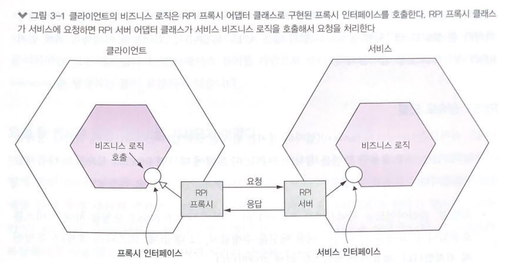

### 동기 RPI 패턴: REST

- REST 는 HTTP로 소통하는 IPC 이다. REST는 HTTP 동사를 사용해서 URL로 참조되는 리소스를 가공(조작)한다
- GET 요청은 대부분 JSON 객체나 XML 문서 등의 포맷으로 리소스 표현형을 반환하고, POST 요청은 새 리소스를 생성하며, PUT 요청은 기존 리소스를 업데이트한다

#### REST 성숙도 모델

- REST 성숙도는 4단계로 이루어져 있으며, 각 단계를 달성할 수록 REST API에 가까워진다
    - 레벨 0: 클라이언트는 서비스별로 유일한 URL 끝점에 HTTP POST 요청을 하여 서비스를 호출한다. 요청을 할 때마다 어떤 액션을 수행할지, 그 대상(예: 비즈니스 객체)은 무엇인지 지정한다. 필요한 매개변수도 함께 전달한다
    - 레벨 1: 서비스는 리소스 개념을 지원한다. 클라이언트는 수행할 액션과 매개변수가 지정된 POST 요청을 한다
    - 레벨 2: 서비스는 HTTP 동사를 이용해서 액션을 수행하고, 요청 쿼리 매개변수 및 본문, 필요 시 매개변수를 지정한다. 덕분에 서비스는 GET 요청을 캐싱하는 등 웹 인프라 활용이 가능하다
    - 레벨 3: 서비스를 HATEOAS(Hypertext As The Engine Of Application State)원칙에 기반하여 설계한다. HATEOAS는 GET 요청으로 반환된 리소스 표현형에 그 리소스에 대한 액션의 링크도 함께 태워 보내자는 생각이다. 가령 클라이언트는 GET 요청으로 주문 데이터를 조회하고 이때 반환된 표현형 내부 링크를 이용해서 해당 주문을 취소할 수도 있다. HATEOAS를 사용하면 하드 코딩한 URL을 클라이언트 코드에 욱여넣지 않아도 된다

#### REST API

- API는 IDL로 정의해야한다. 스웨거라는 오픈 소스 프로젝트를 발전시켜 오픈 API 명세서가 REST IDL로 널리 보급되었다
- 스웨거는 REST API를 개발/문서화하는 도구 세트이다

#### 요청 한번으로 많은 리소스를 가져오기 어렵다

- REST 리소스는 Customer, Order 같은 비즈니스 객체 중심으로 어떻게 해야 클라이언트가 요청 한 번으로 연관된 객체를 모두 가져울 수 있을지 고민해야한다
- 순수 REST API라면 클라이언트는 여러번 요청해야하고 결국 지연 시간이 급증한다
- 쿼리 매개변수로 함께 반환될 리소스를 지정하는 형식을 차용하면 시나리오가 복잡해지면서 효율이 떨어지고 구현 시간이 많이 소요된다
- 데이터를 효율적으로 조회할 수 있게 설계된 GraphQL, 넷플릭스 팔코 등 대체 API 기술이 각광 받기 시작했다

#### 작업을 HTTP 동사에 매핑하기 어렵다

- REST API는 데이터를 수정할 때 대게 PUT 동사를 쓰지만, 이 데이터를 업데이트하는 경로는(주문취소,변경 등) 다양할 수 있고 PUT 사용 시 필수 요건인 멱등성이 보장되지 않는 업데이트도 있다
- 한가지 해결 방법으로 리소스의 특정 부위를 업데이트하는 하위 리소스를 정의하는 것이 있다. 가령 주문 서비스에 주문 취소 끝점 /order/{orderId}/cancel, 주문 변경 끝점 POST /order/{orderId}/revise를 두는 것이다
- 동사를 url 쿼리 매개변수로 지정하는 방법도 있지만 REST답지 않아서 gRPC와 같은 REST 대체 기술이 점점 인기를 끌고있다

#### REST 장단점

- 장점
    - 단순하고 익숙하다
    - 포스트맨 같은 브라우저 플러그인이나 curl 등의 CLI 도구를 사용해서 HTTP API 를 간편하게 테스트할 수 있다
    - 요청/응답 스타일의 통신을 직접 지원한다
    - HTTP는 방화벽 친화적이다(단일 포트, 인터넷에서 서버접속 가능, TCP를 사용)
    - 중간 브로커가 필요하지 않기 때문에 시스템 아키텍처가 단순하다
    
- 단점
    - 요청/응답 스타일의 통신만 지원한다
    - 가용성이 떨어진다. 중간에서 메시지를 버퍼링하는 매개자 없이 클라이언트/서비스가 직접 통신하기 때문에 교환이 일어나는 동안 양쪽 다 실행 중이어야 한다
    - 서비스 인스턴스들의 위치(URL)를 클라이언트가 알고 있어야한다. 요즘 애플리케이션은 서비스 디스커버리 메커니즘을 이용해서 클라이언트가 서비스 인스턴스 위치를 찾을 수 있으므로 큰 단점은 아니다
    - 요청 한 번으로 여러 리소스를 가져오기 어렵다
    - 다중 업데이트 작업을 HTTP 동사에 매핑하기 어려울 때가 많다
    
### 동기 RPI 패턴: gRPC

> gRPC(Google Remote Procedure Calls, 구글 원격 프로시저 호출)는 구글이 최초로 개발한 오픈 소스 원격 프로시저 호출(RPC) 시스템이다 \
> 전송을 위해 HTTP/2를, 인터페이스 정의 언어(IDL)로 프로토콜 버퍼를 사용하며 인증, 양방향 스트리밍 및 흐름 제어, 차단 및 비차단 바인딩, 취소 및 타임아웃 등의 기능을 제공한다

- HTTP는 한정된 동사만 지원하기 때문에 다양한 업데이트 작업을 지원하는 REST API를 설계하기가 쉽지 않아 gRPC가 등장하였다
- IDL로 이진 메시지 기반의 프로토콜 버퍼(Protocol Buffer)를 사용한다
- 프로토콜 버퍼는 xml의 문제점을 개선하기 위해 제안된 IDL로 구조화된 데이터를 직렬화하여 압축해 전송하기때문에 xml에 비해 파일 크기가 3~10배 작으며, 속도가 20~100배 정도 빠르다
- HTTP/2.0 를 지원해 다양한 HTTP/2.0 기능을 사용할 수 있지만, HTTP/2 지원하지 않는 시스템에서는 사용할 수 없다

- 장점
    - 다양한 업데이트 작업이 포함된 API를 설계하기 쉽다
    - 특히 큰 메시지를 교환할 때 콤팩트하고 효율적인 IPC이다
    - 양방향 스트리밍 덕분에 RPI, 메시징 두 가지 통신 방식 모두 가능하다
    - 다양한 언어로 작성된 클라이언트/서버 간 연동이 가능하다
- 단점
    - 자바스크립트 클라이언트가 하는 일이 REST/JSON 기반 API보다 더 많다
    - 구형 방화벽은 HTTP/2를 지원하지 않는다
  
- gRPC는 REST를 대체할 만한 유력한 방안이지만, REST처럼 동기 통신하는 메커니즘이라서 부분 실패 문제는 풀어야 할 숙제이다

### 부분 실패 처리: 회로차단기 패턴

> 회로 차단기, 연속 실패 횟수가 주어진 임계치를 초과하면 일정 시간 동안 호출을 즉시 거부하는 RPI 프록시다

- 분산 시스템은 서비스가 다른 서비스를 동기 호출할 때마다 부분 실패 할 수 있다. 특정 서버의 점검이던 실패이던, 하나의 시스템이 장애가 생기면 클라이언트는 응답 대기도증 블로킹 되어, 잠정적으로는 전체 시스템의 장애를 초래할 수 있다.

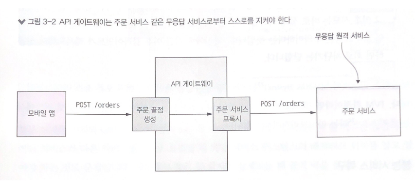

- 따라서 부분 실패가 애플리케이션 전체에 전파되지 않도록 서비스를 설계해야 한다. 솔루션은 두 부분으로 나뉜다
    - 무응답 원격 서비스를 처리하기 위해 주문 서비스 프록시 같은 견고한 RPI 프록시를 설계한다
    - 원격 서비스가 실패하면 어떻게 조치할지 결정한다
    
#### 견고한 RPI 프록시 설계

- 네트워크 타임아웃: 응답 대기 중에 무한정 블로킹하면 안 되고 항상 타임아웃을 걸어 둔다. 이렇게 해야 리소스가 마냥 붙잡히지 않는다
- 미처리 요청 개수 제한: 클라이언트가 특정 서비스에 요청 가능한 미처리 요청의 최대 개수를 설정한다. 이 개수에 이르면 더이상의 요청은 무의미하므로 즉시 실패 처리하는 것이 타당하다
- 회로 차단기 패턴: 성공/실패 요청 개수를 지켜보다가 에러율이 주어진 임계치를 초과하면 그 이후 시도는 바로 실패 처리한다. 실패된 요청이 많다는 것은 서비스가 불능 상태고 더 이상의 요청은 무의미하다는 뜻이다. 타임아웃 시간 이후 클라이언트가 재시도해서 성공하면 회로 차단기는 닫힌다

#### 불능 서비스 복구

- 미리 정해진 기본값이나 캐시된 버전의 데이터를 반환하거나 아예 해당 데이터를 응답에서 제거해도 유용한 정보를 사용자에게 표시 가능하다

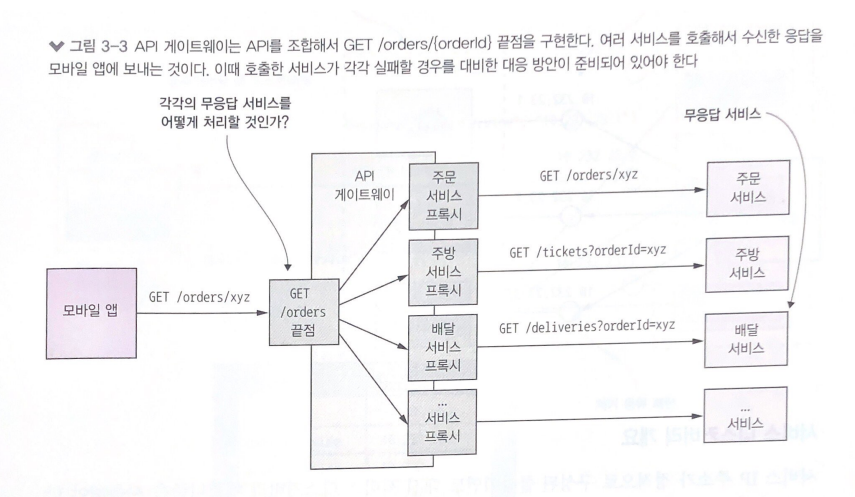

### 서비스 디스커버리

- API 호출시에는 서비스 인스턴스의 네트워크 위치(IP, 도메인/포트)를 알고 있어야 요청을 할 수 있다
- 요즘같은 클라우드 시스템에서는 확장, 축소, 변경 등 네트워크 위치가 시시 각각 변하기 때문에 네트워크 위치를 식별하는 일이 간단치 않다

#### 서비스 디스커버리 개요

- 서비스 인스턴스의 네트워크 위치를 DB화하여 '서비스 레지스트리'에 관리한다
- 서비스 인스턴스가 시작, 종료될때마다 서비스 레지스트리에 등록/삭제한다 클라이언트는 서비스 레지스트리를 조회하여 등록되어있는 해당 서비스의 가용서버로 요청을 호출 한다

#### 애플리케이션 수준의 서비스 디스커버리 패턴 적용

- 서비스 인스턴스가 시작될때, 자신의 위치를 서비스 레지스트리에 등록하고, 클라이언트는 전체 서비스 인스턴스 목록을 가져와 그중 하나로 요청 (라운드로빈 / 랜덤) 을 한다

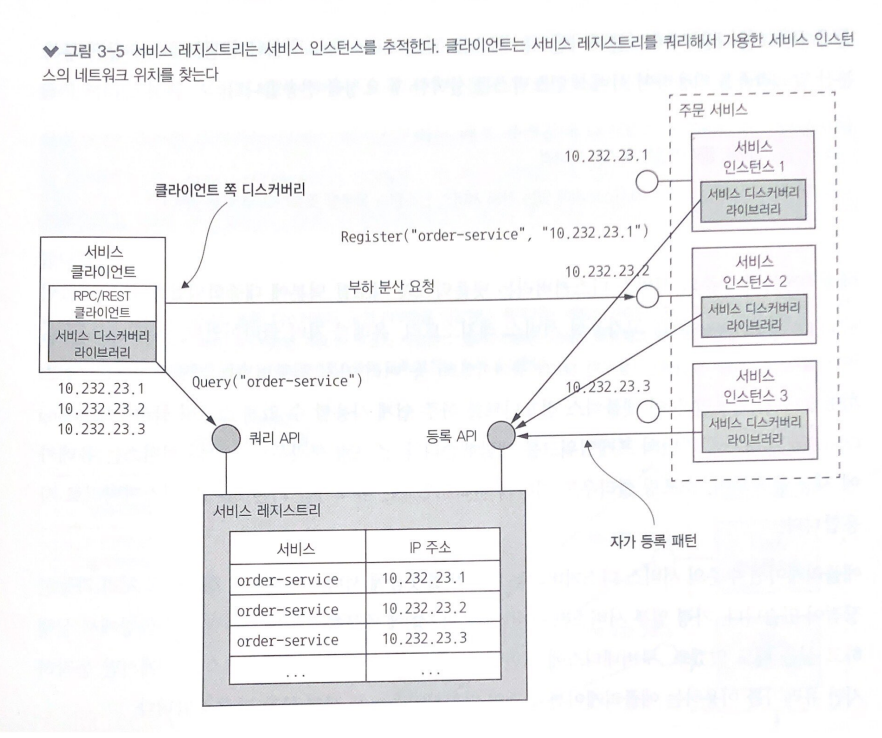

- 이는 두 가지 패턴을 조합한 서비스 디스커비리 방식이다
  - 자가 등록 패턴: 서비스 인스턴스는 자신의 네트워크 위치를 서비스 레지스트리 등록 API를 호출해서 등록한다
  - 클라이언트 쪽 디스커버리 패턴: 클라이언트는 서비스를 호출할 때 먼저 서비스 레지스트리에 서비스 인스턴스 목록을 요청해서 넘겨받는다. 캐시를 사용할 수 도 있고 RR, 랜덤 같은 부하 분산 알고리즘을 이용하여 서비스 인스턴스를 선택한 후 요청을 전송한다

- 어플리케이션 수준의 서비스 디스커버리는 사용하는 언어, 프레임워크에 종속적이지만 다양한 플랫폼(레거시, 쿠버네티스)에 서비스가 배포된 경우에도 처리 가능하다

#### 플랫폼에 내장된 서비스 디스커버리 패턴 적용

- 도커나 쿠버네티스등 최신 배포플랫폼에는 서비스 레지스트리, 서비스 디스커버리등이 탑재 되어 있다
- 클라이언트가 DNS, VIP 등을 요청하면 배포 플랫폼이 가용 인스턴스중 하나로 요청을 라우팅 한다

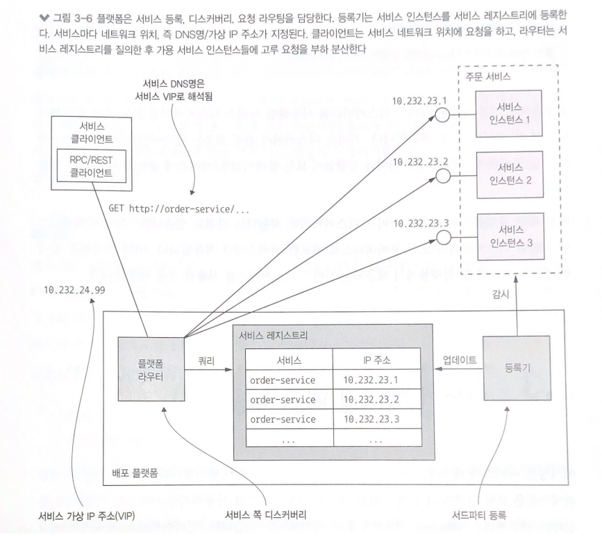

- 이 방식은 다음 두 패턴을 접목시킨 것이다
    - 서드파티 등록 패턴: 배포 플랫폼의 일부인 등록기(레지스트라)라는 서드파티가 서비스 인스턴스를 서비스 레지스트리에 자동 등록한다
    - 서버 쪽 디스커버리 패턴: 클라이언트가 서비스 레지스트리를 질의하지 않고 DNS명을 요청한다. 그러면 서비스 레지스트리를 쿼리하고 요청을 부하 분산하는 요청 라우터로 해석된다

- 서비스 디스커버리 관련 코드는 어디에도 없기 때문에 개발 언어와 상관 없이 모든 클라이언트/서비스에 곧바로 적용할 수 있다
- 해당 플랫폼(쿠버네티스)으로 배포한 서비스 디스커버리만 지원된다는 단점이 있다

## 비동기메시징 패턴 응용 통신

- 메시지를 비동기적으로 주고 받는 통신 방식이다. 
- 서비스 간 중개 역할을 하는 메시지 브로커를 사용하는 방식, 서비스가 직접 통신하는 브로커리스(Brokerless, 브로커가 없는) 방식 두가지가 존재 한다
- 클라이언트가 서비스에 메시지를 보내 요청을 하면, 요청을 받은 서비스 인스턴스가 응답 가능할 경우 별도의 메시지를 클라이언트에 응답한다
- 비동기 통신을 하기 때문에 클라이언트는 응답을 기다리며 블로킹하지 않는다
- 클라이언트는 응답을 바로 받지 못할 것이라는 전제하에 작성한다

### 메시징 개요

#### 메시지

- 메시지는 헤더(Header), 본문(Body)으로 구성된다. 헤더에는 송신된 데이터에 관한 메타데이터에 해당하는 키/값들로 구성된다. 메시지 본문은 실제로 송신할 텍스트 또는 이진 포맷의 데이터이다.
- 메시지의 종류는 다양하다
    - 문서(document): 데이터만 포함된 제네릭한 메시지. 메시지를 어떻게 해석할지는 수신자가 결정한다
    - 커맨드(command): RPC 요청과 동등한 메시지, 호출할 작업과 전달할 매개변수가 지정되어 있다
    - 이벤트(event): 송신자에게 어떤 사건이 발생했음을 알리는 메시지. 대부분 도메인 객체의 상태 변화를 나타내는 도메인 이벤트이다
    
#### 메시지 채널

- 메시지는 채널을 통해 교환된다

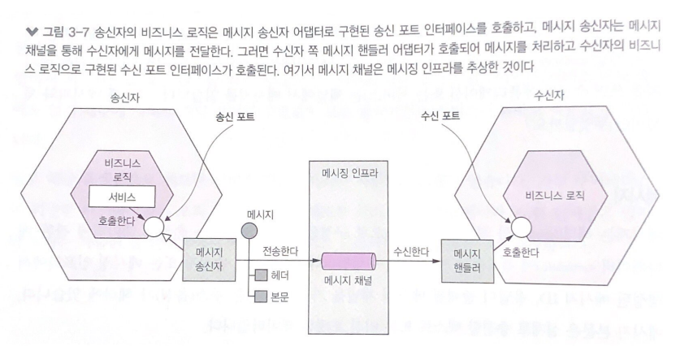

- 채널은 두 종류가 있다
    - 점대점 채널(point to point): 채널을 읽는 컨슈머중 딱 하나만 지정하여 메시지를 전달한다. 앞서 설명한 일대일 상호 작용 스타일의 서비스가 이 채널을 사용한다(예: 커맨드 메시지)
    - 발행-구독 채널(publish - subscribe): 같은 채널을 바라보는 모든 컨슈머에 메시지를 전달한다. 앞서 설명한 일대다 상호 작용 스타일의 서비스가 이 채널을 사용한다(예: 이벤트 메시지)

### 메시징 상호 작용 스타일 구현

#### 요청/응답 및 비동기 요청/응답

- 동기 요청/응답은 서비스가 즉시 응답 할것으로 클라이언트가 기대하고, 비동기 요청/응답은 기대하지 않는다
- 메시징은 비동기 요청으로 제공되지만 원한다면 클라이언트를 블로킹 할 수도 있다

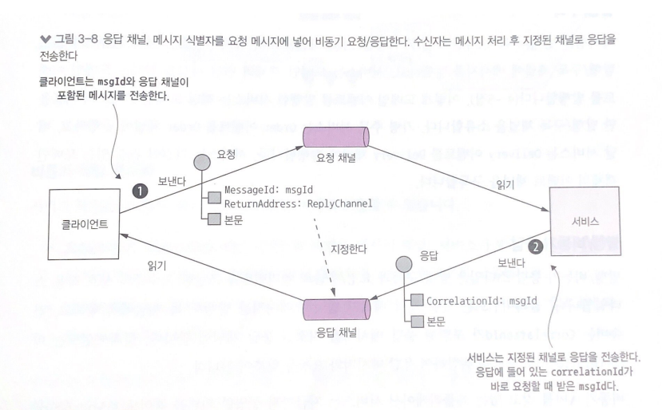

- 클라이언트/서비스는 요청을 점대점 채널로 보내고, 비동기적으로 응답을 기다린다
- 이때 요청한 메시지와 응답받은 메시지가 짝이 맞아야 한다. 이는 요청한 메시지에 포함된 메시지ID 및 응답 채널이 헤더에 명시된 커맨드 메시지를 보내고, 서버는 메시지ID와 값이 동일한 ID를 응답메시지에 보낸다. 클라이언트는 이 ID를 이용하여 응답 메시지와 요청을 맞추어 볼 수 있다

#### 단방향 알림

- 클라이언트가 점대점 채널로 메시지(커맨드 메시지)를 보내면, 서비스는 이 채널을 구독해서 메시지를 처리하는 방식이다. 단방향이므로 서비스는 메시지에 대한 응답은 하지 않는다

#### 발행/구독

- 클라이언트는 여러 컨슈머가 읽는 발행/구독 채널에 메시지를 발행하고, 서비스는 모데인 객체의 변경 사실을 알리는 도메인 이벤트를 발행한다. 도메인 이벤트를 발행한 서비스는 해당 도메인 클래스의 이름을 딴 발행/구독 채널을 소유한다. 서비스는 자신이 관심 있는 도메인 객체의 이벤트 채널을 구독한다

#### 발행/비동기 응답

- 클라이언트는 응답 채널 헤더가 명시된 메시지를 발행/구독 채널에 발행하고, 컨슈머는 메시지ID가 포함된 응답메시지를 지정된 응답 채널에 쓴다. 클라이언트는 이 메시지ID로 응답을 취함하여 응답 메시지와의 요청을 맞추어 본다

### 메시징 기반 서비스의 API 명세 작성

- 서비스의 비동기 API 명세에는 메시지 채널명, 각 채널을 통해 교환되는 메시지의 타입과 포맷을 명시하고, 메시지 포맷은 JSON, XML, 프로토콜 버퍼 등 표준 표맷으로 기술 해야 한다
- REST, 오픈 API와 달리 채널 및 메시지 타입은 딱히 정해진 문서화 표준이 없으므로 자유롭게 기술하면 된다

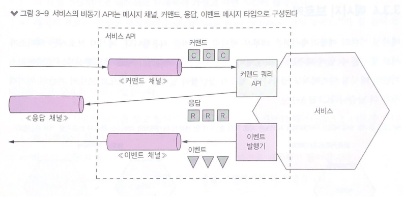

#### 비동기 작업 문서화

- 서비스 작업은 두 가지 상호 작용 스타일 중 하나로 호출할 수 있다

- 요청/비동기 응답 스타일 API
    - 서비스의 커맨드 메시지 채널
    - 서비스가 받는 커맨드 메시지의 타입과 포맷
    - 서비스가 반환하는 응답 메시지의 타입과 포맷
    
- 단방향 알림 스타일 API
    - 서비스의 커맨드 메시지 채널
    - 서비스가 받는 커맨드 메시지의 타입과 포맷

#### 발행 이벤트 문서화

- 발행/구독 스타일 API
    - 이벤트 채널
    - 서비스가 채널에 발행하는 이벤트 메시지의 타입과 포맷

### 메시지 브로커

- 메시징 기반의 애플리케이션은 대부분 메시지 브로커를 사용한다
- 메시지 브로커는 서비스가 서로 통신할 수 있게 해주는 인프라 서비스이다

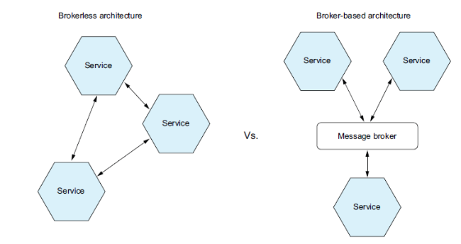

#### 브로커리스 메시징

- 브로커리스 아키텍처의 서비스는 메시지를 서로 직접 교환한다
- ZeroMQ는 잘 알려진 브로커리스 메시징 기술이다
- 장점
    - 송신자에서 수신자로 직접 전달되므로 네트워크 트래픽이 가볍고 지연시간이 짧다
    - 메시지 브로커가 성능 병목점이나 SPOF(Single Point Of Failure)가 될 일이 없다
    - 메시지 브로커를 설정/관리할 필요가 없으므로 운영 복잡도가 낮다
- 단점
    - 서비스가 서로의 위치를 알고 있어야 하므로 서비스 디스커버리 메커니즘 중 하나를 사용해야 한다
    - 메시지 교환 시 송신자/수신자 모두 실행 중이어야 하므로 가용성이 떨어진다
    - 전달 보장같은 메커니즘을 구현하기가 어렵다

#### 브로커 기반 메시징 개요

- 메시지 브로커는 모든 메시지가 지나가는 중간 지점이다
- 메시지 브로커의 가장 큰 장점은 송신자가 컨슈머의 네트워크 위치를 몰라도 된다는 것이다. 또 컨슈머가 메시지를 처리할 수 있을 때까지 메시지 브로커에 메시지를 버퍼링할 수도 있다
- 가장 많이 사용되는 오픈 소스 메시지 브로커는 ActiveMQ, RabbitMQ, Apache Kafka 등이 있다
- 메시지 브로커를 선택할 때에는 다음 항목을 잘 검토해야한다
    - 프로그래밍 언어 지원 여부: 다양한 프로그래밍 언어를 지원할수록 좋다
    - 메시징 표준 지원 여부: AMQP나 STOMP 등 표준 프로토콜을 지원하는 제품인가, 아니면 자체 표준만 지원하는 제품인가
    - 메시지 순서: 메시지 순서가 유지되는가
    - 전달 보장: 어떤 종류의 전달 보장을 하는가
    - 영속화: 브로커가 고장 나도 문제가 없도록 메시지를 디스크에 저장하는가
    - 내구성: 컨슈머가 메시지 브로커에 다시 접속할 경우, 접속이 중단된 시간에 전달된 메시지를 받을 수 있나
    - 확장성: 얼마나 확장성이 좋은가
    - 지연 시간: 종단 간 지연 시간은 얼마나 되나
    - 경쟁사 컨슈머: 경쟁사의 컨슈머를 지원하는가
- 브로커마다 다 일장일단이 있다. 지연 시간이 매우 짧은 브로커는 메시지 순서가 유지되지 않거나 메시지 전달이 보장되지 않는다든지, 아니면 메시지를 메모리에만 저장한다든지 하는 단점이 있다
- 메시지 전달을 보장하고 메시지를 디스크에 확실히 저장하는 브로커는 지연시간이 길다

#### 메시지 브로커로 메시지 채널 구현

- 메시지 채널은 메시지 브로커마다 구현 방식이 조금씩 다르다

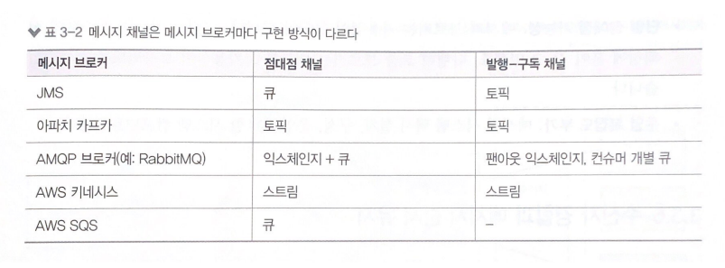

#### 브로커 기반 메시징의 장단점

- 장점
    - 느슨한 결합: 클라이언트는 적절한 채널에 그냥 메시지를 보내는 식으로 요청한다. 클라이언트는 서비스 인스턴스를 몰라도 되므로 서비스 인스턴스 위치를 알려 주는 디스커버리 메커니즘도 필요 없다
    - 메시지 버퍼링: 메시지 브로커는 처리 가능한 시점까지 메시지를 버퍼링 한다. HTTP 같은 동기 요청/응답 프로토콜을 쓰면 교환이 일어나는 동안 클라이언트/서비스 양쪽 모두 가동중이어야 하지만 메시징을 쓰면 컨슈머가 처리할 수 있을 때까지 그냥 큐에 메시지가 쌓인다
    - 유연한 통신: 메시징은 지금까지 설명한 모든 상호작용 스타일을 지원한다

- 단점
    - 성능 병목 가능성: 메시지 브로커가 성능 병목점이 될 위험이 있다
    - 단일 장애점 가능성: 메시지 브로커가 장애가 될 경우 시스템 전체에 영향이 발생한다
    - 운영 복잡도 부가: 메시징 시스템 역시 설치, 구성, 운영해야 할 시스템 컴포넌트로 운영 리소스가 필요하다

### 수신자 경합과 메시지 순서 유지

- 메시지는 발생 순서와 같게 서비스에 도착 해야 한다
- 한 시스템을 스케일 아웃하여 서비스 인스턴스가 3개가 있다고 했을 때 한 채널에 메시지가 순서대로 A라는 도메인이 1,2,3 의 상태로 변경 되었을 경우, 각 인스턴스는 순서대로 메시지를 처리할 수 있지만 네트워크, 장애등의 이유로 이벤트는 2,1,3 순서대로 수신 되거나, 2번만 누락되는 등의 일이 발생 할 수 있다
- 이를 해결하기 위해 아파치 카프카, AWS 키네시스 등 요즘 메시지 브로커는 샤딩된 채널을 이용한다. 솔루션은 다음 세 부분으로 구성된다
    - 채널을 샤드한다. 각 샤드는 개별 채널 처럼 동작한다
    - 송신자는 메시지 헤더에 샤드 키(무작위 문자열 또는 바이트)를 지정한다. 메시지 브로커는 메시지를 샤드 키별로 샤드/파티션에 배정한다. 샤드 키 해시 값을 샤드 개수로 나눈 나머지를 계산해서 샤드를 선택하는 방식이다
    - 메시징 브로커는 여러 수신자 인스턴스를 묶어 마치 동일한 논리 수신자 처럼 취급 한다(Kafka에서 컨슈머 그룹이라고 한다). 메시지 브로커는 각 샤드를 하나의 수신자에 배정하고, 수신자가 시동/종료하면 샤드를 재배정한다

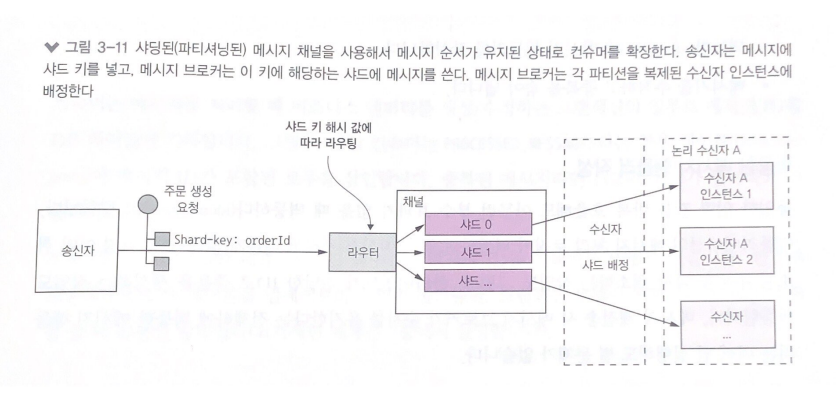

- 샤드 키 값인 orderId가 같은 값을 가진 메시지는 하나의 샤드한 채널로만 메시지가 발행되고, 컨슈머는 하나의 채널에서만 순서대로 메시지를 받을 수 있어 순서가 보장 된다

### 중복 메시지 처리

- 메시지 브로커가 각 메시지를 꼭 한 번만 전달하면 좋겠지만, 그렇게 강제하려면 그만큼 값비싼 대가를 치러야 한다. 그래서 메시지 브로커는 보통 적어도 한 번 이상 메시지를 전달한다
- 일반적으로 메시지는 유일한 메시지가 생성되나 장애 발생, 장애에 대한 복구등으로 인해 동일한 메시지가 중복으로 발생, 소비 될 수 있다. 이러한 문제를 해결하기 위한 매커니즘이 필요하다
- 중복 메시지를 처리하는 방법은 다음 두 가지이다
    - 멱등한 메시지 핸들러를 작성한다
    - 메시지를 추적하고 중복을 솎아 낸다

#### 멱등한 메시지 핸들러 작성

- 동일한 입력 값을 반복 호출해도 아무런 부수적 효과가 없을 때 이를 멱등하다고 한다. 어플리케이션의 메시지 처리 로직이 멱등하다면 중복 메시지는 전혀 해롭지 않다
- 멱등한 애플리케이션 로직은 실제로 별로 없다

#### 메시지 추적과 중복 메시지 솎아내기

- 컨슈머가 메시지 ID를 이용하여 메시지 처리 여부를 추적하면서 중복 메시지를 솎아 내면 해결 된다. 예를들면 컨슈머가 소비하는 메시지 ID를 무조건 DB 테이블에 저장하면 된다

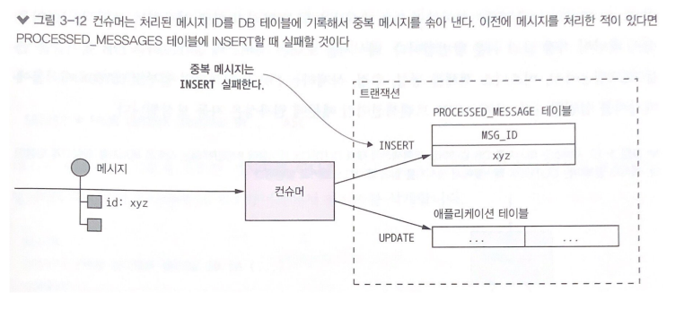

- 컨슈머는 메시지를 처리할 때 메시지 ID를 특정 테이블에 저장하고, 다음 메시지 수신시 해당 ID를 특정 테이블에 있는지 조회하여 동일하면 무시하는 방법이다

### 트랜잭셔널 메시징

- 서비스는 보통 DB를 업데이트하는 트랜잭션의 일부로 메시지를 발행한다. 이 두 작업이 서비스에서 원자적으로 수행되지 않으면 시스템이 실패할 경우 아주 불안정한 상태가 될 것이다
- DB를 업데이트하고 메시지를 발행 한뒤 트랜잭션이 종료 되어야 한다. DB는 저장되지 않고 메시지가 나가던지, DB는 저장되었는데 메시지가 나가지 않는 등의 일이 벌어질 수 있기 때문이다

#### DB 테이블을 메시지 큐로 활용

- RDBMS 기반의 어플리케이션의 경우 DB 테이블을 임시 메시지 큐로 사용하는 트랜잭셔널 아웃박스(OUTBOX) 패턴이 가장 알기 쉬운 방법이다
- 비지니스 로직에서 수정/삭제가 발생했을때 동일 트랜잭션에서 OUTBOX 테이블에 메시지를 삽입한다. 로컬 ACID 이기때문에 원자성이 보장된다. 또 OUTBOX 테이블은 임시 메시지 큐역할도 대신 하기때문에 순서성도 보장 된다

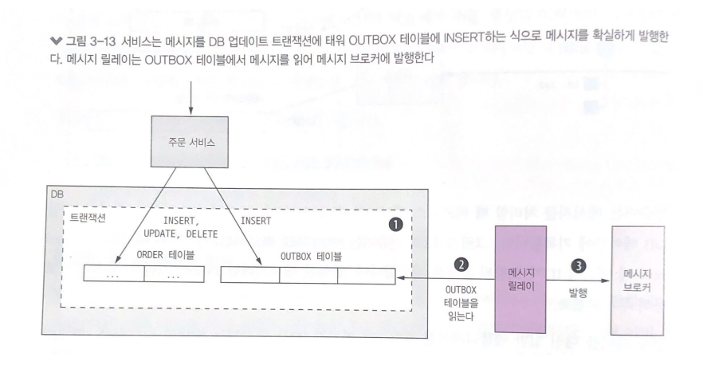  

- 메시지를 DB에서 브로커로 옮기는 방법은 다음 두가지이다.

#### 이벤트 발행: 폴링 발행기 패턴

- 메시지 릴레이로 OUTBOX 테이블에서 미발행 메시지를 입력 순서에 따라 조회해 메시지를 발행 후 삭제한다
- 가장 단순한 방법이고 쉽지만, 자주 DB를 폴링 하기때문에 DB에 조회 리소스가 발생한다
- 애플리케이션이 OUTBOX 테이블을 쿼리하는 대신 비즈니스 엔터티를 쿼리해야 하는 경우도 있는데, 이런 일이 효율족으로 가능할 수도 있고 불가능할 수도 있기 때문에 한계가 있다

#### 이벤트 발행: 트랜잭션 로그 테일링 패턴

- 메시지 릴레이로 DB 트랜잭션 로그를 테일링 하는 방법이 있다. 어플리케이션에서 DB로 커밋된 업데이트는 로그로 남는다. 이 로그를 트랜잭션 로그 마이너로 읽어 변경분을 하나씩 메시지로 발행하는것이 트랜잭션 로그 테일링 패턴이다

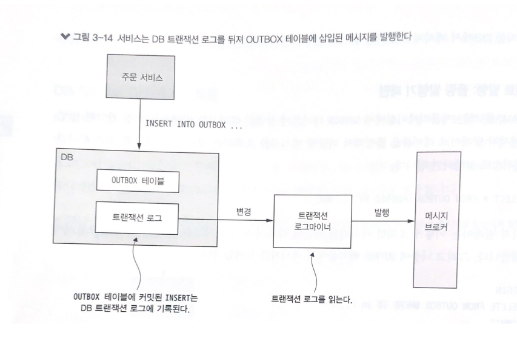

## 비동기메시징으로 가용성 개선

### 동기 통신으로 인한 가용성 저하

- 동기 프로토콜을 이용하면 HTTP 클라이언트는 요청이 응답할때까지 기다려야 하므로 가용성은 저하될 수 밖에 없다.
- 하나의 서비스가 두개 이상의 서비스를 연속적으로 호출 할 경우, 두 서비스중 하나라도 중단되면 해당 서비스는 중단 된다.
- 그렇기 때문에 더 많은 서비스가 요청에 개입될 수록 가용성은 점점 낮아진다.

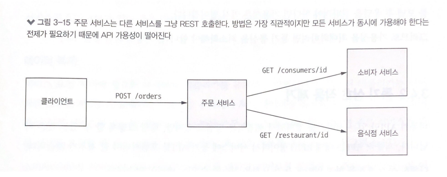

### 동기 상호 작용 제거

#### 비동기 상호 작용 스타일

- 모든 트랜잭션은 앞부분에서 설명한 비동기 상호 작용 스타일로 처리하는 것이 가장 좋다

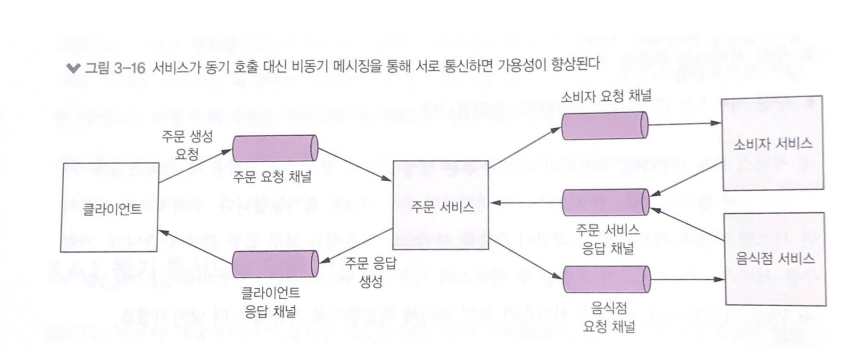

#### 데이터 복제

- REST 와 같은 동기 프로토콜을 사용하여 요청 즉시 응답해야 하는 API 도 있을것이다. 이럴때는 서비스에 데이터를 복제 하면 가용성을 높일 수 있다.
- 데이터를 소유한 서비스가 데이터 변경시 변경된 이벤트를 발행하고, 필요한 서비스에서 이를 수신해 로컬 레플리카 DB에 최신 데이터를 유지 한다.
- 이렇게 되면 다른 서비스의 데이터를 조회 하기 위해 조회 하는 상호 작용이 제거되어 가용성이 증가되고 성능도 높일 수 있다.
- 하지만 방대한 데이터를 관리하는 대규모 시스템에서는 복제 해야 할 데이터가 너무 크기때문에 실제로 실용적이지 못한다.

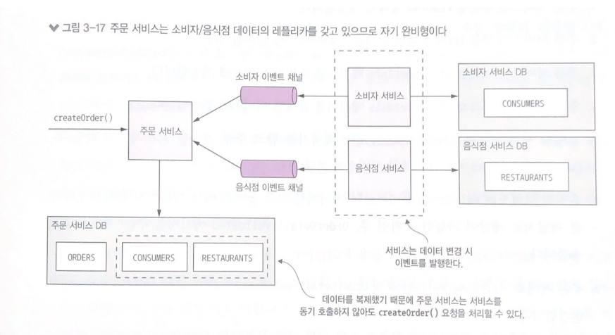

#### 응답 반환 후 마무리

- 요청 처리도중 동기 통신을 제거하려면 다음과 같이 한다.
    - 로컬에서 가용한 데이터만 가지고 검증함 
    - 메시지를 OUTBOX 테이블에 삽입하는 식으로 DB를 업데이트 
    - 클라이언트에 응답을 반환
    
- 서비스는 요청 처리 중에 다른 서비스와 동기적 상호 작용을 하지 않는다. 그 대신 다른 서비스에 메시지를 비동기 전송한다. 이렇게 하면 다른 서비스와 상호 작용 없이 느슨한 결합을 유지 할 수 있다.

- 주문 서비스의 경우 Pending상태를 생성해 비동기 처리를 할 수 있다.

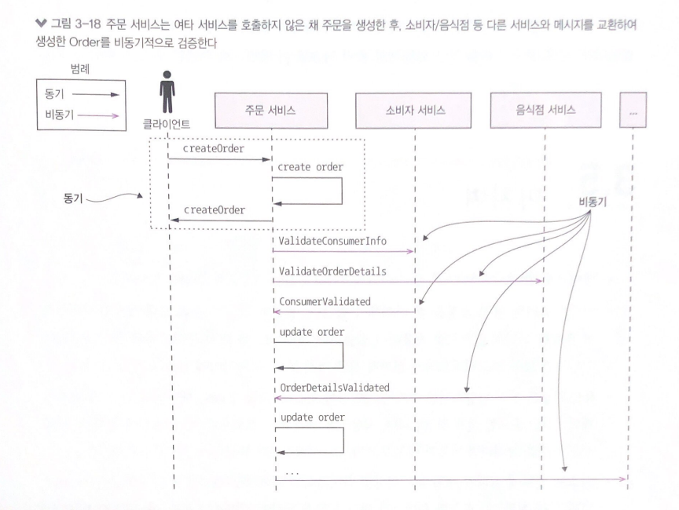

- 주문을 Pending 상태로 생성하고, valdation 은 동기로 처리한뒤 실제 결과는 비동기로 입력받아 각 VALIDATION 에 대한 처리를 상태값으로 관리한다.
- 최종적으로 비동기 응답을 모두 받은뒤 주문의 상태를 처리 하면 된다.
- 이때 다른 서비스가 장애가 나더라도 주문이 후속 처리 되지않고, 복구되어 응답을 받았을때 다시 상태가 처리 되므로 가용성이 높아진다.