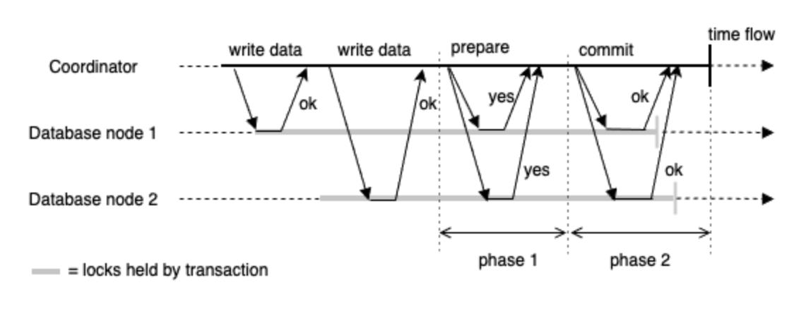
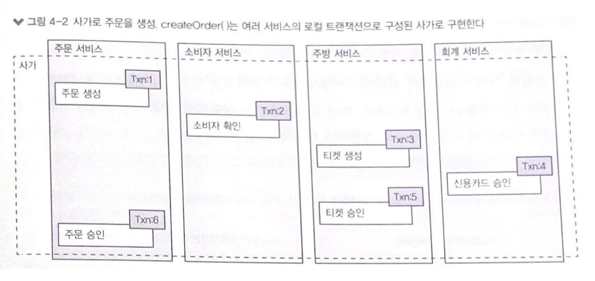
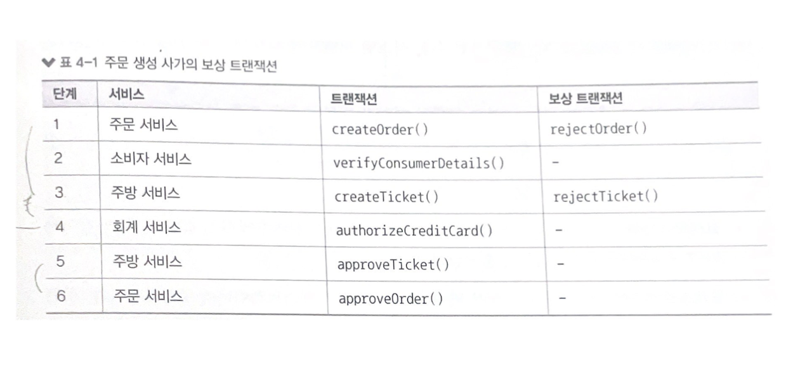
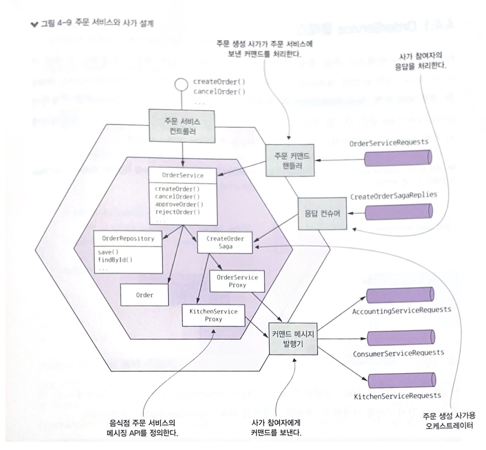
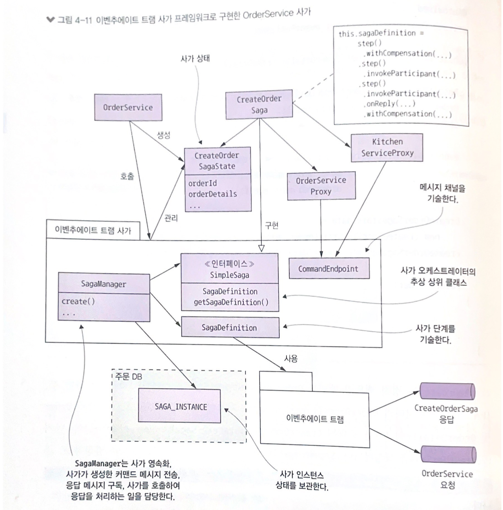
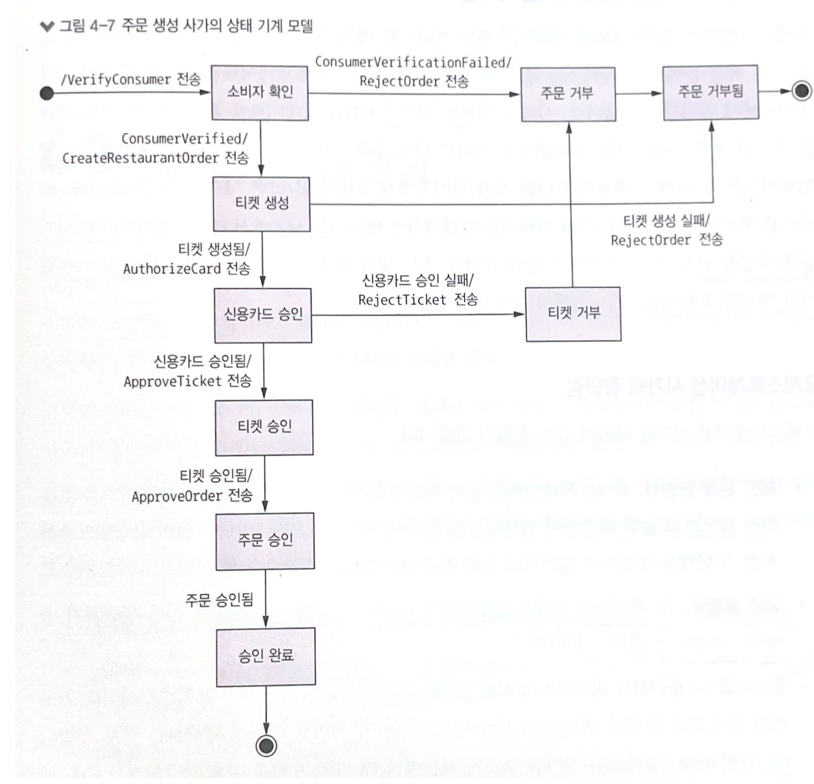
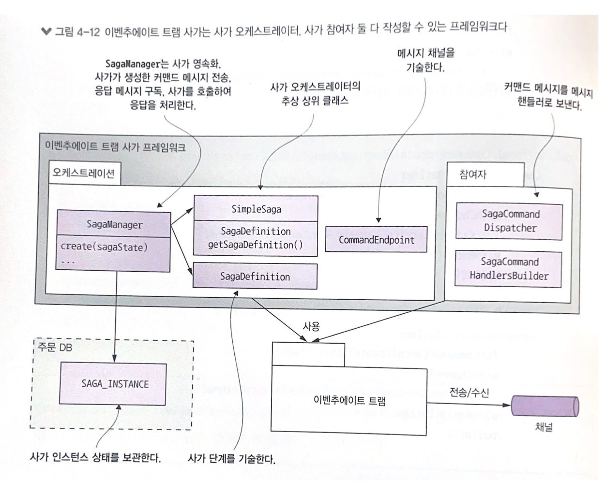
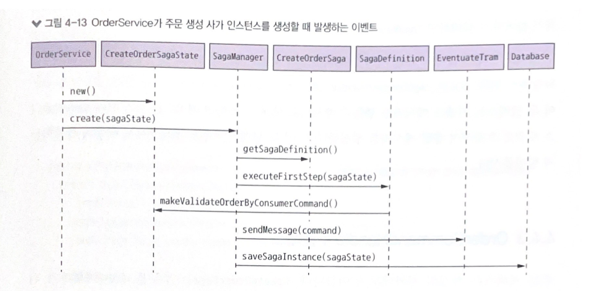
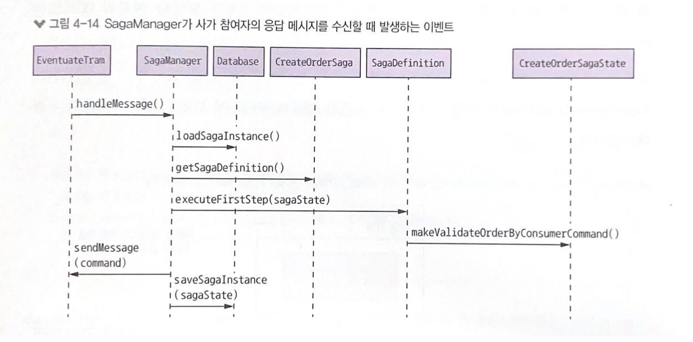
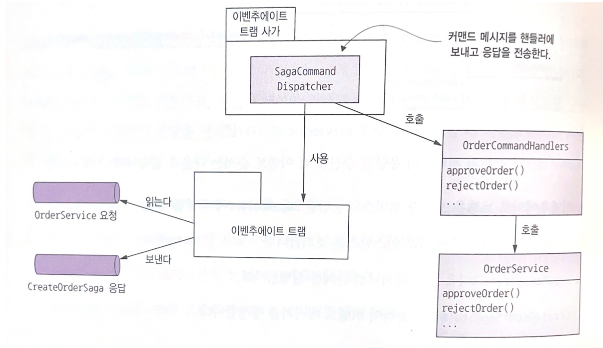

## 4. 트랜잭션 관리: 사가

### 목차
1. 마이크로서비스 아키텍처에서 트랜잭션 관리가 어려운 이유
2. 분산 트랜잭션 관리 방식을 사용할 수 없는 이유
3. 사가로 데이터 일관성을 유지하는 방법
4. 사가를 편성하는 두 가지 기법 (코레오그래피, 오케스트레이션)
5. 사가 간 격리가 되지 않아 발생하는 동시 비정상의 영향을 줄이거나 방지할 수 있는 대책
6. 사가 예제 코드

## 4.1 마이크로서비스 아키텍처에서의 트랜잭션 관리
### 4.1.1 분산 트랜잭션의 필요성
```
createOrder() : 주문 가능한 소비자인지 확인 -> 주문 내역 확인 -> 소비자의 신용카드 승인 -> DB에 주문 생성
```
- 모놀리식 애플리케이션
    - createOrder() 앞에 @Transactional 만 붙이면 ACID 트랜잭션이 자동으로 걸려 데이터 일관성 보장
- 마이크로서비스 아키텍처
    - 소비자 서비스, 주문 서비스, 주방 서비스, 회계 서비스 등 여러 서비스에 있는 데이터에 접근
    - 서비스마다 DB가 따로 있기 때문에 여러 DB에 걸쳐 데이터 일관성을 유지해야 함

### 4.1.2 분산 트랜잭션의 문제점
> 예전에는 분산 트랜잭션을 이용해서 여러 서비스, DB, 메시지 브로커에 걸쳐 데이터 일관성을 유지했음

#### XA 트랜잭션 - 2PC(2-Phase Commit)

- 조정자(coordinator), 참가자(participant)로 구성
- 1단계
    - 각 노드에 prepare 요청을 보내어 commit 할 수 있는지 질의
- 2단계
    - 모든 노드가 "yes"라고 대답하여 커밋할 준비가 되었다고 하면 트랜잭션 매니저는 커밋 요청을 전송하고 커밋이 수행됨
    - 한 참가라도 "no"라고 대답하면 모든 노드에 중단 요청을 보냄

#### 문제점
- NoSQL DB나 현대 메시지 브로커는 분산 트랜잭션을 지원하지 않음
- 동기 IPC 형태 : 참여한 서비스가 모두 가동 중이어야 커밋할 수 있음 -> 가용성이 떨어지게 됨

### 4.1.3 데이터 일관성 유지: 사가 패턴
#### 사가란 무엇인가
- 마이크로서비스 아키텍처에서 분산 트랜잭션 없이 데이터 일관성을 유지하는 메커니즘
- 여러 서비스의 데이터를 업데이트하는 시스템 커맨드마다 사가를 하나씩 정의
- 비동기 메시징을 이용하여 편성한 일련의 로컬 트랜잭션 (각 로컬 트랜잭션은 ACID 트랜잭션 프레임워크/라이브러리를 이용하여 데이터를 업데이트)
#### 사가와 ACID 트랜잭션의 차이
- ACID 트랜잭션의 격리성(I)이 사가에는 없음
- 사가는 로컬 트랜잭션마다 변경분을 커밋하므로 보상 트랜잭션을 걸어 롤백해야 함

#### 예제: 주문 생성 사가
```
1. 주문 서비스: 주문을 APPROVAL_PENDING 상태로 생성
2. 소비자 서비스: 주문 가능한 소비자인지 확인
3. 주방 서비스: 주문 내역을 확인하고 티켓을 CREATE_PENDING 상태로 생성
4. 회계 서비스: 소비자 신용카드를 승인
5. 주방 서비스: 티켓 상태를 AWAITING_ACCEPTANCE로 변경
6. 주문 서비스: 주문 상태를 APPROVED로 변경
```


- 서비스는 로컬 트랜잭션이 완료되면 메시지를 발행하여 다음 사가 단계를 트리거
- 메시지를 통해 사가 참여자를 느슨하게 결합하고 사가가 반드시 완료되도록 보장
- 메시지 수신자가 일시 불능 상태라면, 메시지 브로커는 다시 메시지를 전달할 수 있을 때까지 메시지를 버퍼링

#### 보상 트랜잭션
- 사가는 단계마다 로컬 DB에 변경분을 커밋하므로 자동 롤백은 불가능
- 보상 트랜잭션을 설정해 적용된 변경분을 언두해야 함
```
...
4. 회계 서비스: 소비자 신용카드를 거부
5. 주방 서비스: 티켓 상태를 CREATE_REJECTED로 변경
6. 주문 서비스: 주문 상태를 REJECTED로 변경
```



## 4.2 사가 편셩
사가 편성 로직을 통해 일반 트랜잭션과 보상 트랜잭션을 순서화
- 코레오그래피(choreography): 의사 결정과 순서화를 사가 참여자에게 맡김. 사가 참여자는 주로 이벤트 교환 방식으로 통신한다.
- 오케스트레이션(orchestration): 사가 편성 로직을 사가 오케스트레이터에 중앙화. 사가 오케스트레이터는 사가 참여자에게 커맨드 메시지를 보내 수행할 작업을 지시한다.

### 4.2.1 코레오그래피 사가
> 사가 참여자가 서로 발행/구독 방식으로 서로 소통

#### 고려해야 할 점
1. 사가 참여자가 자신의 DB를 업데이트하고, DB 트랜잭션의 일부로 이벤트를 발행하도록 해야 함
    - DB 업데이트 작업과 이벤트 발행 작업은 원자적으로(atomically) 일어나야 함
2. 사가 참여자는 자신이 수신한 이벤트와 자신이 가진 데이터를 연관 지을 수 있어야 함
    - 데이터를 매핑할 수 있도록 상관관계 ID가 포함된 이벤트를 발행/구독해야 함 (ex. orderId)

#### 장점
- 단순함: 객체를 생성/수정/삭제할 때 이벤트 발행
- 느슨한 결합: 이벤트를 구독할 뿐 서로를 알지 못함

#### 단점
- 이해하기 어려움: 여러 서비스에 구현 로직이 흩어져 있어서 어떤 사가가 어떻게 작동되는지 개발자가 이해하기 어려움
- 서비스 간 순환 의존성 발생 가능
- 단단히 결합될 위험성: 사가 참여자는 가자 자신에게 영향을 미치는 이벤트를 모두 구독해야 함

### 4.2.2 오케스트레이션 사가
#### 사가 오케스트레이터
- 사가 참여자가 할 일을 알려 주는 어케스트레이터 클래스를 정의
- 커맨드/비동기 응답 상호 작용을 하며 참여자와 통신
- 사가 단계를 실행하기 위해 해당 참여자가 무슨 일을 해야 하는지 커맨드 메시지에 적어 보냄
- 사가 참여자가 작업 후 응답 메시지를 오케스트레이터에게 주면, 응답 메시지를 처리한 후 다음 사가 단계를 어느 참여자가 수행할지 결정

#### 장점
- 의존 관계 단순화: 오케스트레이터는 참여자를 호출하지만 참여자는 오케스트레이터를 호출하지 않으므로 순환 의존성이 발생하지 않음
- 낮은 결합도: 각 서비스는 오케스트레이터가 호출하는 API를 구현할 뿐, 사가 참여자가 발행하는 이벤트는 몰라도 됨
- 관심사를 더 분리하고 비즈니스 로직을 단순화: 사가 편성 로직이 오케스트레이터 한곳에만 있으므로 도메인 객체는 더 단순해짐

#### 단점
- 비즈니스 로직을 오케스트레이터에 너무 많이 중앙화하면 똑똑한 오케스트레이터 하나가 깡통 서비스에 할 일을 지시하는 모양새가 될 수 있음

## 4.3 비격리 문제 처리
> 격리성(I): 동시에 실행 중인 여러 트랜잭션의 결과가 어떤 순서대로 실행된 결과와 동일함을 보장하는 속성

#### 사가에서는?
사가의 한 트랜잭션이 커밋한 변경분을 다른 사가가 즉시 바라볼 수 있음
- 한 사가가 실행 중에 접근하는 데이터를 도중에 다른 사가가 바꿔치기 할 수 있음
- 한 사가가 업데이트 하기 이전 데이터를 다른 사가가 읽을 수 있어서 데이터 일관성이 깨질 수 있음

### 4.3.1 비정상 개요
> 격리가 안되면 DB에서는 비정상(anomaly)이 나타남

#### lost updates: 한 사가의 변경분을 다른 사가가 미처 못 읽고 덮어 씀
```
1. 주문 생성 사가 첫 번째 단계에서 주문을 생성
2. 사가 실행 중 주문 취소 사가가 주문을 취소
3. 주문 생성 사가 마지막 단계에서 주문을 승인

=> 주문 생성 사가는 주문 취소 사가가 업데이트한 데이터를 덮어 쓰게 되고, 고객은 취소한 음식을 배달받게 됨
```
#### dirty read: 사가 업데이트를 하지 않은 변경분을 다른 트랜잭션이나 사가가 읽음
소비자 주문 취소 시 배달을 취소하기에는 너무 늦어서 주문 취소 사가가 롤백되는 경우 (그런데 만약 주문 생성 사가와 실행이 서로 겹칠 때)
```
주문 취소 사가
- 소비자 서비스: 신용 잔고를 늘림
- 주문 서비스: 주문을 취소 상태로 변경
- 배달 서비스: 배달을 취소
```
```
1. 주문 취소 사가: 신용 잔고를 늘림
2. 주문 생성 사가: 신용 잔고를 줄임
3. 주문 취소 사가: 신용 잔고를 줄이는 보상 트랜잭션이 가동됨

=> 주문 생성 사가는 신용 잔고를 dirty read 하게 되고, 소비자는 신용잔고를 초과하는 주문도 할 수 있게 됨
```
#### fuzzy/nonrepetable read
한 사가의 상이한 두 단계가 같은 데이터를 읽어도 결과가 달라지는 현상. 다른 사가가 그 사이 업데이트를 했기 때문에 생기는 문제

### 4.3.2 비격리 대책
#### 사가의 구조 먼저 살펴보기
사가는 다음의 세 가지 트랜잭션으로 구성됨
- 보상 가능 트랜잭션: 보상 트랜잭션으로 롤백 가능한 트랜잭션
- 피봇 트랜잭션: 사가의 진행/중단 지점으로 피봇 트랜잭션이 커밋되면 사가는 완료될 때까지 실행
- 재시도 가능 트랜잭션: 피봇 트랜잭션 직후의 트랜잭션으로 반드시 성공

#### 비격리 대책: 시맨틱 락 (sematic lock)
- 어플리케이션 수준의 락
- 보상 가능 트랜잭션이 생성/수정하는 레코드에 무조건 플래그를 세팅하는 대책
- 플래그는 재시도 가능 트랜잭션(사가 완료) 또는 보상 트랜잭션(사가 롤백)에 의해 해제됨
```
- APPROVAL_PENDING (보상 가능 트랜잭션) -> APPROVED (재시도 가능 트랜잭션)
- APPROVAL_PENDING (보상 가능 트랜잭션) -> REJECTED (보상 트랜잭션)
```
- APPROVAL_PENDING 일 때 cancelOrder()를 호출하려면?
    - cancelOrder()를 실패 처리하고 클라이언트에 나중에 시도하라고 알리는 방안 -> 클라이언트 복잡
    - 락이 해제될 때까지 cancelOrder()를 블로킹
        - 애플리케이션에서 락을 관리하는 부담은 감수해야 하며, 데드락 감지 알고리즘을 구현해 데드락이 발생하면 사가를 롤백시켜 데드락을 해소하고 재실행할 수 있게 조치해야 함

#### 비격리 대책: 교환적 업데이트 (commutative updates)
- 업데이트 작업은 어떤 순서로 실행해도 되게끔 설계한다
- Account의 debit()과 credit()은 서로 교환적인 관계
    - 보상 가능 트랜잭션이 계좌를 인출 후 사가를 롤백시켜야 하는 상황이라면 단순히 계좌를 입금해서 업데이트를 언두하면 된다. 다른 사가의 업데이트를 덮어 쓸 일은 전혀 없다.

#### 비격리 대책: 비관적 관점
- 사가 단계 순서를 재조정하여 비즈니스 리스크를 최소화한다
```
주문 취소 사가
1. 주문 서비스: 주문을 취소상태로 변경
2. 배달 서비스: 배달을 취소
3. 회계 서비스: 신용 잔고를 늘림

=> 순서를 바꾸면 신용 잔고는 재시도 가능 트랜잭션에서 증가하므로 더티 읽기 가능성은 사라짐
```

#### 비격리 대책: 값 다시 읽기
- 데이터를 덮어 쓸 때 그 전에 변경된 내용은 없는지 값을 다시 읽고 확인하여 dirty writes를 방지
```
주문 생성 사가
- 주문 승인 트랜잭션은 해당 주문이 처음 생성된 이후 이전 사가 단계에서 변경되었는지 체크
- 변경되지 않았으면 주문을 승인 처리하고, 주문이 취소되었으면 사가를 멈추고 보상 트랜잭션을 가동
```

#### 비격리 대책: 버전 파일
- 순서를 재조정할 수 있게 업데이트를 기록한다
- 비교환적 작업을 교환적 작업으로 변환하는 방법
```
주문 생성 사가와 주문 취소 사가가 동시에 실행될 때 (시맨틱 락 대책 쓰지 않을 때)
- 주문 생성 사가가 소비자 신용카드를 승인하기 전에 주문 취소 사가가 해당 신용카드를 승인 취소하는 상황 가능
- 회계 서비스는 일단 신용카드 승인 취소 요청을 기록
- 나중에 신용카드 승인 요청이 도착하면, 취소가 접수된 상태이니 승인 작업은 생략하는 것으로 인지
```

#### 비격리 대책: 값에 의한 (by value)
- 요청 별 비즈니스 위험성을 기준으로 동시성 메커니즘을 동적 선택한다
- 애플리케이션 차원에서 각 요청의 속성을 보고 사가를 쓸지 분산 트랜잭션을 쓸지 판단하는 것
- 위험성이 낮은 요청은 대책이 적용된 사가를, 위험성이 큰 요청은 분산 트랜잭션을 실행

## 4.4 주문 서비스 및 주문 생성 사가 설계



- 핵심 비즈니스 로직은 OrderService, Order, OrderRepository 에 있음
- 사가 참여자 프록시 클래스(예: KitchenServiceProxy, OrderServiceProxy)를 거쳐 사가 참여자에게 커맨드 메시지를 전달
- OrderCommandHandlers 클래스는 사가가 주문 서비스에 전송한 커맨드 메시지를 처리

### 4.4.1 OrderService 클래스
- Order를 생성/수정하고 OrderRepository를 호출하여 Order를 저장
- SagaManager를 이용하여 CreateOrderSaga와 같은 사가를 생성
    - SagaManager는 이벤추에이트 트램 사가 프레임워크에서 기본 제공되는, 사가 오케스트레이터와 참여자를 작성하는 클래스



### 4.4.2 주문 생성 사가 구현
### CreateOrderSaga 오케스트레이터
- 사가의 상태 기계를 정의한 싱글턴 클래스
  ```java
  public class CreateOrderSaga implements SimpleSaga<CreateOrderSagaState> {
    private SagaDefinition<CreateOrderSagaState> sagaDefinition;
    // ...(생략)...
  }
  ```
- CreateOrderSaga 생성자는 사가 데피니션을 생성하여 sagaDefinition 필드에 세팅
- CreateOrderSagaState로 커맨드 메시지를 생성하고, 사가 참여자 프록시 클래스가 지정한 메시지 채널을 통해 참여자에게 메시지를 전달

#### 주문 생성 사가 상태 기계



#### 이벤추에이트 트램 사가에서 기본 제공되는 DSL
- `step()`
- `invokeParticipant()`: 포워드 트잭션을 정의한 메서드 (커맨드 메시지 생성한 후 지정된 채널로 보냄)
- `onReply()`: 서비스가 반환한 특정 값(예: ticketId)을 상태(예: CreateOrderSagaState)에 저장
- `withCompoensation()`: 보상 트랜잭션 정의


### CreateOrderSagaState 클래스
- 사가 인스턴스의 상태를 나타낸 클래스
  ```java
  public class CrateOrderSagaState {
    private Long orderId;
    private OrderDetails orderDetails;
    private long ticketId;
    // ...(생략)...
  }
  ```
- OrderService가 이 클래스의 인스턴스를 생성하고, 이벤추에이트 트램 사가 프레임워크가 인스턴스를 DB에 저장
- CreateOrderSagaState의 주 임무는 사가 참여자에게 보낼 메시지를 만드는 것
- 생성한 커맨드 메시지는 Proxy 클래스의 끝점으로 전달함

### KitchenServiceProxy 클래스 (사가 참여자 프록시 클래스)
- 주방 서비스의 커맨드 메시지 3개의 끝점을 정의 (create: 티켓 생성, confirmCreate: 생성 확인, cancle: 티켓 취소)
- 커맨드 타입, 커맨드 메시지의 목적지 채널, 예상 응답 타임을 CommandEndpoint마다 지정
  ```java
  public class KitchenServiceProxy {
    public final CommandEndpoint<CreateTicket> create =
      CommandEndpointBuilder.forCommand(CreateTicket.class)
                            .withChannel(KitchenServiceChannels.kitchenServiceChannel)
                            .withReply(CreateTicketReply.class)
                            .build();

    public final CommandEndpoint<ConfirmCreateTicket> confirmCreate = 
      // ...(생략)...

    public final CommandEndpoint<CancleCreateTicket> cancle =
      // ...(생략)...
  }
  ```

#### 프록시 클래스 장점
- 프록시 클래스는 타입이 정해진 끝점을 정의하므로 엉뚱한 메시지가 서비스에 전달될 일은 거의 없음
- 프록시 클래스는 잘 정의된 서비스 호출 API라서 코드를 이해하고 테스트하기 쉬움

### 이벤추에이트 트램 사가 프레임워크
- 사가 오케스트레이터 및 사가 참여자를 모두 작성할 수 있는 프레임워크



#### OrderService가 주문 생성 사가 인스턴스 생성 시 발생하는 이벤트


#### SagaManager가 사가 참여자의 응답 메시지를 수신할 때 발생하는 이벤트


### 4.4.3 OrderCommandHandlers 클래스


### 4.4.4 OrderServiceConfiguration 클래스
- orderService, createOrderSagaManager, createOrderSaga, orderCommandHandlers, orderCommandHandlerDispatcher 등 다양한 스프링 빈이 정의되어 있음
- kitchenServiceProxy, orderServiceProxy 등 프록시 클래스를 가리키는 스프링 빈도 있음
