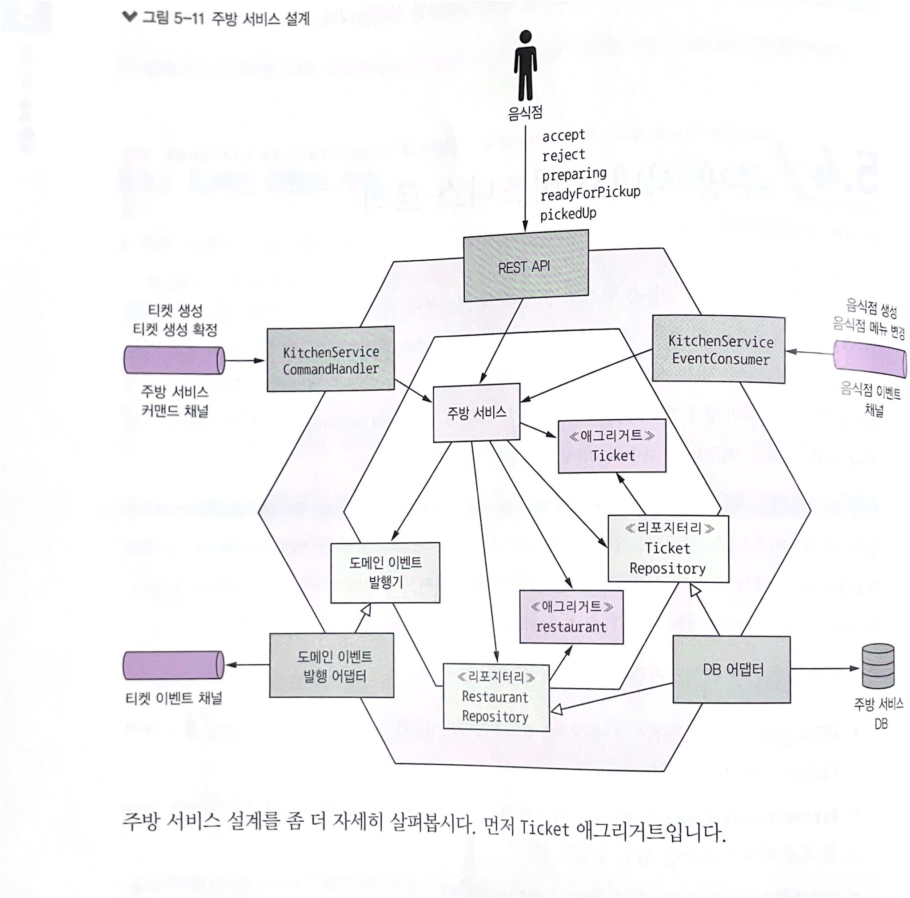
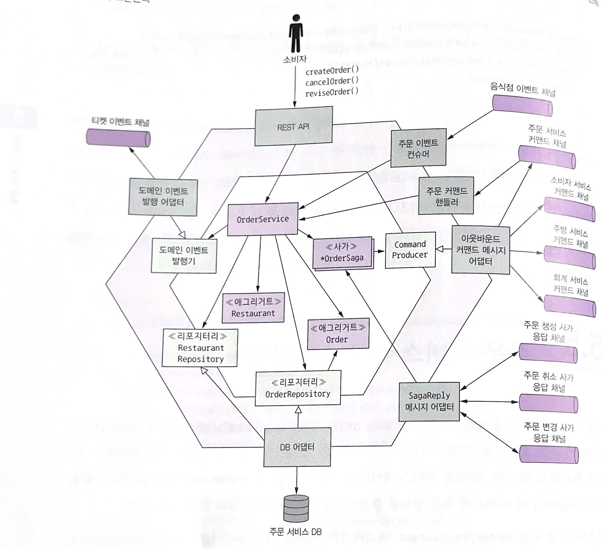
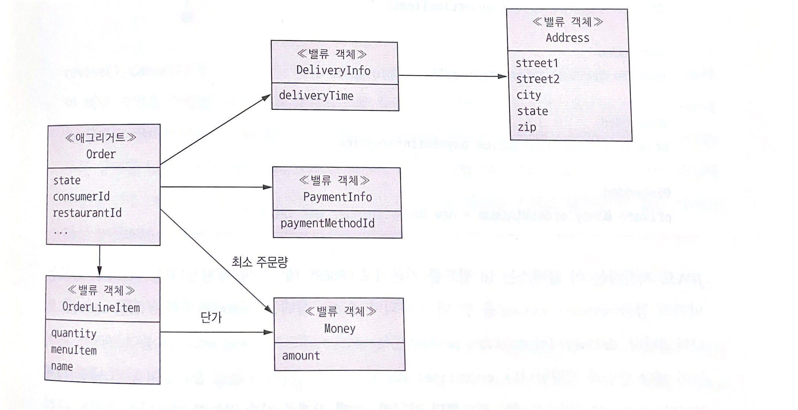
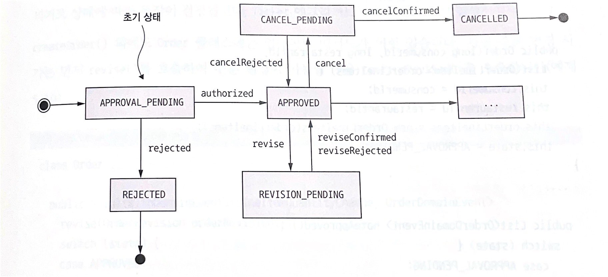

# 5. 비지니스 로직 구성 패턴

> 마이크로서비스 패턴 5장을 정리한 내용입니다

## 비지니스 로직 패턴
* 트랜잭션 스크립트 패턴
    - 간단한 비지니스로직의 경우에 합리적인 경우가 있음
    - 각 클래스는 동작이나, 상태 클래스로 분리되어 구성됨.
    - 로직이 복잡해질수록 유지보수가 힘들어지는 단점이 존재

* 도메인 모델 패턴
    - 비지니스 로직이 복잡해질 수록 유지보수하기 용이함.
    - 클래스 구성, 설계 난이도가 높음.
    - 대부분의 클래스는 동작 / 상태로 구성 됨

### 객체 지향의 장점
- 작은 책임을 갖는 여러 클래스 구성으로 설계를 이해/관리하기 쉽다.
- 독립적으로 테스트하기가 용이하다.
- 잘 알려진 설계패턴을 응용할 수 있기 때문에 확장하기 쉽다.

## 도메인 주도 설계
- 하위도메인과 경계 컨텍스트 개념은 양대 전략
- 구성
    - 엔터티(entity): 영속적 신원을 가진 객체, 속성이 동일해도 다른 객체 (ex: jpa @Entity)
    - 밸류 객체(value object): 속성이 동일하다면 호환 가능
    - 팩토리(factory): 일반 생성자로 만들기 복잡한 객체를 생성하는 객체, 구현체를 감출 수 있으며, static 메소드로 구현 가능
    - 리포지터리(repository): 엔티티를 저장하는 db 접근 객체
    - 서비스(service): entity, value object에 속하지 않는 비지니스 로직 객체

### 애그리거트 패턴

> Order의 비지니스 객체의 경계는 어디까지인가? 


* 규칙
    * 루트를 참조하라
        * 데이터 일관성을 루트 레퍼런스를 이용해서 지킬 수 있다.(예: orderLine을 직접 수정해버리면, 일관성이 깨짐)
    * 기본키를 통해 참조하라
        * 애그리거트간 결합이 느슨해지고, 여러 서비스에 걸친 객체도 문제 없음.
        * 애그리거트가 저장단위이므로 로직도 간단하고, NOSQL을 이용하기 용이함 (예: 샤딩)
    * 하나의 트랜잭션으로 하나의 애그리거트만 생성/수정 한다.
        * 일관성 유지를 위해서 서비스 내 애그리거트는 하나의 트랜잭션으로 병합 (단, NOSQL db는 지원을 안할 수 있음)    

* 크기
    * 크기가 작을수록 동시성 처리가 늘고, 확장성이 좋아진다.
    * 애그리거트는 트랜잭션 범위이기 때문에, 원자적으로 변경사항이 적용되어야하는 경계이다.
    * 애그리거트 규모가 클수록, 마이크로서비스로의 분해가 어렵다.

### 도메인 이벤트
* 구성
    * 원시값 혹은 밸류 객체(value object)로 구성
    * 그 외 변경 사용자 정보, 이벤트 ID, timestamp 메타데이터도 포함
    * 메타데이터는 상위 클래스의 일부이거나, 이벤트를 감싼 래퍼클래스의 일부이다.
    
* 상태변경을 추적해야하는 다른 서비스 혹은 컴포넌트를 위해 이벤트 발행
    * 코레오그래피 사가를 이용해서 여러 서비스에 걸쳐 데이터 일관성 유지
    * 레플리카를 둔 서비스에 소스 데이터가 변경됨을 알림

* 이벤트 강화
    * 이벤트 컨슈머가 이벤트 상세정보를 중복 조회하지 않도록, 필요 정보를 이벤트에 함께 전달(예: 주문, 배달정보)

* 이벤트 식별
    * 도메인 이벤트: `X가 일어나면 Y를 수행하라`
    * 이벤트 스토밍을 통해서 도메인 모델 설계
        * 이벤트 브레인스토밍: 떠오르는 이벤트를 타임라인에 맞도록 `주황색`으로 배치
        * 이벤트 트리거 식별: 각 이벤트를 일으키는 트리거 식별, 트리거는 색으로 구분
            * 사용자 액션
            * 외부 시스템
            * 기타 도메인 이벤트
            * 시간 경과
        * 애그리거트 식별: 이벤트를 발생 시키는 애그리거트를 `노란색`으로 식별
* 이벤트 생성 및 발행
    * 애그리거트 상태가 변경되는 시점에 이벤트도 함께 발행
    * 방식
        * 상태 변경 메소드는 발행 이벤트를 리턴        
        * 애그리거트루트 부모객체(AbstractAggregateRoot)에 발행 이벤트를 모아서 발행
    * 발행 방법
        * 트랜잭션 일부분으로 이벤트를 기록한 뒤(예: OUTBOX 테이블), 메세지 브로커에게 이벤트 발행
            ```java
            // 이벤추에이트 트램 인터페이스
            public interface DomainEventPublisher {
                void publish(String aggregateType, Object aggregateId, List<DomainEvent> domainEvents);
            }
            ```
        * 발행 event의 type safe를 위해, 추상/제네릭 클래스 이용하는 방식 가능
            ```java
            public abstract class AbstractAggregateDomainEventPublisher<A, E extends DomainEvent> {
                // type safe한 이벤트 발행
                public void publish(A aggregate,List<E> events) {
                    ...
                }
            }
            ```
* 이벤트 소비
    * 메세지 브로커에 발행된 이벤트를 직접 소비하거나, 프레임워크에서 제공하는 고수준 api를 이용해도 좋다.

### 주방 서비스 비즈니스 로직
* 메인 애그리거트
    * Ticket(주문메뉴)
    * Restaurant(메뉴 및 운영시간으로 주문검증)
* 비지니스 진입점(KitchenService): Ticket, Restaurant 생성 / 수정
* Ticket, Restaurant Repository: Ticket, Restaurant 애그리거트 db 저장
* 인바운드 어댑터
    * REST: ui 호출
    * KitchenServiceCommandHandler: 사가가 호출하는 비동기 요청/응답
    * KitchenServiceEventConsumer: RestaurantService가 발행한 이벤트 구독
* 아웃바운드
    * DB 어댑터: DB에 애그리거트 저장
    * DomainEventPublisherAdapter : Ticket 도메인 이벤트 발행


#### Ticket 애그리거트
* Ticket 클래스

    음식점 주방관점에서 바라본 주문: 신원, 배달정보 소비자 관련정보 없이, 배달원이 픽업할 주문에만 집중
    ```java
    public class Ticket {
        private Long id;
        private TicketState state;
        private Long restaurantId;              // 기본키 참조
        private List<TicketLineItem> lineItems; // 주문 내역
        private LocalDateTime readyBy;          // 픽업 완료 예상 시간
        ...

        // 주문 상태 업데이트
        // 생성: 정적 팩토리 메소드
        public static ResultWithAggregateEvents<Ticket,TicketDomainEvent> create(long restaurantId, Long id, TicketDetails details);
        // 접수
        public List<TicketAccepted> accept(LocalDateTime readBy);
        // 준비
        public List<TicketPreparationStartedEvent> preparing();
        // 취소
        public List<TicketDomainEvent> cancel();
    }
    ```
* KitchenService 도메인 서비스
    
    인바운드 어댑터를 통해서 호출
    ```java
    public class KitchenService {
        private TicketRepository ticketRepository;
        private TicketDomainEventPublisher domainEventPublisher;

        public void accept(long ticketId, LocalDateTime readyBy) {
            Ticket ticket = ticketRepository.findById(ticketId)
            .orElseThrow(()-> new TicketNotFoundException(ticketId));
            // 애그리거트 상태 변경
            List<TicketDomainEvent> events = ticket.accept(readBy);
            // 이벤트 발행
            domainEventPublisher.publish(ticket,events);
        }
    }
    ```

* KitchenServiceCommandHandler 클래스

    주문 서비스에 구현된 사가가 전송한 커맨드 메세지를 처리하는 어댑터
    ```java
    public class KitchenServiceCommandHandler {
        private KitchenService kitchenService;

        // 커맨드 메세지를 핸들러로 매핑
        public CommandHandlers commandHandlers() {
            return SagaCommandHandlersBuilder
            .fromChannel(KitchenServiceChannels.kitchenServiceChannel)
            .onMessage(CreateTicket.class, this::createTicket)
            .onMessage(ConfirmCreateTicket.class, this::confirmCreateTicket)
            ...
            .build();
        }

        private Message createTicket(CommandMessage<CreateTicket> cm) {
            CreateTicket command = cm.getCommand();
            long restaurantId = command.getRestaurantId();
            Long ticketId = command.getOrderId();
            TicketDetails details = command.getTicketDetails();
            
            try {
                // ticket 애그리거트 생성
                Ticket ticket = kitchenService.createTicket(restaurantId, ticketId, ticketDetails);
                CreateTicketReply reply = new CreateTicketReply(ticket.getId());
                // 커맨드 응답
                return withSuccess(reply)
            } catch(RestaurantDetailsVerificationException e) {
                return withFailure();
            }
        }
    }
    ```

### 주문 서비스 비지니스 로직
* 인바운드 어댑터
    * REST: ui 호출
    * OrderEventConsumer: `음식점 서비스 발행 이벤트 구독`, 레플리카 생성/수정
    * OrderCommandHandler: `사가가 호출`하는 비동기 요청/응답 api
    * SagaReplyAdapter: `사가 응답채널` 구독 / 사가 호출
* 아웃바운드 어댑터
    * DB: db 저장
    * DomainEventPublishingAdapter: `Order 이벤트` 발행
    * OutboundcommandMessageAdapter: 사가 참여자에게 `커맨드 메세지` 전송




#### Order 애그리거트



* 필드
    ```java
    @Entity
    public class Order {
        private Long id;
        private Long version;       // 낙관적 잠금
        private OrderState state;
        private Long consumerId;    // pk 참조
        private Long restaurantId;  // pk 참조
        
        @Embedded
        private DeliveryInformation deliveryInformation;
        private OrderLineItems orderLinItems;
        private PaymentInformation paymentInformation;
        private Money orderMinimum = new Money(Integer.MAX_VALUE);
    }
    ```



* 상태기계
    ```java
    public class Order {
        public static ResultWithDomainEvents<Order,OrderDomainEvent> createOrder(long consumerId, Restaurant restaurant, List<OrderLineItem> orderLineItems) {
            // 애그리거트 생성
            Order order = new Order(...);
            // event 생성
            List<OrderDomainEvent> events = singletonList(new OrderCreatedEvent(...));
            // 애그리거트, event 반환
            return ResultWithDomainEvents<>(order,events);
        }

        // create saga 소비자 신용카드 승인까지 성공한 경우 호출
        public List<OrderDomainEvent> noteApproved() {
            switch(state) {
                case APPROVAL_PENDING:
                    this.state = APPROVED;
                    return singletonList(new OrderAuthorized());
                default:
                // 이외 상태인경우 error
                throw error
            }
        }

        // create saga 서비스 실패 시
        public List<OrderDomainEvent> noteRejected() {
            ...
        }

        public ResultWithDomainEvents<LineItemQuantityChange, OrderDomainEvent> revise(OrderRevision orderRevision) {
            switch(state) {
                case APPROVED:
                    change order state to revised state 
                    // 상태 변경시 재검증
                    if change is lower than minimum
                        throw error
                    state moved "revision_pending"
                    return event
                default:
                    // 이외 상태 인 경우 error
                    throw error
            }
        }
    }
    ```

#### OrderService 
```java
    public class OrderService {
        // DI 
        private OrderRepository orderRepository;
        private SagaManager<CreateOrderSagaState> createOrderSagaManager;
        private SagaManager<ReviseOrderSagaState> reviseOrderSagaManager;
        private OrderDomainEventPublisher orderAggregateEventPublisher;

        // create order
        public Order createOrder(long consumerId, long restaurantId, List<MenuItemIdAndQuantity> lineItmes) {
            check if exists restaurant
            create orderAggregate
            save order to db
            ordercreated event publish
            create createOrderSaga data
            create createOrderSaga 
        }
        // revise order
        public Order reviseOrder(long orderId, OrderRevision revision) {
            find order by id
            create reviseOrderSaga data
            create reviseOrderSaga
        }
    }
```


### 요약
* 비지니스로직이 간편하다면 `트랜잭션 스크립트 패턴`, 복잡하다면 `객체 지향적 도메인 모델 패턴`
* 비지니스 로직은 DDD 애그리거트들로 모듈화하여, 전체 ACID 트랜잭션을 서비스 내부에 국한 시킨다.
* 애그리거트의 생성/수정 시 타 서비스와 이벤트를 주고 받는다.

### 참고
* 절차 지향적, 객체지향적 : https://live-everyday.tistory.com/236
* optimistic lock : https://en.wikipedia.org/wiki/Concurrency_control#Categories


    

        


