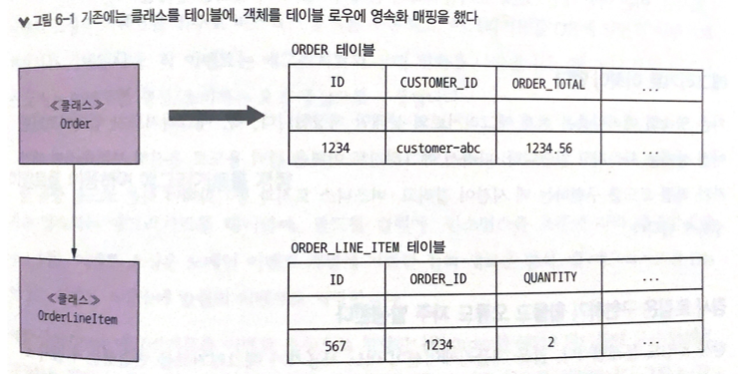
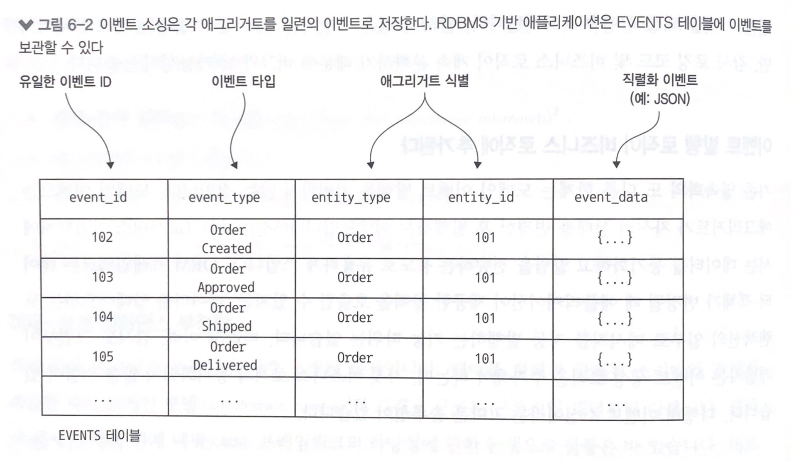
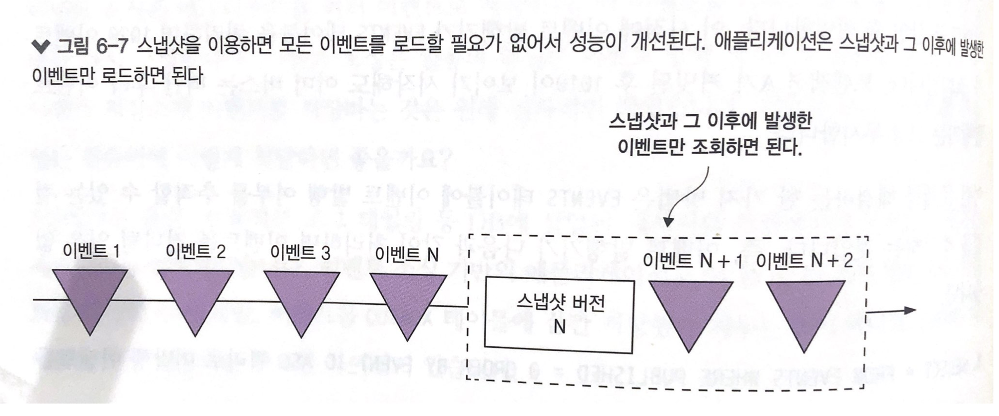
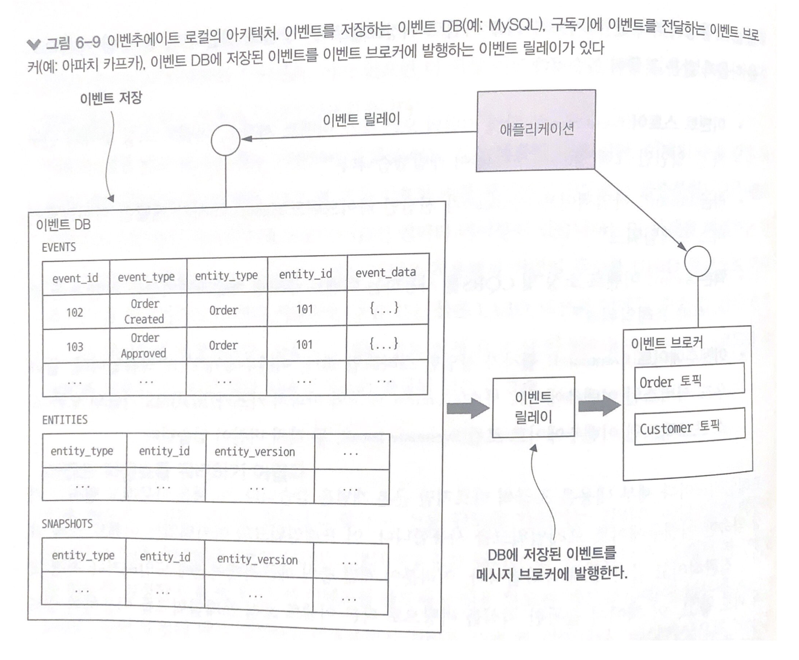
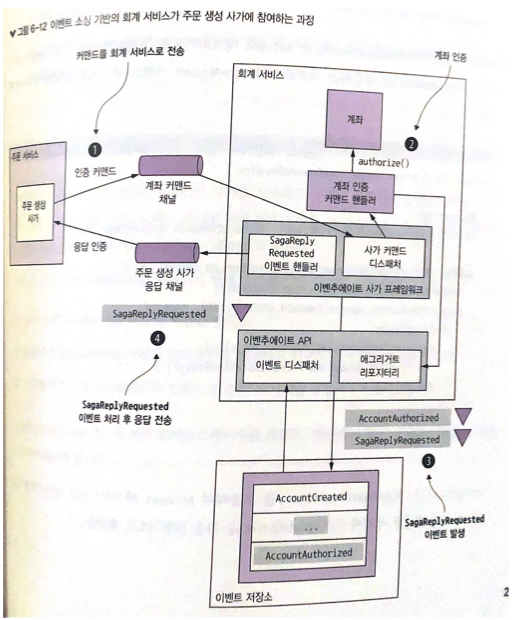
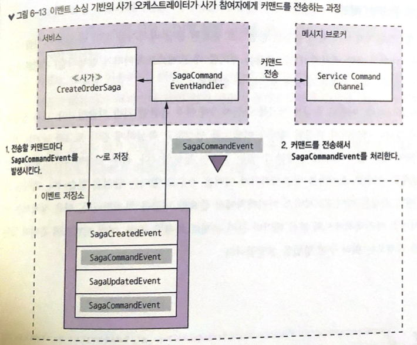

# 6장 비즈니스 로직 개발: 이벤트 소싱

> 6장을 요약한 내용입니다
>

- 혹시라도 이벤트 발행 로직이 오류를 양산하는 공장이 되지는 않을까 걱정이다
- 애그리거트의 상태를 시작/변경하는 각 애그리거트의 메서드가 이벤트 목록을 반환하면 도메인 서비스는 이 이벤트를 발행한다
- 다른 한편으로는 이벤트 발행 로직이 비즈니스 로직에 추가되기 때문에 개발자가 실수로 이벤트 발행 로직을 빠뜨려도 비즈니스 로직은 그냥 흘러갈 것이다
- 이벤트를 발행하는 것이 버그의 원천이 되지는 않을지 염려가 된다
- 예전에는 모든 변경 이력을 애그리거트에 고스란히 보존하는 이벤트 소싱에 여러모로 매력을 느꼈지만 뚜렷한 확신은 없었다
- 이벤트 소싱을 잘 활용하면 애그리거트가 생성/수정될 때마다 무조건 이벤트를 발행해서 프로그래밍 오류를 제거할 수 있다
- 이 장은 이벤트 소싱의 작동 원리를 살펴보고, 이벤트 소싱을 이용하여 비즈니스 로직을 작성하는 방법을 살펴보자

# 이벤트 소싱 응용 비즈니스 로직 개발

- 이벤트 소싱은 비즈니스 로직을 구성하고 애그리거트를 저장하는 또 다른 방법이다

## 이벤트 소싱은 여러모로 좋은 점이 많다

- 애그리거트 이력이 보존되므로 감사/통계 용도로도 가치가 있다
- 도메인 이벤트를 확실하게 발행할 수 있어서 MSA에 유용하다

## 물론 단점도 있다

- 비즈니스 로직을 작성하는 방법이 특이해서 어느 정도 학습 시간이 필요하다
- 이벤트 저장소를 쿼리하기가 쉽지 않아 CQRS 패턴을 적용해야 한다

# 기존 영속화의 문제점

- 클래스는 DB 테이블에, 클래스 필드는 테이블 컬럼에, 클래스 인스턴스는 테이블 각 로우에 매핑 하는 것이 기존 영속화 방식이다



## 이는 작동은 잘 되지만, 다음과 같은 단점 및 한계가 있다

- 객체-관계 임피던스 부정합
- 애그리거트 이력이 없다
- 감사 로깅을 구현하기가 번거롭고 에러가 잘 난다
- 이벤트 발행 로직이 비즈니스 로직에 추가된다

# 이벤트 소싱 개요

- 이벤트 소싱은 이벤트를 위주로 비즈니스 로직을 구현하고, 애그리거트를 DB에 일련의 이벤트로 저장하는 기법이다
- 각 이벤트는 애그리거트의 상태 변화를 나타낸다

## 이벤트를 이용하여 애그리거트를 저장

- 이벤트 소싱은 애그리거트를 DB에 있는 이벤트 저장소에 일련의 이벤트로 저장한다



- 애그리거트를 로드할 때 이벤트 저장소에서 이벤트를 가져와 재연을 하는데, 구체적으로 이 작업은 다음 3단계로 구성된다
    1. 애그리거트의 이벤트를 로드한다
    2. 기본 생성자를 호출하여 애그리거트 인스턴스를 생성한다
    3. 이벤트를 하나씩 순회하며 apply()를 호출한다


## 애그리거트 메서드의 관심사는 오직 이벤트

- 이벤트를 발생시켜 적용하려면 비즈니스 로직을 다시 구성해야 한다
- 이벤추에이트 클라이언트라는 이벤트 소싱 프레임워크에서는 이런 메서드를 process()와 apply()라고 명명한다
- process()는 업데이트 요청 값이 담긴 커맨드 객체를 매개변수로 받아 이벤트 목록을 반환하는 메서드이다
- apply()는 이벤트를 매개변수로 받아 void를 반환하는 메서드이다
- 애그리거트는 각 커맨드 클래스마다 하나의 process()와 애그리거트가 발생시킨 이벤트 타입마다 하나의 apply()를 여러 가지 버전으로 오버로드하여 정의한다

## 이벤트 소싱 기반의 Order 애그리거트

- createOrder(), revise()처럼 JPA 기반의 애그리거트를 생성/수정하는 메서드가 이벤트 소싱 기반 코드에서는 모두 process(), apply()로 대체된다
- 팩토리 메서드 createOrder()는 process(), apply()로 바뀌었다
- process()는 CreateOrderCommand를 받아 OrderCreatedEvent를 발생시키고, apply()는 OrderCreatedEvent를 받아 Order의 각 필드를 초기화한다

```jsx
public class Order {
	...
	public List<Event> process(CreateOrderCommand command) { // 커맨드 검증 후 OrderCreatedEvent 반환
		// 커맨드 검증
		return events(new OrderCreatedEvent(command.getOrderDetails()));
	}

	public void apply(OrderCreatedEvent event) { // Order 필드를 초기화해서 OrderCreatedEvent 적용
		OrderDetails orderDetails = event.getOrderDetails();
		...
	}

	public List<Event> process(ReviseOrder command) {
		// 변경 가능한 Order인지, 변경 주문 수량이 최소 주문량 이상인지 확인
		OrderRevision orderRevision = command.getOrderRevision();

		...
		switch (state) {
			...
		}
		return singletonList(new OrderRevisionProposed(...));
	}

	public void apply(OrderRevisionProposed event) { // Order를 REVISION_PENDING 상태로 변경
		this.state = REVISION_PENDING;
	}

	public List<Event> process(ConfirmReviseOrder command) {
		// 확정 가능한 변경 건인지 확인 후 OrderRevised 이벤트 반환
		swicth (state) { ... }
		return singleonList(new OrderRevised(...));
	}

	public void apply(OrderRevised event) {
		// Order 변경
		OrderRevision orderRevision = event.getOrderRevision();
		...
		this.state = APPROVED;
	}

}
```

### 동시 업데이트: 낙관적 잠금

- 기존 영속화 메커니즘은 대개 한 트랜잭션이 다른 트랜잭션의 변경을 덮어 쓰지 못하게 낙관적 잠금을 하여 처리한다
- 즉, 애그리거트 루트를 VERSION 컬럼이 있는 테이블에 매핑하고 애그리거트가 업데이트될 때마다 UPDATE 문으로 값을 하나씩 증가한다
- 두 트랜잭션이 같은 애그리거트를 읽는다면 첫 번째 트랜잭션은 성공적으로 애그리거트를 업데이트하고, 두 번째 트랜잭션은 그 사이 버전 번호가 바뀌었으니 실패한다
- 이벤트 저장소 역시 낙관적 잠금 기법으로 동시 업데이트를 처리할 수 있다

# 이벤트 소싱과 이벤트 발행

- 저장된 모든 이벤트를 관심있는 컨슈머에 어떻게 전달하면 좋을까?

## 이벤트 발행: 폴링

- 이벤트를 EVENTS 테이블에 저장한다고 가정하면 어느 이벤트가 새 이벤트인지 분간하는게 문제이다
- 만약 EVENT_ID가 단순히 1만큼 증가하면, 이벤트 발행기가 자신이 처리한 마지막 EVENT_ID를 기록하면 된다
- 그러나 트랜잭션이 이벤트를 발생시키는 순서와 다르게 커밋할 수 있다는 점이 문제이다


- 이런 문제를 해결하는 한 가지 방법은 EVENTS 테이블에 이벤트 발행 여부를 추적할 수 있는 컬럼을 추가하는 것이다
- 이벤트 발행기가 다음과 같이 처리하면 이벤트를 건너뛸 일은 없을것이다
    1. SELECT * FROM EVENTS WHERE PUBLISHED = 0 쿼리로 미발행 이벤트를 검색한다
    2. 메시지 브로커에 이벤트를 발행한다
    3. UPDATE EVENTS SET PUBLISHED = 1 WHERE EVENT_ID = ? 쿼리로 이벤트가 발행된 것으로 표시한다


## 스냅샷으로 성능 개선

- Order 애그리거트는 상태 전이가 별로 없는 편이라 이벤트가 많지 않다
- 이런 이벤트는 이벤트 저장소를 쿼리해서 Order 애그리거트를 재구성하는 것이 효율적이다
- 하지만 Account 애그리거트처럼 수명이 긴 애그리거트는 이벤트 수가 꽤 많아서 일일이 로드/폴드하기가 만만찮다
- 그래서 주기적으로 애그리거트 상태의 스냅샷을 저장한다



- 스냅샷 버전이 N이면 N + 1 이후에 발생한 이벤트 2개만 가져오면 애그리거트 상태를 되살릴 수 있다

# 도메인 이벤트 발전시키기

- 이벤트 소싱은 적어도 개념적으로는 이벤트를 영구 저장하지만 사실 이것은 양날의 검과 같다
- 정확성을 담보로 변경 감사 로그를 제공하여 애플리케이션이 애그리거트 상태를 온전히 재구성 할 수 있다
- 반면 이벤트 구조는 시간이 흐름에 따라 계속 달라지기 때문에 새로운 문제가 생기게 마련이다
- 우선 이벤트가 어떤 경로를 거쳐 변경되는지 알아보고, 가장 흔히 사용하는 변경 처리 방법을 알아보자

## 이벤트 소싱의 장점

- 도메인 이벤트를 확실하게 발행한다
- 애그리거트 이력이 보존된다
- O/R 임피던스 불일치 문제를 대부분 방지할 수 있다
- 개발자에게 타임 머신을 제공한다

## 이벤트 소싱의 단점

- 새로운 프로그래밍 모델을 배우는 데 시간이 걸린다
- 메시징 기반 애플리케이션은 복잡하다
- 이벤트를 개량하기가 까다로운 편이다
- 데이터를 삭제하기가 어렵다
- 이벤트 저장소를 쿼리하기가 만만찮다

# 이벤추에이트 로컬 이벤트 저장소의 작동 원리



- 이벤추에이트 로컬은 오픈 소스 이벤트 저장소이다
- 애플리케이션은 애그리거트 이벤트를 기본키로 조회/삽입하고 아파치 카프카 등의 메시지 브로커에서 이벤트를 가져와 소비한다
- 이벤트 DB는 세 테이블로 구성된다
    - events : 이벤트를 저장
    - entities :  엔티티당 로우 하나
        - 엔터티별 현재 버전을 저장한다. 낙관적 잠금을 구현하는 용도로 쓰인다
        - 엔터티가 새성되면 이 테이블에 한 로우가 삽입되고, 엔터티가 업데이트될 때마다 entity_version 컬럼도 업데이트된다
    - snapshots : 스냅샷을 저장


### 이벤추에이트 로컬 이벤트 릴레이 이벤트를 DB에서 메시지 브로커로 전파

- 이벤트 릴레이는 이벤트 DB에 삽입된 이벤트를 이벤트 브로커로 전파
- MySQL 서버에 접속하여 binlog(MySQL DB의 업데이트 기록)를 읽는다
- EVENTS 테이블에 이벤트가 삽입되면 해당 아파치 카프카 토픽으로 발행된다

## 도메인 이벤트 구독

- 이벤추에이트 클라이언트 프레임워크는 이벤트 핸들러 작성에 필요한 API도 제공한다
- @EventSubscriber로 이벤트를 처리할 스프링빈을 지정한다

```jsx
@EventSubscriber(id="orderServiceEventHandlers")
public class OrderServiceEventHandlers {

	@EventHandlerMethod
	public void creditReserved(EventHandlerContext<CreditReserved> ctx) {
		CreditReserved event = ctx.getEvent();
		...
	}
}
```

# 이벤트 소싱 기반의 사가 참여자 구현

## 커맨드 메시지를 멱등하게 처리

- 커맨드 메시지를 멱등하게 처리하려면 참여자가 중복 메시지를 솎아 낼 수 있는 수단을 마련해야 한다
- 메시지를 처리할 때 생성되는 이벤트에 메시지 ID를 기록하면 처리된 메시지인지 확인할 수 있다

## 응답 메시지를 원자적으로 전송

- 사가 오케스트레이터는 애그리거트가 발생시킨 이벤트를 구독할 수 있지만, 그러면 두 가지 문제가 생긴다
  1. 사가 커맨드가 실제로 애그리거트 상태를 변경하지 않을지도 모른다. 이럴 경우 애그리거트는 이벤트를 발생시키지 않으니 사가 오케스트레이터에는 아무 응답도 전송되지 않는다
  2. 이벤트 소싱을 이용하는 사가 참여자와 그렇지 않은 참여자를 사가 오케스트레이터가 다르게 취급해야 한다. 사가 오케스트레이터가 도메인 이벤트를 수신하려면 자신의 응답 채널뿐만 아니라, 애그리거트의 이벤트 채널도 함께 구독해야 하기 때문이다
- 사가 참여자는 응답 메시지를 직접 보내는 것이 아니라 다음 2단계 프로세스를 거쳐야 한다
  1. 사가 커맨드 핸들러가 애그리거트를 생성/수정할 때, 애그리거트가 발생시킨 진짜 이벤트와 가짜 이벤트 SagaReplyRequested를 모두 이벤트 저장소에 저장한다
  2. SagaReplyRequested 이벤트 핸들러는 이벤트에 포함된 데이터로 응답 메시지를 만들어 사가 오케스트레이터의 응답 채널에 출력한다

## 코레오그래피 사가 구현: 이벤트 소싱

- 이벤트 소싱은 상태 변화를 나타내기 위해 이벤트를 이용하는데, 이벤트를 사가 코레오그래피에 갖다 쓰면 애그리거트는 상태 변화가 없어도 무조건 이벤트를 발생시켜야 한다
- 가령 애그리거트를 업데이트하면 비즈니스 규칙에 위배될 경우, 애그리거트는 반드시 이벤트를 발생시켜 오류를 보고해야 한다
- 더 큰 문제는 사가 참여자가 애그리거트를 생성할 수 없는 경우이다
- 이런 문제가 있어서 조금 더 복잡하지만 오케스트레이션 사가를 구현하는 것이 최선이다



- 그림을 보면 주문 생성 사가와 회계 서비스가 서로 어떻게 소통하는지 알 수 있다
  1. 주문 생성 사가가 계좌 인증 커맨드를 메시징 채널을 통해 회계 서비스로 보낸다. 이벤추에이트 사가 프레임워크의 SagaCommandDispatcher는 AccountingServiceCommandHandler를 호출하여 커맨드 메시지를 처리한다
  2. AccountingServiceCommandHandler는 주어진 Accounting 애그리거트로 커맨드를 전송한다
  3. 애그리거트가 AccountAuthorizedEvent 와 SagaReplyRequestedEvent 두 이벤트를 발생시킨다
  4. SagaReplyRequested 이벤트 핸들러는 주문 생성 사가에 응답 메시지를 전송하여 SagaReplyRequestedEvent를 처리한다

```jsx
public class AccountingServiceCommandHandler {

	@Autowired
	private AggregateRepository<Account, AccountCommand> accountRepository;

	public void authorize(CommandMessage<AuthorizeCommand> cm) {
		AuthorizeCommand command = cm.getCommand();
		accountRepository.update(command.getOrderId(), command,
			replyingTo(cm)
				.catching(AccountDisabledException.class,
					() -> withFailure(new AccountDisabledReply()))
					.build());
		}

    ...
}
```

- authorize()는 AggregateRepository를 호출하여 Account 애그리거트를 업데이트한다
- update()에 전달된 세 번째 인수 UpdateOptions는 다음 표현식으로 계산한다
- UpdateOptions는 다음과 같은 일을 수행하기 위해 update()를 구성한다
  1. 메시지가 꼭 한 번만 처리되도록 메시지 ID를 멱등성 키로 사용한다
  2. 이벤트 저장소에 저장된 이벤트 목록에 가짜 이벤트 SagaReplyRequestedEvent를 추가한다. SagaReplyRequestedEventHandler가 이 가짜 이벤트를 받으면 CreateOrderSaga의 응답 채널로 응답을 보낸다
  3. 애그리거트가 AccountDisabledException을 던질 때 기본 에러 응답 대신 AccountDisabledReply를 전송한다

## 사가 오케스트레이터 구현: 이벤트 소싱

- 다음은 사가 오케스트레이터를 구현하기 전에 고민해야 할 세 가지 설계 이슈이다
  1. 사가 오케스트레이터를 어떻게 저장할 것인가?
  2. 어떻게 오케스트레이터 상태를 원자적으로 변경하고 커맨드 메시지를 전송할 것인가?
  3. 어떻게 사가 오케스트레이터가 정확히 한 번만 메시지를 응답하게 만들 것인가?
- 4장에서는 RDBMS 기반의 사가 오케스트레이터를 배웠고, 이번에도 같은 방법으로 해결할 수 있다

## 커맨드 메시지를 확실하게 전송

- 다음은 어떻게 사가 상태를 원자적으로 업데이트하고 커맨드를 전송하는가 하는 문제이다
- 이벤추에이트 트램 기반의 사가는 오케스트레이터를 업데이트하고 커맨드 메시지를 메시지 테이블에 삽입하는 작업을 한 트랜잭션으로 묶어 수행해야 한다
- 오케스트레이터가 트랜잭션을 보장하기 위해서는 전송할 커맨드를 SagaCommandEvent에 저장하면 해결할 수 있다



### 사가 오케스트레이터는 다음 두 단계로 커맨드를 전송한다
1. 사가 오케스트레이터가 전송하려는 각 커맨드마다 SagaCommandEvent를 발생시킨다. SagaCommandEvent에는 목적지 채널, 커맨드 객체 등 커맨드 전송에 필요한 데이터가 모두 담겨 있다. 이런 이벤트는 이벤트 저장소에 저장된다
2. 이벤트 핸들러는 SagaCommandEvent 처리 후 커맨드 메시지를 목적지 메시지 채널로 보낸다


# 마치며

- 이벤트 소싱은 애그리거트를 일련의 이벤트로 저장하며, 여기서 각 이벤트는 애그리거트의 생성 또는 상태 변화를 나타낸다. 이벤트를 재생하면 특정 애그리거트 상태를 그대로 재생성할 수 있다. 이벤트 소싱 덕분에 도메인 객체의 이력 및 감사 로그를 정확히 남기고 도메인 이벤트를 확실하게 발행할 수 있다
- 스냅샷은 재연해야 할 이벤트 개수를 줄여 성능을 향상시킨다
- 이벤트는 DB와 메시지 브로커를 혼합한 형태인 이벤트 저장소에 저장된다. 서비스가 이벤트를 이벤트 저장소에 저장하면 이벤트 저장소는 이벤트를 구독기에 전달한다
- 이벤추에이트 로컬은 필자가 MySQL 및 아파치 카프카 기반으로 개발한 오픈 소스 이벤트 저장소이다. 개발자는 이벤추에이트 클라이언트 프레임워크를 이용하여 애그리거트 및 이벤트 핸들러를 작성할 수 있다
- 애플리케이션에서 이벤트 재연 시 여러 버전의 이벤트를 처리해야 할 수도 있기 때문에 이벤트 발전을 다루는 일이 관건이다. 따라서 이벤트 저장소에서 이벤트를 가져올 때 최근 버전으로 이벤트를 업그레이드하는 업캐스팅이 좋은 방법이다
- 이벤트 소싱 애플리케이션은 데이터를 삭제하기가 까다롭다. 개인 정보를 삭제하는 애플리케이션에서 유럽 연합 GDPR 등의 규정을 준수하려면 암호화/가명화 등의 기법을 동원해야 한다
- 이벤트 소싱을 이용하면, 이벤트 소싱 기반의 애그리거트가 발행한 이벤트를 리스닝하는 이벤트 핸들러가 서비스에 달려 있기 때문에 코레오그래피 사가를 간단히 구현할 수 있다
- 이벤트 소싱은 사가 오케스트레이터를 구현하기 좋은 수단이다. 덕분에 이벤트 저장소를 배타적으로 사용하는 애플리케이션을 작성할 수 있다

# 참고

- [https://github.com/tongnamuu/SpringEvent](https://github.com/tongnamuu/SpringEvent)
- [https://frost-witch-afb.notion.site/YOUTHCON-21-365e94c3df3443e5b1322520a8b1a2ef?p=e23a6710a5344ebc973bc29c5a8a1193&pm=s](https://www.notion.so/e23a6710a5344ebc973bc29c5a8a1193)
- [https://frost-witch-afb.notion.site/YOUTHCON-22-a18e4511463a416e8befd99993355215](https://www.notion.so/a18e4511463a416e8befd99993355215)
