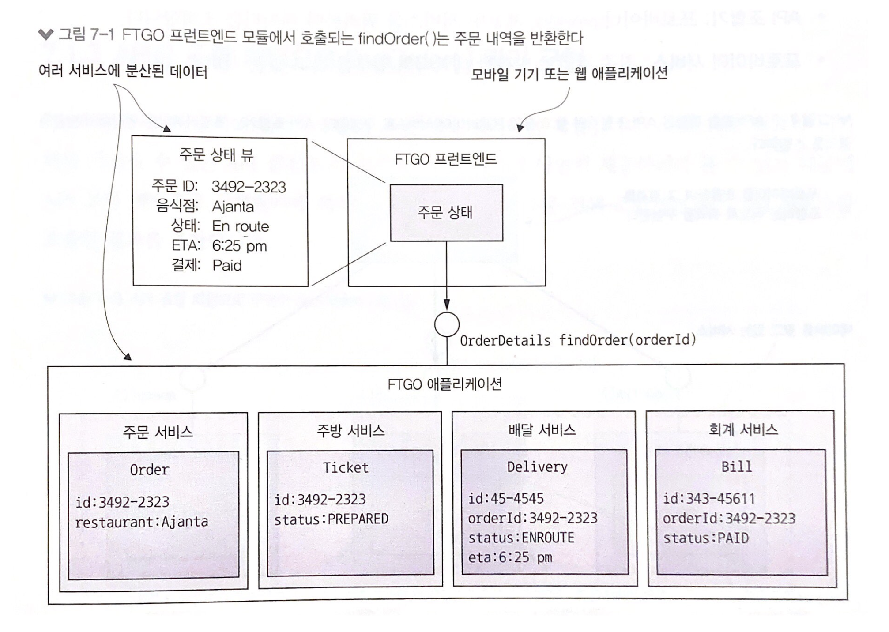
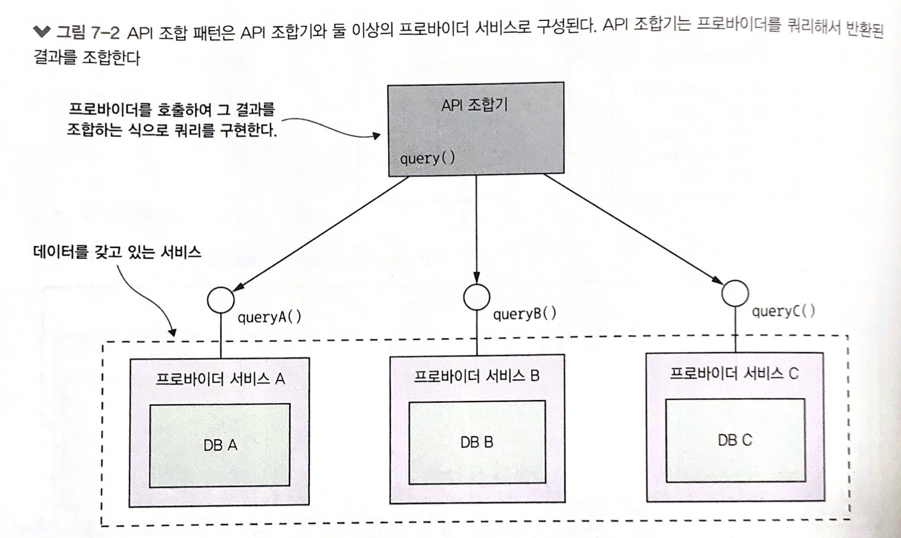
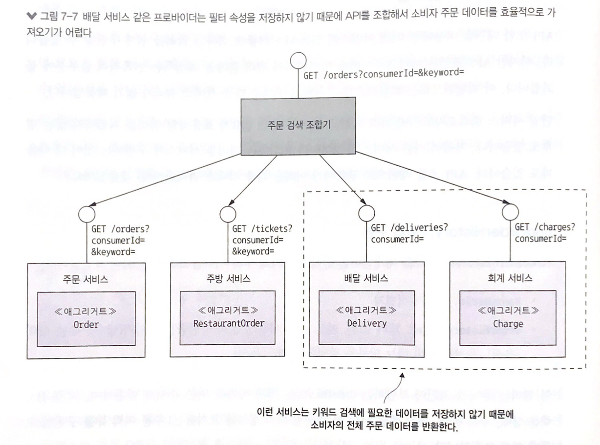
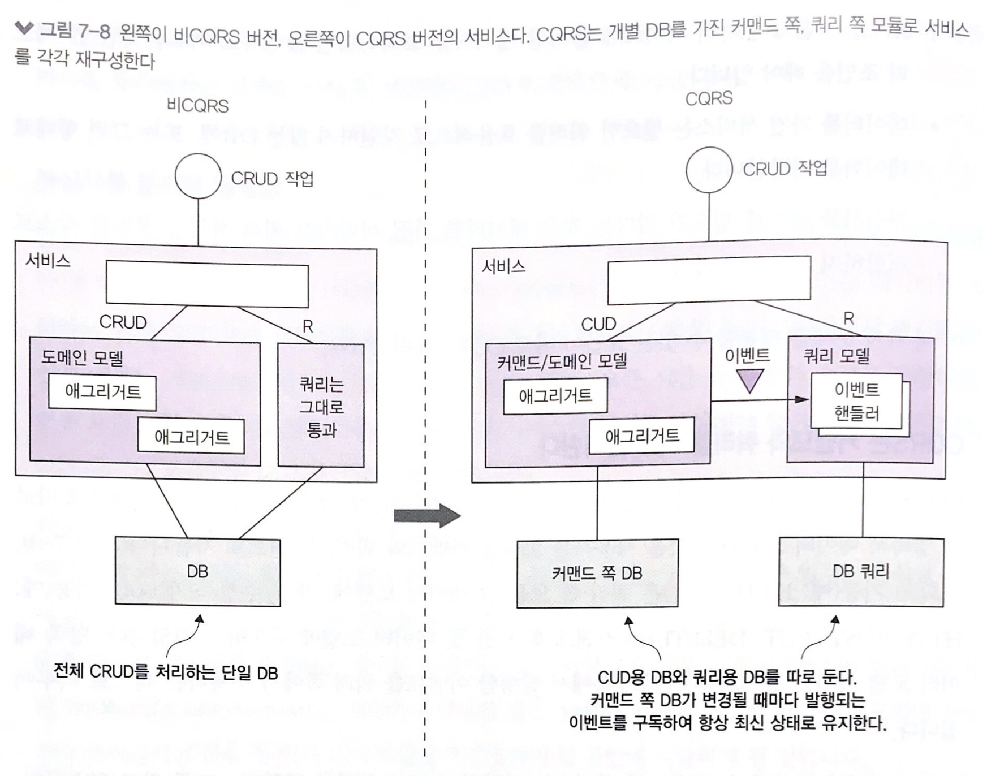
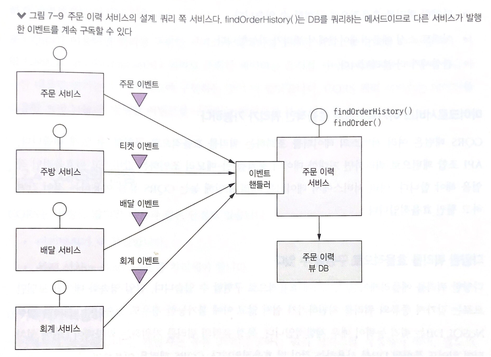

# 7장 마이크로서비스 쿼리 구현

> 7장을 요약한 내용입니다

- 마이크로서비스 아키텍처에서는 여러 서비스에 흩어져 있는 데이터를 반환하는 메서드가 더 많다. 이런 쿼리 작업은 구현하기가 그리 간단하지 않다
- 마이크로서비스 아키텍처에서는 다음 두 가지 패턴으로 쿼리를 구현한다
  - API 조합(composition) 패턴 : 서비스 클라이언트가 데이터를 가진 여러 서비스를 직접 호출하여 그 결과를 조합하는 패턴이다. 가장 단순한 방법으로 가급적 이 방법을 쓰는 것이 좋다
  - CQRS(커맨드 쿼리 책임 분산) 패턴 : 쿼리만 지원하는 하나 이상의 뷰 전용 DB를 유지하는 패턴이다. API 조합 패턴보다 강력한 만큼 구현하기는 더 복잡하다

## API 조합 패턴 응용 쿼리

- findOrder() 메소드를 API 조합 패턴을 이용하여 구현해본다.

### findOrder() 쿼리

- findOrder()는 기본키로 주문 정보를 조회하는 메서드이다. orderId를 매개변수로 받아 주문내역이 포함된 OrderDetails 객체를 반환한다
- 주문 상태 뷰에는 음식점 관점의 주문/지불 등 상태 정보와 배달원의 현재 위치, 배달 예상 시각 등 배달 상태 정보가 표시된다

- 데이터가 여러 서비스에 뿔뿔이 흩어져있다
  - 주문 서비스 : 주문 기본 정보(주문 내역, 주문 상태 등)
  - 주방 서비스 : 음식점 관점의 주문 상태, 픽업 준비까지 예상 소요 시간
  - 배달 서비스 : 주문 배달 상태, 배달 예상 정보, 현재 배달원 위치
  - 회계 서비스 : 주문 지불 상태

### API 조합 패턴 개요

- API 조합 패턴은 데이터를 가진 서비스를 호출한 후 그 반환 결과를 조합해서 가져온다. 이 과정에는 다음 두 종류의 참여자가 개입하게 된다
  - API 조합기 : 프로바이더(provider) 서비스를 쿼리하여 데이터를 조회한다
  - 프로바이더 서비스 : 최종 결과로 반환할 데이터의 일부를 갖고 있는 서비스

- API 조합기는 웹 애플리케이션처럼 웹 페이지에 데이터를 렌더링하는 클라이언트일 수도 있고, 쿼리 작업을 API 끝점으로 표출한 API 게이트웨이나 프론트엔드를 위한 백엔드 패턴(8장의 변형)일 수도 있다

### API 조합 설계 이슈

- 어느 컴포넌트를 쿼리 작업의 API 조합기로 선정할 것인가?
- 어떻게 해야 효율적으로 취합 로직을 작성할 것인가?

#### 누가 API 조합기 역할을 맡을 것인가?

- 첫째, 서비스 클라이언트를 API 조합기로 임명한다
  - 주문 상태 뷰를 구현한 웹 애플리케이션 같은 클라이언트가 동일한 LAN에서 실행 중이라면 가장 효율적으로 주문 내역을 조회할 수 있다
  - 클라이언트가 방화벽 외부에 있고 서비스가 위치한 네트워크가 느리다면 그리 실용적이지 못하다
- 둘째, 애플리케이션의 외부 API가 구현된 API 게이트웨이를 API 조합기로 만든다
  - 쿼리 작업이 애플리케이션의 외부 API 중 일부라면 이 방법이 타당하다
  - 방화벽 외부에서 접근하는 클라이언트가 API 호출 한 번으로 여러 서비스의 데이터를 조회할 수 있기 때문에 효율적이다
- 셋째, API 조합기를 스탠드얼론 서비스로 구현하는 것이다
  - 내부적으로 여러 서비스가 사용하는 쿼리 작업이라면 이 방법이 좋다
  - 취합 로직이 너무 복잡해서 API 게이트웨이 일부로 만들기는 곤란하고 외부에서 접근 가능한 쿼리 작업을 구현할 경우에도 좋은 방법이다
  
#### API 조합기는 리액티브 프로그래밍 모델을 사용해야 한다
 
- 분산 시스템을 개발할 때 지연 시간을 최소화하는 문제는 항상 골칫거리이다
- 주문 검색 애그리거트는 호출 대상인 네 서비스가 서로 의존 관계가 없기 때문에 동시 호출하는 것이 맞다
- 하지만 어떤 프로바이더 서비스를 호출하기 위해 다른 프로바이더 서비스의 결과를 먼저 가져와야 하는 경우도 있다. 이때는 순차 호출해야 한다
- 순차/병렬 서비스 호출이 뒤섞인 실행 로직은 복잡해질 수 있다
- 관리가 용이하고 성능/확장성도 우수한 API 조합기를 작성하려면 리액티브 설계 기법을 동원해야 한다

### API 조합 패턴의 장단점

- 장점
  - 아주 쉽고 단순하게 쿼리 작업을 구현할 수 있게 해준다
- 단점
  - 오버헤드 증가 : 여러 서비스를 호출하고 여러 DB를 쿼리하는 오버헤드는 불가피하다
  - 가용성 저하 우려 : 어떤 작업의 가용성은 더 많은 서비스가 개입할수록 감소한다
    - 특정 프로바이더 서비스가 불능일 경우 API 조합기가 이전에 캐시한 데이터를 반환한다
    - 특정 프로바이더 서비스가 불능일 경우 API 조합기가 여전히 유용한 미완성된 데이터를 반환한다
  - 데이터 일관성 결여 : ACID 트랜잭션과 달리 여러 DB를 대상으로 여러 쿼리를 실행하기 때문에 일관되지 않은 데이터가 반환될 수 있다
- 이런 단점에도 API 조합 패턴은 장점이 너무 명확하다. 효율적으로 구현하기 어려운 쿼리 작업은 CQRS 패턴으로 구현하는 편이 바람직하다

## CQRS 패턴

- 엔터프라이즈 애플리케이션은 대부분 RDBMS나 텍스트 검색 DB(엘라스틱서치) 등을 복합적으로 융합하여 사용한다.
- 이런 의도는 여러 DB의 장점을 최대한 활용하자는 것으로 CQRS는 이런 종류의 아키텍처를 일반화한 것이다

### CQRS의 필요성

- API 조합 패턴으로 구현하기 어려운 다중 서비스 쿼리란?

#### findOrderHistory() 쿼리 구현

- findOrderHistory()는 다음 매개변수를 받아 소비자의 주문 이력을 조회하는 쿼리 작업이다
  - consumerId : 소비자 식별자
  - OrderHistoryFilter : 필터 조건. 어느 시점 이후 주문까지 반환할 것인가(필수), 주문 상태(옵션), 음식점명 및 메뉴 항목을 검색할 키워드(옵션)
- 이 쿼리는 주어진 조건에 부합하는 OrderHistory 객체 목록을 최근 순서로 반환하며, (주문 ID, 주문 상태, 주문 총액, 예상 배달 시각 등 주문별 요약 정보를 표시하는) 주문 이력 뷰를 구현한 모듈에 의해 호출된다
- 겉보기에 findOrderHistory()는 findOrder()와 비슷하지만 단건 주문 정보가 아닌, 다건 주문 목록을 반환하는 차이점이 있다
- API 조합기로 각 프로바이더 서비스에 똑같은 쿼리를 실행한 결과를 조합하면 간단히 구현될 것 같지만, 모든 서비스가 필터/정렬 용도의 속성을 보관하는 것이 아니기 때문에 간단하지 않다
  - 예를 들어 OrderHistoryFilter에는 메뉴 항목과 매치할 keywords라는 속성이 있지만 메뉴 항목을 저장하는 서비스는 주문 서비스, 주방 서비스 2개뿐이고 배달 서비스, 회계 서비스는 메뉴 항목을 저장하지 않아 keywords로 데이터를 필터링 할 수 없다
- API 조합기는 이 문제를 두 가지 방법으로 해결할 수 있다
- 첫째, API 조합기로 데이터를 인-메모리 조인을 한다 

    그러나 거대한 데이터 뭉치를 이런 식으로 API 조합기에서 조인하면 급격히 효율이 떨어질 것이다

- 둘째, API 조합기로 주문 서비스, 주방 서비스에서 데이터를 조회하고, 주문 ID를 이용하여 다른 서비스에 있는 데이터를 요청한다
  - 하지만 이는 해당 서비스가 대량 조회 API를 제공할 경우에만 현실성 있는 방법이다 -> 주문 데이터를 하나하나 요청하는 것은 과도한 네트워크 트래픽 유발

#### 어려운 단일 서비스 쿼리 : findAvailableRestaurants()

- 하나의 서비스에 국한된 쿼리도 구현하기 어려운 경우가 있다
  - 첫째, 데이터를 가진 서비스에 쿼리를 구현하는 것이 부적절한 경우
  - 둘째, 서비스 DB가 효율적인 쿼리를 미지원 하는 경우
- findAvailableRestaurants() 쿼리는 주어진 시점에, 주어진 위치로 배달 가능한 음식점을 검색한다
- 가장 어려운 부분은 효율적으로 지리 공간 쿼리를 수행하는 작업이다
- 이 쿼리를 어떻게 구현할지는 음식점 데이터가 저장된 DB의 능력에 좌우된다. 가령 MongoDB 등의 지리 공간 확장팩을 이용하는 경우 쉽게 구현할 수 있다
- 그러나 사용 중인 DB가 지리 공간 기능을 지원하지 않을 경우 음식점 데이터의 레플리카를 지리 공간 쿼리에 맞게 설계된 형태로 유지해야 한다

#### 관심사를 분리할 필요성

- 데이터를 가진 서비스에 쿼리를 구현하는 것이 부적절한 경우
- findAvailableRestaurants()는 음식점 서비스에 있는 데이터를 조회하는 쿼리 작업이다. 언뜻 보면 음식점 데이터를 가진 음식점 서비스에 쿼리를 구현해야 할 것처럼 느껴지지만, 이는 데이터 소유권만 보고 판단할 문제는 아니다
- 관심사를 어떻게 분리하면 좋을지, 어느 한 서비스에 너무 많은 책임을 부과하지 않으려면 어떻게 해야 할까 하는 문제도 함께 고민해야한다
- 음식점 서비스 개발 팀의 주 임무는 음식점 주인이 자기가 운영하는 음식점을 잘 관리할 수 있게 해주는 서비스를 개발하는 일이지, 성능이 매우 중요한 대용량 데이트를 조회하는 쿼리를 구현하는 일은 아니다
- findAvailableRestaurants() 쿼리는 주문 서비스 개발 팀이 구현하고 음식점 서비스는 검색할 음식점 데이터만 제공하는 구조가 바람직하다

### CQRS 개요

- 마이크로서비스 아키텍처에서는 쿼리를 구현할 때 흔히 다음 세 가지 난관에 봉착한다
  - API를 조합하여 여러 서비스에 흩어진 데이터를 조회하려면 값비싸고 비효율적인 인-메모리 조인을 해야한다.
  - 데이터를 가진 서비스는 필요한 쿼리를 효율적으로 지원하지 않는 DB에, 또는 그런 형태로 데이터를 저장한다
  - 관심사를 분리할 필요가 있다는 것은 데이터를 가진 서비스가 쿼리 작업을 구현할 장소로 적합하지 않다는 뜻이다
- 이 세 가지 문제를 해결할 수 있는 묘안이 바로 CQRS 패턴이다

#### CQRS는 커맨드와 쿼리를 서로 분리한다

- CQRS(커맨드 쿼리 책임 분리)는 이름처럼 관심사의 분리/구분에 관한 패턴이다
- 이 패턴에 따르면 영속적 데이터 모델과 그것을 사용하는 모듈을 커맨드와 쿼리, 두편으로 가른다
- 조회 기능은 쿼리 쪽에, 생성/수정/삭제 기능은 커맨드 쪽에 구현하는 것이다
- 양쪽 데이터 모델 사이의 동기화는 커맨드 쪽에서 발행한 이벤트를 쿼리 쪽에서 구독하는 식으로 이루어진다

#### CQRS와 쿼리 전용 서비스

- CQRS는 서비스 내부에 적용할 수 있을 뿐만 아니라, 이 패턴을 이용하여 쿼리 서비스를 정의하는 것도 가능하다
- 쿼리 서비스에는 커맨드 작업이 전혀 없는 오직 쿼리 작업만으로 구성된 API가 있고, 하나 이상의 다른 서비스가 발행한 이벤트를 구독하여 항상 최신 상태로 유지되는 DB를 쿼리하는 로직이 구현되어 있다
- 쿼리 쪽 서비스는 여러 서비스가 발행한 이벤트를 구독해서 구축된 뷰를 구현하기 좋은 방법이다
- 이런 뷰는 특정 서비스에 종속되지 않기 때문에 스탠드얼론 서비스로 구현하는 것이 타당하다
- findOrderHistory() 쿼리 작업이 구현된 주문 이력 서비스가 좋은 예이다

- 주문 이력 서비스는 여러 서비스가 발행한 이벤트를 구독하고 주문 이력 뷰 DB를 업데이트하는 이벤트 핸들러를 갖고 있다
- 쿼리 서비스는 한 서비스가 가진 데이터를 복제한 뷰를 구현하는 수단으로도 유용하다. 가령 findAvailableRestaurants() 쿼리 작업을 가용 음식점 서비스라는 별도의 쿼리 서비스에 구현할 수 있다
  - 이 서비스는 음식점 서비스가 발행한 이벤트를 구독해서 효율적인 지리 공간 쿼리에 알맞게 설계된 DB를 업데이트한다
- 여러 면에서 CQRS는 RDBMS를 기록 시스템으로 활용하면서 텍스트 검색 엔진을 이용하여 텍스트 검색 쿼리를 처리하는 대중적이 접근 방식을 이벤트를 기반으로 일반화한 것이라고 볼 수 있다
- 다만 CQRS는 텍스트 검색 엔진뿐만 아니라 훨씬 다양한 종류의 DB를 활용할 수 있다는 차이점이 있다. 또 CQRS 쿼리 쪽 뷰는 이벤트를 구독해서 거의 실시간으로 업데이트된다

### CQRS의 장점
