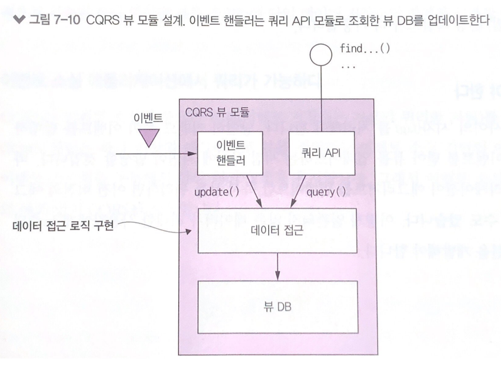
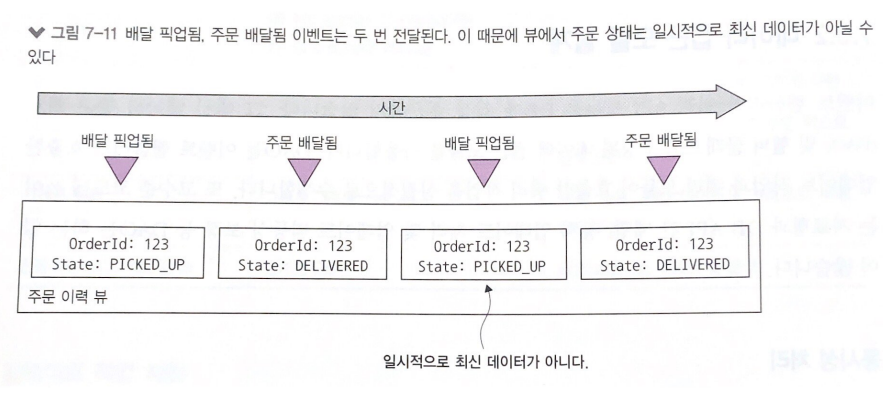
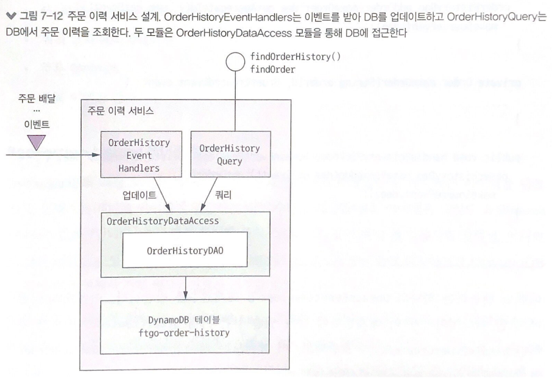
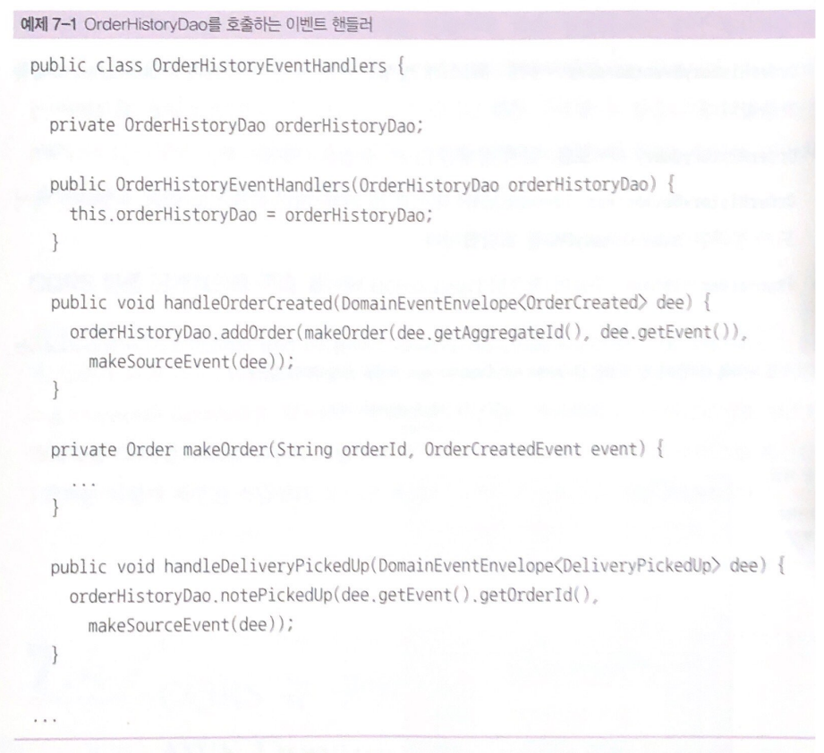
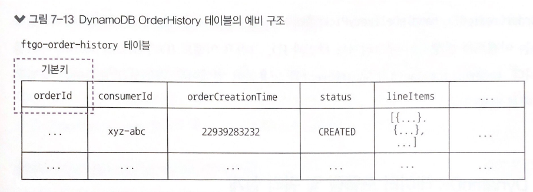
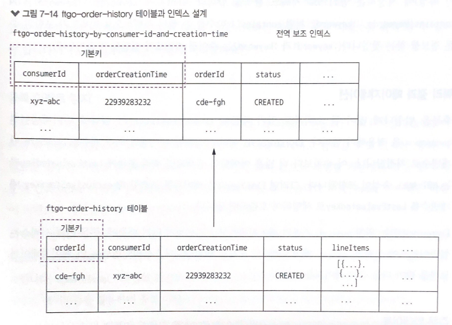
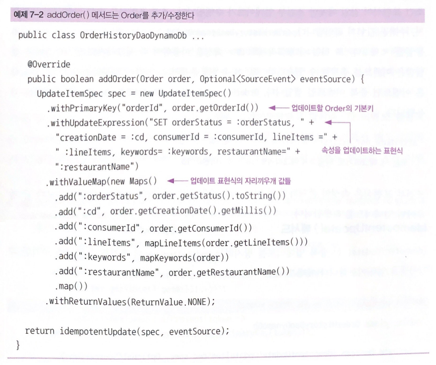
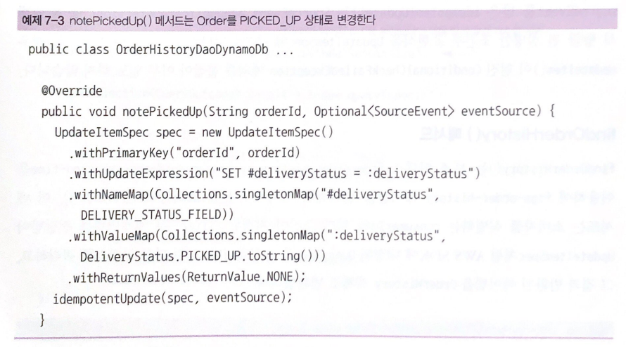
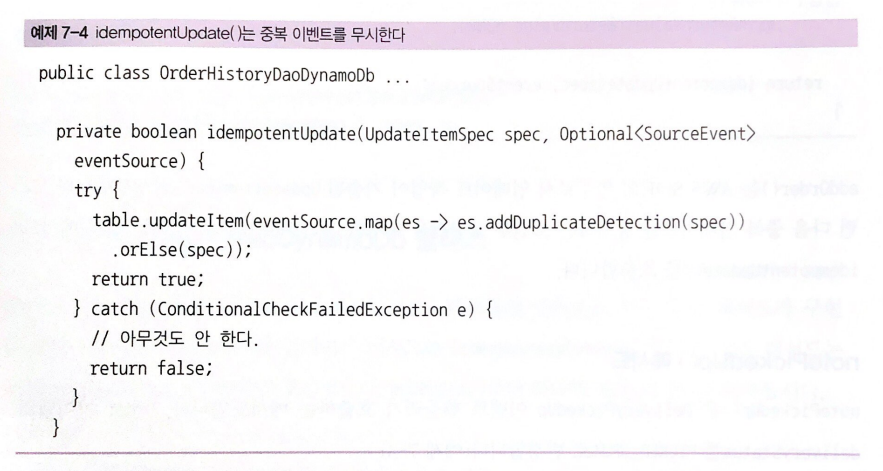
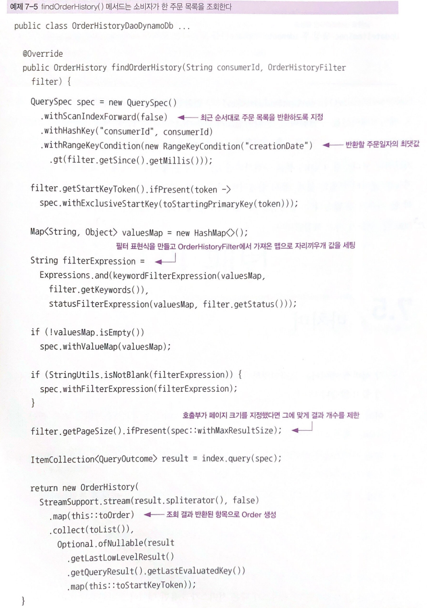

# 7장 마이크로서비스 쿼리 구현

> 7장을 요약한 내용입니다

- 마이크로서비스 아키텍처에서는 여러 서비스에 흩어져 있는 데이터를 반환하는 메서드가 더 많다. 이런 쿼리 작업은 구현하기가 그리 간단하지 않다
- 마이크로서비스 아키텍처에서는 다음 두 가지 패턴으로 쿼리를 구현한다
  - API 조합(composition) 패턴 : 서비스 클라이언트가 데이터를 가진 여러 서비스를 직접 호출하여 그 결과를 조합하는 패턴이다. 가장 단순한 방법으로 가급적 이 방법을 쓰는 것이 좋다
  - CQRS(커맨드 쿼리 책임 분산) 패턴 : 쿼리만 지원하는 하나 이상의 뷰 전용 DB를 유지하는 패턴이다. API 조합 패턴보다 강력한 만큼 구현하기는 더 복잡하다

## API 조합 패턴 응용 쿼리

- findOrder() 메소드를 API 조합 패턴을 이용하여 구현해본다.

### findOrder() 쿼리

- findOrder()는 기본키로 주문 정보를 조회하는 메서드이다. orderId를 매개변수로 받아 주문내역이 포함된 OrderDetails 객체를 반환한다
- 주문 상태 뷰에는 음식점 관점의 주문/지불 등 상태 정보와 배달원의 현재 위치, 배달 예상 시각 등 배달 상태 정보가 표시된다

- 데이터가 여러 서비스에 뿔뿔이 흩어져있다
  - 주문 서비스 : 주문 기본 정보(주문 내역, 주문 상태 등)
  - 주방 서비스 : 음식점 관점의 주문 상태, 픽업 준비까지 예상 소요 시간
  - 배달 서비스 : 주문 배달 상태, 배달 예상 정보, 현재 배달원 위치
  - 회계 서비스 : 주문 지불 상태

### API 조합 패턴 개요

- API 조합 패턴은 데이터를 가진 서비스를 호출한 후 그 반환 결과를 조합해서 가져온다. 이 과정에는 다음 두 종류의 참여자가 개입하게 된다
  - API 조합기 : 프로바이더(provider) 서비스를 쿼리하여 데이터를 조회한다
  - 프로바이더 서비스 : 최종 결과로 반환할 데이터의 일부를 갖고 있는 서비스

- API 조합기는 웹 애플리케이션처럼 웹 페이지에 데이터를 렌더링하는 클라이언트일 수도 있고, 쿼리 작업을 API 끝점으로 표출한 API 게이트웨이나 프론트엔드를 위한 백엔드 패턴(8장의 변형)일 수도 있다

### API 조합 설계 이슈

- 어느 컴포넌트를 쿼리 작업의 API 조합기로 선정할 것인가?
- 어떻게 해야 효율적으로 취합 로직을 작성할 것인가?

#### 누가 API 조합기 역할을 맡을 것인가?

- 첫째, 서비스 클라이언트를 API 조합기로 임명한다
  - 주문 상태 뷰를 구현한 웹 애플리케이션 같은 클라이언트가 동일한 LAN에서 실행 중이라면 가장 효율적으로 주문 내역을 조회할 수 있다
  - 클라이언트가 방화벽 외부에 있고 서비스가 위치한 네트워크가 느리다면 그리 실용적이지 못하다
- 둘째, 애플리케이션의 외부 API가 구현된 API 게이트웨이를 API 조합기로 만든다
  - 쿼리 작업이 애플리케이션의 외부 API 중 일부라면 이 방법이 타당하다
  - 방화벽 외부에서 접근하는 클라이언트가 API 호출 한 번으로 여러 서비스의 데이터를 조회할 수 있기 때문에 효율적이다
- 셋째, API 조합기를 스탠드얼론 서비스로 구현하는 것이다
  - 내부적으로 여러 서비스가 사용하는 쿼리 작업이라면 이 방법이 좋다
  - 취합 로직이 너무 복잡해서 API 게이트웨이 일부로 만들기는 곤란하고 외부에서 접근 가능한 쿼리 작업을 구현할 경우에도 좋은 방법이다
  
#### API 조합기는 리액티브 프로그래밍 모델을 사용해야 한다
 
- 분산 시스템을 개발할 때 지연 시간을 최소화하는 문제는 항상 골칫거리이다
- 주문 검색 애그리거트는 호출 대상인 네 서비스가 서로 의존 관계가 없기 때문에 동시 호출하는 것이 맞다
- 하지만 어떤 프로바이더 서비스를 호출하기 위해 다른 프로바이더 서비스의 결과를 먼저 가져와야 하는 경우도 있다. 이때는 순차 호출해야 한다
- 순차/병렬 서비스 호출이 뒤섞인 실행 로직은 복잡해질 수 있다
- 관리가 용이하고 성능/확장성도 우수한 API 조합기를 작성하려면 리액티브 설계 기법을 동원해야 한다

### API 조합 패턴의 장단점

- 장점
  - 아주 쉽고 단순하게 쿼리 작업을 구현할 수 있게 해준다
- 단점
  - 오버헤드 증가 : 여러 서비스를 호출하고 여러 DB를 쿼리하는 오버헤드는 불가피하다
  - 가용성 저하 우려 : 어떤 작업의 가용성은 더 많은 서비스가 개입할수록 감소한다
    - 특정 프로바이더 서비스가 불능일 경우 API 조합기가 이전에 캐시한 데이터를 반환한다
    - 특정 프로바이더 서비스가 불능일 경우 API 조합기가 여전히 유용한 미완성된 데이터를 반환한다
  - 데이터 일관성 결여 : ACID 트랜잭션과 달리 여러 DB를 대상으로 여러 쿼리를 실행하기 때문에 일관되지 않은 데이터가 반환될 수 있다
- 이런 단점에도 API 조합 패턴은 장점이 너무 명확하다. 효율적으로 구현하기 어려운 쿼리 작업은 CQRS 패턴으로 구현하는 편이 바람직하다

## CQRS 패턴

- 엔터프라이즈 애플리케이션은 대부분 RDBMS나 텍스트 검색 DB(엘라스틱서치) 등을 복합적으로 융합하여 사용한다.
- 이런 의도는 여러 DB의 장점을 최대한 활용하자는 것으로 CQRS는 이런 종류의 아키텍처를 일반화한 것이다

### CQRS의 필요성

- API 조합 패턴으로 구현하기 어려운 다중 서비스 쿼리란?

#### findOrderHistory() 쿼리 구현

- findOrderHistory()는 다음 매개변수를 받아 소비자의 주문 이력을 조회하는 쿼리 작업이다
  - consumerId : 소비자 식별자
  - OrderHistoryFilter : 필터 조건. 어느 시점 이후 주문까지 반환할 것인가(필수), 주문 상태(옵션), 음식점명 및 메뉴 항목을 검색할 키워드(옵션)
- 이 쿼리는 주어진 조건에 부합하는 OrderHistory 객체 목록을 최근 순서로 반환하며, (주문 ID, 주문 상태, 주문 총액, 예상 배달 시각 등 주문별 요약 정보를 표시하는) 주문 이력 뷰를 구현한 모듈에 의해 호출된다
- 겉보기에 findOrderHistory()는 findOrder()와 비슷하지만 단건 주문 정보가 아닌, 다건 주문 목록을 반환하는 차이점이 있다
- API 조합기로 각 프로바이더 서비스에 똑같은 쿼리를 실행한 결과를 조합하면 간단히 구현될 것 같지만, 모든 서비스가 필터/정렬 용도의 속성을 보관하는 것이 아니기 때문에 간단하지 않다
  - 예를 들어 OrderHistoryFilter에는 메뉴 항목과 매치할 keywords라는 속성이 있지만 메뉴 항목을 저장하는 서비스는 주문 서비스, 주방 서비스 2개뿐이고 배달 서비스, 회계 서비스는 메뉴 항목을 저장하지 않아 keywords로 데이터를 필터링 할 수 없다
- API 조합기는 이 문제를 두 가지 방법으로 해결할 수 있다
- 첫째, API 조합기로 데이터를 인-메모리 조인을 한다 

    그러나 거대한 데이터 뭉치를 이런 식으로 API 조합기에서 조인하면 급격히 효율이 떨어질 것이다

- 둘째, API 조합기로 주문 서비스, 주방 서비스에서 데이터를 조회하고, 주문 ID를 이용하여 다른 서비스에 있는 데이터를 요청한다
  - 하지만 이는 해당 서비스가 대량 조회 API를 제공할 경우에만 현실성 있는 방법이다 -> 주문 데이터를 하나하나 요청하는 것은 과도한 네트워크 트래픽 유발

#### 어려운 단일 서비스 쿼리 : findAvailableRestaurants()

- 하나의 서비스에 국한된 쿼리도 구현하기 어려운 경우가 있다
  - 첫째, 데이터를 가진 서비스에 쿼리를 구현하는 것이 부적절한 경우
  - 둘째, 서비스 DB가 효율적인 쿼리를 미지원 하는 경우
- findAvailableRestaurants() 쿼리는 주어진 시점에, 주어진 위치로 배달 가능한 음식점을 검색한다
- 가장 어려운 부분은 효율적으로 지리 공간 쿼리를 수행하는 작업이다
- 이 쿼리를 어떻게 구현할지는 음식점 데이터가 저장된 DB의 능력에 좌우된다. 가령 MongoDB 등의 지리 공간 확장팩을 이용하는 경우 쉽게 구현할 수 있다
- 그러나 사용 중인 DB가 지리 공간 기능을 지원하지 않을 경우 음식점 데이터의 레플리카를 지리 공간 쿼리에 맞게 설계된 형태로 유지해야 한다

#### 관심사를 분리할 필요성

- 데이터를 가진 서비스에 쿼리를 구현하는 것이 부적절한 경우
- findAvailableRestaurants()는 음식점 서비스에 있는 데이터를 조회하는 쿼리 작업이다. 언뜻 보면 음식점 데이터를 가진 음식점 서비스에 쿼리를 구현해야 할 것처럼 느껴지지만, 이는 데이터 소유권만 보고 판단할 문제는 아니다
- 관심사를 어떻게 분리하면 좋을지, 어느 한 서비스에 너무 많은 책임을 부과하지 않으려면 어떻게 해야 할까 하는 문제도 함께 고민해야한다
- 음식점 서비스 개발 팀의 주 임무는 음식점 주인이 자기가 운영하는 음식점을 잘 관리할 수 있게 해주는 서비스를 개발하는 일이지, 성능이 매우 중요한 대용량 데이트를 조회하는 쿼리를 구현하는 일은 아니다
- findAvailableRestaurants() 쿼리는 주문 서비스 개발 팀이 구현하고 음식점 서비스는 검색할 음식점 데이터만 제공하는 구조가 바람직하다

### CQRS 개요

- 마이크로서비스 아키텍처에서는 쿼리를 구현할 때 흔히 다음 세 가지 난관에 봉착한다
  - API를 조합하여 여러 서비스에 흩어진 데이터를 조회하려면 값비싸고 비효율적인 인-메모리 조인을 해야한다.
  - 데이터를 가진 서비스는 필요한 쿼리를 효율적으로 지원하지 않는 DB에, 또는 그런 형태로 데이터를 저장한다
  - 관심사를 분리할 필요가 있다는 것은 데이터를 가진 서비스가 쿼리 작업을 구현할 장소로 적합하지 않다는 뜻이다
- 이 세 가지 문제를 해결할 수 있는 묘안이 바로 CQRS 패턴이다

#### CQRS는 커맨드와 쿼리를 서로 분리한다

- CQRS(커맨드 쿼리 책임 분리)는 이름처럼 관심사의 분리/구분에 관한 패턴이다
- 이 패턴에 따르면 영속적 데이터 모델과 그것을 사용하는 모듈을 커맨드와 쿼리, 두편으로 가른다
- 조회 기능은 쿼리 쪽에, 생성/수정/삭제 기능은 커맨드 쪽에 구현하는 것이다
- 양쪽 데이터 모델 사이의 동기화는 커맨드 쪽에서 발행한 이벤트를 쿼리 쪽에서 구독하는 식으로 이루어진다

#### CQRS와 쿼리 전용 서비스

- CQRS는 서비스 내부에 적용할 수 있을 뿐만 아니라, 이 패턴을 이용하여 쿼리 서비스를 정의하는 것도 가능하다
- 쿼리 서비스에는 커맨드 작업이 전혀 없는 오직 쿼리 작업만으로 구성된 API가 있고, 하나 이상의 다른 서비스가 발행한 이벤트를 구독하여 항상 최신 상태로 유지되는 DB를 쿼리하는 로직이 구현되어 있다
- 쿼리 쪽 서비스는 여러 서비스가 발행한 이벤트를 구독해서 구축된 뷰를 구현하기 좋은 방법이다
- 이런 뷰는 특정 서비스에 종속되지 않기 때문에 스탠드얼론 서비스로 구현하는 것이 타당하다
- findOrderHistory() 쿼리 작업이 구현된 주문 이력 서비스가 좋은 예이다

- 주문 이력 서비스는 여러 서비스가 발행한 이벤트를 구독하고 주문 이력 뷰 DB를 업데이트하는 이벤트 핸들러를 갖고 있다
- 쿼리 서비스는 한 서비스가 가진 데이터를 복제한 뷰를 구현하는 수단으로도 유용하다. 가령 findAvailableRestaurants() 쿼리 작업을 가용 음식점 서비스라는 별도의 쿼리 서비스에 구현할 수 있다
  - 이 서비스는 음식점 서비스가 발행한 이벤트를 구독해서 효율적인 지리 공간 쿼리에 알맞게 설계된 DB를 업데이트한다
- 여러 면에서 CQRS는 RDBMS를 기록 시스템으로 활용하면서 텍스트 검색 엔진을 이용하여 텍스트 검색 쿼리를 처리하는 대중적이 접근 방식을 이벤트를 기반으로 일반화한 것이라고 볼 수 있다
- 다만 CQRS는 텍스트 검색 엔진뿐만 아니라 훨씬 다양한 종류의 DB를 활용할 수 있다는 차이점이 있다. 또 CQRS 쿼리 쪽 뷰는 이벤트를 구독해서 거의 실시간으로 업데이트된다

### CQRS의 장점

#### 마이크로서비스 아키텍처에서 효율적인 쿼리가 가능하다
- CQRS 패턴은 여러 서비스의 데이터를 조회하는 쿼리를 효율적으로 구현할 수 있게 해준다. 여러 서비스에서 데이터를 미리 조인해 놓는 CQRS 뷰를 이용하는 것이 간편하고 효율적이다

#### 다양한 쿼리를 효율적으로 구현할 수 있다
- CQRS 패턴을 이용하면 각 쿼리가 효율적으로 구현된 하나 이상의 뷰를 정의하여 단일 데이터 저장소의 한계를 극복할 수 있다

#### 이벤트 소싱 애플리케이션에서 쿼리가 가능하다
- CQRS 패턴은 하나 이상의 애그리거트 뷰를 정의하고 이벤트 소싱 기반의 애그리거트가 발행한 이벤트 스트림을 구독해서 항상 최신 상태를 유지한다. 그래서 이벤트 소싱 애플리케이션은 거의 예외없이 CQRS를 사용한다

#### 관심사가 더 분리된다
- CQRS 패턴은 서비스의 커맨드 쪽, 쿼리 쪽에 각각 알맞은 코드 모듈과 DB 스키마를 별도로 정의한다. 이렇게 관심사를 분리하면 커맨드/쿼리 양쪽 모두 관리하기 간편해지는 이점이 있다
- 쿼리를 구현한 서비스와 데이터를 소유한 서비스를 달리할 수 있다. CQRS 쿼리 서비스는 데이터를 소유한 서비스가 발행한 이벤트를 구독하는 방식으로 뷰를 관리한다

### CQRS의 단점

#### 아키텍처가 복잡하다
- 개발자는 뷰를 조회/수정하는 쿼리 서비스를 작성해야 하며, 별도의 데이터 저장소를 관리해야 하는 운영 복잡도 역시 가중된다. 종류가 다양한 DB를 사용하는 애플리케이션이라면 개발/운영 복잡도가 더 가중된다

#### 복제 시차를 신경 써야 한다
- 커맨드/쿼리 양쪽 뷰 사이의 시차를 처리해야 한다. 커맨드 쪽이 이벤트를 발행하는 시점과 쿼리 쪽이 이벤트를 받아 뷰를 업데이트 하는 시점 사이의 지연이 발생한다.

## CQRS 뷰 설계

- CQRS 뷰 모듈에는 하나 이상의 쿼리 작업으로 구성된 API가 있다. 뷰 모듈은 뷰 DB와 세 하위 모듈로 구성된다

- 이벤트 핸들러 모듈은 이벤트를 구독해서 DB를 업데이트하고, 쿼리 API 모듈은 데이터를 조회한다
- 뷰 모듈을 개발할 때에는 몇 가지 중요한 설계 결정을 해야 한다
  - DB를 선정하고 스키마를 설계해야 한다
  - 데이터 접근 모듈을 설계할 때 멱등한/동시 업데이트 등 다양한 문제를 고려해야 한다
  - 기존 애플리케이션에 새 뷰를 구현하거나 기존 스키마를 바꿀 경우, 뷰를 효율적으로 (재)빌드할 수 있는 수단을 강구해야 한다
  - 뷰 클라이언트에서 복제 시차를 어떻게 처리할지 결정해야 한다
  
### 뷰 DB 선택

#### SQL 대 NoSQL DB

- NoSQL DB는 대부분 트랜잭션 기능이 제한적이고 범용적인 쿼리 능력은 없지만, 어떤 유스 케이스는 유연한 데이터 모델, 우수한 성능/확장성 등 SQL 기반 DB보다 더 낫다
- CQRS 뷰는 단순 트랜잭션만 사용하고 고정된 쿼리만 실행하므로 NoSQL DB의 제약 사항에도 영향을 받지 않는다. 하지만 어떤 DB가 더 타당한지는 개발자가 잘 판단해서 써야 한다

#### 업데이트 작업 지원

- 이벤트 핸들러는 대개 뷰 DB에 있는 레코드를 기본키로 찾아 수정/삭제한다. 하지만 외래키를 이용하여 레코드를 수정/삭제해야 하는 경우도 있다
- RDBMS나 MongoDB를 사용 중이라면 필요한 컬럼의 인덱스를 생성하면 되지만, 다른 NoSQL DB에서는 비기본키 기반으로 업데이트하기가 결코 쉽지 않다
- 애플리케이션이 업데이트할 레코드를 결정하려면 외래키에서 기본키로 매핑 가능한 데이터를 DB에 갖고 있어야 한다. 예를 들어 기본키 기반의 수정/삭제만 지원되는 DynamoDB를 사용한다면, 먼저 DynamoDB 보조 인덱스를 쿼리해서 수정/삭제할 항목의 기본키를 결정해야 한다

### 데이터 접근 모듈 설계

- 이벤트 핸들러와 쿼리 API 모듈은 DB에 직접 접근하지 않는다. 대신 데이터 접근 객체(DAO) 및 헬퍼 클래스로 구성된 데이터 접근 모듈을 사용한다
- 고수준 코드에 쓰이는 자료형과 DB API 간 매핑, 동시 업데이트 처리 및 업데이트 멱등성 보장 등 DAO는 하는 일이 많다

#### 동시성 처리

- 특정 애그리거트 인스턴스가 발행한 이벤트는 순차적으로 처리되기 때문에 뷰가 한종류의 애그리거트가 발행한 이벤트를 구독한다면 동시성 이슈는 없다
- 하지만 뷰가 여러 종류의 애그리거트가 발행한 이벤트를 구독할 경우, 여러 이벤트 핸들러가 동일한 레코드에 달려들어 업데이트 할 수 있다
  - 예를 들어 동일한 주문을 대상으로 Order* 이벤트 핸들러와 Delivery* 이벤트 핸들러가 동일한 시간에 호출되어 해당 주문의 DB 레코드를 업데이트하는 DAO가 동시에 호출될 수 있다
- 낙관적 잠금이든 비관적 잠금이든 둘 중 하나를 적용해야 한다
  - 낙관적 잠금 : 데이터를 읽을 때는 락 설정을 하지 않는다. 데이터를 수정하는 시점에 앞서 읽은 데이터와 비교하여 변경되었는지 검사 후 변경 되었으면 재시도 혹은 거부를 할 수 있다
  - 비관적 잠금 : 데이터를 읽을 때 락을 걸고 조회/갱신 처리가 완료될 때까지 유지한다

#### 멱등한 이벤트 핸들러

- 이벤트 핸들러는 같은 이벤트를 한 번 이상 넘겨 받고 호출될 수 있다. 쿼리 쪽 이벤트 핸들러가 멱등한 경우, 문제가 되지 않는다
- 최악의 경우, 뷰 데이터 저장소는 일시적으로 동기화가 안될 수 있다

- 비멱등적 이벤트 핸들러는 자신이 뷰 데이터 저장소에서 처리한 이벤트 ID를 기록해 두었다가 중복 이벤트가 들어오면 솎아내야 한다
- 이벤트 핸들러는 반드시 이벤트 ID를 기록하고 데이터 저장소를 원자적으로 업데이트해야 한다
  - 뷰 데이터 저장소가 SQL DB면, 이벤트 핸들러가 처리 완료한 이벤트를 뷰 업데이트 트랜잭션의 일부로 PROCESSED_EVENTS 테이블에 삽입할 수 있다
  - 트랜잭션 능력이 제한적인 NoSQL DB면, 이벤트 핸들러는 자신이 업데이트하는 데이터 저장소 '레코드'에 이벤트를 저장해야 한다
  
#### 클라이언트 애플리케이션이 최종 일관된 뷰를 사용할 수 있다

- 커맨드와 쿼리 모듈 API를 이용하면 클라이언트가 비일관성을 감지하게 만들 수 있다
- 커맨드 쪽 작업이 클라이언트에 발행된 이벤트 ID가 포함된 토큰을 반환하고, 클라이언트는 이 토큰을 쿼리 작업에 전달하면 해당 이벤트에 의해 뷰가 업데이트 되지 않았을 경우 에러를 반환한다
- 이런 중복 감지 메커니즘을 뷰 모듈에 구현할  수 있다

### CQRS 뷰 추가 및 업데이트

- CQRS 뷰에 새 뷰를 추가해야 할 때도 있고, 스키마가 변경되거나 뷰 업데이트 코드의 버그를 조치하기 위해 뷰를 재생성해야 할 경우도 있다
- 새 뷰를 생성하려면 쿼리 쪽 모듈을 개발하고, 데이터 저장소를 세팅하고, 서비스를 배포한다. 쿼리 쪽 모듈의 이벤트 핸들러가 모든 이벤트를 처리하고 뷰는 언젠가 최신 상태가 된다. 기존 뷰를 수정하는 작업도 이벤트 핸들러를 변경한 후 뷰를 재생성 한다

#### 아카이빙된 이벤트를 이용하여 CQRS 뷰 구축

- 메시지 브로커는 메시지를 무기한 보관할 수 없기 때문에 필요한 이벤트를 미시지 브로커에서 전부 읽기만 해서는 뷰를 구축할 수 없다
- AWS S3 같은 곳에 아카이빙된, 더 오래된 이벤트도 같이 가져와야한다

#### CQRS 뷰를 단계적으로 구축

- 전체 이벤트를 처리하는 시간/리소스가 점점 증가하는 것도 뷰 생성의 또 다른 문제점이다
- 해결 방법은 2단계 증분 알고리즘을 적용하는 것이다
  - 1단계는 주기적으로 각 애그리거트 인스턴스의 스냅샷을 그 이전의 스냅샷과 이 스냅샷이 생성된 이후 쭉 발생한 이벤트를 바탕으로 계산한다
  - 2단계는 이렇게 계산된 스냅샷과 그 이후 발생한 이벤트를 이용하여 뷰를 생성한다
  
## CQRS 뷰 구현: AWS DynamoDB 응용

- DynamoDB는 아마존 클라우드에서 서비스로 사용 가능한 확장성이 우수한 NoSQL DB이다. 데이터 모델은 JSON 처럼 계층적인 이름-값 쌍이 포함된 테이블로 구성된다
- AWS DynamoDB를 이용하여 findOrderHistory() 쿼리 작업의 CQRS 뷰를 구현할 때 고민해야할 이슈를 살펴보자
- findOrderHistory()의 CQRS 뷰는 여러 서비스의 이벤트를 소비하기 때문에 스탠드얼론 주문 뷰 서비스로 구현한다
- 이 서비스에는 findOrderHistory(), findOrder() 두 작업이 구현된 API가 있다. findOrder()는 API 조합 패턴으로 구현할 수도 있지만, 이 뷰는 이 작업을 무료로 제공한다
- 주문 이력 서비스 설계

- OrderHistoryEventHandler : 여러 서비스가 발행한 이벤트를 구독하며 OrderHistoryDAO를 호출한다
- OrderHistoryQuery API 모듈 : 앞서 설명한 REST 끝점을 구현한다
- OrderHistoryDataAccess : DynamoDB 테이블 및 관련 헬퍼 클래스를 조회/수정하는 메서드가 정의된 OrderHistoryDAO를 포함한다
- ftgo-order-history : 주문이 저장된 DynamoDB 테이블

### OrderHistoryEventHandlers 모듈

- OrderHistoryEventHandlers는 이벤트를 소비해서 DynamoDB 테이블을 업데이트하는 이벤트 핸들러로 구성된 모듈이다. 이벤트로부터 전달받은 인수를 OrderHistoryDao 메서드에 넘겨 호출하는 단순 메서드이다

- 이벤트 핸들러는 하나의 DomainEventEnvelope형 매개변수를 받는다. 이벤트와 이벤트에 관한 메타데이터가 이 매개변수에 담겨 있다
- 이벤트가 발생하면 handleOrderCreated(), handleDeliveryPickedUp() 두 메서드중 알맞는 메서드가 호출된다
- makeSourceEvent()는 이벤트를 발생시킨 애그리거트 타입과 ID, 그리고 이벤트 ID가 포함된 SourceEvent를 생성한다

### DynamoDB 데이터 모델링 및 쿼리 설계

- 다른 NoSQL DB처럼 DynamoDB도 데이터 접근 능력이 RDBMS에 훨씬 못 미치는 수준이기 때문에 데이터를 어떻게 저장하면 좋을지 잘 설계해야 한다
- 다음과 같은 설계 이슈를 검토해야한다
  - ftgo-order-history 테이블의 설계
  - findOrderHistory 쿼리 전용 인덱스 정의
  - findOrderHistory 쿼리 구현
  - 쿼리 결과 페이지네이션
  - 주문 업데이트
  - 중복 이벤트 감지
  
#### ftgo-order-history 테이블의 설계

- DynamoDB의 저장 모델은 아이템이 테이블과 인덱스로 구성된다. 테이블은 아이템을 담고 있고, 인덱스는 테이블 아이템에 접근하는 대체 수단을 제공한다. 아이템은 네임드 속성 컬렉션이다
- OrderHistoryDataAccess 모듈은 각 Order를 DynamoDB 테이블 ftgo-order-history의 아이템 하나로 저장할 수 있다

#### findOrderHistory 쿼리 전용 인덱스 정의

- ftgo-order-history 테이블은 기본키로 Order를 조회/수정할 수 있게 지원하지만 최근 순서로 정렬된 주문 검색 결과를 여럿 반환하는 findOrderHistory() 같은 쿼리는 지원하지 않는다
- DynamoDB의 query()작업은 두 스칼라 속성이 조합된 기본키를 갖고 있어야 수행 가능한 작업이다
- 첫 번째 속성은 파티션 키이다. DynamoDB가 Z축 확장(데이터 분할)할 때 이 키를 보고 아이템의 저장소 파티션을 선택한다
- 두 번째 속성은 정렬 키이다. query()작업은 필터 표현식(옵션)에 맞는 아이템 목록을 주어진 정렬 키로 정렬하여 반환한다
- findOrderHistory()는 customerId가 파티션 키, orderCreationDate가 정렬 키인 기본키가 있어야 하는데 이 둘은 유일한 데이터를 가리키지 않는다
- 해결 방법은 (customerId, orderCreationDate)를 보조인덱스로 non-unique 키로 갖고 있는 것이다
- RDBMS 인덱스와는 다르게 비식별 속성(orderId, status)을 가질 수 있다

- 인덱스로 최근 순서로 정렬된 소비자 주문 정보를 효율적으로 조회할 수 있다

#### findOrderHistory 쿼리 구현

- findOrderHistory() 쿼리 작업에는 검색 기준(주문 조회 시작/종료 일자)에 해당하는 filter라는 필터 매개변수가 있다. DynamoDB의 query()작업은 정렬 키에 범위 제약을 걸 수 있는 조건 표현식을 지원하여 쉽게 구현할 수 있다
- 그 밖의 비식별 속성에 해당되는 검색 기준은 boolean 표현식인 필터 표현식으로 구현 가능하다. (ex. orderStatus = :orderStatus)

#### 쿼리 결과 페이지네이션

- 주문을 많이 한 소비자도 있기 때문에 findOrderHistory() 쿼리에 페이지네이션을 적용해야 한다. 내부적으로 기능을 제공한다

#### 주문 업데이트

- DynamoDB는 아이템을 추가/수정하는 PutItem(), UpdateItem() 작업을 각각 제공한다.
- PutItem()은 기본키로 찾은 아이템을 생성 또는 대체하는 작업으로 동일한 아이템을 동시 업데이트할 경우 정확히 처리된다는 보장이 없다
- UpdateItem()은 개별 아이템 속성을 업데이트하고, 필요 시 아이템을 생성하는 작업이다. 서로 다른 이벤트 핸들러가 상이한 Order 아이템 속성을 업데이트하므로 이 메서드를 활용하는 것이 맞다

#### 중복 이벤트 감지

- 주문 이력 서비스의 모든 이벤트 핸들러는 멱등하다. 따라서 중복 이벤트 문제는 그냥 무시하고 넘어갈 수도 있지만, 중복 이벤트를 접수한 이벤트 핸들러가 Order 아이템 속성을 과거 값으로 세팅할 가능성은 항상 있기 때문에 일시적으로 최신 상태가 아닐 수 있다. 이런 Order 아이템은 나중에 이벤트가 재전달될 때까지는 정확한 값이 아니다
- OrderHistoryDaoDynamoDb는 아이템마다 업데이트를 일으킨 이벤트를 일일이 기록해서 중복 이벤트를 감지한다
- UpdateItem() 작업의 조건부 업데이트 메커니즘을 활용하면 중복 이벤트가 아닐 때에만 아이템을 업데이트 할 수 있다
- OrderHistoryDaoDynamoDb DAO는 (수신한 이벤트 ID의 최댓값과 동일한) 애그리거트 타입 + 애그리거트 ID 속성을 이용하여 각 애그리거트 인스턴스에서 전달받은 이벤트를 추적할 수 있다. 즉 이 속성이 이미 존재하고 그 값이 자신의 ID 보다 같거나 작은 이벤트면 중복 이벤트이다
- 조건부 표현식은 속성이 존재하지 않거나 eventId가 가장 마지막에 처리된 이벤트 ID보다 클 경우에만 업데이트를 허용한다

### OrderHistoryDaoDynamoDb 클래스

- OrderHistoryDaoDynamoDb는 ftgo-order-history 테이블의 아이템을 읽고 쓰는 메서드가 구현된 클래스이다
- 이 클래스의 업데이트 메서드는 OrderHistoryEventHandler가, 쿼리 메서드는 OrderHistoryQuery API가 각각 호출한다

#### addOrder() 메서드

- addOrder()는 order, sourceEvent 두 매개변수를 받아 ftgo-order-history 테이블에 Order를 추가하는 메서드이다
- OrderCreated 이벤트에서 획득한 Order를 order 매개변수로 받아 추가한다. sourceEvent에는 이벤트를 발생시킨 애그리거트의 aggregateType, aggregateId, eventId가 있다. sourceEvent는 조건부 업데이트를 구현하는 용도로 쓰인다
- addOrder()는 AWS SDK의 일부로서 업데이트 작업이 기술된 UpdateItemSpec을 생성한다. 그런 다음 중복 업데이트를 방지하는 조건부 표현식을 추가한 후 업데이트를 수행하는 헬퍼 메서드 idempotentUpdate()를 호출한다

#### notePickedUp() 메서드

- notePickedUp()은 DeliveryPickedUp 이벤트 핸들러가 호출하는 메서드이다. Order 아이템의 deliveryStatus를 PICKED_UP으로 변경한다
- UpdateItemSpec을 생성 후 idempotentUpdate()를 호출하는 로직은 addOrder()와 같다

#### idempotentUpdate() 메서드

- idempotentUpdate()는 중복 업데이트를 방지하는 UpdateItemSpec에 조건부 표현식을 후가한 후 아이템을 업데이트한다
- sourceEvent를 받은 idempotentUpdate()는 SourceEvent.addDuplicateDetection()을 호출해서 조건부 표현식을 UpdateItemSpec에 추가한다.
- 중복 이벤트일 경우 updateItem()이 던진 ConditionalCheckFailedException 예외를 잡아 아무 일도 하지 않는다

#### findOrderHistory() 메서드

- findOrderHistory()는 보조 인덱스 ftgo-order-history-by-consumer-id-and-creation-time을 이용하여 ftgo-order-history 테이블을 쿼리해서 소비자 주문을 조회한다
- 이 메서드는 소비자를 식별하는 consumerId와 필터 조건이 지정된 filter, 두 매개변수를 전달받아 UpdateItemSpec처럼 AWS SDK에 내장된 QuerySpec을 생성한다. 그런 다음 인덱스를 쿼리하고, 그 결과 반환된 아이템을 OrderHistory 객체로 변환한다

- 동시성을 잘 처리하고 업데이트의 멱등성을 보장해야 하므로 DAO만 코드가 다소 복잡하다

## 마치며

- 각 서비스 데이터는 프라이빗하기 때문에 여러 서비스의 데이터를 가져오는 쿼리는 구현하기 쉽지 않다
- 여러 서비스의 데이터를 조회하는 쿼리는 크게 API 조합 패턴과 커맨드 쿼리 책임 분리(CQRS) 패턴으로 구현한다
- 여러 서비스에서 데이터를 취합하는 API 조합 패턴은 쿼리를 구현하기 가장 간편한 방법이므로 가능하다면 많이 사용하는 것이 좋다
- API 조합 패턴은 쿼리가 조금만 복잡해져도 대량 데이터를 인-메모리 조인해야 하므로 효율이 낮다
- CQRS 패턴은 뷰 전용 DB를 이용하여 쿼리한다. 기능이 강력한 만큼 구현 복잡도는 높은 편이다
- CQRS 뷰 모듈은 중복 이벤트 솎아 내기, 동시 업데이트 처리 기능을 갖추어야 한다
- CQRS를 사용하면 한 서비스가 다른 서비스가 소유한 데이터를 반환하는 쿼리 구현도 가능하므로 관심사 분리 관점에서 유리하다
- 클라이언트는 CQRS 뷰의 최종 일관성을 처리해야 한다