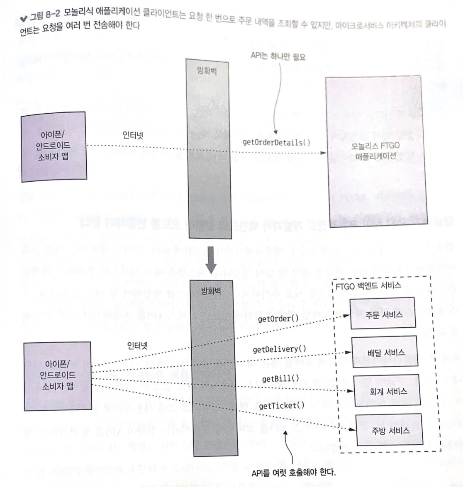
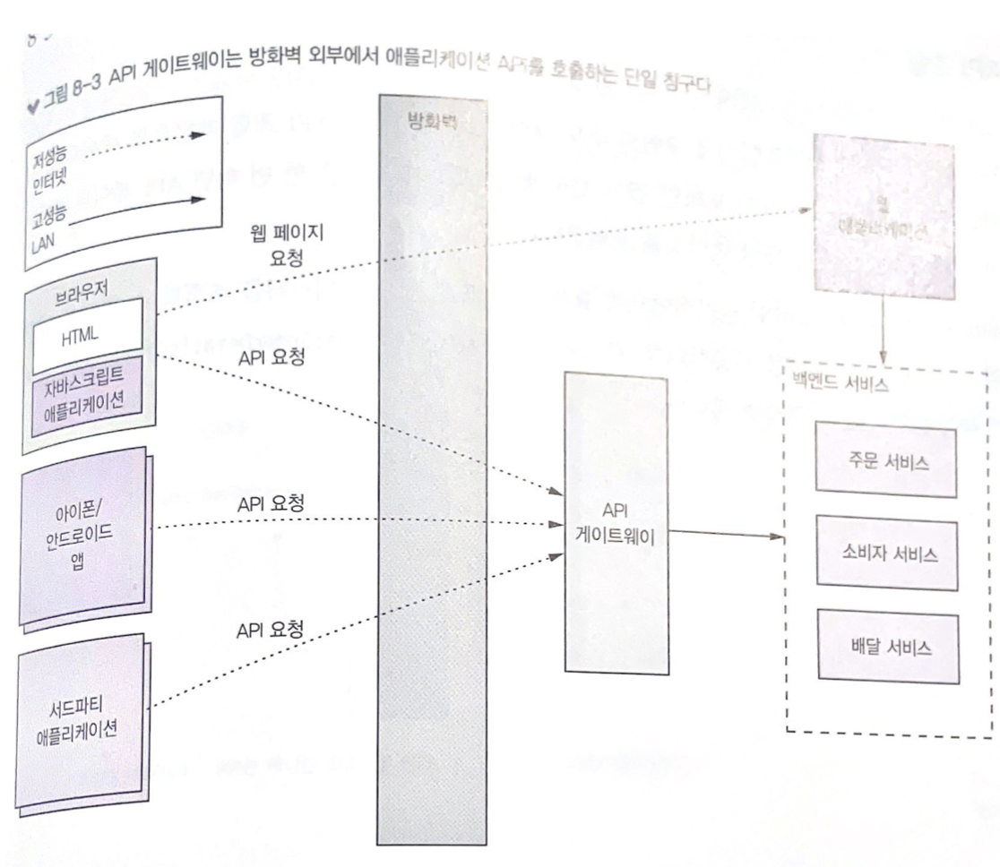
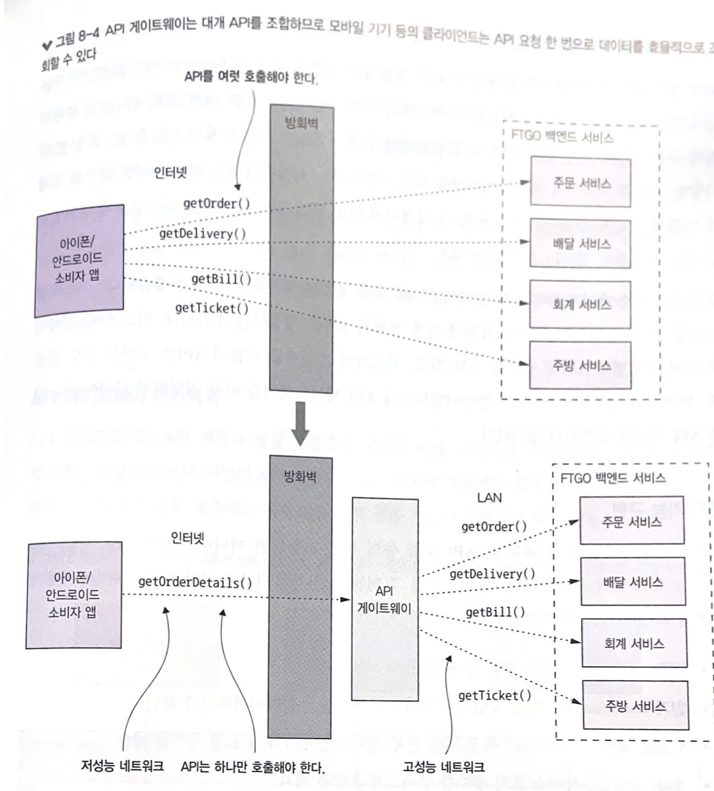
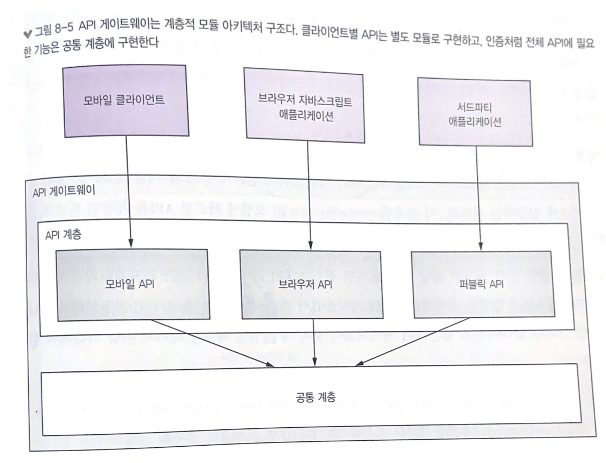
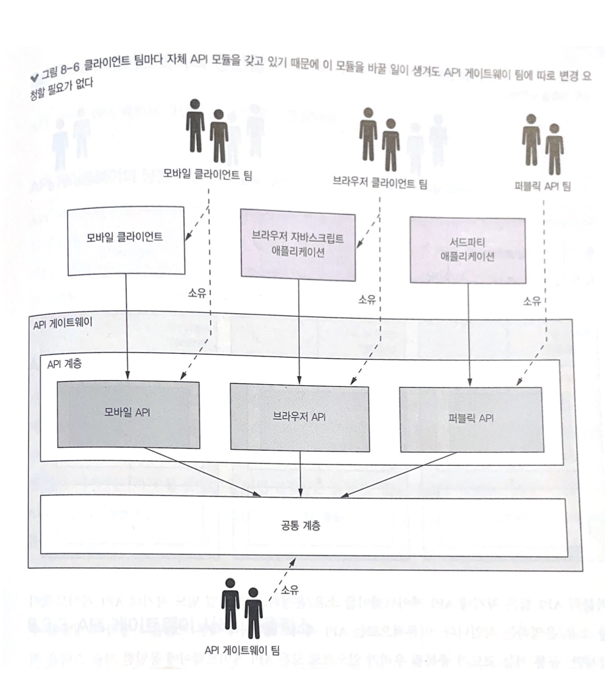
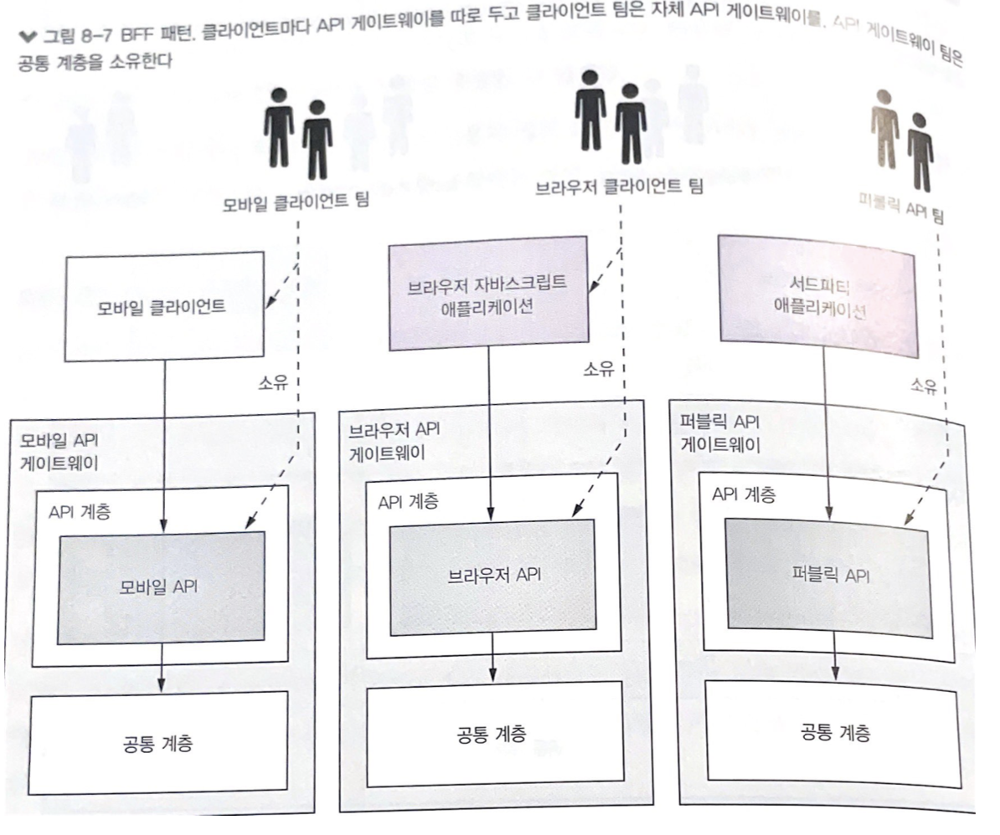
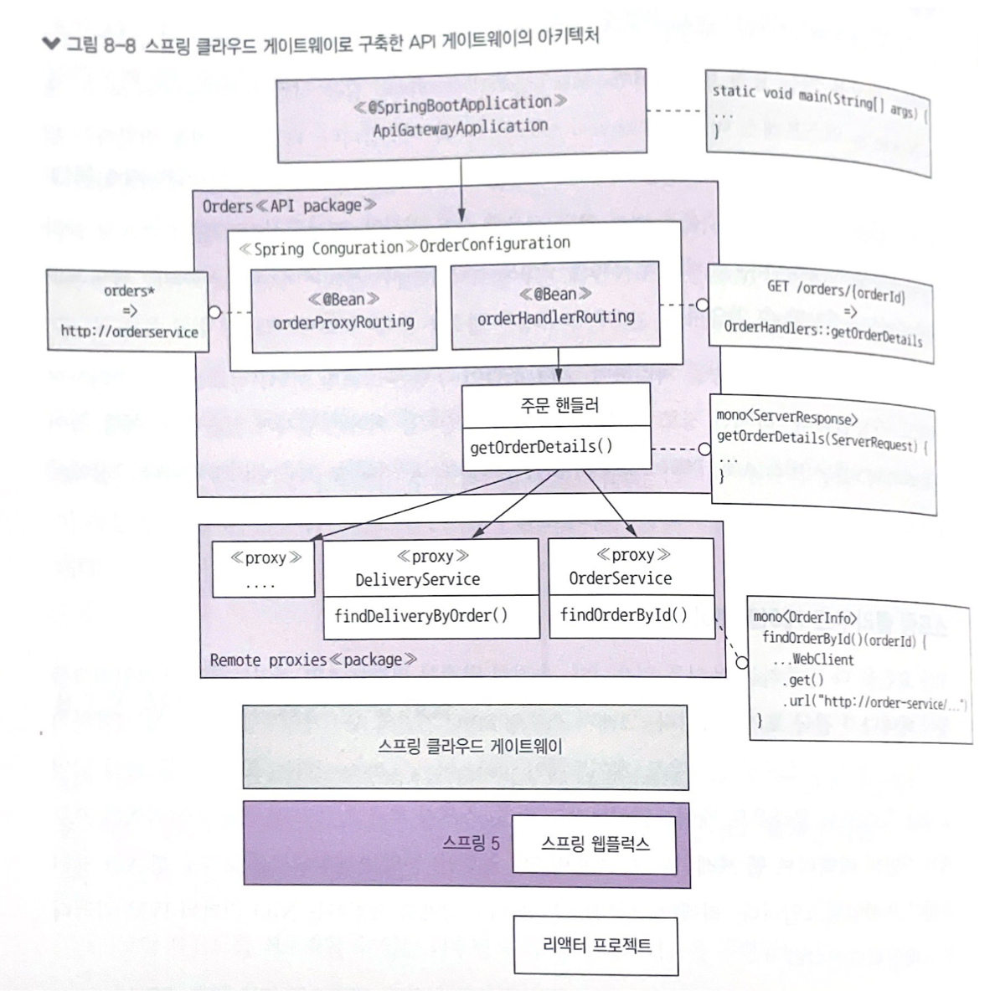
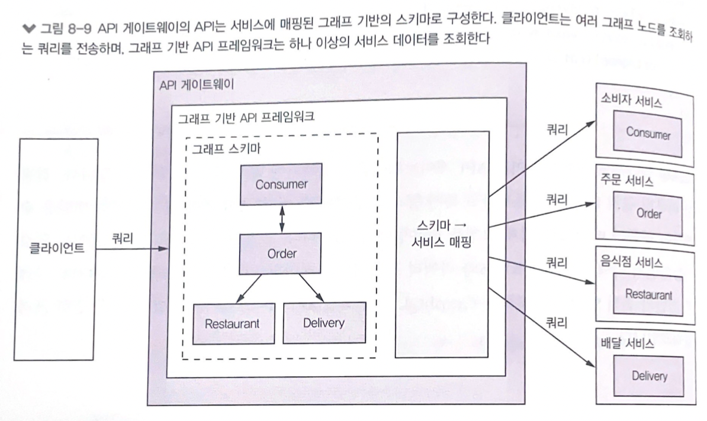
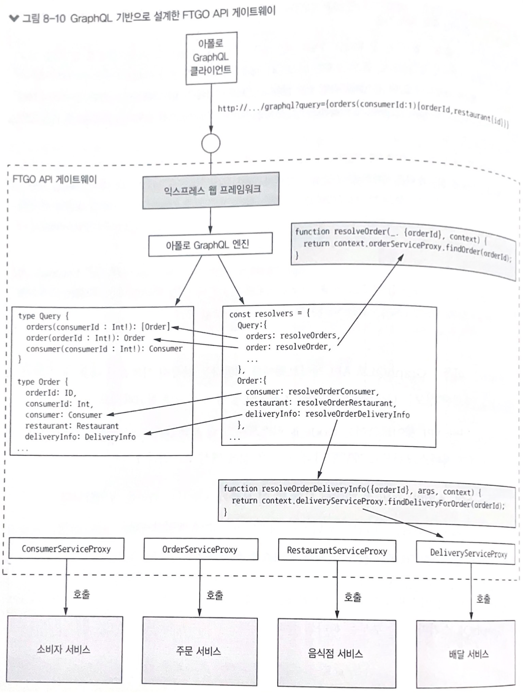
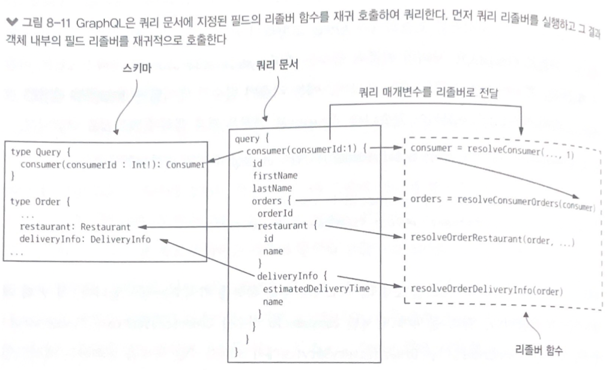

# 8. 외부 API 패턴
### 배경
- 클라이언트(모바일 앱, 브라우저, 제휴사 애플리케이션 등)가 호출하는 REST API가 있음
- 마이크로서비스의 경우 서비스마다 API를 갖고 있기때문에 어떤 종류의 API를 클라이언트에 표출해야 할지 결정해야 함
  - 클라이언트가 어떤 서비스가 있는지 파악해서 원하는 서비스에 요청을 해야할까?
- 애플리케이션의 외부 API는 클라이언트 종류가 다양한 만큼 설계가 어려움
  - 클라이언트마다 다른 종류의 데이터를 요구
  - 클라이언트마다 서비스에 접근하는 네트워크 경로가 다름

### 그래서 8장에서는
- 다양한 외부 API 설계 이슈를 살펴보고,
- 두 가지 외부 API 패턴(API 게이트웨이, BFF) 및 설계/구현 방법을 알아본다
- 이미 완성된 API 게이트웨이 제품을 갖다 쓰거나 직접 프레임워크를 개발하는 등 다양한 옵션을 소개하고,
- 스프링 클라우드 게이트웨이 프레임워크를 기반으로 API 게이트웨이를 설계/구현하는 방법도 알아본다
- 끝으로 그래프 기반의 쿼리 언어를 제공하는 프레임워크인 GraphGL로 API 게이트웨이를 구축하는 방법을 설명한다

# 8.1 외부 API 설계 이슈
## 8.8.1 API 설계 이슈: FTGO 모바일 클라이언트
**주문 상태**, **지불 상태**, **음식점 관점에서 주문 상태** 등의 주문 기본 정보와 배달 중일 경우 현재 위치 및 예상 배달 시간 등의 **배달 상태**를 한눈에 볼 수 있는 주문 조회 뷰를 개발할 때
- 모놀리식에서는 주문 내역을 반환하는 API 끝점이 있어서 클라이언트에서 요청 한 번으로 모두 가져올 수 있지만,
- 마이크로서비스 버전은 주문 데이터가 여러 서비스에 분산되어 있음
  - 주문 서비스: 주문 내역, 주문 상태
  - 주방 서비스: 음식점 관점에서 주문 상태 
  - 배달 서비스: 주문 배달 상태, 예상 배달 시간, 현재 위치
  - 회계 서비스: 주문 지불 상태



#### 문제점 1. 클라이언트가 요청을 여러 번 전송하기 때문에 UX가 나빠진다
- 애플리케이션과 서비스 간 상호 작용이 자주 발생하면 애플리케이션이 멎은 것처럼 보일 수 있음
- 인터넷은 LAN보다 대역폭이 훨씬 낮고 지연 시간이 길고, 특히 모바일 네트워크(인터넷)의 지연시간은 LAN보다 100배는 더 김
- 요청을 순차 실행할 수밖에 없는 상황이라면 UX가 형편없이 나빠질 것
- 모바일 개발자가 복잡한 API 조합 코드를 작성할 일이 많아지게 되면 결국 UX를 개선해야 하는 본연의 임무를 달성하기 어려움
- 네트워크 요청 횟수가 늘어날수록 전력 소모도 커져 배터리도 더 빨리 닳을 것

#### 문제점 2. 캡슐화가 되지 않아 프런트엔드 개발자가 백엔드와 맞물려 코드를 변경해야 한다
- 애플리케이션이 발전함에 따라, 서비스 개발자는 기존 클라이언트와 호환되지 않는 변경을 해야 할 일이 생김
- 서비스에 관한 지식이 모바일 앱에 포함되어 있으면 서비스 API를 변경하기가 곤란해짐
- 모바일 앱은 새 버전을 출시하는 데 몇 시간, 심지어 며칠도 걸리며 현재 버전을 고수하는 사용자도 있을 것
- 따라서 서비스 API를 모바일에 표출시키는 것이 API를 발전시키는 데 걸림돌이 될 수 있음

#### 문제점 3. 클라이언트에 비친화적인 IPC를 사용 중인 클라이언트도 있다
- 방화벽 외부에서 동작하는 클라이언트 애플리케이션은 대부분 HTTP, 웹 소켓 같은 프로토콜을 쓰지만 gRPC 혹은 AMQP 같은 메시징 프로토콜을 쓰는 서비스도 있을 것

## 8.1.2 API 설계 이슈: 다른 종류의 클라이언트
#### 웹 애플리케이션
- 전통적인 서버 쪽 웹 애플리케이션
- 브라우저에서 HTTP 요청을 받아 HTML 페이지를 반환하며, 방화벽 내부에서 실행되고 LAN을 통해 서비스에 접근
- 네트워크 대역폭과 지연 시간은 장애물이 아님
- 웹 애플리케이션 개발 팀은 대개 같은 조직에 있는 백엔드 서비스 개발 팀과 긴밀한 협의하에 작업을 진행하므로 백엔드 서비스가 변경될 때마다 웹 애플리케이션도 쉽게 수정 가능
- 따라서 웹 애플리케이션이 직접 백엔드 서비스에 접근하는 것은 얼마든지 가능한 이야기

#### 브라우저 기반의 자바스크립트 애플리케이션
- 소비자 웹 애플리케이션은 서비스 API를 호출하는 자바스크립트로 주문 내역 페이지를 동적 리프레시 함
- 서비스 API 변경 시 업데이트하기는 쉽지만,
- 인터넷을 통해 서비스에 접근하기 때문에 네트워크 지연 문제는 별반 다를 바 없음
- 보통 일반 모바일 앱보다 더 정교한 브라우저 기반의 UI로 더 많은 서비스를 조합해야 할 필요

#### 서드파티 애플리케이션
- FTGO도 서드파티 개발자용 API를 제공해서, 이 API를 응용해서 주문 관리 애플리케이션을 개발할 수 있음
- 아무리 잘나가는 회사라도 서드파티 개발자에게 무조건 새 API로 업그레이드하라고 강요할 수는 없으므로 조심스럽게 발전시켜야 함
- 따라서 서드파티 개발자에게 직접 서비스를 표출하는 대신 별도 팀에서 개발한 퍼블릭 API를 따로 가져가는 것이 좋음

# 8.2 API 게이트웨이 패턴
## 8.2.1 API 게이트웨이 패턴 개요
- API 게이트웨이: 방화벽 외부의 클라이언트가 애플리케이션에 API 요청을 하는 단일 창구 역할을 하는 서비스
  - 내부 애플리케이션 아키텍처를 캡슐화하고 클라이언트에 API 제공
  - 인증, 모니터링, 사용량 제한 등 부수적인 일도 담당



#### API 게이트웨이의 기능: 요청 라우팅
- 요청이 들어오면 API 게이트웨이는 라우팅 맵을 찾아보고 어느 서비스로 요청을 보낼지 결정
- 라우팅 맵: HTTP 메서드와 서비스의 HTTP URL을 매핑한 것
- nginx 같은 웹 서버의 리버스 프록시와 똑같음

#### API 게이트웨이의 기능: API 조합


#### API 게이트웨이의 기능: 프로토콜 변환
- 외부 REST API <-> 내부 grpc API 변환

#### API 게이트웨이의 기능: 클라이언트마다 적합한 API 제공
- API 게이트웨이가 각 클라이언트에 맞춤 API를 제공
  - 모바일 클라이언트에는 모바일 요건에 맞게 설계된 API 제공
  - 예) 서드파티: 주문 내역 조회 API를 호출하여 전체 주문 내역 반환 / 모바일: 일부만 필요

#### API 게이트웨이의 기능: 엣지 기능 구현
- 인증(authentication): 요청한 클라이언트의 신원을 확인
- 인가(authorization): 특정 작업을 수행하도록 허가받은 클라이언트인지 확인
- 사용량 제한(rate limiting): 특정(또는 전체) 클라이언트의 초당 요청 개수를 제한
- 캐싱(caching): 서비스 요청 횟수를 줄이고자 응답을 캐시
- 지표 수집(metrics collection): 과금 분선용 API 사용 지표 수집
- 요청 로깅: 요청을 기록

#### API 게이트웨이 아키텍처



#### API 게이트웨이 소유권 모델


#### 프런트엔드 패턴을 위한 백엔드
- API 게이트웨이 소유권 모델은 책임 소재가 불분명해짐
  - 여러 팀 사람들이 동일한 코드베이스에 소스를 커밋하고, API 게이트웨이 팀이 그 운영을 맡는 구조는 책임 소재가 불분명해진다
  - "빌드한 사람이 임자다(If you build it, you own it)"라는 마이크로서비스 아키텍처의 철학과 맞지 않게 된다
- 해결 방법
  - 각 클라이언트마다 API 게이트웨이를 따로 두는 **BFF(Backends For Fronteds) 패턴**을 적용하는 것
  - 각 API 모듈이 하나의 클라이언트 팀이 개발/운영하는 스탠드얼론 API 게이트웨이 구조
  - 책임을 명확히 정의하는 것 외에도 API 모듈이 격리되어 신뢰성이 향상되고, API는 서로 영향을 받지 않으며, 각 API를 독립적으로 확장할 수 있다는 장점

#### BFF 패턴


## 8.2.2 API 게이트웨이의 장단점
- 장점
  - 애플리케이션의 내부 구조를 캡슐화
  - 클라이언트마다 최적의 API를 제공하므로 클라이언트-애플리케이션 간 왕복 횟수도 줄고 클라이언트 코드도 단순해짐
- 단점
  - 개발, 배포, 관리를 해야 하는 고가용 컴포넌트가 하나 더 늘어남
  - API 게이트웨이가 개발 병목 지점이 될 우려
    - 개발자가 자신의 서비스 API를 표출하려면 반드시 API 게이트웨이를 업데이트해야 하므로 그 과정이 가볍지 않다면 여러 개발자가 기다리게 될 것

## 8.2.3 API 게이트웨이 사례: 넷플릭스
- 기기별 API가 따로 구현된 API 게이트웨이를 사용하며, API 구현 코드는 클라이언트 기기 팀이 소유/개발
- 초기 버전: 각 클라이언트 팀이 API 라우팅/조합을 수행하는 그루비 스크립트를 작성하여 API를 구현
  - 클라이언트 개발자는 스크립트를 수천 개 작성하였고, API 게이트웨이는 매일 수십억 건의 요청을 처리하고 호출 당 평균 6~7개의 백엔드 서비스가 관여
  - 이런 모놀리식 아키텍처가 너무 무겁고 관리하기 어렵다는 것을 깨달음
- 현재: BFF 패턴과 유사한 API 게이트웨이 아키텍처로 이전중
  - 클라이언트 팀은 node.js로 모듈을 개발하고 도커 컨테이너로 실행
  - 스크립트가 서비스를 직접 호출하는 것이 아니라 넷플릭스 팔코를 이용하여 서비스 API를 표출한 부차(second) API 게이트웨이를 호출
  - Netflix Falcor: 선언적으로 API를 동적 조합하는 API 기술로, 클라이언트는 요청 한 번으로 여러 서비스 호출 가능
  - API 모듈이 서로 분리되어 신뢰성/관측성이 향상되고, 독립적으로 확장 가능

## 8.2.4 API 게이트웨이 설계 이슈

#### API 게이트웨이 설계 이슈: 성능과 확장성
> 동기 I/O 혹은 비동기 I/O를 사용할 것인가 하는 문제는 성능, 확장성에 가장 큰 영향을 미침
- 동기 I/O
  - 각 네트워크 접속마다 스레드를 하나씩 배정므로, 프로그래밍 모델이 간단하고 잘 작동됨
  - 널리 사용되는 자바 EE 서블릿 프레임워크도 동기 I/O에 기반
  - 다소 무거운 OS 스레드를 사용하기 때문에 스레드 개수에 제약을 받고 API 
  게이트웨이의 동시 접속 가능 개수도 제한적
- 비동기(논블로킹) I/O
  - 단일 이벤트 루프 스레드가 I/O 요청을 각 이벤트 핸들러로 디스패치
  - 다중 스레드를 사용하는 오버헤드가 없기 때문에 확장성이 더 좋음
  - 비동기/콜백 기반의 프로그래밍 모델은 훨씬 복잡한 편이라서 코드 작성, 이해, 디버깅이 어려운 단점
  - 이벤트 핸들러는 이벤트 루프 스레드가 블로킹되지 않도록 제어권을 신속하게 반환해야 함
  - JVM 환경에서는 네티(Netty), 버택스(Vertx), 제이보스 언더토우(JBoss Undertow) 등 NIO 기반의 프레임워크가 비 JVM 환경에서는 node.js가 유명
- 논블로킹 I/O를 쓰는 것이 나은 선택인지는 API 게이트웨이의 요청 처리 로직 성격에 따라 다름
- 실제로 넷플릭스의 경우 NIO를 적용한 이후
  - 접속할 때마다 스레드를 배정할 필요가 없기 때문에 네트워크 접속 비용은 예상대로 감소
  - I/O 집약적 로직(예: 요청 라우팅)을 수행했던 클러스터는 처리율은 25% 증가하고 CPU 사용량은 25% 감소했으나 CPU 집약적 로직(예: 복호화, 압축)을 수행하는 주울 클러스터는 전혀 개선되지 않았음

#### API 게이트웨이 설계 이슈: 리액티브 프로그래밍 추상체를 이용하여 관리 가능한 코드 작성
- 기존 비동기 콜백 방식으로 API 조합 코드를 작성하면 유명한 콜백 지옥(callback hell)에 빠지게 되어 코드가 마구 뒤얽혀 알아보기 힘듬
- 따라서 리액티브하게 선언형 스타일로 작성하는 것이 더 나음
- JVM용 리액티브 추상체
  - 자바 8 CompletableFutures
  - 리액터 프로젝트 Mono
  - RxJava(Reactive Extensions for Java)의 옵저버블(observable)
  - 스칼라 Future
- Node.js 진영에서는 Promise라는 자바스크립트 리액티브 확장판이나 RxJS를 사용

#### API 게이트웨이 설계 이슈: 부분 실패 처리
- 안정적으로 동작하기 위해 부하 분산기 후면에 여러 게이트웨이 인스턴스를 두고 가동
- 실패한 요청, 지연 시간이 너무 긴 요청도 적절히 잘 처리해야 함
  - 실패한 서비스로 들어온 요청이 스레드처럼 한정된 리소스를 계속 붙들고 있으면 결국 API 게이트웨이 전체가 전혀 요청을 처리할 수 없게 됨
  - 회로 차단기 패턴(3장)은 이 문제를 해결할 수 있는 좋은 방안

#### API 게이트웨이 설계 이슈: 애플리케이션 아키텍처에서 선량한 시민 되기
- 서비스 디스커버리 패턴(3장)을 이용하면 API 게이트웨이 같은 서비스 클라이언트가 자신이 호출할 서비스 인스턴스의 네트워크 위치를 파악할 수 있음
- 관측성 패턴(11장)을 활용하면 개발자가 애플리케이션 동작 상태를 모니터링하고 문제를 진단하는 데 도움이 됨
- API 게이트웨이도 다른 서비스처럼 아키텍처에 알맞게 선정된 패턴으로 구현해야 함

# 8.3 API 게이트웨이 구현
- 기성 API 게이트웨이 제품/서비스를 활용하는 방법
  - 개발 노력은 거의 안 들지만 유연성은 제일 떨어짐. 대체로 API 조합을 지원하지 않음
- API 게이트웨이 프레임워크 또는 웹 프레임워크를 기반으로 API 게이트웨이를 직접 개발
  - 가장 유연한 접근 방식이지만 적잖은 개발 노력이 투입되어야 함

## 8.3.1 기성 API 게이트웨이 제품/서비스 활용
#### AWS API 게이트웨이
- AWS API 게이트웨이의 API는 하나 이상의 HTTP 메서드를 지원하는 REST 리소스 세트
  - 각각의 (메서드, 리소스)를 백엔드 서비스(AWS 람다, 애플리케이션에 정의된 HTTP 서비스, AWS 서비스 등)로 라우팅할 수 있게 구성
- 처음에 구성만 잘 해두면 확장 등 나머지 일은 모두 AWS에서 알아서 처리하므로 직접 설치/운영을 신경 쓸 필요는 없음
- 하지만 API 조합을 지원하지 않기 때문에 직접 백엔드 서비스에 조합 로직을 구현해야 함
- JSON 위주의 HTTP(S)만, 서비스 쪽 디스커버리 패턴만 지원
- 애플리케이션은 보통 AWS ELB로 EC2나 ECS 컨테이너에 요청을 부하 분산
- 이런 단점은 있지만 API 조합이 굳이 필요 없다면 AWS API 게이트웨이는 API 게이트웨이 패턴이 충실히 반영된 훌륭한 서비스

#### AWS 애플리케이션 부하 분산기
- AWS ALB는 HTTP, HTTPS, 웹 소켓, HTTP/2 용 부하 분산기
- 제공하는 기능은 AWS API 게이트웨이와 비슷함
- AWS EC2 인스턴스에서 가동 중인 백엔드 서비스로 요청을 라우팅하는 규칙이 ALB에 정의되어 있음
- 직접 설치/운영할 필요 없음
- 기능이 제한적이고 HTTP 메서드 기반의 라우팅, API 조합, 인증 같은 로직은 없음

#### 다른 API 게이트웨이 제품
- 콩(Kong): nginx http 서버를 기반
- 트래픽(Traefik): 고 언어 기반
- 두 제품 모두 HTTP 메서드, 헤더, 경로를 이용하여 백엔드 서비스를 선택하는 유연한 라우팅 규칙을 구성할 수 있음
- 콩은 엣지 기능이 구현된 플러그인을 끼워 넣을 수 있음
- 트래픽은 서비스 레지스트리와 연계하는 기능까지 제공
- 여전히 API 조합은 지원하지 않으며, 직접 설치/구성/운영을 해야 함

## 8.3.2 API 게이트웨이 자체 개발
요청을 다른 서비스로 위임하는 웹 애플리케이션이므로 특별히 개발하기 어려운 부분은 없으나, 다음 두 가지 이슈는 신중히 검토해야 함
- 코딩 복잡도를 최소화할 수 있는 라우팅 규칙 정의 메커니즘을 구현한다
- HTTP 헤더 처리 등 HTTP 프록시 로직을 정확히 구현한다

#### API 게이트웨이 프레임워크: 넷플릭스 주울
- 라우팅, 사용량 제한, 인증 같은 엣지 기능이 탑재된 프레임워크
- 재사용 가능 요청 인터셉터같은 서블릿 필터와 비슷함
- HTTP 요청을 변환하는 필터 체인을 적절히 조합해서 요청을 처리하고, 백엔드 서비스를 호출 후 클라이언트에 반환하기 직전에 응답을 가공
- 스프링 클라우드 주울을 사용하면 주울 기반의 서버를 구성보다 관습(convention over configuration) 방식으로 손쉽게 개발할 수 있음
- 경로 기반의 라우팅만 지원되는 한계가 있음 (메소드 기반 라우팅 불가능)

#### API 게이트웨이 프레임워크: 스프링 클라우드 게이트웨이
스프링 5, 스프링 부트 2, 스프링 웹플럭스 등의 프레임워크를 토대로 한 API 게이트웨이 프레임워크
- 요청을 백엔드 서비스로 보낸다
- API를 조합하는 요청 핸들러 역할을 한다
- 인증 등의 엣지 기능을 처리한다

#### API 게이트웨이 프레임워크: 스프링 클라우드 게이트웨이


#### API 게이트웨이 프레임워크: 스프링 클라우드 게이트웨이
- ApiGatewayMain 패키지: API 게이트웨이 메인 프로그램
- 하나 이상의 API 패키지: API 끝점이 구현된 패키지로 가령 Order 패키지에는 주문 관련 API 끝점이 구현되어 있음
- 프록시 패키지: 서비스를 호출하기 위해 API 패키지가 사용하는 프록시 클래스로 구성

#### API 게이트웨이 프레임워크: 스프링 클라우드 게이트웨이
- OrderConfiguration: 주문 관련 요청을 라우팅하는 스프링 빈이 정의된 클래스
- OrderProxyRouting 빈: API 요청을 백엔드 서비스 URL에 매핑하는 규칙 (Ex. /order로 시작하는 요청은 OrderService로 보냄)
- OrderHandlerRouting 빈: OrderProxyRouting 빈에 정의된 규칙을 override한 규칙을 정의. API 요청을 핸들러 메서드, 즉 스프링 MVC 컨트롤러 메서드와 동등한 스프링 웹플럭스 메서드에 매핑하는 규칙 (Ex. GET /orders/{orderId}는 OrderHandlers::getOrderDetails()로 매핑)
- OrderHandlers 클래스: getOrderDetails() 메서드는 API를 조합하여 주문 내역을 조회
- OrderService 같은 백엔드 서비스는 원격 프록시 클래스를 이용하여 호출하며, 이 서비스를 호출하는 메서드는 OrderHandlers 클래스에 있음

### 스프링 클라우드 게이트웨이: OrderConfiguration 클래스
```java
@Configuration
@EnableConfigurationProperties(OrderDestinations.class)
public class OrderConfiguration {
  @Bean
  public RouteLocator orderProxyRouting(RouteLocatorBuilder builder, OrderDestinations orderDestinations) {
    return builder.routes()
      .route(r -> r.path("/orders")
        .and(). method("POST").uri(orderDestinations.getOrderServiceUrl()))
      .route(r -> r.path("/orders")
        .and().method("PUT").uri(orderDestinations.getOrderServiceUrl()))
      .route(r -> r.path("/orders/**")
        .and() .method("POST").uri(orderDestinations.getOrderServiceUrl()))
      .route(r -› r.path("/orders/**")
        .and().method("PUT").uri(orderDestinations.getOrderServiceUrl()))
      .route(r -> r.path("/orders")
        .and().method("GET").uri(orderDestinations.getOrderHistoryServiceUrl()))
      .build();
  }

  @Bean public RouterFunction<ServerResponse> orderHandlerRouting(OrderHandlers orderHandlers) {
    return RouterFunctions.route(GET("/orders/ {orderId}"), orderHandlers: :getOrderDetails);
  }

  @Bean
  public OrderHandlers orderHandlers(OrderService orderService, KitchenService kitchenService, DeliveryService deliveryService, AccountingService accountingService) {
    return new OrderHandlers(orderService, kitchenService, deliveryService, accountingService);
  }
}
```

#### 스프링 클라우드 게이트웨이: OrderHandlers 클래스
```java
public class OrderHandlers {
  ...(생략)...
  public Mono<ServerResponse> getOrderDetails (ServerRequest serverRequest) {
    String orderId = serverRequest.pathVariable("orderId");
    Mono<OrderInfo> orderinfo = orderService. findOrderById(orderId):

    Mono<Optional‹TicketInfo>> ticketInfo =
      kitchenService
        .findTicketByOrderId(orderId)
        .map(Optional: of)
        .onErrorReturn(Optional.empty());

    Mono<Optional<DeliveryInfo>> deliveryInfo =
      deliveryService
        .findDeliveryByOrderId(orderId)
        .map(Optional::of)
        .onErrorReturn(Optional.empty());

    Mono<Optional<BillInfo>> billInfo = 
      accountingService
        .findBillByOrderId(orderId)
        .map(Optional::of)
        .onErrorReturn(Optional.empty());
    
    Mono<Tuple4<OrderInfo, Optional<TicketInfo>, Optional<DeliveryInfo>, Optional<BillInfo>> combined =
    Mono. when(orderInfo, ticketInfo, deliveryInfo, billInfo);

    Mono<OrderDetails> orderDetails =
      combined.map(OrderDetails: :makeOrderDetails);

    return orderDetails.flatMap(person -> ServerResponse.ok()
      .contentType (MediaType.APPLICATION_JSON)
      .body(fromObject(person)))
      .onErrorResume (OrderNotFoundException.class, e -> ServerResponse.notFound() .build());
  }
}
```

#### 스프링 클라우드 게이트웨이: OrderServiceProxy 클래스
```java
@Service
public class OrderServiceProxy {
  private OrderDestinations orderDestinations;
  private WebClient client;
  public OrderService(OrderDestinations orderDestinations, WebClient client) {
    this.orderDestinations = orderDestinations;
    this.client = client;
  }
  public Mono<OrderInfo> findOrderById(String orderId) {
    Mono‹ClientResponse> response = client
      .get()
      .uri(orderDestinations.orderServiceUrl+"/orders/{orderId}", orderId)
      .exchange();
    return response.flatMap(resp ->
      switch (resp.statusCode()) {
        case OK:
          return resp. bodyToMono (OrderInfo.class);
        case NOT_FOUND:
          return Mono.error(new OrderNotFoundException());
        default:
          return Mono, error (new RuntimeException("Unknown" + resp. statusCode ()));
      }
    );
  }
}
```

#### 스프링 클라우드 게이트웨이: ApiGatewayApplication 클래스
```java
@SpringBootConfiguration
@ComponentScan
public class ApiGatewayApplication {
    public static void main(String[] args) {
      SpringApplication.run(ApiGatewayApplication.class, args);
    }
}
```

## 8.3.3 API 게이트웨이 구현: GraphQL
- API 게이트웨이에 별의별 클라이언트를 지원하는 REST API를 구현하는 것은 시간 낭비
- 결국 GraphQL처럼 데이터를 효율적으로 가져오도록 설계된 그래프 기반의 API 프레임워크를 찾게 됨
- 그래프 기반의 API 프레임워크는 프로퍼티(필드) 및 다른 노드와 연관된 노드(타입)를 정의
- 클라이언트는 그래프 노드와 이들의 프로퍼티/관계 단위로 필요한 데이터를 지정해서 조회하기 때문에
- API 게이트웨이로 원하는 데이터를 한 번에 모두 가져올 수 있음

#### GraphQL


#### GraphQL 장점
- 클라이언트가 반환 데이터를 제어할 수 있음
  - 덕분에 갖가지 클라이언트가 지원되는 충분히 유연한 단일 API를 개발할 수 있음
- 개발 수고를 엄청나게 덜 수 있음
  - 서버 쪽 코드를 API 조합과 투사를 지원하도록 설계된 쿼리 실행 프레임워크로 작성하기 때문에
  - 클라이언트가 저장 프로시저를 통해 데이터를 조회하도록 강제하는 대신 클라이언트가 직접 하부 DB를 대상으로 쿼리하게끔 만드는 것

#### GraphQL 설계 핵심 요소
- GraphQL 스키마: 서버 쪽 데이터 모델 및 이 모델이 지원하는 쿼리를 정의
- 리졸버 함수: 스키마 엘리먼트를 다양한 백엔드 서비스에 매핑
- 프록시 클래스: FTGO 애플리케이션 서비스를 호출

#### GraphQL


#### GraphQL 스키마 정의
```graphql
type Query {
  orders(consumerId : Int!): [Order]
  order(orderId : Int!): Order
  consumer(consumerId : Int!): Consumer
}

type Consumer {
  id: ID
  firstName: String
  lastName: String
  orders: [Order]
}

type Order {
  orderId: ID
  consumerId: Int
  consumer: Consumer
  restaurant: Restaurant
  deliveryInfo: DeliveryInfo
  ...
}

type Restaurant {
  id: ID
  name: Stirng
  ...
}

type DeliveryInfo {
  status: DeliveryStatus
  estimatedDeliveryTime: Int
  assignedCourier: String
}

enum DeliveryStatus {
  PREPARING
  READY_FOR_PICKUP
  PICKED_UP
  DELIVERED
}
```

#### GraphQL 쿼리 실행
- 위의 orders(), order(), consumer()는 REST 끝점과 별 차이가 없어 보이지만, GraphQL은 클라이언트가 반환 데이터를 쿼리 언어로 자유롭게 제어할 수 있다는 것이 큰 매력
- 클라이언트는 쿼리 문서가 담긴 요청을 서버에 전송하여 쿼리를 실행
- 주어진 Consumer의 firstName, lastName 필드를 반환하는 쿼리
  ```graphql
  query {
    consumer(consumerId:1)
    {
      firstName
      lastName
    }
  }
  ```

#### GraphQL 쿼리 실행
- 소비자 정보와 이 소비자가 한 주문들과  주문별 음식점 ID와 음식점명을 반환하는 복잡한 쿼리
  ```graphql
  query {
    consumer(consumerId:1) {
      id
      firstName
      lastName
      orders {
        orderId
        restaurant {
          id
          name
        }
        deliveryInfo {
          estinamedDeliveryTime
          name
        }
      }
    }
  }
  ```
- 클라이언트는 타동적으로 연관된 객체 필드 등 원하는 데이터를 정확히 특정할 수 있음

#### GraphQL 쿼리 실행
- 소비자 2명을 조회하는 쿼리
  ```graphql
  query {
    c1: consumer(consumerId:1) {id, firstName, lastName}
    c2: consumer(consumerId:2) {id, firstName, lastName}
  }
  ```
- c1, c2는 GraphQL 용어로 alias라고 함
- 이러한 스키마를 데이터 소스에 연결하면 그 진가가 발휘됨

### GraphQL 스키마를 데이터에 연결
- GraphQL 서버가 데이터를 소유한 API를 하나하나 호출해야 함
- 스키마에 정의된 객체형 필드에 리졸버 함수를 붙이면 GraphQL 스키마를 데이터 소스와 연관 지을 수 있음
- GraphQL 서버는 처음에는 최상위 쿼리로 데이터를 가져와 결과 객체의 필드를 재귀 조회하는 리졸버 함수를 호출하여 API를 조합
- ```graphql
  const resolvers = {
    Query: {
      orders: resolveORders,
      consumer: resolveConsumer,
      order: resolveOrder
    },
    Order: {
      consumer: resolveOrderConsumer,
      restaruant: resolveOrderRestaurant,
      deliveryInfo: resolveOrderDeliveryInfo
    ...
  };
  ```

### GraphQL 스키마를 데이터에 연결
- GraphQL은 재귀 알고리즘을 이용하여 리졸버 함수를 실행
- 제일 먼저 Query 문서에 지정된 최상위 쿼리의 리졸버 함수를 실행하고, 쿼리가 반환한 객체마다 Query 문서에 지정된 필드를 하나씩 순회
- 만약 필드에 리졸버가 달려 있으면 객체 및 Query 문서의 인수를 리졸버에 전달하여 호출
- 그리고 다시 이 리졸버가 반환한 객체로 재귀


### GraphQL 스키마를 데이터에 연결
리졸버 함수 매개변수 세가지
- 객체: 최상위 쿼리 필드의 경우엔 리졸버 함수가 무시하지만 그 외의 경우 리졸버가 부모 객체에 반환한 값이 object로
  - Order.consumer 필드의 리졸버 함수에는 Order 리졸버 함수가 반환한 값이 전달됨
- 쿼리 인수: 쿼리 문서에 명시된 값
- 컨텍스트: 모든 리졸버가 접근 가능한 전역 쿼리 실행 상태로 사용자 정보나 디펜던시를 리졸버에 전달하는 용도로 쓰임
```
function resolveOrders(_, { consumerId }, context) {
  return context.orderServiceProxy.findOrders(consumerId);
}
```
```
function resolveOrderRestaurant({restaurantId}, args, context) {
  return context.restaurantServiceProxy.findRestaurant(restaurantId);
}
```

### GraphQL 배칭/캐싱으로 로딩 최적화
- GraphQL이 쿼리 실행 시 엄청나게 많은 리졸버를 실행하게 될 가능성은 항상 있음
- 각각의 리졸버는 독립적으로 실행되므로 서비스 왕복 횟수가 많아지면 성능이 떨어질 위험성
  - 예) 주문이 N개 있으면 소비자 서비스에 한 번, 주문 이력서비스에 한 번, 음식점 서비스에 N번 호출하게 됨 
- 그래서 성능을 최적하기 위해 서버 쪽에서 배칭/캐싱을 조합하여 사용
  - 배칭: 서비스를 N번 호출할 것을 N개 객체를 일괄 조회하는 호출 한 번으로 전환
  - 캐싱: 불필요한 중복 호출을 방지하기 위해 동일한 객체를 가져왔던 이전 결과 재사용

### GraphQL 배칭/캐싱으로 로딩 최적화
- node.js 기반의 GraphQL 서버에서는 데이터로더 모듈을 사용해서 배칭/캐싱을 구현
```javascript
const DataLoader = require('dataloader');
class RestaurantServiceProxy {
  constructor() {
    this.dataLoader = // DataLoader를 생성하여 batchFindRestaurants()를 배치 로딩함수로 사용
      new DataLoader(restaurantIds =>
        thisbatchFindRestaurants(restaurantIds));
  }

  findRestaurant(restaurantId) { // 주어진 음식점을 DataLoader로 로딩
    return this.dtatLoader.load(restaurantId);
  }

  batchFindRestaurants(restaurantIds) { // 여러 음식점을 배치 로딩
    ...
  }
}
```

### 아폴로 GraphQL 서버와 익스프레스를 연계
```javascript
const {graphqlExpress} = require("apollo-server-express");
const typeDefs = gql`
  type Query {
    orders: resolverders,
    ...
  }
  type Consumer {
    ...
`
const resolvers = {
    Query: {
      ...
    }
  }

const schema = makeExecutableSchema({ typeDefs, resolvers });
const app = express ();

function makeContextWithDependencies(req) { //리포지터리를 리졸버에서 쓸 수 있게 컨텍스트에 주입
  const orderServiceProxy = new OrderServiceProxy ();
  const consumerServiceProxy = new ConsumerServiceProxy ();
  const restaurantServiceProxy = new RestaurantServiceProxy ();
  ...
  return {orderServiceProxy, consumerServiceProxy, restaurantServiceProxy, ...};
}
function makeGraphQLHandler() { //실행 가능한 스키마를 상대로 GraphQL 쿼리를 실행하는 익스프레스 요청 핸들러 생성
  return grahqlExpress(req =>
  {
    return {schema: schema, context: makeContextWithDependencies(req)}
  });
}
app.post('/graphal', bodyParser.json(), makeGraphQLHandler()); // POST /graphql, GET /graphql 끝점을 GraphQL 서버로 라우팅
app.get('/graphql', makeGraphQLHandler());
app.listen(PORT);
```

#### GraphQL 클라이언트 작성
- GraphQL 서버는 HTTP 기반의 API를 제공하므로 클라이언트 애플리케이션은 적당한 HTTP 라이브러리를 이용하여 요청
  - ex. `GET http://localhost:3000/graphql?query={orders(consumerId:1){orderId,restaurant{id}}}`
- 하지만 요청 포맷을 잘 맞추어 주면서 클라이언트 쪽 캐싱 기능까지 제공하는 GraphQL 클라이언트 라이브러리를 사용하는 것이 더 쉬움

#### GraphQL 클라이언트 작성
```javascript
class FtgoGraphQLClient {
  constructor(...) {
    this.client = new ApolloClient({ ... });
  }
  findConsumer(consumerId) {
    return this.client.query({
      variables: {cid: consumerId},
      query: gql`
        query foo($cid : Int!) {
          consumer(consuemrId:$cid) {
            id
            firstName
            lastName
          }
        }
        `
    })
  }
}
```