# Virtual Thread

- JDK19 얼리 액세스 feature 로 그리고 JDK 21 에 정식 출시.
- Go의 goroutine, Kotlin의 coroutine과 비슷한 경량 스레드 모델. 기존 언어의 스레드 모델보다 더 작은 단위로 실행 단위를 나눠 컨텍스트 스위칭 비용과 Blocking 타임을 낮추는 개념.

## Virtual Thread란?

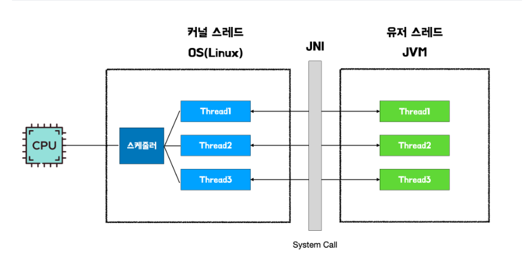

- 기존 Java의 스레드 모델은 Native Thread로, Java의 유저 스레드를 만들면 Java Native Interface(JNI)를 통해 커널 영역을 호출하여 OS가 커널 스레드를 생성하고 매핑하여 작업을 수행하는 형태

- 기존 프로세스, 스레드 모델로는 요청량이 급격하게 증가하는 서버 환경에서 감당할 수 없게 되어버렸음 (스레드 1개당 1MB 사이즈라 가정했을때, 4GB 메모리 환경에서도 많아야 4,000개의 스레드)

- 스레드가 많아지면서 컨텍스트 스위칭 비용도 기하급수적으로 늘어났음

- 이런 한계를 겪던 서버는 더 많은 요청 처리량과 컨텍스트 스위칭 비용을 줄여야 했는데, 이를 위해 나타난 스레드 모델이 경량 스레드 모델인 Virtual Thread !

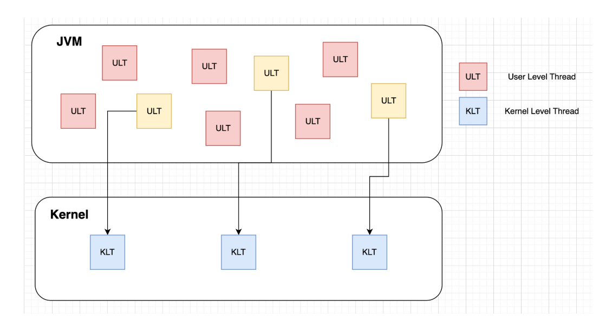

### JNI란?

- Java Native Interface(이하 JNI)는 C, C++처럼 인터프리터 없이 OS가 바로 읽을 수 있는 형태의 네이티브 코드를 JVM이 호출할 수 있게 하는 인터페이스. 쉽게 말해, JVM에서 다른 언어를 사용할 수 있게 함. 이 JNI 덕분에 Java가 머신 플랫폼에 상관없이 동작할 수 있음. 이 호출은 Java에서 메서드 앞에 native 키워드를 붙여 해당 메서드가 JNI를 사용함을 나타냄.

## Virtual Thread 구조

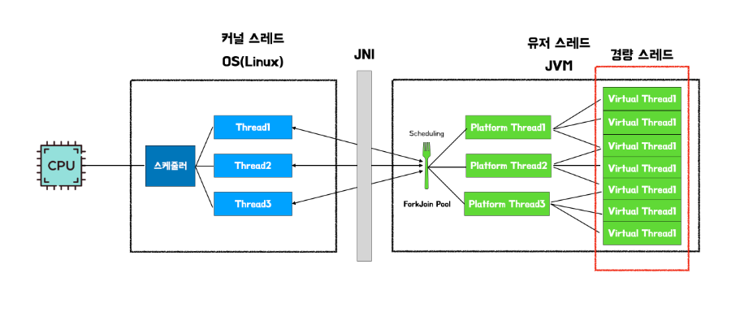

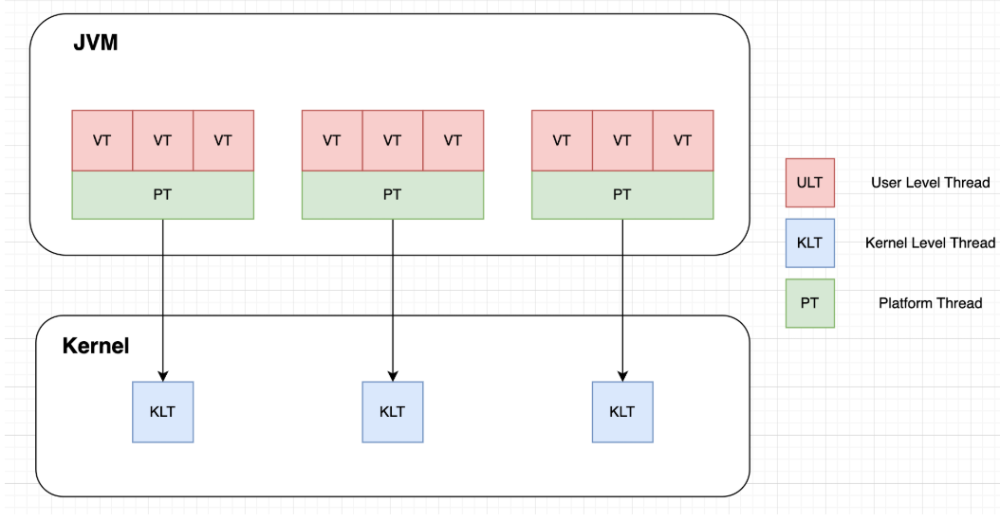

- virtual Thread는 기존 Java의 스레드 모델과 달리, 플랫폼 스레드와 가상 스레드로 나뉨

- 플랫폼 스레드 위에서 여러 Virtual Thread가 번갈아 가며 실행되는 형태로 동작, 마치 커널 스레드와 유저 스레드가 매핑되는 형태랑 유사

- 가장 큰 특징은 Virtual Thread는 컨텍스트 스위칭 비용이 저렴

| |Thread|Virtual Thread|
|------|---|---|
|Stack 사이즈|~2MB|~10KB|
|생성시간|~1ms|~1µs|
|컨텍스트 스위칭|~100µs|~10µs|

- Thread는 컨텍스트 스위칭 시 메모리 이동량이 상대적으로 크고, 생성을 위해서는 커널과 통신하여 스케줄링 해야하므로, 시스템 콜을 이용하기 때문에 생성 비용도 상대적으로 큼

- Virtual Thread는 JVM에 의해 생성되기 때문에 시스템 콜과 같은 커널 영역의 호출이 적고, 메모리 크기가 일반 스레드의 1%에 불과

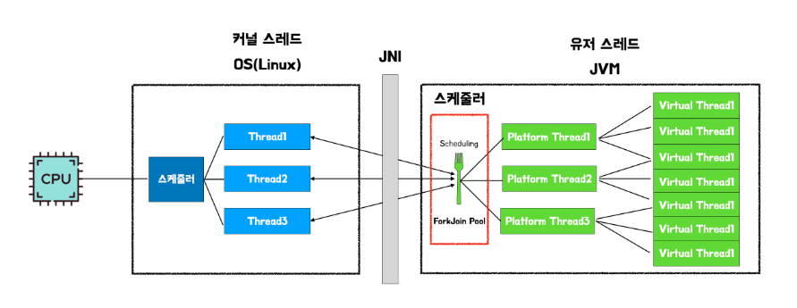

- Platform Thread의 기본 스케줄러는 ForkJoinPool을 사용. 스케줄러는 platform thread pool을 관리하고, Virtual Thread의 작업 분배 역할

## 스레드 모델 간 비교

- 256MB의 힙 사이즈를 사용하도록 설정. 테스트는 300ms를 sleep하는 API를 3번 호출하는 Request I/O Bound 작업, 0~300000000까지 합을 3번 계산하는 CPU Bound 작업

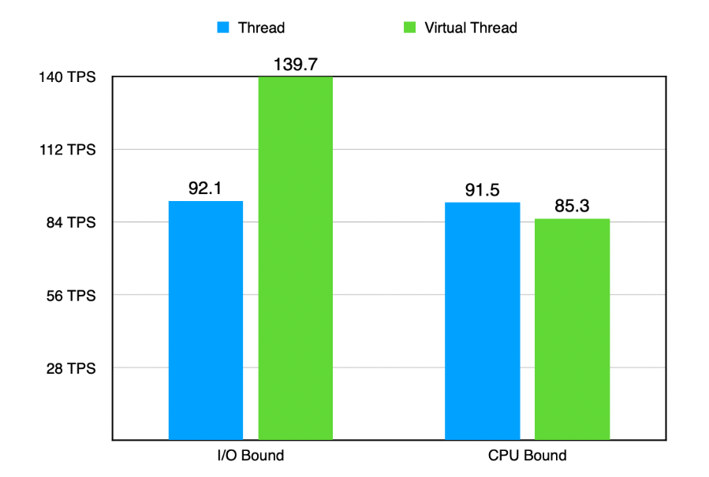

- CPU Bound 작업에서는 일반 스레드 모델이 성능상 우위

- 경량 스레드가 결국 플랫폼 스레드 위에서 동작하기 때문에, CPU Bound 작업과 같은 Virtual Thread가 Switching 되지 않는 경우에는 Platform Thread 사용 비용뿐만 아니라 Virtual Thread 생성 및 스케줄링 비용까지 포함되어 성능 낭비

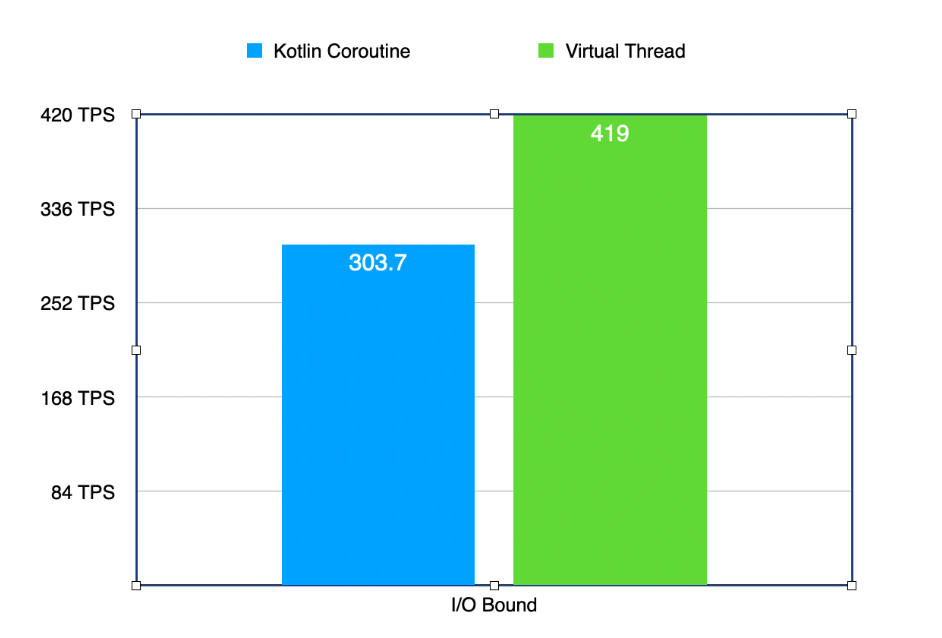

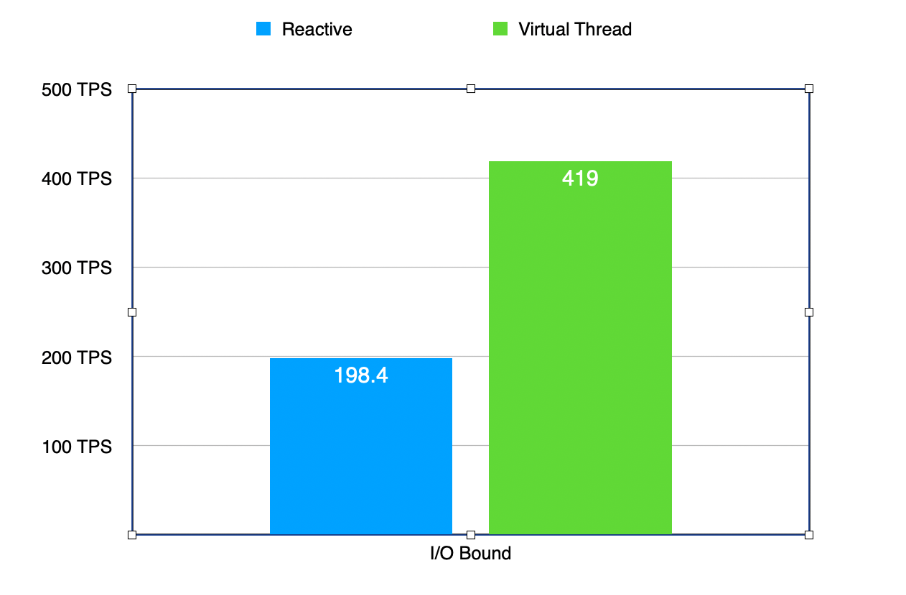

## CPU Bound vs I/O Bound

### CPU Bound

- CPU Bound는 프로세스가 진행될 때, CPU 사용 기간이 I/O Wating 보다 많은 경우. 주로 행렬 곱이나 고속 연산을 할 때 나타나며 CPU 성능에 의해 작업 속도가 결정

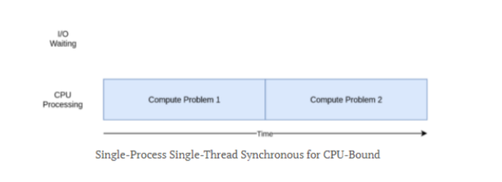

- CPU의 성능이 향상되거나 개수가 추가되면 CPU Bound의 작업 처리 성능이 향상. 따라서 성능 향상을 위해 scale-up이 주로 사용

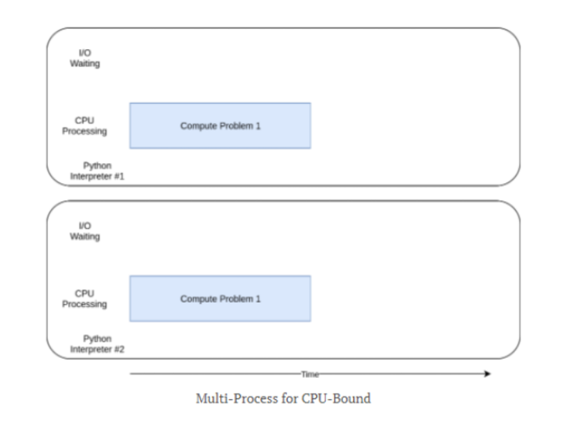

### I/O Bound

- I/O Bound는 프로세스가 진행될 때, I/O Wating 시간이 많은 경우다. 파일 쓰기, 디스크 작업, 네트워크 통신을 할 때 주로 나타나며 작업에 의한 병목(다른 시스템과 통신할 때 나타남)에 의해 작업 속도가 결정

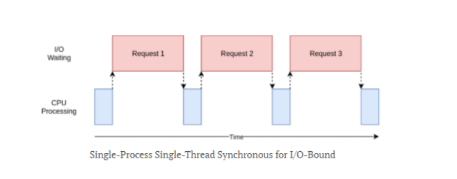

- I/O Bound의 경우에는 CPU 성능보다 타 시스템과의 병목 부분(I/O Wating)에 큰 영향을 받기 때문에 스레드 개수를 늘리거나 동시성을 활용. 따라서 성능 향상을 위해 scale-out을 주로 사용

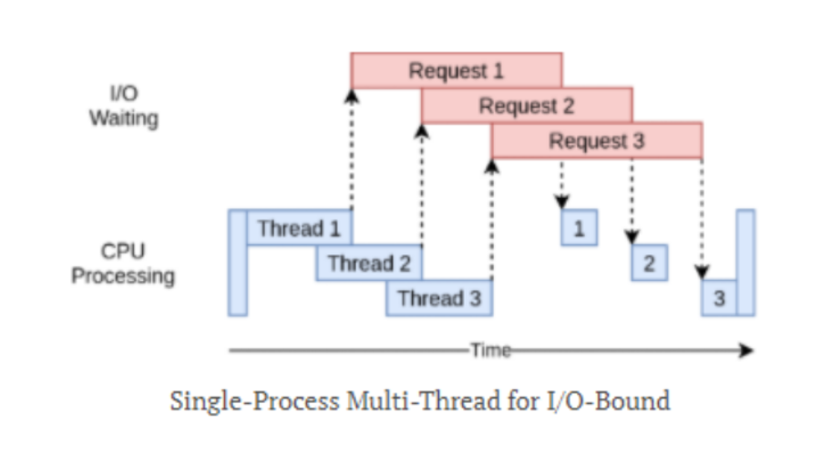

## 결론

- CPU Bound 인 경우 애초에 멀티스레드 형식이 어울리지 않음. CPU 개수 만큼 멀티프로세싱 방식이 최적화라고 볼 수 있음. 프로세스 위에서 동작하는 멀티스레드는 부하만 생길 뿐. 버추얼 스레드라면 더더욱 비효율적.

## 의문점

- 코틀린(coroutine), Netty/WebFlux(non-blocking single thread) 와 같은 모델에 비교해 가지고 있던 단점이 virtual thread 도입으로 많이 희석 되었다고 하는데 이들의 필요성은 여전히 있나?